# IMigrate Architecture

Complete system design, components, and data flows for the SAP Integration Suite migration platform.

---

## Table of Contents

1. [System Overview](#system-overview)
2. [Architecture Diagram](#architecture-diagram)
3. [Components](#components)
4. [Data Flow](#data-flow)
5. [Knowledge Graph](#knowledge-graph)
6. [Pattern Library](#pattern-library)
7. [Request-Reply Architecture](#request-reply-architecture)
8. [Technology Stack](#technology-stack)

---

## System Overview

IMigrate uses a **multi-layered RAG (Retrieval-Augmented Generation) architecture** with:
- **Frontend**: React UI for file upload and monitoring
- **Main API**: Orchestration and job management (Port 5000)
- **BoomiToIS-API**: Platform-specific iFlow generation (Port 5003)
- **RAG Agent API**: AI-powered component generation (Port 8001)
- **Knowledge Sources**: Supabase (vectors), Neo4j (graph), Pattern Library

**Key Innovation:** Intelligent intent understanding + strategic planning + knowledge retrieval = 85-95% accurate iFlow generation

---

## Architecture Diagram

```mermaid
graph TB
    User[👤 User] --> Frontend[🖥️ React Frontend<br/>:5173]
    Frontend --> MainAPI[🔄 Main API<br/>Flask :5000]
    Frontend --> BoomiAPI[🔧 BoomiToIS-API<br/>Flask :5003]
    
    MainAPI --> DocGen[📝 Doc Generator<br/>Boomi/MuleSoft Parser]
    MainAPI --> Supabase[(💾 Supabase<br/>Vector Store + Jobs)]
    
    BoomiAPI --> RAG[🤖 RAG Agent<br/>Flask :8001]
    RAG --> Agent[🧠 SAP iFlow Agent<br/>Intent + Strategic Plan]
    
    Agent --> PatternLib[(📚 Pattern Library<br/>Supabase Tables)]
    Agent --> VectorStore[(🔍 Vector Search<br/>CodeBERT Embeddings)]
    Agent --> KG[(🕸️ Knowledge Graph<br/>Neo4j)]
    Agent --> LLM[🎯 LLM<br/>Anthropic Claude]
    
    Agent --> Packager[📦 iFlow Packager<br/>ZIP Builder]
    Packager --> SAP[☁️ SAP BTP<br/>Cloud Integration]
    
    BoomiAPI --> Feedback[(📊 Feedback System<br/>Continuous Learning)]
    Feedback --> PatternLib
    
    style Frontend fill:#61DAFB,stroke:#333,color:#000
    style Agent fill:#10a37f,stroke:#333,color:#fff
    style SAP fill:#0FAAFF,stroke:#333,color:#fff
    style KG fill:#008CC1,stroke:#333,color:#fff
    style Feedback fill:#FF6B6B,stroke:#333,color:#fff
```



---

## Components

### **1. Frontend (React + Vite)**
**Location:** `IFA-Project/frontend/`  
**Port:** 5173  
**Purpose:** User interface for file upload, job monitoring, iFlow deployment

**Key Files:**
- `src/pages/common/JobResult.jsx` - Main job status page
- `src/pages/common/FileUploadForm.jsx` - File upload
- `src/components/FeedbackModal.jsx` - Feedback collection
- `src/services/api.js` - API client

**State Management:**
- `isGeneratingIflow` - iFlow generation in progress
- `isIflowGenerated` - Generation completed
- `iflowGenerationStatus` - Current status (queued/generating/completed)

**Status Flow:**
```
Upload → Processing → Documentation_Completed → Generating_iFlow → Completed
```

### **2. Main API (Flask)**
**Location:** `app/`  
**Port:** 5000  
**Purpose:** Central orchestrator, job management, Supabase sync

**Key Functions:**
- `upload_documentation()` - Handle file uploads
- `process_boomi_documentation()` - Generate documentation
- `get_job_status()` - Return job status to frontend
- `update_job()` - Sync job state to Supabase

**Job Statuses:**
- `'processing'` - Generating documentation
- `'documentation_completed'` - Docs ready, iFlow not generated
- `'generating_iflow'` - iFlow generation in progress
- `'completed'` - iFlow generated successfully
- `'failed'` - Error occurred

**Database Integration:**
- Supabase for persistent job storage
- Local `jobs.json` for quick access
- Automatic sync between sources

### **3. BoomiToIS-API (Flask)**
**Location:** `BoomiToIS-API/`  
**Port:** 5003  
**Purpose:** Platform-specific iFlow generation, RAG orchestration

**Key Functions:**
- `generate_iflow_from_markdown()` - Main entry point
- `direct_deploy_to_sap()` - Deploy to SAP BTP
- `generate_iflow_route()` - API endpoint

**Workflow:**
1. Receive markdown documentation
2. Call RAG Agent API (port 8001)
3. Wait for generation (2-5 minutes)
4. Verify ZIP file exists
5. Mark job as completed
6. Update Main API

**Fallback:** If RAG fails, uses template-based generation

### **4. RAG Agent API (Flask)**
**Location:** `agentic-rag-IMigrate/`  
**Port:** 8001  
**Purpose:** AI-powered iFlow generation using RAG

**Key Files:**
- `rag_api_service.py` - Flask API wrapper
- `agent/agent.py` - SAP iFlow Agent (main logic)
- `agent/packager.py` - ZIP package builder
- `agent/rag_logger.py` - Query/result logging

**Agent Workflow:**
```
Markdown → Intent Understanding → Strategic Plan → Component Selection → 
XML Generation → Packaging → ZIP File
```

### **5. SAP iFlow Agent (Core AI)**
**Location:** `agentic-rag-IMigrate/agent/agent.py`  
**Purpose:** Intelligent iFlow generation with RAG

**Key Methods:**
- `create_complete_iflow_package()` - Main entry point
- `_understand_user_intent()` - Extract intent from documentation
- `_create_strategic_plan()` - Plan component generation
- `_execute_strategic_plan()` - Generate components
- `_generate_component_xml()` - Create SAP-compliant XML

**Intelligence Sources:**
1. **Pattern Library** (Supabase) - Learned component patterns
2. **Vector Store** (Supabase) - CodeBERT embeddings
3. **Knowledge Graph** (Neo4j) - Component relationships
4. **LLM** (Anthropic Claude) - Code generation

**Special Handling:**
- **RequestReply Pattern**: Expands into ExternalCall + MessageFlow + Receiver trio
- **Router Component**: Handles branching logic with multiple endpoints
- **Groovy Scripts**: Generated and embedded in ZIP
- **Error Handling**: Automatic exception handling components

---

## Data Flow

### **Upload to Deployment (Complete Flow)**


### **Status Updates Flow**

```
Main API Job Status Updates:
├─ 'processing'              ← Documentation generation starts
├─ 'documentation_completed' ← Documentation ready ✅
├─ 'generating_iflow'        ← iFlow generation starts (BoomiToIS job created)
└─ 'completed'               ← iFlow ZIP exists ✅
    └─ deployment_status='completed' ← Deployed to SAP ✅
```

**Critical:** Status `'completed'` only set AFTER:
1. RAG agent returns success
2. BoomiToIS-API verifies ZIP file exists (line 500 in app.py)
3. Job data saved

This prevents premature "Generated" button state.

---

## Knowledge Graph (Neo4j)

### **Purpose**
Find similar iFlow components based on:
- Component types (SFTP, OData, GroovyScript)
- Configuration patterns
- Connection topology
- Business context

### **Schema**

```cypher
// Nodes
(:Component {
  id: string,
  type: string,
  name: string,
  properties: map
})

// Relationships
(:Component)-[:CONNECTS_TO]->(:Component)
(:Component)-[:SIMILAR_TO {score: float}]->(:Component)
```

### **Similarity Search**

**Query Example:**
```python
from agent.iflow_similarity import IFlowSimilaritySearch

search = IFlowSimilaritySearch()
results = search.find_similar_iflows(
    component_types=['SFTP', 'OData'],
    top_k=5
)
```

**Returns:**
- Similar iFlow XML snippets
- Component configurations
- Connection patterns
- Business descriptions

**Use Case:** When generating SFTP+OData integration, find 5 similar historical examples to guide XML generation.

---

## Pattern Library (Supabase)

### **Purpose**
Learn from user feedback to improve future generations.

### **Tables**

#### **1. component_pattern_library**
```sql
CREATE TABLE component_pattern_library (
  id uuid PRIMARY KEY,
  trigger_phrase text,           -- "poll.*sftp"
  component_type text,            -- "Timer"
  pattern_category text,          -- "scheduled_polling"
  confidence_score float,         -- 0.85
  typical_requirements jsonb,     -- {"polling": true}
  success_count int,
  failure_count int
);
```

**Example Patterns:**
- `"poll.*sftp.*every.*minutes"` → `Timer` (confidence: 0.95)
- `"transform.*employee"` → `GroovyScript` (confidence: 0.88)
- `"post.*odata"` → `RequestReply` (confidence: 0.92)

#### **2. component_co_occurrence**
```sql
CREATE TABLE component_co_occurrence (
  component_a text,
  component_b text,
  co_occurrence_count int,
  confidence_score float
);
```

**Example Co-occurrences:**
- `Timer` + `SFTP` (95% together)
- `SFTP` + `GroovyScript` (87% together)
- `GroovyScript` + `OData` (82% together)

#### **3. intent_training_examples**
Historical successful conversions used for few-shot learning.

### **Integration with Agent**

**In `agent.py` line 3360:**
```python
def _understand_user_intent(self, user_query: str):
    # Query pattern library
    patterns = self._query_pattern_library(user_query)
    
    # Inject into LLM prompt
    prompt = f'''
    User query: {user_query}
    
    Learned patterns (95% success rate):
    {patterns}
    
    Generate component list...
    '''
    
    return llm_response
```

**Learning Loop:**
```
User Feedback → Update confidence_score → Future generations use updated patterns
```

---

## Request-Reply Architecture

### **Special Pattern**

**RequestReply** is a SAP Integration Suite pattern that represents **synchronous external calls**. 

**Important:** RequestReply is **ONE logical component** but expands into **THREE SAP components**:
1. **ExternalCall** - Initiates the call
2. **MessageFlow** - Routes request/response
3. **Receiver** - Target endpoint configuration

### **Adapter Types**

RequestReply supports multiple adapters:
- **HTTP** - REST APIs
- **OData** - SAP OData services
- **SOAP** - SOAP web services
- **SuccessFactors** - SAP SuccessFactors APIs (OData V2)
- **ProcessDirect** - Internal SAP BTP calls
- **SFTP** - Synchronous file operations

### **Configuration**

```json
{
  "type": "RequestReply",
  "adapter_type": "OData",  // Determines receiver configuration
  "protocol": "OData V2",
  "target_system": "SAP_SuccessFactors",
  "resourcePath": "EmpJob",
  "operation": "Query(GET)"
}
```

### **Generation**

**Agent Method:** `_generate_request_reply_pattern()`  
**Location:** `agent/agent.py` line 2850

**Workflow:**
1. Detect RequestReply intent from documentation
2. Determine adapter type (HTTP vs OData vs SOAP)
3. Generate trio of components with proper IDs
4. Configure receiver with adapter-specific settings
5. Link via MessageFlow references

---

## Technology Stack

### **Languages & Frameworks**
- **Python 3.9+** - Backend
- **JavaScript (React 18)** - Frontend
- **Cypher** - Neo4j queries
- **SQL (PostgreSQL)** - Supabase

### **AI/ML**
- **LangChain** - RAG framework
- **Anthropic Claude** / **Google Gemma3** - LLMs
- **OpenAI Embeddings** (text-embedding-3-large) - Vector embeddings
- **CodeBERT** (microsoft/codebert-base) - Code embeddings
- **Sentence Transformers** - Semantic search

### **Databases**
- **Supabase (PostgreSQL + pgvector)** - Vector store, job tracking, feedback
- **Neo4j 5.0+** - Knowledge graph
- **SQLite** - Local caching

### **APIs**
- **Flask** - REST APIs
- **SAP BTP Integration Suite APIs** - iFlow deployment
- **OAuth 2.0** - SAP authentication

### **Frontend**
- **Vite** - Build tool
- **TailwindCSS** - Styling
- **Axios** - HTTP client
- **React Router** - Navigation

---

## Security Architecture

### **API Key Management**
- Stored in `.env` files (never committed)
- Loaded via `os.getenv()`
- Separate keys per environment (dev/prod)

### **SAP BTP Authentication**
- OAuth 2.0 client credentials flow
- Service key with specific roles:
  - `WorkspacePackagesEdit`
  - `WorkspaceArtifactsEdit`
  - `AuthGroup.IntegrationDeveloper`

### **Database Security**
- Supabase Row Level Security (RLS)
- Neo4j authentication
- No credentials in code

### **Data Privacy**
- Source XML never sent to LLMs
- Only generated documentation used
- Feedback anonymized

---

## Performance Optimizations

### **Caching**
- Pattern library cached in memory
- Vector embeddings cached
- Knowledge graph results cached

### **Async Operations**
- iFlow generation runs async
- Frontend polls for status
- Database writes batched

### **Timeouts**
- RAG agent: 20 minutes max
- SAP BTP deployment: 60 seconds
- Documentation generation: 5 minutes

---

## Error Handling

### **Fallback Strategies**
1. RAG fails → Template-based generation
2. Neo4j unavailable → Vector search only
3. Pattern library empty → Use defaults
4. LLM timeout → Retry with shorter context

### **Logging**
- All queries logged to `query_logs/*.json`
- Component selection logged to `rag_logs/*.json`
- Errors logged to console + file

---

**See `DEPLOYMENT_GUIDE.md` for setup instructions**  
**See `FEEDBACK_AND_LEARNING.md` for AI learning details**  
**See `DEVELOPMENT.md` for developer guide**
