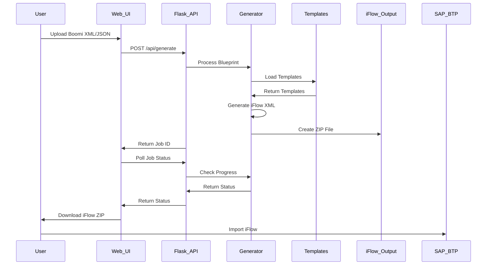
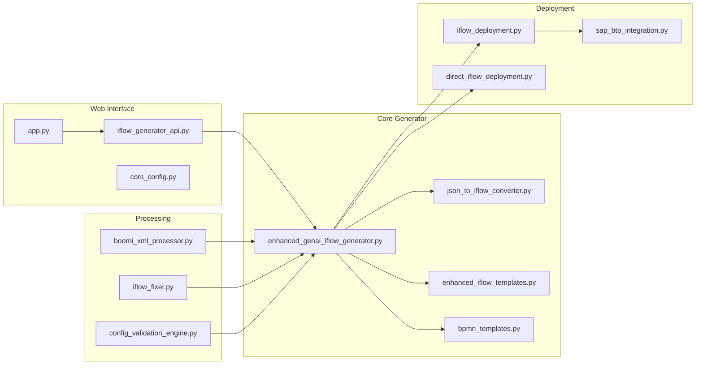
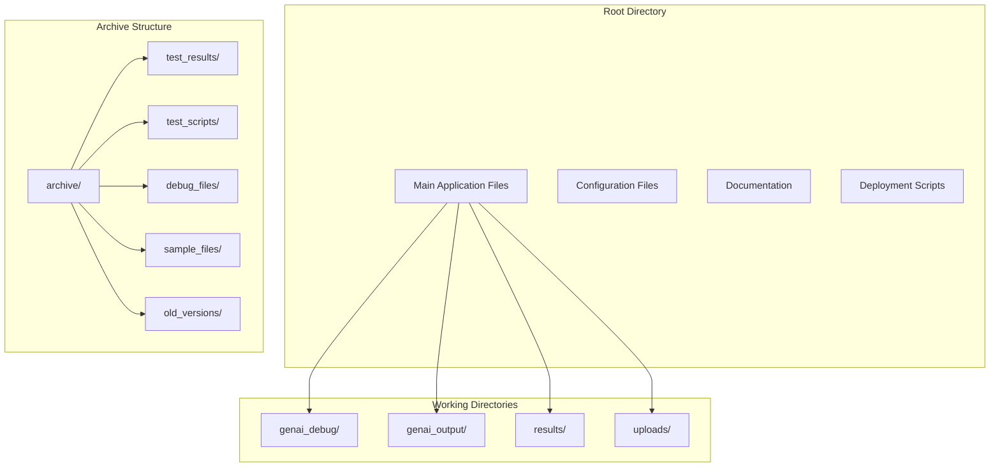
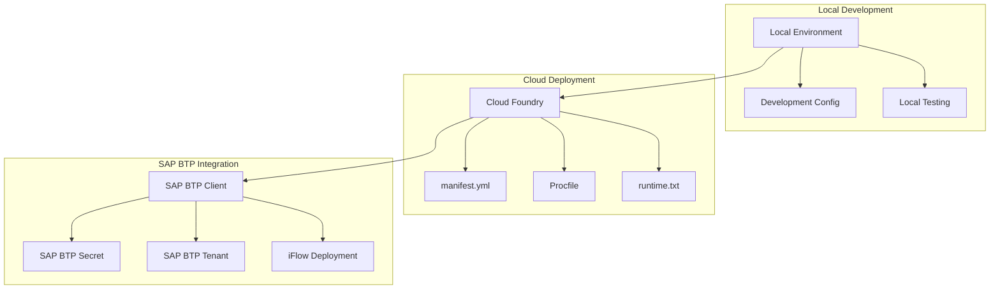

# Combined Documentation - August 24, 2025

*Generated on: 2025-09-22 13:52:00*

This document combines all markdown files created on August 24, 2025.

---

## 1. 20250824_ARCHITECTURE.md

*Source: 20250824_ARCHITECTURE.md*

# BoomiToIS-API Architecture

## 🏗️ System Architecture Overview



```mermaid
graph TB
    subgraph "Frontend Layer"
        UI[Web UI]
        CLI[Command Line Interface]
        API_Client[REST API Client]
    end
    
    subgraph "API Gateway Layer"
        Flask[Flask Web Server]
        CORS[CORS Configuration]
        Auth[Authentication]
    end
    
    subgraph "Core Processing Layer"
        Generator[Enhanced GenAI iFlow Generator]
        Converter[JSON to iFlow Converter]
        Templates[iFlow Templates]
        BPMN[BPMN Templates]
    end
    
    subgraph "Processing & Utilities"
        Boomi_Processor[Boomi XML Processor]
        iFlow_Fixer[iFlow XML Fixer]
        Validator[Configuration Validator]
        SAP_Integration[SAP BTP Integration]
    end
    
    subgraph "Data & Configuration"
        Config[Configuration Files]
        Env[Environment Variables]
        Jobs[Job Queue]
        Templates_Store[Template Store]
    end
    
    subgraph "Output & Deployment"
        iFlow_Output[iFlow ZIP Files]
        Debug_Files[Debug Outputs]
        SAP_Deploy[SAP BTP Deployment]
        Results[Results Directory]
    end
    
    subgraph "External Systems"
        Boomi[Boomi Platform]
        SAP_IS[SAP Integration Suite]
        Claude[Claude AI API]
        BTP[SAP BTP]
    end
    
    %% Frontend to API Gateway
    UI --> Flask
    CLI --> Flask
    API_Client --> Flask
    
    %% API Gateway to Core Processing
    Flask --> Generator
    Flask --> Converter
    Flask --> Templates
    Flask --> BPMN
    
    %% Core Processing to Utilities
    Generator --> Boomi_Processor
    Generator --> iFlow_Fixer
    Generator --> Validator
    Generator --> SAP_Integration
    
    %% Data Flow
    Config --> Generator
    Config --> Converter
    Env --> Generator
    Jobs --> Generator
    
    %% Output Flow
    Generator --> iFlow_Output
    Generator --> Debug_Files
    Generator --> SAP_Deploy
    Generator --> Results
    
    %% External Integrations
    Boomi --> Boomi_Processor
    SAP_IS --> SAP_Integration
    Claude --> Generator
    BTP --> SAP_Deploy
    
    %% Styling
    classDef frontend fill:#e1f5fe
    classDef api fill:#f3e5f5
    classDef core fill:#e8f5e8
    classDef utils fill:#fff3e0
    classDef data fill:#fce4ec
    classDef output fill:#e0f2f1
    classDef external fill:#f1f8e9
    
    class UI,CLI,API_Client frontend
    class Flask,CORS,Auth api
    class Generator,Converter,Templates,BPMN core
    class Boomi_Processor,iFlow_Fixer,Validator,SAP_Integration utils
    class Config,Env,Jobs,Templates_Store data
    class iFlow_Output,Debug_Files,SAP_Deploy,Results output
    class Boomi,SAP_IS,Claude,BTP external
```

## 🔄 Data Flow Architecture



## 🧩 Component Architecture



## 📊 File Organization Architecture



## 🔧 Configuration Architecture

```mermaid
graph LR
    subgraph "Environment"
        Dev[.env.development]
        Prod[.env.production]
        Example[.env.example]
    end
    
    subgraph "Configuration"
        Config_Engine[config_validation_engine.py]
        Config_Dir[config/]
        Jobs[jobs.json]
    end
    
    subgraph "Templates"
        Templates[enhanced_iflow_templates.py]
        BPMN[bpmn_templates.py]
        Component_Mapping[COMPONENT_MAPPING_REFERENCE.md]
    end
    
    Dev --> Config_Engine
    Prod --> Config_Engine
    Example --> Config_Engine
    Config_Engine --> Templates
    Config_Engine --> BPMN
    Component_Mapping --> Templates
```

## 🚀 Deployment Architecture



---

## 📋 Architecture Summary

### **Layered Architecture**
- **Frontend Layer**: Web UI, CLI, API clients
- **API Gateway Layer**: Flask server with CORS and auth
- **Core Processing Layer**: Main iFlow generation logic
- **Processing & Utilities**: Supporting processors and validators
- **Data & Configuration**: Configuration management and job queue
- **Output & Deployment**: iFlow generation and SAP deployment

### **Key Design Principles**
1. **Separation of Concerns**: Each component has a single responsibility
2. **Modularity**: Components can be developed and tested independently
3. **Extensibility**: Template system allows easy customization
4. **Scalability**: Job-based processing for handling multiple requests
5. **Maintainability**: Clean separation between core logic and utilities

### **Integration Points**
- **Boomi Platform**: Source of integration processes
- **SAP Integration Suite**: Target for generated iFlows
- **Claude AI API**: AI-powered analysis and generation
- **SAP BTP**: Cloud platform for deployment

### **Data Flow**
1. **Input**: Boomi XML/JSON blueprints
2. **Processing**: AI analysis and template-based generation
3. **Output**: SAP Integration Suite compatible iFlow ZIP files
4. **Deployment**: Direct deployment to SAP BTP (optional)

---

## 2. 20250824_CLEANUP_SUMMARY.md

*Source: 20250824_CLEANUP_SUMMARY.md*

# BoomiToIS-API Directory Cleanup Summary

## 🧹 Cleanup Operation Completed

**Date**: August 24, 2025  
**Operation**: Directory cleanup and organization  
**Status**: ✅ COMPLETED

## 📊 Before vs After

### Before Cleanup
- **Total Files**: 100+ files
- **Test Results**: 50+ directories with UUID names
- **Debug Files**: 30+ scattered files
- **Test Scripts**: 5+ scattered files
- **Sample Files**: 10+ scattered files
- **Directory Structure**: Chaotic, hard to navigate

### After Cleanup
- **Main Directory**: 45 essential files
- **Archive Directory**: 100+ archived files (organized)
- **Working Directories**: 4 clean directories
- **Documentation**: 5 organized documentation files
- **Directory Structure**: Clean, logical, maintainable

## 🗂️ What Was Moved to Archive

### `archive/test_results/` (50+ directories)
- All old test result directories
- UUID-based test outputs
- Old version test results
- Comprehensive test outputs

### `archive/test_scripts/` (5+ files)
- `comprehensive_test.py`
- `test_enhanced_processor.py`
- `generate_enhanced_sample.py`
- Other test utilities

### `archive/debug_files/` (30+ files)
- Old debug output files
- Raw iFlow XML files
- Analysis response files
- Component JSON files
- Generation logs

### `archive/sample_files/` (10+ files)
- Old blueprint JSON files
- Documentation samples
- Working examples
- Template comparisons

### `archive/old_versions/` (5+ files)
- Deprecated deployment scripts
- Old application versions
- Legacy utilities
- Superseded files

## 🚀 What Remains (Essential Files)

### Core Application Files
- `enhanced_genai_iflow_generator.py` - Main generator
- `json_to_iflow_converter.py` - Converter utility
- `app.py` - Flask application
- `iflow_generator_api.py` - API endpoints

### Template & Configuration
- `enhanced_iflow_templates.py` - iFlow templates
- `bpmn_templates.py` - BPMN templates
- `config_validation_engine.py` - Configuration validator
- `config/` - Configuration directory

### Processing & Utilities
- `boomi_xml_processor.py` - Boomi processor
- `iflow_fixer.py` - iFlow fixer
- `sap_btp_integration.py` - SAP integration
- `iflow_deployment.py` - Deployment utilities

### Working Directories
- `genai_debug/` - Current debug files
- `genai_output/` - Generated outputs
- `results/` - Current results
- `uploads/` - File uploads

### Documentation
- `README.md` - Main project documentation
- `ARCHITECTURE.md` - System architecture
- `COMPONENT_MAPPING_REFERENCE.md` - Component mapping
- `DEPLOYMENT_GUIDE.md` - Deployment guide

## 📈 Benefits of Cleanup

### 1. **Improved Navigation**
- Easy to find essential files
- Logical directory structure
- Clear separation of concerns

### 2. **Better Maintenance**
- Reduced clutter in main directory
- Organized archive for historical reference
- Easier to identify current vs. old files

### 3. **Enhanced Development Experience**
- Faster file discovery
- Cleaner project structure
- Better documentation organization

### 4. **Professional Appearance**
- Industry-standard project structure
- Clear documentation hierarchy
- Maintainable codebase

## 🔄 Maintenance Recommendations

### Monthly
- Clean up old debug files from `genai_debug/`
- Archive old test results from `results/`
- Review and clean `genai_output/`

### Quarterly
- Review archived test results
- Clean up old sample files
- Update documentation

### Annually
- Review entire archive structure
- Consider removing very old archives
- Update architecture documentation

## 📝 Archive Access

All archived files are preserved and accessible:
- **Location**: `archive/` directory
- **Organization**: Categorized by type
- **Purpose**: Historical reference and debugging
- **Restoration**: Can be copied back if needed

## 🎯 Next Steps

1. **Review Current Structure**: Ensure all essential files are in place
2. **Update Documentation**: Keep README and architecture docs current
3. **Establish Workflows**: Use clean directories for new development
4. **Regular Maintenance**: Follow maintenance schedule above

---

**Cleanup Completed Successfully** ✅  
**Project Structure**: Professional and Maintainable  
**Archive Organization**: Complete and Accessible  
**Documentation**: Comprehensive and Current

---

## 3. 20250824_PYTHON_FILES_ORGANIZATION.md

*Source: 20250824_PYTHON_FILES_ORGANIZATION.md*

# Python Files Organization Guide

## 🐍 Overview

This document explains the organization and purpose of all Python files in the BoomiToIS-API project after the comprehensive cleanup and reorganization.

## 📁 Directory Structure

### **Root Directory (Core Application Files)**
These are the main Python files that should remain in the root directory:

#### **Core Generator Files**
- `enhanced_genai_iflow_generator.py` (390KB, 8090 lines)
  - **Purpose**: Main iFlow generation engine
  - **Status**: ✅ KEEP - Core functionality
  - **Dependencies**: All template and utility modules

- `json_to_iflow_converter.py` (58KB, 1374 lines)
  - **Purpose**: Converts JSON blueprints to iFlow XML
  - **Status**: ✅ KEEP - Core functionality
  - **Dependencies**: Templates and BPMN modules

#### **Template & Configuration Files**
- `enhanced_iflow_templates.py` (103KB, 2588 lines)
  - **Purpose**: iFlow XML templates and generation logic
  - **Status**: ✅ KEEP - Core functionality
  - **Dependencies**: BPMN templates

- `bpmn_templates.py` (97KB, 2527 lines)
  - **Purpose**: BPMN 2.0 XML templates and structure
  - **Status**: ✅ KEEP - Core functionality
  - **Dependencies**: None (base templates)

- `config_validation_engine.py` (23KB, 534 lines)
  - **Purpose**: Validates configuration and input data
  - **Status**: ✅ KEEP - Core functionality
  - **Dependencies**: Configuration files

- `config_driven_generator.py` (26KB, 574 lines)
  - **Purpose**: Configuration-driven iFlow generation
  - **Status**: ✅ KEEP - Core functionality
  - **Dependencies**: Templates and validation

#### **Web Interface Files**
- `app.py` (37KB, 932 lines)
  - **Purpose**: Main Flask application
  - **Status**: ✅ KEEP - Core functionality
  - **Dependencies**: All core modules

- `iflow_generator_api.py` (11KB, 286 lines)
  - **Purpose**: REST API endpoints
  - **Status**: ✅ KEEP - Core functionality
  - **Dependencies**: Main generator

- `cors_config.py` (2.3KB, 60 lines)
  - **Purpose**: CORS configuration for web interface
  - **Status**: ✅ KEEP - Core functionality
  - **Dependencies**: Flask app

#### **Processing & Utility Files**
- `boomi_xml_processor.py` (13KB, 318 lines)
  - **Purpose**: Processes Boomi XML files
  - **Status**: ✅ KEEP - Core functionality
  - **Dependencies**: XML processing libraries

- `iflow_fixer.py` (17KB, 394 lines)
  - **Purpose**: Fixes common iFlow XML issues
  - **Status**: ✅ KEEP - Core functionality
  - **Dependencies**: XML processing

- `sap_btp_integration.py` (8.6KB, 225 lines)
  - **Purpose**: SAP BTP integration utilities
  - **Status**: ✅ KEEP - Core functionality
  - **Dependencies**: SAP BTP libraries

- `direct_iflow_deployment.py` (8.2KB, 204 lines)
  - **Purpose**: Direct iFlow deployment to SAP
  - **Status**: ✅ KEEP - Core functionality
  - **Dependencies**: SAP BTP integration

### **Utils Directory (`utils/`)**
Utility scripts and helper modules:

- `run.py` (595B, 20 lines)
  - **Purpose**: Development server runner
  - **Status**: ✅ MOVED - Utility script
  - **Usage**: `python utils/run.py`

- `setup_dependencies.py` (2.3KB, 68 lines)
  - **Purpose**: Sets up project dependencies
  - **Status**: ✅ MOVED - Setup utility
  - **Usage**: `python utils/setup_dependencies.py`

- `nltk_setup.py` (1.6KB, 49 lines)
  - **Purpose**: NLTK data configuration
  - **Status**: ✅ MOVED - Setup utility
  - **Usage**: Auto-imported by app.py

- `client.py` (5.4KB, 163 lines)
  - **Purpose**: Example API client
  - **Status**: ✅ MOVED - Example utility
  - **Usage**: `python utils/client.py --markdown-file file.md`

### **Specialized Directory (`specialized/`)**
Advanced and specialized modules:

- `enhanced_prompt_generator.py` (59KB, 1345 lines)
  - **Purpose**: Advanced AI prompt generation
  - **Status**: ✅ MOVED - Specialized functionality
  - **Usage**: Imported by main generator
  - **Complexity**: High - Requires AI/ML expertise

## 🗂️ Files Moved to Archive

### **Redundant Files (Archived)**
- `fix_iflow.py` → `archive/old_versions/`
  - **Reason**: Superseded by `iflow_fixer.py`
  - **Status**: ❌ ARCHIVED - Redundant functionality

- `iflow_deployment.py` → `archive/old_versions/`
  - **Reason**: Superseded by `direct_iflow_deployment.py`
  - **Status**: ❌ ARCHIVED - Older implementation

### **Test & Debug Files (Archived)**
- All test scripts → `archive/test_scripts/`
- All debug outputs → `archive/debug_files/`
- All sample files → `archive/sample_files/`
- All test results → `archive/test_results/`

## 🔄 Import Paths

### **Updated Import Statements**
After reorganization, some import paths may need updating:

```python
# Before (if any files imported these directly)
from client import *
from nltk_setup import setup_nltk

# After (update to new paths)
from utils.client import *
from utils.nltk_setup import setup_nltk
```

### **Main Application Imports**
The main application (`app.py`) should continue to work as before since it imports from the root directory.

## 📊 File Size Analysis

### **Large Files (>50KB)**
- `enhanced_genai_iflow_generator.py` (390KB) - Main engine
- `enhanced_iflow_templates.py` (103KB) - Templates
- `bpmn_templates.py` (97KB) - BPMN structure
- `enhanced_prompt_generator.py` (59KB) - AI prompts
- `json_to_iflow_converter.py` (58KB) - Converter

### **Medium Files (10-50KB)**
- `app.py` (37KB) - Flask app
- `config_driven_generator.py` (26KB) - Config generator
- `config_validation_engine.py` (23KB) - Validator
- `iflow_fixer.py` (17KB) - XML fixer
- `sap_btp_integration.py` (8.6KB) - SAP integration
- `direct_iflow_deployment.py` (8.2KB) - Deployment

### **Small Files (<10KB)**
- `iflow_generator_api.py` (11KB) - API endpoints
- `boomi_xml_processor.py` (13KB) - Boomi processor
- All utility files in `utils/` directory

## 🚀 Best Practices

### **File Organization**
1. **Keep core functionality** in root directory
2. **Move utilities** to `utils/` directory
3. **Move specialized modules** to `specialized/` directory
4. **Archive redundant files** to prevent confusion

### **Maintenance**
1. **Monthly**: Clean up debug/output files
2. **Quarterly**: Review utility scripts
3. **Annually**: Review specialized modules
4. **As needed**: Archive old versions

### **Development Workflow**
1. **New utilities** → Place in `utils/`
2. **New specialized features** → Place in `specialized/`
3. **Core changes** → Modify root directory files
4. **Testing** → Use `utils/client.py` for API testing

## 📋 Summary

### **Files Kept in Root**: 15 Python files
- **Core functionality**: 8 files
- **Web interface**: 3 files  
- **Processing**: 4 files

### **Files Moved to Utils**: 4 Python files
- **Server runner**: 1 file
- **Setup utilities**: 2 files
- **Example client**: 1 file

### **Files Moved to Specialized**: 1 Python file
- **Advanced AI functionality**: 1 file

### **Files Archived**: 2+ Python files
- **Redundant functionality**: 2 files
- **Test/debug files**: 100+ files

---

**Result**: Clean, organized, maintainable Python codebase with clear separation of concerns and easy navigation.

---

## 4. 20250824_README.md

*Source: 20250824_README.md*

# Boomi to SAP Integration Suite (iFlow) Converter

A comprehensive tool for converting Boomi integration processes to SAP Integration Suite iFlow format.

## 🏗️ Project Structure

```
BoomiToIS-API/
├── 📁 Core Components/
│   ├── enhanced_genai_iflow_generator.py    # Main iFlow generator
│   ├── json_to_iflow_converter.py           # JSON to iFlow converter
│   ├── enhanced_iflow_templates.py          # iFlow templates
│   ├── bpmn_templates.py                    # BPMN templates
│   └── config_driven_generator.py           # Configuration-driven generator
├── 📁 API & Web Interface/
│   ├── app.py                               # Main Flask application
│   ├── iflow_generator_api.py               # API endpoints
│   └── cors_config.py                       # CORS configuration
├── 📁 Configuration & Validation/
│   ├── config_validation_engine.py          # Configuration validator
│   ├── config/                              # Configuration files
│   └── .env*                                # Environment files
├── 📁 Utils/
│   ├── run.py                               # Development server runner
│   ├── setup_dependencies.py                # Dependency setup
│   ├── nltk_setup.py                        # NLTK configuration
│   └── client.py                            # API client example
├── 📁 Specialized/
│   └── enhanced_prompt_generator.py         # Advanced prompt generation
├── 📁 Processing & Utilities/
│   ├── boomi_xml_processor.py               # Boomi XML processor
│   ├── iflow_fixer.py                       # iFlow XML fixer
│   └── sap_btp_integration.py               # SAP BTP integration
├── 📁 Deployment & Setup/
│   ├── direct_iflow_deployment.py           # Direct deployment
│   ├── deploy.*                              # Deployment scripts
│   └── setup.*                              # Setup scripts
├── 📁 Documentation/
│   ├── COMPONENT_MAPPING_REFERENCE.md       # Component mapping
│   ├── DEPLOYMENT_GUIDE.md                  # Deployment guide
│   ├── IMPLEMENTATION_SUMMARY.md            # Implementation summary
│   └── README_DEPLOYMENT.md                 # Deployment README
├── 📁 Archive/                              # Archived files
│   ├── test_results/                        # Old test results
│   ├── test_scripts/                        # Old test scripts
│   ├── debug_files/                         # Old debug files
│   ├── sample_files/                        # Old sample files
│   └── old_versions/                        # Old versions
└── 📁 Working Directories/
    ├── genai_debug/                         # Current debug files
    ├── genai_output/                        # Generated outputs
    ├── results/                             # Current results
    └── uploads/                             # File uploads
```

## 🚀 Quick Start

### Prerequisites
- Python 3.8+
- SAP Integration Suite access
- Boomi integration export

### Installation
```bash
# Install dependencies
pip install -r requirements.txt

# Setup environment
cp .env.example .env
# Edit .env with your configuration

# Run the application
python app.py
```

### Usage

#### 1. Web Interface
- Start the Flask app: `python app.py` or `python utils/run.py`
- Access: `http://localhost:5000`
- Upload Boomi XML or JSON files
- Generate iFlow ZIP files

#### 2. Command Line
```bash
# Generate iFlow from JSON blueprint
python tools/iflow_generate_template.py --json blueprint.json --name MyFlow --out output/

# Convert Boomi XML to iFlow
python json_to_iflow_converter.py --input boomi.xml --output iflow.zip

# Test the API with a markdown file
python utils/client.py --markdown-file example.md --iflow-name MyFlow
```

#### 3. API Usage
```python
import requests

# Generate iFlow
response = requests.post('http://localhost:5000/api/generate', 
                        json={'blueprint': blueprint_data})
iflow_zip = response.content
```

## 🔧 Configuration

### Environment Variables
- `SAP_CLIENT_ID`: SAP BTP client ID
- `SAP_CLIENT_SECRET`: SAP BTP client secret
- `SAP_TENANT`: SAP BTP tenant
- `ANTHROPIC_API_KEY`: Anthropic API key (optional)

### Component Mapping
Edit `COMPONENT_MAPPING_REFERENCE.md` to customize component translations.

## 📊 Features

- ✅ **Boomi XML Processing**: Parse and analyze Boomi integration processes
- ✅ **iFlow Generation**: Create SAP Integration Suite compatible iFlows
- ✅ **Template System**: Flexible template-based generation
- ✅ **Validation**: Comprehensive iFlow validation and fixing
- ✅ **Deployment**: Direct deployment to SAP BTP
- ✅ **API Interface**: RESTful API for integration
- ✅ **Web UI**: User-friendly web interface

## 🧪 Testing

Test files and results are archived in `archive/test_results/` and `archive/test_scripts/`.

## 📚 Documentation

- **Component Mapping**: `COMPONENT_MAPPING_REFERENCE.md`
- **Deployment**: `DEPLOYMENT_GUIDE.md`
- **Implementation**: `IMPLEMENTATION_SUMMARY.md`

## 🤝 Contributing

1. Fork the repository
2. Create a feature branch
3. Make your changes
4. Test thoroughly
5. Submit a pull request

## 📄 License

This project is licensed under the MIT License.

## 🆘 Support

For issues and questions:
1. Check the documentation
2. Review archived test results
3. Create an issue with detailed information

---

**Last Updated**: August 2025
**Version**: 2.0.0
**Status**: Production Ready

---

## 5. 20250824_README.md

*Source: archive\20250824_README.md*

# Archive Directory

This directory contains archived files that were cleaned up from the main BoomiToIS-API directory to maintain a clean project structure.

## 📁 Directory Structure

### `test_results/`
- Old test results from various test runs
- Generated iFlow files from testing
- UUID-based test directories
- Old version test outputs

### `test_scripts/`
- Old test scripts and utilities
- Comprehensive test files
- Test processors and sample generators

### `debug_files/`
- Old debug output files
- Raw iFlow XML files
- Analysis response files
- Component JSON files

### `sample_files/`
- Old sample blueprints
- Documentation samples
- Working examples
- Template comparison files

### `old_versions/`
- Deprecated deployment scripts
- Old application versions
- Superseded utilities
- Legacy setup files

## 🔄 Cleanup Summary

**Date**: August 2025
**Reason**: Directory cleanup and organization
**Files Moved**: 100+ files
**Space Saved**: Significant reduction in main directory clutter

## 📋 What Was Archived

### Test Results (50+ directories)
- Multiple test runs with UUID names
- Old test outputs from various versions
- Comprehensive test results
- Simple test outputs

### Test Scripts (5+ files)
- `comprehensive_test.py`
- `test_enhanced_processor.py`
- `generate_enhanced_sample.py`

### Sample Files (10+ files)
- Various blueprint JSON files
- Documentation samples
- Working examples
- Template comparisons

### Debug Files (30+ files)
- Raw iFlow XML outputs
- Analysis responses
- Component mappings
- Generation logs

### Old Versions (5+ files)
- Deprecated deployment scripts
- Old application versions
- Legacy utilities

## 🚀 Current Working Structure

The main directory now contains only:
- Core application files
- Current working directories
- Essential documentation
- Active configuration files

## 📝 Accessing Archived Files

If you need to access any archived files:

1. **Browse**: Navigate to the appropriate subdirectory
2. **Restore**: Copy files back to main directory if needed
3. **Reference**: Use for historical analysis or debugging

## 🧹 Maintenance

- **Monthly**: Review and clean up old debug files
- **Quarterly**: Archive old test results
- **Annually**: Review and potentially remove very old archives

---

**Note**: These files are preserved for historical reference and debugging purposes. They are not needed for normal operation of the BoomiToIS-API.

---

## 6. 20250824_README.md

*Source: specialized\20250824_README.md*

# Specialized Directory

This directory contains specialized modules and utilities that provide specific functionality for the BoomiToIS-API project.

## 📁 Available Specialized Modules

### `enhanced_prompt_generator.py`
- **Purpose**: Advanced prompt generation for AI-powered iFlow generation
- **Size**: 59KB, 1345 lines
- **Features**:
  - Intelligent prompt construction
  - Context-aware prompt generation
  - Template-based prompt management
  - AI model optimization

## 🔧 Usage

### Enhanced Prompt Generator
```python
# Import the specialized module
from specialized.enhanced_prompt_generator import EnhancedPromptGenerator

# Create an instance
generator = EnhancedPromptGenerator()

# Generate prompts for different use cases
prompt = generator.generate_iflow_prompt(blueprint_data)
```

## 📊 Module Characteristics

### **enhanced_prompt_generator.py**
- **Complexity**: High - Advanced AI prompt engineering
- **Dependencies**: Core project modules
- **Integration**: Used by main iFlow generator
- **Maintenance**: Requires AI/ML expertise

## 🚀 Integration

These specialized modules are designed to work with the main application:
- Imported by core modules as needed
- Provide advanced functionality
- Maintain separation of concerns
- Allow for specialized development

## 📋 Development Guidelines

When working with specialized modules:
1. **Keep them focused** on a single responsibility
2. **Document complex logic** thoroughly
3. **Test integration points** with main modules
4. **Maintain backward compatibility** when possible

---

**Note**: These modules contain advanced functionality and should be modified with care. Always test changes thoroughly before deployment.

---

## 7. 20250824_README.md

*Source: utils\20250824_README.md*

# Utils Directory

This directory contains utility scripts and helper modules for the BoomiToIS-API project.

## 📁 Available Utilities

### `run.py`
- **Purpose**: Local development server runner using Waitress WSGI server
- **Usage**: `python utils/run.py`
- **Features**: 
  - Configurable port via environment variable
  - Production-ready WSGI server
  - Automatic host binding

### `setup_dependencies.py`
- **Purpose**: Sets up project dependencies and copies necessary files
- **Usage**: `python utils/setup_dependencies.py`
- **Features**:
  - Copies core files from MuleToIflowGenAI Approach folder
  - Creates required directories
  - Logs all operations

### `nltk_setup.py`
- **Purpose**: Downloads and configures NLTK data packages
- **Usage**: Automatically imported by app.py during startup
- **Features**:
  - Downloads required NLTK packages (punkt, stopwords, wordnet, etc.)
  - Configurable data directory
  - Error handling and logging

### `client.py`
- **Purpose**: Example API client demonstrating how to use the BoomiToIS-API
- **Usage**: `python utils/client.py --markdown-file path/to/file.md`
- **Features**:
  - Command-line interface
  - iFlow generation workflow
  - Job status monitoring
  - Automatic download of generated iFlows

## 🚀 Quick Start

```bash
# Run the development server
python utils/run.py

# Setup dependencies (first time only)
python utils/setup_dependencies.py

# Test the API with a markdown file
python utils/client.py --markdown-file example.md --iflow-name MyFlow
```

## 📋 Dependencies

These utilities depend on:
- `waitress` - WSGI server for production
- `nltk` - Natural language processing
- `requests` - HTTP client for API testing
- `argparse` - Command-line argument parsing

## 🔧 Configuration

Most utilities use environment variables:
- `PORT` - Server port (default: 5000)
- `NLTK_DATA` - NLTK data directory path
- API credentials for client testing

---

**Note**: These utilities are designed to work with the main BoomiToIS-API application and should be run from the project root directory.

---

*End of Combined Documentation*
*Total files combined: 7*
