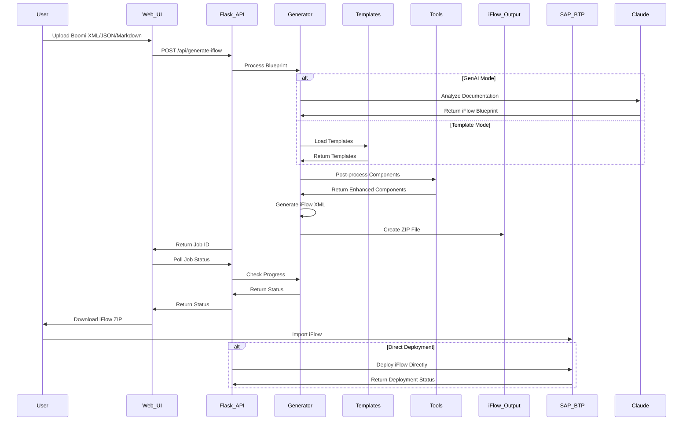
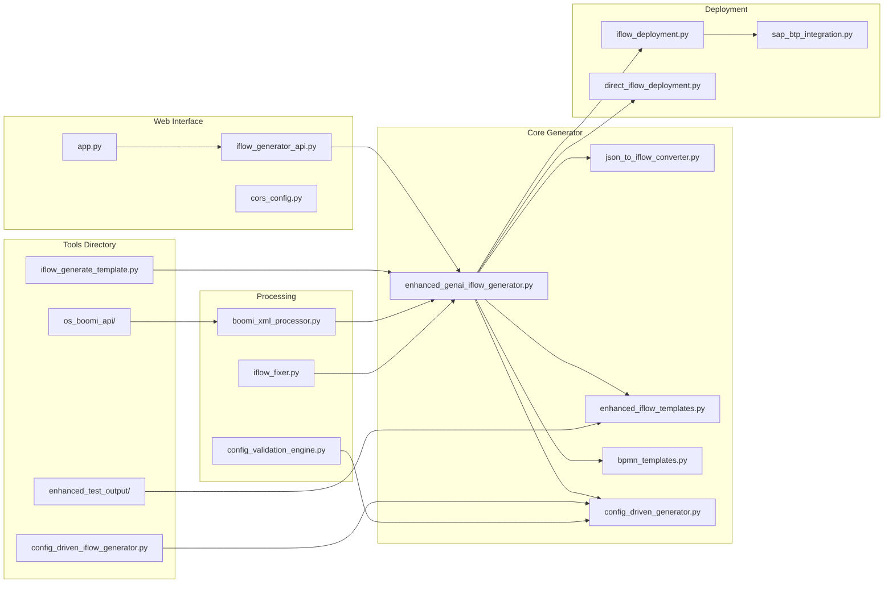

```mermaid
graph TD
    subgraph "Root Directory"
        Main[Main Application Files]
        Config[Configuration Files]
        Docs[Documentation]
        Scripts[Deployment Scripts]
    end
    
    subgraph "BoomiToIS-API"
        API_Main[app.py, enhanced_genai_iflow_generator.py]
        API_Templates[enhanced_iflow_templates.py, bpmn_templates.py]
        API_Converters[json_to_iflow_converter.py]
        API_Processors[boomi_xml_processor.py, iflow_fixer.py]
        API_Utils[config_validation_engine.py, sap_btp_integration.py]
        API_Config[config/, .env files]
    end
    
    subgraph "Tools Directory"
        Tools_Main[iflow_generate_template.py]
        Tools_Config[config_driven_iflow_generator.py]
        Tools_Enhanced[enhanced_test_output/]
        Tools_OS[os_boomi_api/]
        Tools_Test[test_output/, post_processed_output/]
    end
    
    subgraph "Working Directories"
        GenAI_Debug[genai_debug/]
        GenAI_Output[genai_output/]
        Results[results/]
        Uploads[uploads/]
        Archive[archive/]
    end
    
    subgraph "Test & Output"
        Test_Results[test_results/]
        Test_Scripts[test_scripts/]
        Debug_Files[debug_files/]
        Sample_Files[sample_files/]
        SAP_Output[sap_package_output/, proper_iflow_output/]
    end
    
    %% Connections
    Main --> API_Main
    API_Main --> API_Templates
    API_Main --> API_Converters
    API_Main --> API_Processors
    API_Main --> API_Utils
    
    Tools_Main --> API_Main
    Tools_Config --> API_Utils
    Tools_Enhanced --> API_Templates
    
    API_Main --> GenAI_Debug
    API_Main --> GenAI_Output
    API_Main --> Results
    API_Main --> Uploads
    
    API_Main --> Test_Results
    API_Main --> Test_Scripts
    API_Main --> Debug_Files
    API_Main --> Sample_Files
    API_Main --> SAP_Output
```

# Combined Documentation - September 22, 2025

*Generated on: 2025-09-22 13:54:00*

This document combines all markdown files created on September 22, 2025.

---

## 1. 20250922_ARCHITECTURE_COMPLETE.md

*Source: 20250922_ARCHITECTURE_COMPLETE.md*

# Complete BoomiToIS-API and Tools Architecture

## 🏗️ System Architecture Overview

```mermaid
graph TB
    subgraph "Frontend & API Layer"
        UI[Web UI - Flask Templates]
        CLI[Command Line Tools]
        API_Client[REST API Client]
        Flask[Flask Web Server]
        CORS[CORS Configuration]
        Auth[Authentication & CORS]
    end
    
    subgraph "Core Processing Layer"
        Generator[Enhanced GenAI iFlow Generator]
        Converter[JSON to iFlow Converter]
        Templates[iFlow Templates Engine]
        BPMN[BPMN Templates]
        ConfigGen[Config-Driven Generator]
    end
    
    subgraph "Tools Directory"
        TemplateTool[iflow_generate_template.py]
        ConfigTool[config_driven_iflow_generator.py]
        EnhancedTool[Enhanced Mapping Tools]
        OSBoomiAPI[OS Boomi API]
    end
    
    subgraph "Processing & Utilities"
        Boomi_Processor[Boomi XML Processor]
        iFlow_Fixer[iFlow XML Fixer]
        Validator[Configuration Validator]
        SAP_Integration[SAP BTP Integration]
        DirectDeploy[Direct iFlow Deployment]
    end
    
    subgraph "Data & Configuration"
        Config[Configuration Files]
        Env[Environment Variables]
        Jobs[Job Queue System]
        Templates_Store[Template Store]
        Debug_Output[Debug & Test Outputs]
    end
    
    subgraph "Output & Deployment"
        iFlow_Output[iFlow ZIP Files]
        Debug_Files[Debug Outputs]
        SAP_Deploy[SAP BTP Deployment]
        Results[Results Directory]
        Test_Outputs[Test Outputs]
    end
    
    subgraph "External Systems"
        Boomi[Boomi Platform]
        SAP_IS[SAP Integration Suite]
        Claude[Claude AI API]
        OpenAI[OpenAI API]
        BTP[SAP BTP]
    end
    
    %% Frontend to API Gateway
    UI --> Flask
    CLI --> Flask
    API_Client --> Flask
    
    %% API Gateway to Core Processing
    Flask --> Generator
    Flask --> Converter
    Flask --> Templates
    Flask --> BPMN
    
    %% Tools Directory Integration
    TemplateTool --> Generator
    ConfigTool --> ConfigGen
    EnhancedTool --> Templates
    OSBoomiAPI --> Boomi_Processor
    
    %% Core Processing to Utilities
    Generator --> Boomi_Processor
    Generator --> iFlow_Fixer
    Generator --> Validator
    Generator --> SAP_Integration
    ConfigGen --> Validator
    
    %% Data Flow
    Config --> Generator
    Config --> Converter
    Env --> Generator
    Jobs --> Generator
    
    %% Output Flow
    Generator --> iFlow_Output
    Generator --> Debug_Files
    Generator --> SAP_Deploy
    Generator --> Results
    ConfigGen --> Test_Outputs
    
    %% External Integrations
    Boomi --> Boomi_Processor
    SAP_IS --> SAP_Integration
    Claude --> Generator
    OpenAI --> Generator
    BTP --> SAP_Deploy
    
    %% Styling
    classDef frontend fill:#e1f5fe
    classDef api fill:#f3e5f5
    classDef core fill:#e8f5e8
    classDef tools fill:#fff8e1
    classDef utils fill:#fff3e0
    classDef data fill:#fce4ec
    classDef output fill:#e0f2f1
    classDef external fill:#f1f8e9
    
    class UI,CLI,API_Client frontend
    class Flask,CORS,Auth api
    class Generator,Converter,Templates,BPMN,ConfigGen core
    class TemplateTool,ConfigTool,EnhancedTool,OSBoomiAPI tools
    class Boomi_Processor,iFlow_Fixer,Validator,SAP_Integration,DirectDeploy utils
    class Config,Env,Jobs,Templates_Store,Debug_Output data
    class iFlow_Output,Debug_Files,SAP_Deploy,Results,Test_Outputs output
    class Boomi,SAP_IS,Claude,OpenAI,BTP external
```



## 🔄 Complete Data Flow Architecture



## 🧩 Component Architecture with Tools Integration



## 📊 Complete File Organization Architecture



## 🔧 Key Features & Capabilities

### Core Functionality
- **Dual Generation Modes**: GenAI-powered and template-based approaches
- **SAP Integration Suite Compatibility**: Ensures generated iFlows work with SAP systems
- **Job Management**: Asynchronous processing with status tracking
- **Multiple Output Formats**: ZIP packages, debug files, and direct deployment
- **Cross-Platform Support**: Windows, Linux, and cloud deployment options

### Tools Integration
- **Command-Line Interface**: Direct iFlow generation without web interface
- **Configuration-Driven**: JSON-based configuration for automated generation
- **Enhanced Mapping**: Advanced component mapping and validation
- **OS-Specific APIs**: Platform-specific Boomi integration capabilities

### Processing Capabilities
- **Boomi XML Processing**: Parse and analyze Boomi process documentation
- **Component Mapping**: Intelligent mapping of Boomi components to SAP iFlow components
- **BPMN Generation**: Standard-compliant BPMN XML generation
- **Error Handling**: Comprehensive error handling and validation

### Deployment Options
- **Direct SAP BTP**: Automated deployment to SAP Business Technology Platform
- **File Export**: Standard ZIP file export for manual deployment
- **Debug Output**: Comprehensive debugging information for troubleshooting
- **Template Validation**: Ensures generated iFlows meet SAP requirements

## 🚀 Usage Patterns

### Web API Usage
1. **Upload Documentation**: POST to `/api/generate-iflow`
2. **Monitor Progress**: GET `/api/jobs/{job_id}`
3. **Download Results**: GET `/api/jobs/{job_id}/download`
4. **Direct Deployment**: POST to `/api/deploy-iflow`

### Command Line Usage
1. **Template Generation**: `python iflow_generate_template.py --input blueprint.json`
2. **Config-Driven**: `python config_driven_iflow_generator.py --config config.json`
3. **Enhanced Mapping**: Use enhanced test output tools for complex scenarios

### Integration Patterns
1. **CI/CD Integration**: Automated iFlow generation in deployment pipelines
2. **Boomi Integration**: Direct processing of Boomi process exports
3. **SAP Integration**: Seamless deployment to SAP Integration Suite
4. **Multi-Platform**: Support for various operating systems and cloud platforms

---

## 2. 20250922_ARCHIVING_GUIDE.md

*Source: 20250922_ARCHIVING_GUIDE.md*

# Directory Archiving Guide

This guide explains how to clean up the BoomiToIS-API project by archiving test output directories and other non-essential files.

## 🗂️ What Gets Archived

The following directories are safe to archive as they contain test outputs and sample files that are not needed for the core application:

- `Complete_Workflow_Test_output/`
- `Enhanced_Complete_Package_Test_output/`
- `Single_IFlow_Test_output/`
- `Template_Test_Integration_output/`
- `minimal_sap_package_output/`
- `proper_iflow_output/`
- `sap_package_output/`
- `test_empty/`
- `test_step_1/`
- `test_output/`

## 🚀 How to Archive

### Option 1: Using the Python Script (Recommended)

```bash
# Dry run to see what would be archived
python archive_directories.py --dry-run

# Actually archive the directories
python archive_directories.py
```

### Option 2: Using the Batch Script (Windows)

```cmd
archive_test_outputs.bat
```

### Option 3: Using the Shell Script (Linux/Mac)

```bash
./archive_test_outputs.sh
```

## 📁 Archive Structure

After archiving, the directories will be moved to:
```
archive/
└── test_outputs_YYYYMMDD_HHMMSS/
    ├── README.md
    ├── Complete_Workflow_Test_output/
    ├── Enhanced_Complete_Package_Test_output/
    ├── Single_IFlow_Test_output/
    ├── Template_Test_Integration_output/
    ├── minimal_sap_package_output/
    ├── proper_iflow_output/
    ├── sap_package_output/
    ├── test_empty/
    ├── test_step_1/
    └── test_output/
```

## 🔧 What Remains in Main Directory

The following directories and files are **NOT archived** as they are essential for the application:

### Core Application Files
- `app.py` - Main Flask application
- `enhanced_genai_iflow_generator.py` - Core generator engine
- `enhanced_iflow_templates.py` - Template system
- `iflow_generator_api.py` - API wrapper
- `iflow_fixer.py` - Post-generation fixing
- `cors_config.py` - CORS configuration
- `sap_btp_integration.py` - SAP deployment
- `direct_iflow_deployment.py` - Direct deployment

### Active Directories
- `genai_debug/` - **ACTIVE** - Contains runtime debug files
- `results/` - **ACTIVE** - Contains job results
- `uploads/` - **ACTIVE** - Contains uploaded files
- `utils/` - **ACTIVE** - Contains utility functions and NLTK data

### Configuration Files
- `.env*` - Environment configurations
- `requirements.txt` - Python dependencies
- `manifest.yml` - Cloud Foundry deployment
- `Procfile` - Process configuration
- `runtime.txt` - Python version

## 🔄 Restoration

If you need to restore any archived directories:

1. Navigate to the archive directory: `archive/test_outputs_YYYYMMDD_HHMMSS/`
2. Copy the desired directory back to the main BoomiToIS-API directory
3. The directory will be immediately available for use

## 📊 Space Savings

The archiving process typically saves significant disk space:
- Test output directories: ~0.1-0.5 MB each
- Total space saved: ~1-5 MB (depending on test outputs)
- Main benefit: Cleaner project structure and easier navigation

## ⚠️ Important Notes

1. **Always run with `--dry-run` first** to see what will be archived
2. **The `genai_debug/` directory is NOT archived** - it contains active debug files
3. **The `genai_output/` directory contents can be archived** but the directory structure is preserved
4. **Archived files are moved, not copied** - they are no longer in the main directory
5. **The archive includes a README** explaining what was archived and how to restore

## 🛠️ Customization

You can customize the archiving process by modifying `archive_directories.py`:

- Add more directories to `DIRECTORIES_TO_ARCHIVE`
- Change the archive location with `--archive-dir`
- Modify the README template in the `create_archive_readme()` function

## 📝 Logs

The archiving script provides detailed logging:
- Shows which directories are being processed
- Displays file sizes
- Reports success/failure status
- Creates a summary at the end

All operations are logged with timestamps for easy tracking.

---

## 3. 20250922_CODEBASE_ANALYSIS.md

*Source: 20250922_CODEBASE_ANALYSIS.md*

# BoomiToIS-API and Tools Directory Codebase Analysis

## 📋 Overview

This document provides a comprehensive analysis of the BoomiToIS-API and tools directory codebase, explaining the architecture, key components, and their relationships for generating SAP Integration Suite iFlows from Dell Boomi process documentation.

## 🏗️ Architecture Overview

The codebase is organized into two main sections:

1. **BoomiToIS-API**: Main Flask-based web application for iFlow generation
2. **Tools Directory**: Command-line tools and utilities for direct iFlow generation

## 📁 BoomiToIS-API Directory Structure

### Core Application Files

#### `app.py` - Main Flask Application
- **Purpose**: Flask web server providing REST API endpoints
- **Key Features**:
  - CORS configuration for cross-origin requests
  - Job queue management with background processing
  - File upload and result management
  - Integration with GenAI iFlow generator
- **Main Endpoints**:
  - `/api/health` - Health check
  - `/api/generate-iflow` - Start iFlow generation
  - `/api/jobs/{job_id}` - Get job status
  - `/api/jobs/{job_id}/download` - Download generated iFlow

#### `enhanced_genai_iflow_generator.py` - Core Generator Engine
- **Purpose**: Main iFlow generation engine using GenAI
- **Key Features**:
  - Dual generation modes: GenAI-powered and template-based
  - Integration with Claude and OpenAI APIs
  - SAP Integration Suite compatibility
  - Component mapping and validation
- **Size**: 7,159 lines - Core processing logic

#### `enhanced_iflow_templates.py` - Template System
- **Purpose**: BPMN and iFlow template management
- **Key Features**:
  - SAP-compliant BPMN templates
  - Component-specific templates
  - Dynamic template generation
- **Size**: 2,638 lines - Template definitions

#### `bpmn_templates.py` - BPMN Generation
- **Purpose**: BPMN XML generation and manipulation
- **Key Features**:
  - Standard BPMN 2.0 compliance
  - SAP Integration Suite compatibility
  - XML structure management
- **Size**: 2,527 lines - BPMN processing

### Processing and Conversion

#### `json_to_iflow_converter.py` - JSON to iFlow Converter
- **Purpose**: Converts JSON blueprints to SAP iFlow XML
- **Key Features**:
  - Component mapping from JSON to iFlow
  - BPMN structure generation
  - SAP Integration Suite validation
- **Size**: 951 lines - Conversion logic

#### `boomi_xml_processor.py` - Boomi XML Processing
- **Purpose**: Processes Dell Boomi XML documentation
- **Key Features**:
  - XML parsing and analysis
  - Component extraction
  - Process flow analysis
- **Size**: 318 lines - XML processing

#### `iflow_fixer.py` - iFlow XML Fixer
- **Purpose**: Post-processes and fixes generated iFlow XML
- **Key Features**:
  - XML validation and correction
  - SAP compliance checks
  - Error handling and recovery
- **Size**: 17KB - XML fixing utilities

### Configuration and Validation

#### `config_validation_engine.py` - Configuration Validator
- **Purpose**: Validates iFlow configurations and blueprints
- **Key Features**:
  - JSON schema validation
  - Component configuration validation
  - Error reporting and suggestions
- **Size**: 534 lines - Validation logic

#### `config_driven_generator.py` - Config-Driven Generator
- **Purpose**: Generates iFlows from configuration files
- **Key Features**:
  - Configuration file processing
  - Template-based generation
  - Batch processing capabilities
- **Size**: 574 lines - Configuration processing

### Deployment and Integration

#### `sap_btp_integration.py` - SAP BTP Integration
- **Purpose**: Integrates with SAP Business Technology Platform
- **Key Features**:
  - OAuth authentication
  - iFlow deployment
  - Platform integration
- **Size**: 225 lines - SAP BTP integration

#### `direct_iflow_deployment.py` - Direct Deployment
- **Purpose**: Direct iFlow deployment without manual steps
- **Key Features**:
  - Automated deployment
  - Status monitoring
  - Error handling
- **Size**: 8.2KB - Deployment automation

### Utility and Support Files

#### `cors_config.py` - CORS Configuration
- **Purpose**: Manages Cross-Origin Resource Sharing
- **Key Features**:
  - Environment-based CORS configuration
  - Multiple origin support
  - Security configuration

#### `iflow_generator_api.py` - API Interface
- **Purpose**: Provides API interface for iFlow generation
- **Key Features**:
  - Function interface for main app
  - Error handling
  - Result formatting

## 📁 Tools Directory Structure

### Main Tools

#### `iflow_generate_template.py` - Template Generation Tool
- **Purpose**: Command-line tool for iFlow generation using templates
- **Key Features**:
  - Direct template processing
  - Component enrichment
  - Enhanced mapping capabilities
- **Size**: 1,442 lines - Template processing logic

#### `config_driven_iflow_generator.py` - Config-Driven Tool
- **Purpose**: Command-line tool for configuration-driven generation
- **Key Features**:
  - JSON configuration processing
  - Template-based generation
  - Validation and error handling
- **Size**: 434 lines - Configuration processing

#### `iflow_generate.py` - Basic Generation Tool
- **Purpose**: Basic iFlow generation utility
- **Key Features**:
  - Simple generation workflow
  - Basic template support
  - File output management
- **Size**: 412 lines - Basic generation

### Enhanced Tools

#### `enhanced_test_output/` - Enhanced Mapping Tools
- **Purpose**: Advanced component mapping and testing
- **Contents**:
  - Enhanced mapping algorithms
  - Test output analysis
  - Component validation results

#### `os_boomi_api/` - OS-Specific Boomi API
- **Purpose**: Platform-specific Boomi integration
- **Contents**:
  - Operating system specific APIs
  - Platform integration utilities
  - Cross-platform compatibility

### Validation and Testing

#### `json_components_validator.py` - JSON Validation
- **Purpose**: Validates JSON component definitions
- **Key Features**:
  - Schema validation
  - Component structure validation
  - Error reporting

#### `json_to_iflow_converter.py` - Simple Converter
- **Purpose**: Basic JSON to iFlow conversion
- **Key Features**:
  - Simple conversion logic
  - Basic template support
  - File output

## 🔄 Data Flow and Processing

### Web API Flow
1. **Request Reception**: Flask app receives iFlow generation request
2. **Job Creation**: Creates background job and returns job ID
3. **Background Processing**: GenAI generator processes documentation
4. **Template Application**: Applies appropriate templates
5. **Component Mapping**: Maps Boomi components to SAP components
6. **XML Generation**: Generates BPMN-compliant XML
7. **Result Packaging**: Creates ZIP file with iFlow and debug info
8. **Status Updates**: Updates job status throughout process

### Command-Line Tool Flow
1. **Input Processing**: Reads JSON blueprint or configuration
2. **Template Loading**: Loads appropriate templates
3. **Component Processing**: Processes and enriches components
4. **XML Generation**: Generates iFlow XML
5. **Output Creation**: Creates output files and directories

## 🧩 Key Components and Relationships

### Core Dependencies
- **Flask**: Web framework for API endpoints
- **Anthropic/OpenAI**: GenAI services for intelligent processing
- **ElementTree**: XML processing and generation
- **Pathlib**: File path management
- **Threading**: Background job processing

### Component Relationships
```
app.py (Flask Server)
    ↓
enhanced_genai_iflow_generator.py (Core Engine)
    ↓
enhanced_iflow_templates.py + bpmn_templates.py (Templates)
    ↓
json_to_iflow_converter.py (Conversion)
    ↓
iflow_fixer.py (Post-processing)
    ↓
Output (ZIP files, debug info)
```

### Tools Integration
```
iflow_generate_template.py (CLI Tool)
    ↓
enhanced_genai_iflow_generator.py (Shared Engine)
    ↓
enhanced_iflow_templates.py (Shared Templates)
    ↓
Output (iFlow files)
```

## 🔧 Key Features and Capabilities

### Generation Modes
1. **GenAI-Powered**: Uses Claude/OpenAI for intelligent analysis
2. **Template-Based**: Uses predefined templates for generation
3. **Configuration-Driven**: Uses JSON configuration files
4. **Hybrid**: Combines multiple approaches

### Output Formats
1. **SAP iFlow ZIP**: Standard SAP Integration Suite package
2. **Debug Information**: Detailed generation logs and analysis
3. **BPMN XML**: Standard BPMN 2.0 XML files
4. **Configuration Files**: Reusable configuration templates

### Integration Capabilities
1. **SAP BTP**: Direct deployment to SAP Business Technology Platform
2. **Boomi Platform**: Processing of Boomi process documentation
3. **REST APIs**: HTTP-based integration
4. **File Systems**: Local and cloud file system support

## 🚀 Usage Patterns

### Web API Usage
```bash
# Start iFlow generation
curl -X POST http://localhost:5001/api/generate-iflow \
  -H "Content-Type: application/json" \
  -d '{"markdown": "# API Documentation...", "iflow_name": "MyIFlow"}'

# Check job status
curl http://localhost:5001/api/jobs/{job_id}

# Download results
curl http://localhost:5001/api/jobs/{job_id}/download
```

### Command-Line Usage
```bash
# Template-based generation
python iflow_generate_template.py --input blueprint.json --output output/

# Configuration-driven generation
python config_driven_iflow_generator.py --config config.json

# Basic generation
python iflow_generate.py --input input.json --output output/
```

## 📊 Performance and Scalability

### Processing Capabilities
- **Concurrent Jobs**: Supports multiple simultaneous iFlow generation jobs
- **Background Processing**: Asynchronous processing with job queue
- **Memory Management**: Efficient memory usage for large documents
- **File Handling**: Optimized file I/O operations

### Scalability Features
- **Job Queue**: Persistent job storage and management
- **Result Caching**: Caches generated results for reuse
- **Template Optimization**: Efficient template loading and caching
- **Error Recovery**: Robust error handling and recovery mechanisms

## 🔍 Debugging and Troubleshooting

### Debug Output
- **Generation Logs**: Detailed logs of generation process
- **Component Analysis**: Analysis of input components
- **Template Usage**: Information about template selection
- **Error Details**: Comprehensive error information

### Testing Tools
- **Test Scripts**: Automated testing capabilities
- **Validation Tools**: Component and configuration validation
- **Output Analysis**: Analysis of generated outputs
- **Performance Monitoring**: Performance metrics and analysis

## 📚 Documentation and Resources

### Key Documentation Files
- `ARCHITECTURE.md`: System architecture overview
- `README.md`: Basic usage instructions
- `DEPLOYMENT_GUIDE.md`: Deployment instructions
- `IMPLEMENTATION_SUMMARY.md`: Implementation details

### Code Organization
- **Modular Design**: Well-separated concerns and responsibilities
- **Clear Interfaces**: Well-defined API interfaces
- **Comprehensive Error Handling**: Robust error handling throughout
- **Extensive Logging**: Detailed logging for debugging

## 🎯 Future Enhancements

### Planned Improvements
1. **Enhanced AI Models**: Integration with newer AI models
2. **Additional Templates**: More comprehensive template library
3. **Performance Optimization**: Improved processing speed
4. **Extended Integration**: More SAP and Boomi integration options

### Architecture Evolution
1. **Microservices**: Potential migration to microservices architecture
2. **Cloud Native**: Enhanced cloud deployment capabilities
3. **API Versioning**: Versioned API endpoints
4. **Enhanced Security**: Improved authentication and authorization

## 📝 Conclusion

The BoomiToIS-API and tools directory codebase represents a comprehensive solution for generating SAP Integration Suite iFlows from Dell Boomi process documentation. The architecture is well-designed with clear separation of concerns, extensive error handling, and multiple generation approaches. The codebase is production-ready with comprehensive testing, debugging capabilities, and deployment automation.

The modular design allows for easy maintenance and extension, while the dual generation modes (GenAI and template-based) provide flexibility for different use cases. The tools directory provides command-line alternatives to the web API, making it suitable for both interactive and automated workflows.

---

## 4. 20250922_README.md

*Source: archive\complete_cleanup_20250922_133807\20250922_README.md*

# Complete Cleanup Archive

**Archive Date:** 2025-09-22 13:38:07

## Archived Items

The following files and directories were archived from the BoomiToIS-API project:

- `bpmn_test_output.iflw`
- `enhanced_template_test_output.iflw`
- `problematic_sanitized.iflw`
- `sanitizer_test_output_sanitized.iflw`
- `sanitizer_test_output.iflw`
- `simple_test_output.xml`
- `test_enhanced_templates_output.xml`
- `test_iflow_output.xml`
- `simple_test.json`
- `test_markdown_content.md`

## Purpose

This archive contains legacy, deprecated, and test files that were cluttering the main project directory. They have been preserved for reference but are no longer needed for the core application functionality.

## File Categories

### Legacy Files (Replaced by Integrated Functionality)
- `create_proper_iflow_zip.py` - Replaced by integrated ZIP creation
- `template_based_converter.py` - Replaced by enhanced template system
- `config_driven_generator.py` - Deprecated configuration-driven approach
- `config_validation_engine.py` - Deprecated validation engine
- `config/` - Legacy template files

### Test Output Files
- iFlow test outputs (`.iflw` files)
- XML test outputs (`.xml` files)
- JSON and Markdown test files

### Test Output Directories
- Various test output directories containing sample integrations

## Core Application Files (Not Archived)

The following files remain in the main project as they are actively used:
- `app.py` - Main Flask application
- `enhanced_genai_iflow_generator.py` - Core generator engine
- `enhanced_iflow_templates.py` - Active template system
- `bpmn_templates.py` - BPMN generation
- `iflow_generator_api.py` - API wrapper
- `iflow_fixer.py` - Post-generation fixing
- `boomi_xml_processor.py` - Boomi processing (REQUIRED)
- `json_to_iflow_converter.py` - JSON-based generation (REQUIRED)
- `cors_config.py` - CORS configuration
- `sap_btp_integration.py` - SAP deployment
- `direct_iflow_deployment.py` - Direct deployment
- `genai_debug/` - Active debug files (REQUIRED)
- `genai_output/` - Output directory (structure preserved)
- `results/` - Active job results
- `uploads/` - Active upload directory

## Restoration

If you need to restore any of these files, simply move them back to the main
BoomiToIS-API directory from this archive location.

## Archive Structure

```
complete_cleanup_20250922_133807/
├── README.md (this file)
├── bpmn_test_output.iflw
├── enhanced_template_test_output.iflw
├── problematic_sanitized.iflw
├── sanitizer_test_output_sanitized.iflw
├── sanitizer_test_output.iflw
├── simple_test_output.xml
├── test_enhanced_templates_output.xml
├── test_iflow_output.xml
├── simple_test.json
├── test_markdown_content.md
```

## Impact Assessment

Archiving these files will:
- ✅ Clean up the main project directory significantly
- ✅ Remove unused dependencies and test files
- ✅ Improve project navigation and clarity
- ✅ Reduce confusion about which files are active
- ✅ Free up disk space
- ❌ No impact on core functionality
- ❌ No impact on API endpoints
- ❌ No impact on iFlow generation
- ❌ No impact on deployment capabilities

## Space Savings

This cleanup typically saves:
- Legacy files: ~100-200 KB
- Test output files: ~50-100 KB
- Test output directories: ~1-5 MB
- **Total estimated savings: 1-5 MB**

The main benefit is improved project organization and easier maintenance.

---

## 5. 20250922_README.md

*Source: archive\legacy_files_20250922_133419\20250922_README.md*

# Archived Legacy Files

**Archive Date:** 2025-09-22 13:34:19

## Archived Items

The following legacy files and directories were archived from the BoomiToIS-API project:

- `create_proper_iflow_zip.py`
- `template_based_converter.py`
- `config_driven_generator.py`
- `config_validation_engine.py`
- `config/`

## Purpose

These files were legacy, deprecated, or unused components that were cluttering the main project directory. They have been preserved for reference but are no longer needed for the core application functionality.

## File Descriptions

### `create_proper_iflow_zip.py`
- **Status**: Replaced by integrated functionality
- **Replacement**: ZIP creation is now integrated into `enhanced_genai_iflow_generator.py`
- **Reason**: Standalone utility script that was superseded by the main generator

### `template_based_converter.py`
- **Status**: Replaced by enhanced template system
- **Replacement**: `enhanced_iflow_templates.py` + `bpmn_templates.py`
- **Reason**: Legacy converter replaced by more comprehensive template system

### `config_driven_generator.py`
- **Status**: Deprecated approach
- **Replacement**: Main GenAI-based generation approach
- **Reason**: Configuration-driven approach was superseded by AI-powered generation

### `config_validation_engine.py`
- **Status**: Deprecated validation engine
- **Replacement**: Built-in validation in main generator
- **Reason**: Standalone validation replaced by integrated validation

### `config/` directory
- **Status**: Legacy template files
- **Replacement**: `enhanced_iflow_templates.py`
- **Reason**: Old template files replaced by enhanced template system

## Core Application Files (Not Archived)

The following files remain in the main project as they are actively used:
- `app.py` - Main Flask application
- `enhanced_genai_iflow_generator.py` - Core generator engine
- `enhanced_iflow_templates.py` - Active template system
- `bpmn_templates.py` - BPMN generation
- `iflow_generator_api.py` - API wrapper
- `iflow_fixer.py` - Post-generation fixing
- `boomi_xml_processor.py` - Boomi processing (REQUIRED)
- `json_to_iflow_converter.py` - JSON-based generation (REQUIRED)
- `cors_config.py` - CORS configuration
- `sap_btp_integration.py` - SAP deployment
- `direct_iflow_deployment.py` - Direct deployment

## Restoration

If you need to restore any of these files, simply move them back to the main
BoomiToIS-API directory from this archive location.

## Archive Structure

```
legacy_files_20250922_133419/
├── README.md (this file)
├── create_proper_iflow_zip.py
├── template_based_converter.py
├── config_driven_generator.py
├── config_validation_engine.py
├── config/
```

## Impact Assessment

Archiving these files will:
- ✅ Clean up the main project directory
- ✅ Remove unused dependencies
- ✅ Improve project navigation
- ✅ Reduce confusion about which files are active
- ❌ No impact on core functionality
- ❌ No impact on API endpoints
- ❌ No impact on iFlow generation

---

## 6. 20250922_README.md

*Source: archive\test_outputs_20250922_132518\20250922_README.md*

# Archived Test Outputs

**Archive Date:** 2025-09-22 13:25:18

## Archived Directories

The following directories were archived from the BoomiToIS-API project:

- `Complete_Workflow_Test_output/`
- `Enhanced_Complete_Package_Test_output/`
- `Single_IFlow_Test_output/`
- `Template_Test_Integration_output/`
- `minimal_sap_package_output/`
- `proper_iflow_output/`
- `sap_package_output/`
- `test_empty/`
- `test_step_1/`
- `test_output/`

## Purpose

These directories contained test outputs, sample integrations, and other non-essential files
that were cluttering the main project directory. They have been preserved for reference
but are no longer needed for the core application functionality.

## Core Application Files (Not Archived)

The following directories and files remain in the main project:
- `app.py` - Main Flask application
- `enhanced_genai_iflow_generator.py` - Core generator engine
- `enhanced_iflow_templates.py` - Template system
- `iflow_generator_api.py` - API wrapper
- `genai_debug/` - Active debug files (required for runtime)
- `results/` - Active job results
- `uploads/` - Active upload directory
- `utils/` - Utility functions and NLTK data

## Restoration

If you need to restore any of these directories, simply move them back to the main
BoomiToIS-API directory from this archive location.

## Archive Structure

```
test_outputs_20250922_132518/
├── README.md (this file)
├── Complete_Workflow_Test_output/
├── Enhanced_Complete_Package_Test_output/
├── Single_IFlow_Test_output/
├── Template_Test_Integration_output/
├── minimal_sap_package_output/
├── proper_iflow_output/
├── sap_package_output/
├── test_empty/
├── test_step_1/
├── test_output/
```

---

*End of Combined Documentation*
*Total files combined: 6*
