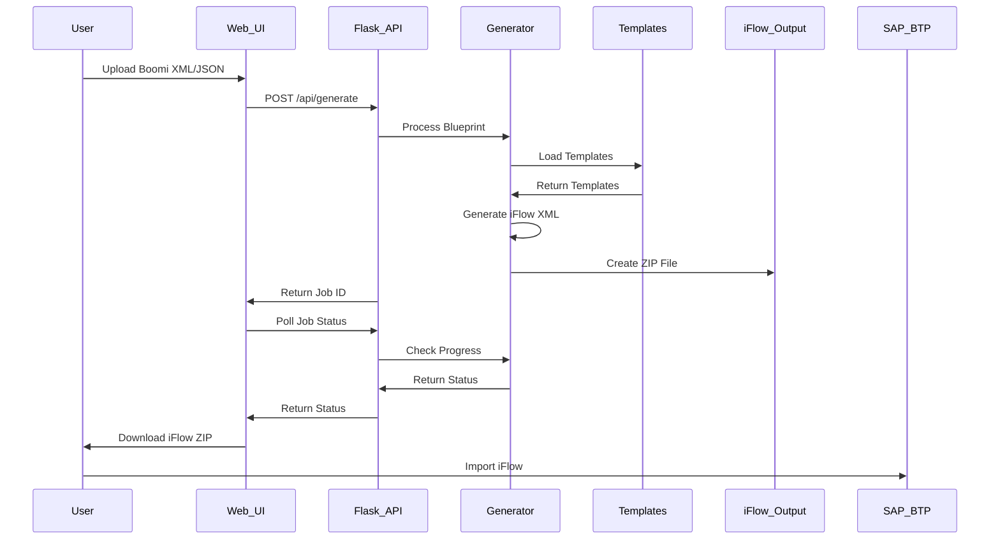
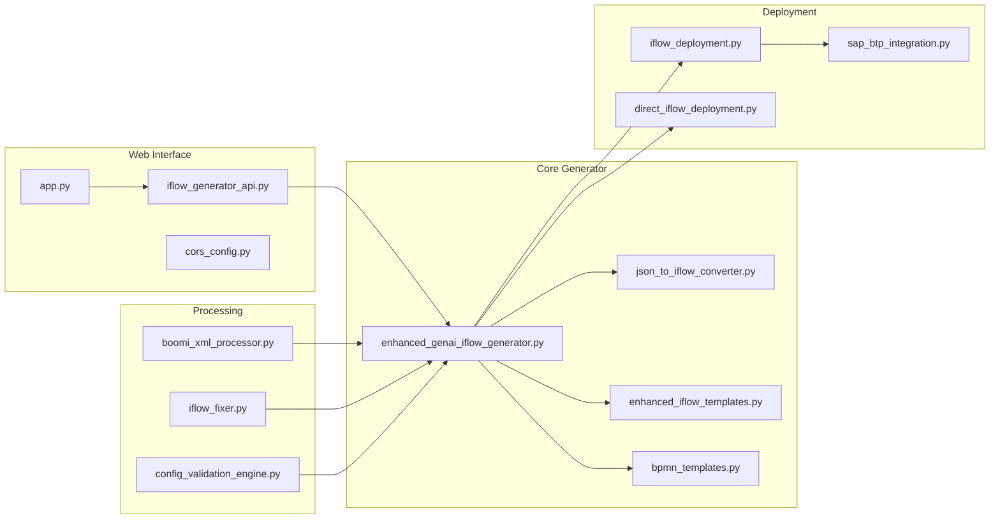
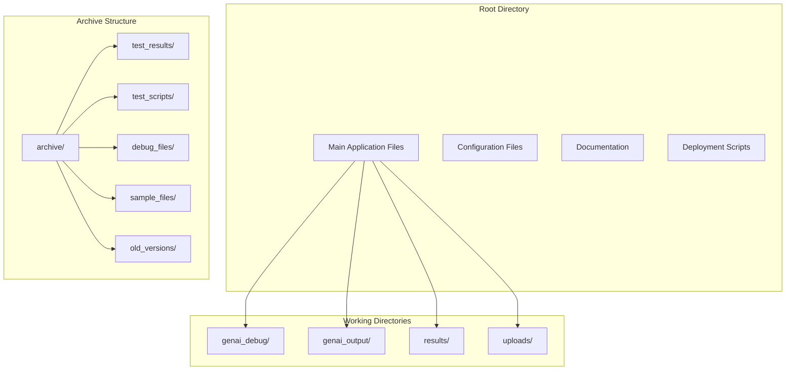
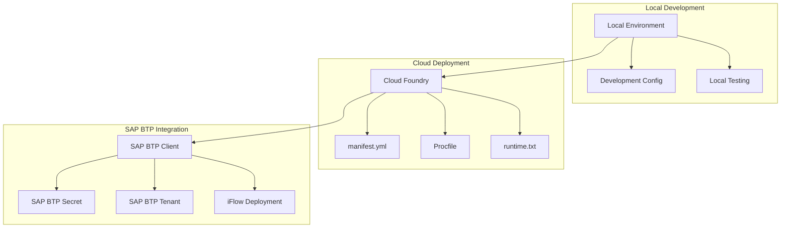

# BoomiToIS-API Architecture

## 🏗️ System Architecture Overview



```mermaid
graph TB
    subgraph "Frontend Layer"
        UI[Web UI]
        CLI[Command Line Interface]
        API_Client[REST API Client]
    end
    
    subgraph "API Gateway Layer"
        Flask[Flask Web Server]
        CORS[CORS Configuration]
        Auth[Authentication]
    end
    
    subgraph "Core Processing Layer"
        Generator[Enhanced GenAI iFlow Generator]
        Converter[JSON to iFlow Converter]
        Templates[iFlow Templates]
        BPMN[BPMN Templates]
    end
    
    subgraph "Processing & Utilities"
        Boomi_Processor[Boomi XML Processor]
        iFlow_Fixer[iFlow XML Fixer]
        Validator[Configuration Validator]
        SAP_Integration[SAP BTP Integration]
    end
    
    subgraph "Data & Configuration"
        Config[Configuration Files]
        Env[Environment Variables]
        Jobs[Job Queue]
        Templates_Store[Template Store]
    end
    
    subgraph "Output & Deployment"
        iFlow_Output[iFlow ZIP Files]
        Debug_Files[Debug Outputs]
        SAP_Deploy[SAP BTP Deployment]
        Results[Results Directory]
    end
    
    subgraph "External Systems"
        Boomi[Boomi Platform]
        SAP_IS[SAP Integration Suite]
        Claude[Claude AI API]
        BTP[SAP BTP]
    end
    
    %% Frontend to API Gateway
    UI --> Flask
    CLI --> Flask
    API_Client --> Flask
    
    %% API Gateway to Core Processing
    Flask --> Generator
    Flask --> Converter
    Flask --> Templates
    Flask --> BPMN
    
    %% Core Processing to Utilities
    Generator --> Boomi_Processor
    Generator --> iFlow_Fixer
    Generator --> Validator
    Generator --> SAP_Integration
    
    %% Data Flow
    Config --> Generator
    Config --> Converter
    Env --> Generator
    Jobs --> Generator
    
    %% Output Flow
    Generator --> iFlow_Output
    Generator --> Debug_Files
    Generator --> SAP_Deploy
    Generator --> Results
    
    %% External Integrations
    Boomi --> Boomi_Processor
    SAP_IS --> SAP_Integration
    Claude --> Generator
    BTP --> SAP_Deploy
    
    %% Styling
    classDef frontend fill:#e1f5fe
    classDef api fill:#f3e5f5
    classDef core fill:#e8f5e8
    classDef utils fill:#fff3e0
    classDef data fill:#fce4ec
    classDef output fill:#e0f2f1
    classDef external fill:#f1f8e9
    
    class UI,CLI,API_Client frontend
    class Flask,CORS,Auth api
    class Generator,Converter,Templates,BPMN core
    class Boomi_Processor,iFlow_Fixer,Validator,SAP_Integration utils
    class Config,Env,Jobs,Templates_Store data
    class iFlow_Output,Debug_Files,SAP_Deploy,Results output
    class Boomi,SAP_IS,Claude,BTP external
```

## 🔄 Data Flow Architecture



## 🧩 Component Architecture



## 📊 File Organization Architecture



## 🔧 Configuration Architecture

```mermaid
graph LR
    subgraph "Environment"
        Dev[.env.development]
        Prod[.env.production]
        Example[.env.example]
    end
    
    subgraph "Configuration"
        Config_Engine[config_validation_engine.py]
        Config_Dir[config/]
        Jobs[jobs.json]
    end
    
    subgraph "Templates"
        Templates[enhanced_iflow_templates.py]
        BPMN[bpmn_templates.py]
        Component_Mapping[COMPONENT_MAPPING_REFERENCE.md]
    end
    
    Dev --> Config_Engine
    Prod --> Config_Engine
    Example --> Config_Engine
    Config_Engine --> Templates
    Config_Engine --> BPMN
    Component_Mapping --> Templates
```

## 🚀 Deployment Architecture



---

## 📋 Architecture Summary

### **Layered Architecture**
- **Frontend Layer**: Web UI, CLI, API clients
- **API Gateway Layer**: Flask server with CORS and auth
- **Core Processing Layer**: Main iFlow generation logic
- **Processing & Utilities**: Supporting processors and validators
- **Data & Configuration**: Configuration management and job queue
- **Output & Deployment**: iFlow generation and SAP deployment

### **Key Design Principles**
1. **Separation of Concerns**: Each component has a single responsibility
2. **Modularity**: Components can be developed and tested independently
3. **Extensibility**: Template system allows easy customization
4. **Scalability**: Job-based processing for handling multiple requests
5. **Maintainability**: Clean separation between core logic and utilities

### **Integration Points**
- **Boomi Platform**: Source of integration processes
- **SAP Integration Suite**: Target for generated iFlows
- **Claude AI API**: AI-powered analysis and generation
- **SAP BTP**: Cloud platform for deployment

### **Data Flow**
1. **Input**: Boomi XML/JSON blueprints
2. **Processing**: AI analysis and template-based generation
3. **Output**: SAP Integration Suite compatible iFlow ZIP files
4. **Deployment**: Direct deployment to SAP BTP (optional)
