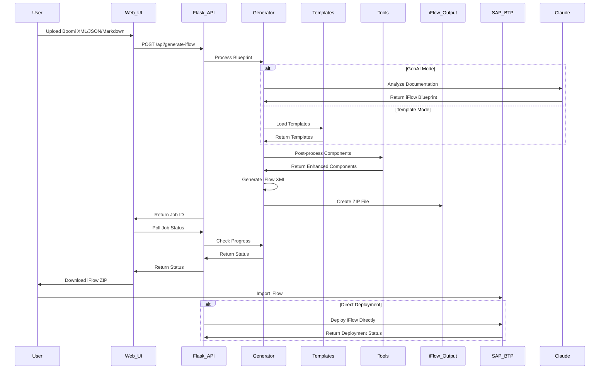
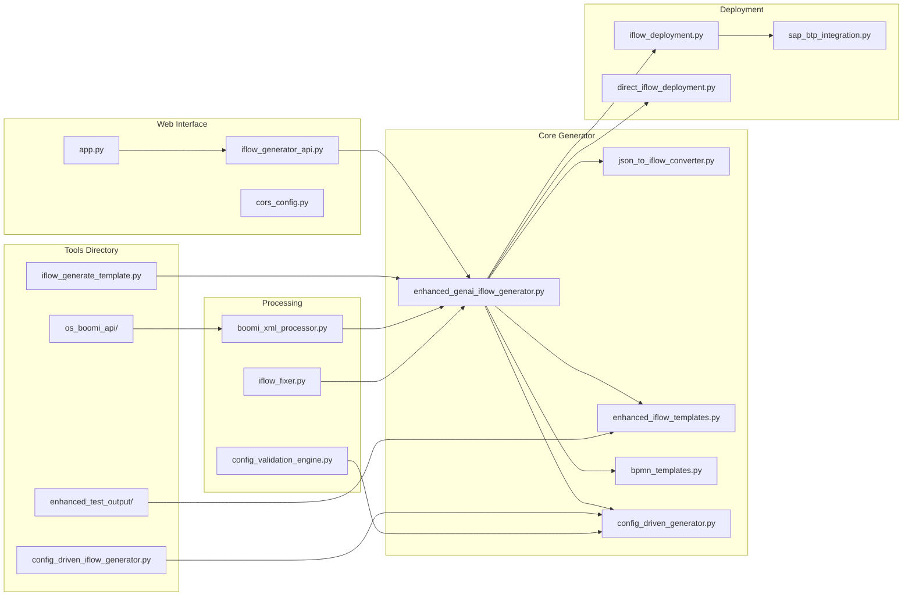

# Complete BoomiToIS-API and Tools Architecture

## 🏗️ System Architecture Overview

```mermaid
graph TB
    subgraph "Frontend & API Layer"
        UI[Web UI - Flask Templates]
        CLI[Command Line Tools]
        API_Client[REST API Client]
        Flask[Flask Web Server]
        CORS[CORS Configuration]
        Auth[Authentication & CORS]
    end
    
    subgraph "Core Processing Layer"
        Generator[Enhanced GenAI iFlow Generator]
        Converter[JSON to iFlow Converter]
        Templates[iFlow Templates Engine]
        BPMN[BPMN Templates]
        ConfigGen[Config-Driven Generator]
    end
    
    subgraph "Tools Directory"
        TemplateTool[iflow_generate_template.py]
        ConfigTool[config_driven_iflow_generator.py]
        EnhancedTool[Enhanced Mapping Tools]
        OSBoomiAPI[OS Boomi API]
    end
    
    subgraph "Processing & Utilities"
        Boomi_Processor[Boomi XML Processor]
        iFlow_Fixer[iFlow XML Fixer]
        Validator[Configuration Validator]
        SAP_Integration[SAP BTP Integration]
        DirectDeploy[Direct iFlow Deployment]
    end
    
    subgraph "Data & Configuration"
        Config[Configuration Files]
        Env[Environment Variables]
        Jobs[Job Queue System]
        Templates_Store[Template Store]
        Debug_Output[Debug & Test Outputs]
    end
    
    subgraph "Output & Deployment"
        iFlow_Output[iFlow ZIP Files]
        Debug_Files[Debug Outputs]
        SAP_Deploy[SAP BTP Deployment]
        Results[Results Directory]
        Test_Outputs[Test Outputs]
    end
    
    subgraph "External Systems"
        Boomi[Boomi Platform]
        SAP_IS[SAP Integration Suite]
        Claude[Claude AI API]
        OpenAI[OpenAI API]
        BTP[SAP BTP]
    end
    
    %% Frontend to API Gateway
    UI --> Flask
    CLI --> Flask
    API_Client --> Flask
    
    %% API Gateway to Core Processing
    Flask --> Generator
    Flask --> Converter
    Flask --> Templates
    Flask --> BPMN
    
    %% Tools Directory Integration
    TemplateTool --> Generator
    ConfigTool --> ConfigGen
    EnhancedTool --> Templates
    OSBoomiAPI --> Boomi_Processor
    
    %% Core Processing to Utilities
    Generator --> Boomi_Processor
    Generator --> iFlow_Fixer
    Generator --> Validator
    Generator --> SAP_Integration
    ConfigGen --> Validator
    
    %% Data Flow
    Config --> Generator
    Config --> Converter
    Env --> Generator
    Jobs --> Generator
    
    %% Output Flow
    Generator --> iFlow_Output
    Generator --> Debug_Files
    Generator --> SAP_Deploy
    Generator --> Results
    ConfigGen --> Test_Outputs
    
    %% External Integrations
    Boomi --> Boomi_Processor
    SAP_IS --> SAP_Integration
    Claude --> Generator
    OpenAI --> Generator
    BTP --> SAP_Deploy
    
    %% Styling
    classDef frontend fill:#e1f5fe
    classDef api fill:#f3e5f5
    classDef core fill:#e8f5e8
    classDef tools fill:#fff8e1
    classDef utils fill:#fff3e0
    classDef data fill:#fce4ec
    classDef output fill:#e0f2f1
    classDef external fill:#f1f8e9
    
    class UI,CLI,API_Client frontend
    class Flask,CORS,Auth api
    class Generator,Converter,Templates,BPMN,ConfigGen core
    class TemplateTool,ConfigTool,EnhancedTool,OSBoomiAPI tools
    class Boomi_Processor,iFlow_Fixer,Validator,SAP_Integration,DirectDeploy utils
    class Config,Env,Jobs,Templates_Store,Debug_Output data
    class iFlow_Output,Debug_Files,SAP_Deploy,Results,Test_Outputs output
    class Boomi,SAP_IS,Claude,OpenAI,BTP external
```

## 🔄 Complete Data Flow Architecture

## 🧩 Component Architecture with Tools Integration

## 📊 Complete File Organization Architecture

```mermaid
graph TD
    subgraph "Root Directory"
        Main[Main Application Files]
        Config[Configuration Files]
        Docs[Documentation]
        Scripts[Deployment Scripts]
    end
    
    subgraph "BoomiToIS-API"
        API_Main[app.py, enhanced_genai_iflow_generator.py]
        API_Templates[enhanced_iflow_templates.py, bpmn_templates.py]
        API_Converters[json_to_iflow_converter.py]
        API_Processors[boomi_xml_processor.py, iflow_fixer.py]
        API_Utils[config_validation_engine.py, sap_btp_integration.py]
        API_Config[config/, .env files]
    end
    
    subgraph "Tools Directory"
        Tools_Main[iflow_generate_template.py]
        Tools_Config[config_driven_iflow_generator.py]
        Tools_Enhanced[enhanced_test_output/]
        Tools_OS[os_boomi_api/]
        Tools_Test[test_output/, post_processed_output/]
    end
    
    subgraph "Working Directories"
        GenAI_Debug[genai_debug/]
        GenAI_Output[genai_output/]
        Results[results/]
        Uploads[uploads/]
        Archive[archive/]
    end
    
    subgraph "Test & Output"
        Test_Results[test_results/]
        Test_Scripts[test_scripts/]
        Debug_Files[debug_files/]
        Sample_Files[sample_files/]
        SAP_Output[sap_package_output/, proper_iflow_output/]
    end
    
    %% Connections
    Main --> API_Main
    API_Main --> API_Templates
    API_Main --> API_Converters
    API_Main --> API_Processors
    API_Main --> API_Utils
    
    Tools_Main --> API_Main
    Tools_Config --> API_Utils
    Tools_Enhanced --> API_Templates
    
    API_Main --> GenAI_Debug
    API_Main --> GenAI_Output
    API_Main --> Results
    API_Main --> Uploads
    
    API_Main --> Test_Results
    API_Main --> Test_Scripts
    API_Main --> Debug_Files
    API_Main --> Sample_Files
    API_Main --> SAP_Output
```

## 🔧 Key Features & Capabilities

### Core Functionality
- **Dual Generation Modes**: GenAI-powered and template-based approaches
- **SAP Integration Suite Compatibility**: Ensures generated iFlows work with SAP systems
- **Job Management**: Asynchronous processing with status tracking
- **Multiple Output Formats**: ZIP packages, debug files, and direct deployment
- **Cross-Platform Support**: Windows, Linux, and cloud deployment options

### Tools Integration
- **Command-Line Interface**: Direct iFlow generation without web interface
- **Configuration-Driven**: JSON-based configuration for automated generation
- **Enhanced Mapping**: Advanced component mapping and validation
- **OS-Specific APIs**: Platform-specific Boomi integration capabilities

### Processing Capabilities
- **Boomi XML Processing**: Parse and analyze Boomi process documentation
- **Component Mapping**: Intelligent mapping of Boomi components to SAP iFlow components
- **BPMN Generation**: Standard-compliant BPMN XML generation
- **Error Handling**: Comprehensive error handling and validation

### Deployment Options
- **Direct SAP BTP**: Automated deployment to SAP Business Technology Platform
- **File Export**: Standard ZIP file export for manual deployment
- **Debug Output**: Comprehensive debugging information for troubleshooting
- **Template Validation**: Ensures generated iFlows meet SAP requirements

## 🚀 Usage Patterns

### Web API Usage
1. **Upload Documentation**: POST to `/api/generate-iflow`
2. **Monitor Progress**: GET `/api/jobs/{job_id}`
3. **Download Results**: GET `/api/jobs/{job_id}/download`
4. **Direct Deployment**: POST to `/api/deploy-iflow`

### Command Line Usage
1. **Template Generation**: `python iflow_generate_template.py --input blueprint.json`
2. **Config-Driven**: `python config_driven_iflow_generator.py --config config.json`
3. **Enhanced Mapping**: Use enhanced test output tools for complex scenarios

### Integration Patterns
1. **CI/CD Integration**: Automated iFlow generation in deployment pipelines
2. **Boomi Integration**: Direct processing of Boomi process exports
3. **SAP Integration**: Seamless deployment to SAP Integration Suite
4. **Multi-Platform**: Support for various operating systems and cloud platforms

