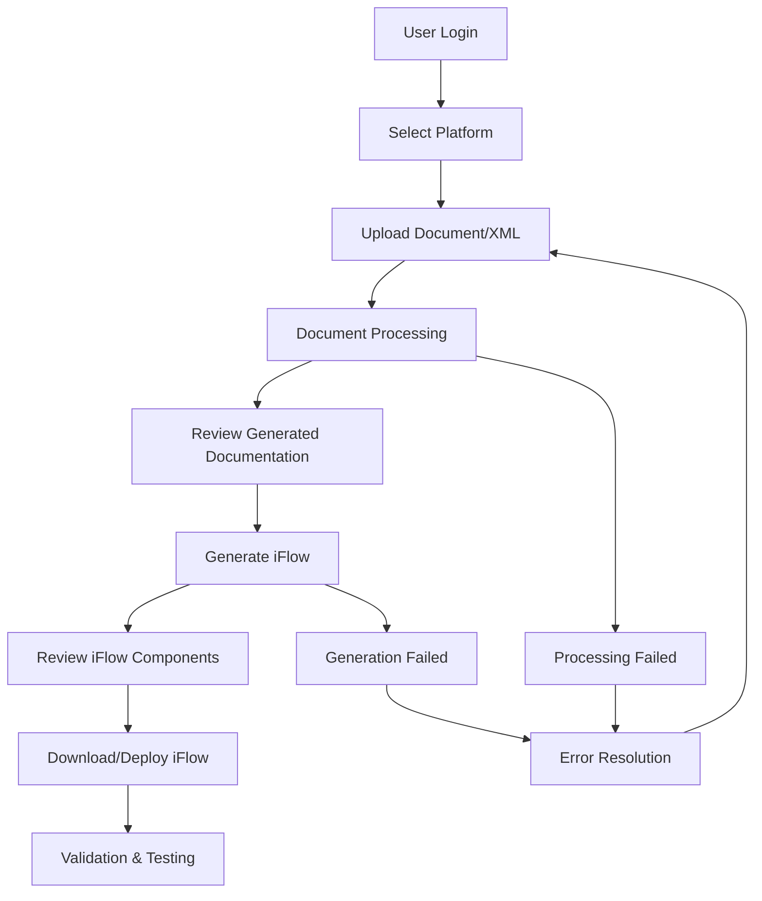
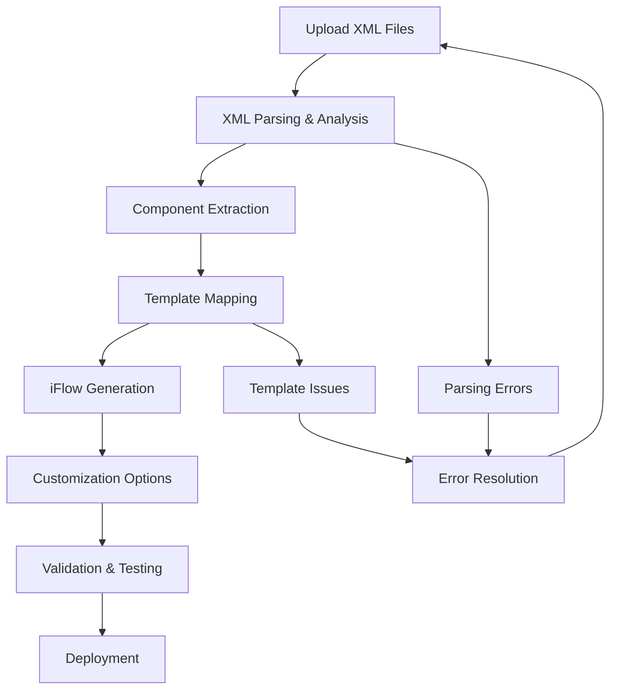

# IS-Migration Platform - Functional Design Document

## 📋 Document Overview

**Document Version:** 1.0  
**Last Updated:** January 2025  
**Project:** IS-Migration Platform  
**Purpose:** Comprehensive functional design covering business requirements, user workflows, and system behavior

---

## 🎯 Business Requirements

### 1. **Primary Business Objectives**

#### **Strategic Goals**
- **Legacy Migration**: Migrate integration flows from Dell Boomi and MuleSoft to SAP Integration Suite
- **Cost Reduction**: Reduce manual migration effort by 80-90%
- **Time Acceleration**: Complete migrations in days instead of months
- **Quality Assurance**: Ensure SAP-compliant iFlow generation
- **Knowledge Transfer**: Preserve integration logic during migration

#### **Business Value Proposition**
- **Automated Migration**: AI-powered conversion of legacy flows
- **Multi-Platform Support**: Handle both Boomi and MuleSoft platforms
- **Documentation Generation**: Automatic technical documentation
- **Direct Deployment**: Seamless deployment to SAP BTP Integration Suite
- **Progress Visibility**: Real-time tracking of migration progress

### 2. **Stakeholder Requirements**

#### **Business Users**
- **Requirement**: Upload business documents and generate integration flows
- **Expectation**: Simple, intuitive interface with clear progress indicators
- **Success Criteria**: Generate working iFlows without technical expertise

#### **Technical Users**
- **Requirement**: Upload XML files and customize iFlow generation
- **Expectation**: Advanced options, debugging capabilities, template customization
- **Success Criteria**: Fine-grained control over migration process

#### **Integration Architects**
- **Requirement**: Review and validate generated iFlows before deployment
- **Expectation**: Detailed technical documentation, component mapping visibility
- **Success Criteria**: Confidence in generated iFlow quality and SAP compliance

#### **Project Managers**
- **Requirement**: Track migration progress across multiple projects
- **Expectation**: Dashboard views, status reporting, timeline estimates
- **Success Criteria**: Clear visibility into migration pipeline and bottlenecks

---

## 👥 User Personas & Stories

### 1. **Primary Personas**

#### **Sarah - Business Analyst**
- **Background**: 5+ years in integration projects, familiar with business requirements
- **Technical Level**: Low-Medium (understands business flows, limited technical knowledge)
- **Primary Goal**: Convert business requirement documents into working integrations
- **Pain Points**: Technical complexity, long development cycles, communication gaps

**User Stories:**
```
As Sarah, I want to upload a Word document with integration requirements
So that I can generate a working iFlow without involving developers

As Sarah, I want to see real-time progress during iFlow generation
So that I know the system is working and estimate completion time

As Sarah, I want to download generated documentation
So that I can review and share integration details with stakeholders
```

#### **Mike - Integration Developer**
- **Background**: 8+ years in integration development, expert in Boomi/MuleSoft
- **Technical Level**: High (deep technical knowledge, XML expertise)
- **Primary Goal**: Migrate existing integration flows with minimal rework
- **Pain Points**: Manual conversion effort, maintaining complex logic, testing overhead

**User Stories:**
```
As Mike, I want to upload Boomi XML files
So that I can convert existing flows to SAP Integration Suite

As Mike, I want to customize iFlow templates and components
So that I can ensure the generated flow meets specific requirements

As Mike, I want to access debug files and generation logs
So that I can troubleshoot issues and optimize the conversion process
```

#### **Lisa - Integration Architect**
- **Background**: 10+ years in enterprise integration, SAP Integration Suite expert
- **Technical Level**: Expert (deep SAP knowledge, architecture design)
- **Primary Goal**: Ensure generated iFlows follow SAP best practices
- **Pain Points**: Quality assurance, compliance validation, performance optimization

**User Stories:**
```
As Lisa, I want to review generated iFlow components and mappings
So that I can validate SAP Integration Suite compliance

As Lisa, I want to deploy iFlows directly to SAP BTP
So that I can streamline the deployment process

As Lisa, I want to access detailed technical documentation
So that I can understand the conversion logic and validate the results
```

### 2. **Secondary Personas**

#### **David - Project Manager**
- **Goal**: Track migration progress and manage timelines
- **Needs**: Status dashboards, progress reports, resource allocation insights

#### **Emma - Quality Assurance**
- **Goal**: Validate generated iFlows meet functional requirements
- **Needs**: Test scenarios, validation reports, error tracking

---

## 🔄 User Workflows

### 1. **Primary Workflow: Document Upload & iFlow Generation**

#### **Workflow Steps**


#### **Detailed User Journey**

**Step 1: Platform Selection**
- User selects source platform (Boomi/MuleSoft)
- System configures appropriate processing pipeline
- User sees platform-specific upload options

**Step 2: File Upload**
- User uploads document (Word, PDF, XML)
- System validates file format and size
- Real-time upload progress indicator

**Step 3: Document Processing (10-15 seconds)**
- System extracts content from uploaded file
- AI converts raw content to structured markdown
- User sees processing status with detailed messages

**Step 4: Documentation Review**
- User reviews AI-generated documentation
- Option to download intermediate files
- User can proceed to iFlow generation

**Step 5: iFlow Generation (30-60 seconds)**
- System analyzes documentation for integration components
- AI generates SAP Integration Suite XML
- Real-time progress with component identification

**Step 6: Results & Actions**
- User downloads generated iFlow ZIP package
- Option to deploy directly to SAP BTP
- Access to debug files and generation logs

### 2. **Advanced Workflow: XML File Processing**

#### **Technical User Journey**


### 3. **Error Recovery Workflows**

#### **Common Error Scenarios**
- **File Format Issues**: Clear error messages with supported formats
- **Processing Timeouts**: Automatic retry with user notification
- **AI Service Unavailable**: Fallback to basic processing
- **Template Errors**: Alternative template selection

---

## 📋 Functional Requirements

### 1. **Core Functional Requirements**

#### **FR-001: Document Upload & Processing**
- **Description**: System shall accept multiple document formats and extract integration requirements
- **Acceptance Criteria**:
  - Support .docx, .pdf, .txt, .xml file formats
  - Maximum file size: 50MB
  - Processing time: < 30 seconds for typical documents
  - Extract text content with 95%+ accuracy

#### **FR-002: AI-Powered Documentation Generation**
- **Description**: System shall convert raw document content to structured integration documentation
- **Acceptance Criteria**:
  - Generate structured markdown with integration components
  - Identify data flows, transformations, and endpoints
  - Maintain business context and requirements
  - Support multiple AI providers (Anthropic, OpenAI, Gemma-3)

#### **FR-003: iFlow Generation**
- **Description**: System shall generate SAP Integration Suite iFlows from processed documentation
- **Acceptance Criteria**:
  - Generate valid BPMN 2.0 XML format
  - Include all identified integration components
  - Apply SAP Integration Suite best practices
  - Generate deployable ZIP packages

#### **FR-004: Progress Tracking**
- **Description**: System shall provide real-time progress updates during processing
- **Acceptance Criteria**:
  - Show current processing step
  - Display estimated completion time
  - Provide detailed status messages
  - Handle long-running operations gracefully

#### **FR-005: File Management**
- **Description**: System shall manage uploaded files and generated artifacts
- **Acceptance Criteria**:
  - Secure file storage with user isolation
  - Download access to all generated files
  - Automatic cleanup of temporary files
  - File versioning and history tracking

### 2. **Platform-Specific Requirements**

#### **FR-006: Boomi Integration**
- **Description**: System shall process Boomi XML files and generate equivalent SAP iFlows
- **Acceptance Criteria**:
  - Parse Boomi process XML structure
  - Extract connectors, transformations, and routing logic
  - Map Boomi components to SAP Integration Suite equivalents
  - Preserve business logic and data flow

#### **FR-007: MuleSoft Integration**
- **Description**: System shall process MuleSoft XML files and generate equivalent SAP iFlows
- **Acceptance Criteria**:
  - Parse MuleSoft flow XML structure
  - Extract DataWeave transformations and connectors
  - Map MuleSoft components to SAP Integration Suite equivalents
  - Handle complex routing and error handling patterns

### 3. **Quality Requirements**

#### **FR-008: SAP BTP Deployment**
- **Description**: System shall deploy generated iFlows directly to SAP BTP Integration Suite
- **Acceptance Criteria**:
  - Authenticate with SAP BTP using OAuth 2.0
  - Deploy iFlows to specified packages
  - Validate deployment success
  - Provide deployment status and logs

#### **FR-009: Error Handling & Recovery**
- **Description**: System shall handle errors gracefully and provide recovery options
- **Acceptance Criteria**:
  - Clear error messages with resolution guidance
  - Automatic retry for transient failures
  - Fallback options for service unavailability
  - Error logging and debugging support

---

## 🎨 User Experience Requirements

### 1. **Interface Design Requirements**

#### **UX-001: Intuitive Navigation**
- **Description**: Users shall navigate the application without training
- **Acceptance Criteria**:
  - Clear visual hierarchy and information architecture
  - Consistent navigation patterns across all pages
  - Breadcrumb navigation for complex workflows
  - Responsive design for desktop and tablet devices

#### **UX-002: Progress Visualization**
- **Description**: Users shall see clear progress indicators during long operations
- **Acceptance Criteria**:
  - Animated progress bars with percentage completion
  - Step-by-step workflow indicators
  - Real-time status messages
  - Estimated time remaining

#### **UX-003: File Management Interface**
- **Description**: Users shall easily manage uploaded files and generated artifacts
- **Acceptance Criteria**:
  - Drag-and-drop file upload interface
  - File preview and metadata display
  - Download buttons with clear file descriptions
  - File organization by job/project

### 2. **Accessibility Requirements**

#### **UX-004: Web Accessibility**
- **Description**: Application shall be accessible to users with disabilities
- **Acceptance Criteria**:
  - WCAG 2.1 AA compliance
  - Keyboard navigation support
  - Screen reader compatibility
  - High contrast mode support

---

## 📊 Performance Requirements

### 1. **Response Time Requirements**

| Operation | Target Response Time | Maximum Acceptable |
|-----------|---------------------|-------------------|
| Page Load | < 2 seconds | < 5 seconds |
| File Upload | < 5 seconds | < 10 seconds |
| Document Processing | < 15 seconds | < 30 seconds |
| iFlow Generation | < 60 seconds | < 120 seconds |
| File Download | < 3 seconds | < 5 seconds |

### 2. **Scalability Requirements**

#### **PERF-001: Concurrent Users**
- **Description**: System shall support multiple concurrent users
- **Acceptance Criteria**:
  - Support 50+ concurrent users
  - Maintain response times under load
  - Queue management for resource-intensive operations
  - Auto-scaling based on demand

#### **PERF-002: File Processing**
- **Description**: System shall handle large files efficiently
- **Acceptance Criteria**:
  - Process files up to 50MB
  - Streaming upload for large files
  - Background processing for time-intensive operations
  - Progress tracking for long-running jobs

---

## 🔒 Security & Compliance Requirements

### 1. **Data Security Requirements**

#### **SEC-001: Data Protection**
- **Description**: System shall protect user data and uploaded files
- **Acceptance Criteria**:
  - Encrypt data in transit (HTTPS/TLS)
  - Secure file storage with access controls
  - User data isolation and privacy
  - Automatic cleanup of sensitive data

#### **SEC-002: Authentication & Authorization**
- **Description**: System shall control access to features and data
- **Acceptance Criteria**:
  - User authentication for sensitive operations
  - Role-based access control
  - Session management and timeout
  - API key protection for external services

### 2. **Compliance Requirements**

#### **SEC-003: Enterprise Compliance**
- **Description**: System shall meet enterprise security standards
- **Acceptance Criteria**:
  - Audit logging for all operations
  - Data retention and deletion policies
  - Compliance with corporate security policies
  - Regular security assessments and updates

---

## 🎯 Success Criteria & KPIs

### 1. **Business Success Metrics**

- **Migration Efficiency**: 80%+ reduction in manual effort
- **Time to Value**: Complete migrations in days vs. months
- **Quality Score**: 95%+ generated iFlows deploy successfully
- **User Adoption**: 90%+ user satisfaction rating
- **Cost Savings**: 60%+ reduction in migration costs

### 2. **Technical Success Metrics**

- **System Availability**: 99.5% uptime
- **Processing Success Rate**: 95%+ successful completions
- **Performance**: Meet all response time requirements
- **Error Rate**: < 5% processing failures
- **User Experience**: < 3 clicks to complete primary workflows

---

This functional design document defines the complete business and user requirements for the IS-Migration platform. Together with the Technical Design Document, it provides comprehensive guidance for development, testing, and deployment of the migration solution.
