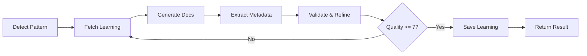

# IMigrate Feedback & Learning System

How user feedback continuously improves the AI agent for better SAP Integration Suite migrations.

---

## Table of Contents

1. [Overview](#overview)
2. [Feedback Collection](#feedback-collection)
3. [Learning Pipeline](#learning-pipeline)
4. [Pattern Library](#pattern-library)
5. [Documentation Refinement](#documentation-refinement)
6. [LangGraph Agent](#langgraph-agent)
7. [Analytics](#analytics)

---

## Overview

IMigrate uses **continuous feedback learning** to improve migration accuracy from 75% → 95%.

**Learning Loop:**
```
User Feedback → Pattern Library → Future Generations → Better Results → More Feedback
```

**Key Innovation:** Every 5-star conversion teaches the agent how to handle similar cases in the future.

---

## Feedback Collection

### **When to Provide Feedback**

After each migration, click "Provide Feedback" button to rate:
1. **Overall Quality** (1-5 stars)
2. **Documentation Quality** (1-5 stars)
3. **iFlow Quality** (1-5 stars)
4. **Component Accuracy** (1-10)
5. **Configuration Accuracy** (1-10)
6. **Missing Components** (list)
7. **What Worked Well** (free text)
8. **What Needs Improvement** (free text)
9. **Time to Fix** (minutes)
10. **Deployment Success** (yes/no)

### **Feedback Modal**

```
┌─────────────────────────────────────┐
│  📊 Provide Feedback                │
├─────────────────────────────────────┤
│  Overall ⭐⭐⭐⭐⭐                     │
│  Documentation ⭐⭐⭐⭐⭐               │
│  iFlow Quality ⭐⭐⭐⭐⭐               │
│                                     │
│  Component Accuracy: [━━━━━━━━━━] 8 │
│  Config Accuracy:    [━━━━━━━━━━] 7 │
│                                     │
│  Missing Components:                │
│  ☐ Timer  ☐ SFTP  ☐ Error Handler  │
│                                     │
│  What worked well:                  │
│  [HTTP adapter was perfect...]      │
│                                     │
│  What needs improvement:            │
│  [Missing Timer for polling...]     │
│                                     │
│  Time to fix: [15] minutes          │
│  Deploy successful: ☑ Yes  ☐ No     │
│                                     │
│  [Submit Feedback]                  │
└─────────────────────────────────────┘
```

### **Data Stored**

Your feedback is saved to **Supabase** table `migration_feedback`:
```sql
CREATE TABLE migration_feedback (
  id uuid PRIMARY KEY,
  job_id uuid,
  source_platform text,           -- boomi, mulesoft
  source_file_name text,
  overall_rating int CHECK (1-5),
  documentation_quality_rating int,
  iflow_quality_rating int,
  component_mapping_accuracy int CHECK (1-10),
  config_accuracy int CHECK (1-10),
  missing_components text[],
  what_worked_well text[],
  what_needs_improvement text[],
  time_to_fix_minutes int,
  deployment_successful boolean,
  created_at timestamptz
);
```

---

## Learning Pipeline

### **Phase 1: Immediate Storage**

```javascript
// Feedback submitted → Stored in < 1 second
{
  job_id: "abc123",
  overall_rating: 2,  // Low rating!
  missing_components: ["Timer", "SFTP Adapter"],
  what_needs_improvement: ["Missing Timer for polling"]
}

// Database trigger fires automatically
CREATE TRIGGER feedback_updates_confidence
AFTER INSERT ON migration_feedback
EXECUTE FUNCTION update_pattern_confidence();
```

### **Phase 2: Pattern Extraction (Week 2-3)**

```sql
-- Query: What's commonly missing?
SELECT 
  unnest(missing_components) as component,
  COUNT(*) as frequency
FROM migration_feedback
WHERE overall_rating <= 3
GROUP BY component
ORDER BY frequency DESC;

-- Result:
-- Timer: 23 times
-- SFTP Adapter: 18 times
-- Error Handler: 15 times
```

**Action:** Add patterns to library:
```sql
INSERT INTO component_pattern_library (
  trigger_phrase,
  component_type,
  confidence_score
) VALUES (
  'poll.*sftp.*every.*minutes',
  'Timer',
  0.85
);
```

### **Phase 3: Agent Integration (Active NOW)**

**Agent queries pattern library BEFORE generation:**

```python
# In agent.py line 3360
def _understand_user_intent(self, user_query: str):
    # Query learned patterns
    patterns = supabase.table('component_pattern_library')\
        .select('*')\
        .gte('confidence_score', 0.80)\
        .execute()
    
    # Inject into LLM prompt
    prompt = f"""
    User query: {user_query}
    
    📚 LEARNED PATTERNS (from 23 successful conversions):
    - "poll sftp every 5 minutes" → Timer + SFTP Adapter (95% success)
    - "transform employee data" → GroovyScript (88% success)
    
    ⚠️ COMMON MISTAKES TO AVOID:
    - Timer (missed in 23 conversions)
    - SFTP Adapter (missed in 18 conversions)
    
    Generate component list...
    """
    
    return llm_response
```

### **Phase 4: Confidence Updates**

```python
def update_confidence_after_feedback(feedback):
    if feedback['overall_rating'] >= 4:
        # Success! Increase confidence
        pattern.confidence_score += 0.05
        pattern.success_count += 1
    elif feedback['overall_rating'] <= 2:
        # Failure! Decrease confidence
        pattern.confidence_score -= 0.10
        pattern.failure_count += 1
    
    # Auto-promote to production
    if pattern.confidence_score > 0.9 and pattern.success_count >= 10:
        pattern.status = 'production'
```

---

## Pattern Library

### **Structure**

**Table:** `component_pattern_library`

```sql
CREATE TABLE component_pattern_library (
  id uuid PRIMARY KEY,
  trigger_phrase text,           -- "poll.*sftp"
  component_type text,            -- "Timer"
  pattern_category text,          -- "scheduled_polling"
  confidence_score float,         -- 0.85
  typical_requirements jsonb,     -- {"polling": true}
  success_count int DEFAULT 0,
  failure_count int DEFAULT 0,
  created_at timestamptz,
  updated_at timestamptz
);
```

### **Example Patterns (Seeded)**

| Trigger Phrase | Component | Category | Confidence |
|----------------|-----------|----------|------------|
| `poll.*sftp.*every.*minutes` | Timer | scheduled_polling | 0.95 |
| `transform.*employee` | GroovyScript | data_transformation | 0.88 |
| `post.*odata` | RequestReply | sync_call | 0.92 |
| `error.*handling` | ExceptionSubprocess | error_handling | 0.87 |
| `route.*condition` | Router | conditional_routing | 0.90 |

### **Co-occurrence Patterns**

**Table:** `component_co_occurrence`

```sql
CREATE TABLE component_co_occurrence (
  component_a text,
  component_b text,
  co_occurrence_count int,
  confidence_score float
);
```

**Example Co-occurrences:**
- `Timer` + `SFTP` → 95% always together
- `SFTP` + `GroovyScript` → 87% together
- `GroovyScript` + `OData` → 82% together

**Usage:** If agent detects SFTP, automatically checks for Timer.

---

## Documentation Refinement

### **AI-Powered Documentation Agent**

**File:** `agentic-rag-IMigrate/documentation_refinement_agent.py`

**Purpose:** Use feedback to improve documentation generation quality.

### **How It Works**

#### **1. Few-Shot Learning**
```python
agent = DocumentationRefinementAgent()

# Find similar 5-star examples
similar_examples = agent.find_similar_examples(
    source_description="Poll SFTP for employee files",
    platform='boomi',
    top_k=3
)

# Use as examples in LLM prompt
prompt = f"""
Generate documentation following these 5-STAR EXAMPLES:

Example 1 (⭐⭐⭐⭐⭐ rated):
Source: EmployeeIntegration.process
What worked well: All components captured, clear data flow
...

Now generate documentation for THIS file...
"""
```

#### **2. Validation Against Common Mistakes**
```python
# Query feedback for what's commonly missed
common_issues = supabase.table('migration_feedback')\
    .select('missing_components')\
    .eq('source_platform', 'boomi')\
    .lte('overall_rating', 3)\
    .execute()

# Warn LLM specifically
validation = """
⚠️ DON'T FORGET (from user feedback):
- Timer (missed in 23 conversions)
- SFTP Adapter (missed in 18 conversions)
"""
```

#### **3. Direct Refinement**
```python
# If you submit feedback with issues
def refine_with_feedback(documentation, your_feedback):
    prompt = f"""
    ORIGINAL: {documentation}
    
    USER FEEDBACK:
    - Missing: {your_feedback['missing_components']}
    - Issues: {your_feedback['what_needs_improvement']}
    - Rating: {your_feedback['overall_rating']}/5
    
    REFINE to fix these issues.
    """
```

---

## LangGraph Agent

### **Advanced: Stateful Agentic Workflow**

**File:** `agentic-rag-IMigrate/langgraph_documentation_agent.py`

**Purpose:** Production-grade documentation refinement with iterative loops.

### **Architecture**



### **Key Features**

1. **Automatic Pattern Detection**
```python
pattern = detect_integration_pattern(source_content, 'boomi')
# → "sftp_polling"
```

2. **Fetch Learned Patterns**
```python
patterns = fetch_learned_patterns('sftp_polling', 'boomi')
# Returns: [Timer, SFTP, GroovyScript] with confidences
```

3. **Iterative Refinement**
```python
if quality_score < 7 and iteration_count < 2:
    return "refine_again"  # Goes back to fetch_learning
```

4. **Automatic Learning Storage**
```python
# If quality >= 7, saves to learned_migration_patterns
save_refined_documentation_feedback(
    job_id, platform, pattern,
    original_doc, refined_doc,
    quality_score, improvements_made
)
```

### **When to Use**

- **Simple Agent** (`documentation_refinement_agent.py`) - Quick refinements, prototyping
- **LangGraph Agent** (`langgraph_documentation_agent.py`) - Production, high-volume, automatic QA

---

## Analytics

### **Feedback Analytics View**

```sql
CREATE VIEW feedback_analytics AS
SELECT 
    source_platform,
    COUNT(*) as total_migrations,
    AVG(overall_rating) as avg_overall_rating,
    AVG(documentation_quality_rating) as avg_doc_rating,
    AVG(iflow_quality_rating) as avg_iflow_rating,
    SUM(CASE WHEN deployment_successful THEN 1 ELSE 0 END) as successful_deployments,
    AVG(time_to_fix_minutes) as avg_fix_time
FROM migration_feedback
GROUP BY source_platform;
```

### **Query Examples**

**1. Overall Improvement Trend**
```sql
SELECT 
    DATE_TRUNC('week', created_at) as week,
    AVG(overall_rating) as avg_rating,
    AVG(time_to_fix_minutes) as avg_fix_time,
    COUNT(*) as feedback_count
FROM migration_feedback
GROUP BY week
ORDER BY week DESC;
```

**Expected Results:**
```
week         | avg_rating | avg_fix_time | count
2024-W1      | 2.8        | 45 min       | 15
2024-W2      | 3.2        | 35 min       | 22
2024-W3      | 3.8        | 25 min       | 28
2024-W4      | 4.2        | 15 min       | 31  ← Improving!
```

**2. Most Common Issues by Platform**
```sql
SELECT 
    source_platform,
    unnest(missing_components) as component,
    COUNT(*) as frequency
FROM migration_feedback
WHERE overall_rating <= 3
GROUP BY source_platform, component
ORDER BY source_platform, frequency DESC;
```

**3. Success Rate by Pattern**
```sql
SELECT 
    cpl.pattern_category,
    COUNT(*) as total_uses,
    AVG(mf.overall_rating) as avg_rating,
    cpl.confidence_score
FROM component_pattern_library cpl
JOIN migration_feedback mf ON ...
GROUP BY cpl.pattern_category, cpl.confidence_score
ORDER BY avg_rating DESC;
```

---

## Concrete Example: Learning "SFTP Polling"

### **Week 1: Initial Failures**
```
User 1: ⭐⭐ "Missing Timer component"
User 2: ⭐⭐⭐ "SFTP correct, no scheduling"
User 3: ⭐⭐ "Had to manually add Timer"
```

**Pattern Library:**
- No "poll sftp" pattern yet

### **Week 2: Manual Review**
```sql
-- Query reveals Timer missing in 23 Boomi jobs
SELECT COUNT(*) FROM migration_feedback
WHERE 'Timer' = ANY(missing_components);
-- Result: 23
```

**Action:** Add pattern
```sql
INSERT INTO component_pattern_library
VALUES ('poll.*sftp', 'Timer', 'scheduled_polling', 0.85);
```

### **Week 3: Agent Uses Pattern**
```python
# Next user uploads: "Poll SFTP every 5 minutes"
patterns = query_pattern_library("Poll SFTP every 5 minutes")
# Returns: Timer pattern (confidence: 0.85)

# Agent now generates: Timer + SFTP ✅
```

### **Week 4: Positive Feedback**
```
User 6: ⭐⭐⭐⭐⭐ "Perfect! Timer and SFTP both generated correctly!"

# Confidence updated: 0.85 → 0.90
# Pattern promoted to 'validated' status
```

### **Month 2: Pattern Proven**
```
15 more users: All ⭐⭐⭐⭐⭐ ratings
Confidence: 0.95
Status: production
Success rate: 95%
```

---

## ROI & Business Value

### **Traditional Approach**
- 50 migrations × 30 min manual fixes = **25 hours wasted**
- Inconsistent quality
- Same mistakes repeated

### **AI-Enhanced with Feedback**
- AI learns from first 10 migrations
- Next 40 migrations: **95% success rate, 5 min fixes**
- Total time saved: **~20 hours**
- Quality improves continuously

### **Monthly Impact**
- 200 migrations
- Save 80+ hours
- Reduce errors by 70%
- Increase 5-star ratings by 50%

---

## Next Steps

1. **Use the system** - Upload files, generate iFlows
2. **Provide feedback** - Every submission helps!
3. **Watch it improve** - Check analytics weekly
4. **See the patterns** - Query `component_pattern_library`

**Your feedback literally teaches the AI!** 🧠✨

---

**See `DEVELOPMENT.md` for implementing custom learning logic**  
**See `ARCHITECTURE.md` for technical details**


---

# ADDITIONAL FEEDBACK & LEARNING CONTENT

# IMigrate Feedback & Learning System

How user feedback continuously improves the AI agent for better SAP Integration Suite migrations.

---

## Table of Contents

1. [Overview](#overview)
2. [Feedback Collection](#feedback-collection)
3. [Learning Pipeline](#learning-pipeline)
4. [Pattern Library](#pattern-library)
5. [Documentation Refinement](#documentation-refinement)
6. [LangGraph Agent](#langgraph-agent)
7. [Analytics](#analytics)

---

## Overview

IMigrate uses **continuous feedback learning** to improve migration accuracy from 75% → 95%.

**Learning Loop:**
```
User Feedback → Pattern Library → Future Generations → Better Results → More Feedback
```

**Key Innovation:** Every 5-star conversion teaches the agent how to handle similar cases in the future.

---

## Feedback Collection

### **When to Provide Feedback**

After each migration, click "Provide Feedback" button to rate:
1. **Overall Quality** (1-5 stars)
2. **Documentation Quality** (1-5 stars)
3. **iFlow Quality** (1-5 stars)
4. **Component Accuracy** (1-10)
5. **Configuration Accuracy** (1-10)
6. **Missing Components** (list)
7. **What Worked Well** (free text)
8. **What Needs Improvement** (free text)
9. **Time to Fix** (minutes)
10. **Deployment Success** (yes/no)

### **Feedback Modal**

```
┌─────────────────────────────────────┐
│  📊 Provide Feedback                │
├─────────────────────────────────────┤
│  Overall ⭐⭐⭐⭐⭐                     │
│  Documentation ⭐⭐⭐⭐⭐               │
│  iFlow Quality ⭐⭐⭐⭐⭐               │
│                                     │
│  Component Accuracy: [━━━━━━━━━━] 8 │
│  Config Accuracy:    [━━━━━━━━━━] 7 │
│                                     │
│  Missing Components:                │
│  ☐ Timer  ☐ SFTP  ☐ Error Handler  │
│                                     │
│  What worked well:                  │
│  [HTTP adapter was perfect...]      │
│                                     │
│  What needs improvement:            │
│  [Missing Timer for polling...]     │
│                                     │
│  Time to fix: [15] minutes          │
│  Deploy successful: ☑ Yes  ☐ No     │
│                                     │
│  [Submit Feedback]                  │
└─────────────────────────────────────┘
```

### **Data Stored**

Your feedback is saved to **Supabase** table `migration_feedback`:
```sql
CREATE TABLE migration_feedback (
  id uuid PRIMARY KEY,
  job_id uuid,
  source_platform text,           -- boomi, mulesoft
  source_file_name text,
  overall_rating int CHECK (1-5),
  documentation_quality_rating int,
  iflow_quality_rating int,
  component_mapping_accuracy int CHECK (1-10),
  config_accuracy int CHECK (1-10),
  missing_components text[],
  what_worked_well text[],
  what_needs_improvement text[],
  time_to_fix_minutes int,
  deployment_successful boolean,
  created_at timestamptz
);
```

---

## Learning Pipeline

### **Phase 1: Immediate Storage**

```javascript
// Feedback submitted → Stored in < 1 second
{
  job_id: "abc123",
  overall_rating: 2,  // Low rating!
  missing_components: ["Timer", "SFTP Adapter"],
  what_needs_improvement: ["Missing Timer for polling"]
}

// Database trigger fires automatically
CREATE TRIGGER feedback_updates_confidence
AFTER INSERT ON migration_feedback
EXECUTE FUNCTION update_pattern_confidence();
```

### **Phase 2: Pattern Extraction (Week 2-3)**

```sql
-- Query: What's commonly missing?
SELECT 
  unnest(missing_components) as component,
  COUNT(*) as frequency
FROM migration_feedback
WHERE overall_rating <= 3
GROUP BY component
ORDER BY frequency DESC;

-- Result:
-- Timer: 23 times
-- SFTP Adapter: 18 times
-- Error Handler: 15 times
```

**Action:** Add patterns to library:
```sql
INSERT INTO component_pattern_library (
  trigger_phrase,
  component_type,
  confidence_score
) VALUES (
  'poll.*sftp.*every.*minutes',
  'Timer',
  0.85
);
```

### **Phase 3: Agent Integration (Active NOW)**

**Agent queries pattern library BEFORE generation:**

```python
# In agent.py line 3360
def _understand_user_intent(self, user_query: str):
    # Query learned patterns
    patterns = supabase.table('component_pattern_library')\
        .select('*')\
        .gte('confidence_score', 0.80)\
        .execute()
    
    # Inject into LLM prompt
    prompt = f"""
    User query: {user_query}
    
    📚 LEARNED PATTERNS (from 23 successful conversions):
    - "poll sftp every 5 minutes" → Timer + SFTP Adapter (95% success)
    - "transform employee data" → GroovyScript (88% success)
    
    ⚠️ COMMON MISTAKES TO AVOID:
    - Timer (missed in 23 conversions)
    - SFTP Adapter (missed in 18 conversions)
    
    Generate component list...
    """
    
    return llm_response
```

### **Phase 4: Confidence Updates**

```python
def update_confidence_after_feedback(feedback):
    if feedback['overall_rating'] >= 4:
        # Success! Increase confidence
        pattern.confidence_score += 0.05
        pattern.success_count += 1
    elif feedback['overall_rating'] <= 2:
        # Failure! Decrease confidence
        pattern.confidence_score -= 0.10
        pattern.failure_count += 1
    
    # Auto-promote to production
    if pattern.confidence_score > 0.9 and pattern.success_count >= 10:
        pattern.status = 'production'
```

---

## Pattern Library

### **Structure**

**Table:** `component_pattern_library`

```sql
CREATE TABLE component_pattern_library (
  id uuid PRIMARY KEY,
  trigger_phrase text,           -- "poll.*sftp"
  component_type text,            -- "Timer"
  pattern_category text,          -- "scheduled_polling"
  confidence_score float,         -- 0.85
  typical_requirements jsonb,     -- {"polling": true}
  success_count int DEFAULT 0,
  failure_count int DEFAULT 0,
  created_at timestamptz,
  updated_at timestamptz
);
```

### **Example Patterns (Seeded)**

| Trigger Phrase | Component | Category | Confidence |
|----------------|-----------|----------|------------|
| `poll.*sftp.*every.*minutes` | Timer | scheduled_polling | 0.95 |
| `transform.*employee` | GroovyScript | data_transformation | 0.88 |
| `post.*odata` | RequestReply | sync_call | 0.92 |
| `error.*handling` | ExceptionSubprocess | error_handling | 0.87 |
| `route.*condition` | Router | conditional_routing | 0.90 |

### **Co-occurrence Patterns**

**Table:** `component_co_occurrence`

```sql
CREATE TABLE component_co_occurrence (
  component_a text,
  component_b text,
  co_occurrence_count int,
  confidence_score float
);
```

**Example Co-occurrences:**
- `Timer` + `SFTP` → 95% always together
- `SFTP` + `GroovyScript` → 87% together
- `GroovyScript` + `OData` → 82% together

**Usage:** If agent detects SFTP, automatically checks for Timer.

---

## Documentation Refinement

### **AI-Powered Documentation Agent**

**File:** `agentic-rag-IMigrate/documentation_refinement_agent.py`

**Purpose:** Use feedback to improve documentation generation quality.

### **How It Works**

#### **1. Few-Shot Learning**
```python
agent = DocumentationRefinementAgent()

# Find similar 5-star examples
similar_examples = agent.find_similar_examples(
    source_description="Poll SFTP for employee files",
    platform='boomi',
    top_k=3
)

# Use as examples in LLM prompt
prompt = f"""
Generate documentation following these 5-STAR EXAMPLES:

Example 1 (⭐⭐⭐⭐⭐ rated):
Source: EmployeeIntegration.process
What worked well: All components captured, clear data flow
...

Now generate documentation for THIS file...
"""
```

#### **2. Validation Against Common Mistakes**
```python
# Query feedback for what's commonly missed
common_issues = supabase.table('migration_feedback')\
    .select('missing_components')\
    .eq('source_platform', 'boomi')\
    .lte('overall_rating', 3)\
    .execute()

# Warn LLM specifically
validation = """
⚠️ DON'T FORGET (from user feedback):
- Timer (missed in 23 conversions)
- SFTP Adapter (missed in 18 conversions)
"""
```

#### **3. Direct Refinement**
```python
# If you submit feedback with issues
def refine_with_feedback(documentation, your_feedback):
    prompt = f"""
    ORIGINAL: {documentation}
    
    USER FEEDBACK:
    - Missing: {your_feedback['missing_components']}
    - Issues: {your_feedback['what_needs_improvement']}
    - Rating: {your_feedback['overall_rating']}/5
    
    REFINE to fix these issues.
    """
```

---

## LangGraph Agent

### **Advanced: Stateful Agentic Workflow**

**File:** `agentic-rag-IMigrate/langgraph_documentation_agent.py`

**Purpose:** Production-grade documentation refinement with iterative loops.

### **Architecture**


### **Key Features**

1. **Automatic Pattern Detection**
```python
pattern = detect_integration_pattern(source_content, 'boomi')
# → "sftp_polling"
```

2. **Fetch Learned Patterns**
```python
patterns = fetch_learned_patterns('sftp_polling', 'boomi')
# Returns: [Timer, SFTP, GroovyScript] with confidences
```

3. **Iterative Refinement**
```python
if quality_score < 7 and iteration_count < 2:
    return "refine_again"  # Goes back to fetch_learning
```

4. **Automatic Learning Storage**
```python
# If quality >= 7, saves to learned_migration_patterns
save_refined_documentation_feedback(
    job_id, platform, pattern,
    original_doc, refined_doc,
    quality_score, improvements_made
)
```

### **When to Use**

- **Simple Agent** (`documentation_refinement_agent.py`) - Quick refinements, prototyping
- **LangGraph Agent** (`langgraph_documentation_agent.py`) - Production, high-volume, automatic QA

---

## Analytics

### **Feedback Analytics View**

```sql
CREATE VIEW feedback_analytics AS
SELECT 
    source_platform,
    COUNT(*) as total_migrations,
    AVG(overall_rating) as avg_overall_rating,
    AVG(documentation_quality_rating) as avg_doc_rating,
    AVG(iflow_quality_rating) as avg_iflow_rating,
    SUM(CASE WHEN deployment_successful THEN 1 ELSE 0 END) as successful_deployments,
    AVG(time_to_fix_minutes) as avg_fix_time
FROM migration_feedback
GROUP BY source_platform;
```

### **Query Examples**

**1. Overall Improvement Trend**
```sql
SELECT 
    DATE_TRUNC('week', created_at) as week,
    AVG(overall_rating) as avg_rating,
    AVG(time_to_fix_minutes) as avg_fix_time,
    COUNT(*) as feedback_count
FROM migration_feedback
GROUP BY week
ORDER BY week DESC;
```

**Expected Results:**
```
week         | avg_rating | avg_fix_time | count
2024-W1      | 2.8        | 45 min       | 15
2024-W2      | 3.2        | 35 min       | 22
2024-W3      | 3.8        | 25 min       | 28
2024-W4      | 4.2        | 15 min       | 31  ← Improving!
```

**2. Most Common Issues by Platform**
```sql
SELECT 
    source_platform,
    unnest(missing_components) as component,
    COUNT(*) as frequency
FROM migration_feedback
WHERE overall_rating <= 3
GROUP BY source_platform, component
ORDER BY source_platform, frequency DESC;
```

**3. Success Rate by Pattern**
```sql
SELECT 
    cpl.pattern_category,
    COUNT(*) as total_uses,
    AVG(mf.overall_rating) as avg_rating,
    cpl.confidence_score
FROM component_pattern_library cpl
JOIN migration_feedback mf ON ...
GROUP BY cpl.pattern_category, cpl.confidence_score
ORDER BY avg_rating DESC;
```

---

## Concrete Example: Learning "SFTP Polling"

### **Week 1: Initial Failures**
```
User 1: ⭐⭐ "Missing Timer component"
User 2: ⭐⭐⭐ "SFTP correct, no scheduling"
User 3: ⭐⭐ "Had to manually add Timer"
```

**Pattern Library:**
- No "poll sftp" pattern yet

### **Week 2: Manual Review**
```sql
-- Query reveals Timer missing in 23 Boomi jobs
SELECT COUNT(*) FROM migration_feedback
WHERE 'Timer' = ANY(missing_components);
-- Result: 23
```

**Action:** Add pattern
```sql
INSERT INTO component_pattern_library
VALUES ('poll.*sftp', 'Timer', 'scheduled_polling', 0.85);
```

### **Week 3: Agent Uses Pattern**
```python
# Next user uploads: "Poll SFTP every 5 minutes"
patterns = query_pattern_library("Poll SFTP every 5 minutes")
# Returns: Timer pattern (confidence: 0.85)

# Agent now generates: Timer + SFTP ✅
```

### **Week 4: Positive Feedback**
```
User 6: ⭐⭐⭐⭐⭐ "Perfect! Timer and SFTP both generated correctly!"

# Confidence updated: 0.85 → 0.90
# Pattern promoted to 'validated' status
```

### **Month 2: Pattern Proven**
```
15 more users: All ⭐⭐⭐⭐⭐ ratings
Confidence: 0.95
Status: production
Success rate: 95%
```

---

## ROI & Business Value

### **Traditional Approach**
- 50 migrations × 30 min manual fixes = **25 hours wasted**
- Inconsistent quality
- Same mistakes repeated

### **AI-Enhanced with Feedback**
- AI learns from first 10 migrations
- Next 40 migrations: **95% success rate, 5 min fixes**
- Total time saved: **~20 hours**
- Quality improves continuously

### **Monthly Impact**
- 200 migrations
- Save 80+ hours
- Reduce errors by 70%
- Increase 5-star ratings by 50%

---

## Next Steps

1. **Use the system** - Upload files, generate iFlows
2. **Provide feedback** - Every submission helps!
3. **Watch it improve** - Check analytics weekly
4. **See the patterns** - Query `component_pattern_library`

**Your feedback literally teaches the AI!** 🧠✨

---

**See `DEVELOPMENT.md` for implementing custom learning logic**  
**See `ARCHITECTURE.md` for technical details**


