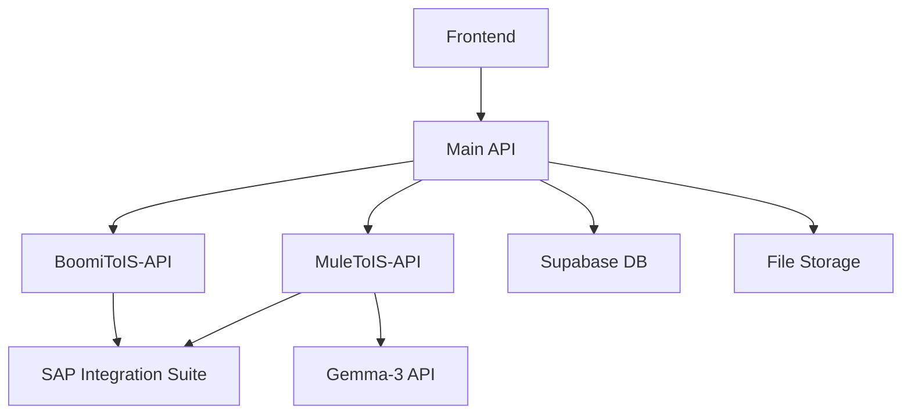
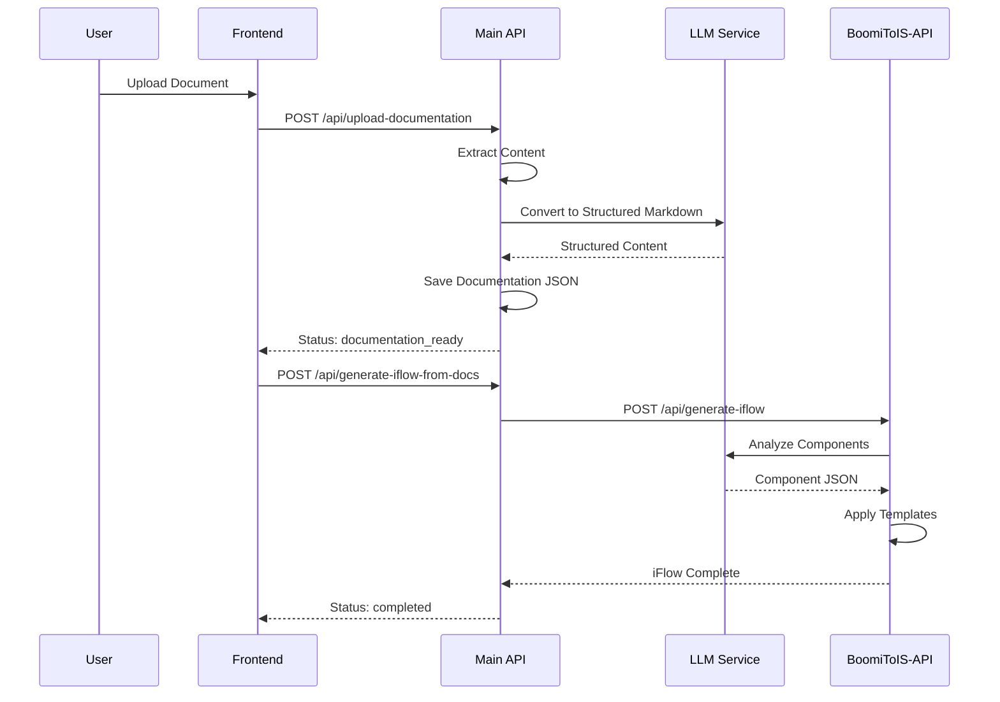

# IS-Migration Platform - Technical Design Document

## 📋 Document Overview

**Document Version:** 1.0  
**Last Updated:** January 2025  
**Project:** IS-Migration Platform  
**Purpose:** Comprehensive technical design for migrating integration flows from legacy platforms to SAP Integration Suite

---

## 🏗️ System Architecture

### 1. **High-Level Architecture**

The IS-Migration platform follows a **microservices architecture** with specialized services for different integration platforms:

```
┌─────────────────┐    ┌─────────────────┐    ┌─────────────────┐
│   React Frontend │    │   Main API      │    │  BoomiToIS-API  │
│   (Port 3000)   │◄──►│   (Port 5000)   │◄──►│   (Port 5003)   │
└─────────────────┘    └─────────────────┘    └─────────────────┘
                                │                        │
                                ▼                        ▼
                       ┌─────────────────┐    ┌─────────────────┐
                       │  MuleToIS-API   │    │ SAP Integration │
                       │   (Port 5001)   │    │     Suite       │
                       └─────────────────┘    └─────────────────┘
                                │
                                ▼
                       ┌─────────────────┐
                       │ Gemma-3 API     │
                       │   (Port 5002)   │
                       └─────────────────┘
```

### 2. **Core Architecture Principles**

- **Microservices**: Independent, specialized services for each platform
- **API-First**: RESTful APIs with clear contracts
- **Event-Driven**: Asynchronous processing with job queues
- **Cloud-Native**: Designed for Cloud Foundry deployment
- **AI-Powered**: Multiple LLM providers for robust processing

### 3. **Service Responsibilities**

| Service | Port | Primary Responsibility |
|---------|------|----------------------|
| **Frontend** | 3000 | User interface, workflow management, progress tracking |
| **Main API** | 5000 | Orchestration, document processing, job management |
| **BoomiToIS-API** | 5003 | Boomi XML processing, iFlow generation |
| **MuleToIS-API** | 5001 | MuleSoft XML processing, iFlow generation |
| **Gemma-3 API** | 5002 | RunPod Gemma-3 integration, alternative LLM |

---

## 🔧 Technical Components

### 1. **Technology Stack**

#### **Backend Services**
- **Framework**: Flask (Python 3.9+)
- **Web Server**: Gunicorn (production), Flask dev server (development)
- **HTTP Client**: Requests library
- **File Processing**: python-docx, PyPDF2, BeautifulSoup4
- **AI Integration**: Anthropic Claude, OpenAI, RunPod Gemma-3

#### **Frontend Application**
- **Framework**: React 18 with Vite
- **Styling**: Tailwind CSS
- **HTTP Client**: Axios
- **State Management**: React hooks
- **Build Tool**: Vite

#### **Database & Storage**
- **Primary Database**: Supabase (PostgreSQL)
- **File Storage**: Local filesystem (dev), AWS S3/CF Object Store (prod)
- **Caching**: In-memory caching for search results
- **Job Persistence**: JSON files with database fallback

### 2. **AI/LLM Integration**

#### **Primary LLM Provider: Anthropic Claude**
```python
# Configuration
ANTHROPIC_API_KEY = os.getenv('ANTHROPIC_API_KEY')
MODEL = "claude-sonnet-4-20250514"
MAX_TOKENS = 4000
TEMPERATURE = 0.1
```

#### **Secondary LLM Provider: RunPod Gemma-3**
```python
# OpenAI-compatible endpoint
RUNPOD_BASE_URL = f"https://api.runpod.ai/v2/{ENDPOINT_ID}/openai/v1"
RUNPOD_CHAT_URL = f"{RUNPOD_BASE_URL}/chat/completions"
```

#### **LLM Usage Patterns**
- **Document Processing**: Convert raw text to structured markdown
- **Component Analysis**: Extract integration components from documentation
- **iFlow Generation**: Generate SAP Integration Suite XML
- **Error Recovery**: Retry logic with multiple attempts

---

## 🗄️ Database Design

### 1. **Database Schema (Supabase PostgreSQL)**

#### **Core Tables**

```sql
-- Jobs table (primary entity)
CREATE TABLE is_migration.jobs (
    id UUID PRIMARY KEY DEFAULT gen_random_uuid(),
    filename TEXT NOT NULL,
    status TEXT NOT NULL DEFAULT 'pending',
    platform TEXT DEFAULT 'mulesoft',
    user_id TEXT,
    file_info JSONB,
    parsed_details JSONB,
    enhance_with_llm BOOLEAN DEFAULT false,
    llm_service TEXT,
    upload_path TEXT,
    results_path TEXT,
    created_at TIMESTAMPTZ DEFAULT NOW(),
    updated_at TIMESTAMPTZ DEFAULT NOW(),
    completed_at TIMESTAMPTZ
);

-- Documents table (file metadata)
CREATE TABLE is_migration.documents (
    id UUID PRIMARY KEY DEFAULT gen_random_uuid(),
    job_id UUID REFERENCES is_migration.jobs(id),
    filename TEXT NOT NULL,
    file_type TEXT NOT NULL,
    file_size BIGINT,
    file_path TEXT,
    content_hash TEXT,
    metadata JSONB,
    created_at TIMESTAMPTZ DEFAULT NOW()
);

-- iFlow Generations table (generation tracking)
CREATE TABLE is_migration.iflow_generations (
    id UUID PRIMARY KEY DEFAULT gen_random_uuid(),
    job_id UUID REFERENCES is_migration.jobs(id),
    iflow_name TEXT,
    generation_status TEXT DEFAULT 'pending',
    ai_model TEXT,
    generation_time_seconds INTEGER,
    component_count INTEGER,
    template_version TEXT,
    error_message TEXT,
    created_at TIMESTAMPTZ DEFAULT NOW(),
    completed_at TIMESTAMPTZ
);
```

#### **Database Features**
- **Row-Level Security (RLS)**: User-based data isolation
- **Vector Extension**: pgvector for similarity search
- **Real-time Subscriptions**: Live status updates
- **Audit Trails**: Complete job history tracking

### 2. **Data Flow Architecture**

```
User Upload → File Storage → Database Record → Processing Queue → Results Storage
     ↓              ↓              ↓                ↓                ↓
   Frontend    Local/S3/CF    Supabase Jobs    Background Job    Results Folder
```

---

## 🔌 API Design

### 1. **Main API Endpoints**

#### **Document Processing**
```http
POST /api/upload-documentation
Content-Type: multipart/form-data

Request:
- file: Document file (Word, PDF, etc.)
- platform: "boomi" | "mulesoft"
- enhance_with_llm: boolean

Response:
{
  "job_id": "uuid",
  "status": "processing",
  "message": "Document uploaded successfully"
}
```

#### **Job Management**
```http
GET /api/jobs/{job_id}
Response:
{
  "job_id": "uuid",
  "status": "completed",
  "platform": "boomi",
  "files": {
    "documentation_json": "path/to/doc.json",
    "markdown": "path/to/doc.md",
    "iflow": "path/to/iflow.zip"
  },
  "created": "2025-01-09T10:00:00Z",
  "completed": "2025-01-09T10:02:30Z"
}
```

#### **iFlow Generation**
```http
POST /api/generate-iflow-from-docs/{job_id}
Response:
{
  "status": "processing",
  "message": "iFlow generation started",
  "estimated_time": "2-5 minutes"
}
```

### 2. **BoomiToIS-API Endpoints**

#### **iFlow Generation**
```http
POST /api/generate-iflow/{job_id}
Content-Type: application/json

Request:
{
  "markdown_content": "# Integration Flow...",
  "platform": "boomi",
  "options": {
    "template_version": "v2.0",
    "include_error_handling": true
  }
}

Response:
{
  "job_id": "uuid",
  "status": "processing",
  "components_identified": 5,
  "estimated_completion": "2025-01-09T10:05:00Z"
}
```

#### **SAP BTP Deployment**
```http
POST /api/jobs/{job_id}/deploy
Content-Type: application/json

Request:
{
  "tenant_url": "https://tenant.integration.hana.ondemand.com",
  "package_id": "MyPackage",
  "credentials": {
    "client_id": "...",
    "client_secret": "..."
  }
}
```

### 3. **Error Handling Standards**

#### **HTTP Status Codes**
- `200 OK`: Successful operation
- `202 Accepted`: Async operation started
- `400 Bad Request`: Invalid request data
- `404 Not Found`: Resource not found
- `422 Unprocessable Entity`: Validation errors
- `500 Internal Server Error`: System errors

#### **Error Response Format**
```json
{
  "error": {
    "code": "INVALID_FILE_FORMAT",
    "message": "Unsupported file format. Please upload .docx, .pdf, or .txt files.",
    "details": {
      "supported_formats": [".docx", ".pdf", ".txt"],
      "received_format": ".xlsx"
    }
  }
}
```

---

## 🔐 Security Design

### 1. **Authentication & Authorization**

#### **API Security**
- **CORS Configuration**: Restricted origins for production
- **Environment Variables**: Secure credential storage
- **API Key Management**: Encrypted storage of LLM API keys

#### **Database Security**
- **Row-Level Security (RLS)**: User-based data isolation
- **Connection Encryption**: SSL/TLS for all database connections
- **Credential Rotation**: Regular API key rotation

### 2. **Data Protection**

#### **File Security**
- **Upload Validation**: File type and size restrictions
- **Virus Scanning**: Malware detection for uploads
- **Temporary Cleanup**: Automatic cleanup of processed files
- **Access Control**: User-specific file access

#### **Data Encryption**
- **In Transit**: HTTPS for all API communications
- **At Rest**: Encrypted storage for sensitive data
- **API Keys**: Environment-based secure storage

---

## 🚀 Deployment Architecture

### 1. **Cloud Foundry Deployment**

#### **Application Manifest Structure**
```yaml
# Main API
applications:
- name: it-resonance-main-api
  memory: 1G
  instances: 2
  buildpacks:
    - python_buildpack
  env:
    ANTHROPIC_API_KEY: ((anthropic-api-key))
    DATABASE_URL: ((database-url))
```

#### **Environment Configuration**
- **Development**: Local services, file storage
- **Staging**: Cloud services, limited resources
- **Production**: Full cloud deployment, auto-scaling

### 2. **Service Dependencies**



### 3. **Scaling Strategy**

#### **Horizontal Scaling**
- **Frontend**: CDN distribution
- **APIs**: Multiple instances with load balancing
- **Database**: Read replicas for heavy queries

#### **Performance Optimization**
- **Caching**: In-memory caching for frequent requests
- **Connection Pooling**: Database connection optimization
- **Async Processing**: Background job processing

---

## 📊 Performance Design

### 1. **Performance Requirements**

| Operation | Target Time | Acceptable Time |
|-----------|-------------|-----------------|
| Document Upload | < 5 seconds | < 10 seconds |
| Document Processing | < 15 seconds | < 30 seconds |
| iFlow Generation | < 60 seconds | < 120 seconds |
| File Download | < 3 seconds | < 5 seconds |

### 2. **Optimization Strategies**

#### **Backend Optimization**
- **Async Processing**: Non-blocking operations
- **Connection Pooling**: Efficient database connections
- **Caching**: Results caching for repeated operations
- **Batch Processing**: Bulk operations where possible

#### **Frontend Optimization**
- **Code Splitting**: Lazy loading of components
- **Asset Optimization**: Compressed images and scripts
- **Progressive Loading**: Incremental content loading
- **Caching**: Browser caching for static assets

---

## 🔄 Integration Patterns

### 1. **Document Processing Flow**



### 2. **Error Recovery Patterns**

#### **Retry Logic**
- **LLM Failures**: Up to 5 retry attempts with exponential backoff
- **Network Timeouts**: Automatic retry with circuit breaker
- **Template Errors**: Fallback to basic templates

#### **Graceful Degradation**
- **LLM Unavailable**: Basic markdown structure generation
- **Database Offline**: File-based job storage
- **Storage Issues**: Temporary local storage

---

This technical design document provides the foundation for understanding the IS-Migration platform's architecture, components, and implementation details. The next section will cover the Functional Design Document with business requirements and user workflows.
