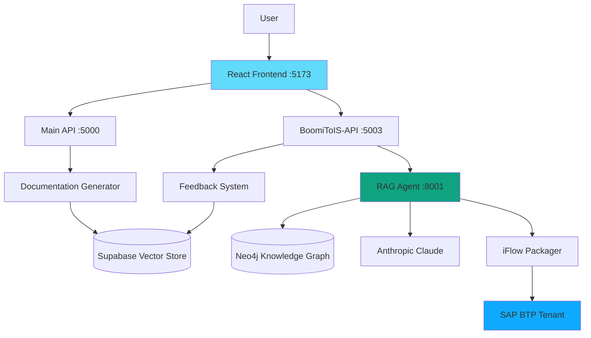

# IMigrate - Migration Tool for SAP Integration Suite

**Intelligent migration from Boomi/MuleSoft/Sterling → SAP Integration Suite (Cloud Integration)**

[](https://www.sap.com/products/integration-suite.html)
[](https://www.python.org/)
[](https://reactjs.org/)
[](https://www.langchain.com/)

---

## **🎯 What is IMigrate?**

IMigrate is an **AI-powered migration platform** that automatically converts integration flows from:
- **Dell Boomi** → SAP Integration Suite iFlows
- **MuleSoft** → SAP Integration Suite iFlows  
- **IBM Sterling** → SAP Integration Suite iFlows (coming soon)

### **Key Features**

✅ **Intelligent Documentation Generation** - Extracts integration patterns from source XML  
✅ **RAG-Powered iFlow Generation** - Uses AI to generate production-ready SAP iFlows  
✅ **Knowledge Graph Integration** - Neo4j-based component similarity search  
✅ **Feedback Learning System** - Continuously improves from user feedback  
✅ **Direct SAP BTP Deployment** - Deploy generated iFlows directly to SAP Cloud Integration  
✅ **Multi-LLM Support** - Works with Anthropic Claude, Google Gemma3, OpenAI GPT-4  

---

## **🚀 Quick Start (3 Commands)**

### **Prerequisites**
- Python 3.9+
- Node.js 18+
- Docker (for Neo4j)
- Supabase account (free tier)
- Anthropic/OpenAI API key

### **1. Clone & Setup**
```bash
git clone <repository-url>
cd IMigrate

# Install Python dependencies
pip install -r agentic-rag-IMigrate/requirements.txt
pip install -r BoomiToIS-API/requirements.txt  
pip install -r app/requirements.txt

# Install Frontend dependencies
cd IFA-Project/frontend
npm install
cd ../..
```

### **2. Configure Environment**
```bash
# Copy environment templates
cp app/.env.example app/.env
cp BoomiToIS-API/.env.example BoomiToIS-API/.env.development
cp agentic-rag-IMigrate/.env.example agentic-rag-IMigrate/.env
cp IFA-Project/frontend/.env.example IFA-Project/frontend/.env.development

# Edit with your API keys:
# - Anthropic API Key
# - Supabase URL & Key
# - Neo4j credentials
# - SAP BTP credentials (optional)
```

**Key Configuration Files:**
- `app/.env` - Main API configuration
- `BoomiToIS-API/.env.development` - iFlow generation API
- `agentic-rag-IMigrate/.env` - RAG agent configuration
- `IFA-Project/frontend/.env.development` - Frontend configuration

### **3. Start Services**

**Terminal 1: Main API**
```bash
cd app
python app.py
# Runs on http://localhost:5000
```

**Terminal 2: iFlow Generation API**
```bash
cd BoomiToIS-API
python app.py
# Runs on http://localhost:5003
```

**Terminal 3: RAG Agent API**
```bash
cd agentic-rag-IMigrate
python rag_api_service.py
# Runs on http://localhost:8001
```

**Terminal 4: Frontend**
```bash
cd IFA-Project/frontend
npm run dev
# Runs on http://localhost:5173
```

**Access the app:** http://localhost:5173

---

## **📖 Basic Usage**

### **Step 1: Upload Source File**
1. Open http://localhost:5173
2. Select platform (Boomi/MuleSoft)
3. Upload XML file or ZIP archive
4. Click "Generate Documentation"

### **Step 2: Generate iFlow**
1. Review generated documentation
2. Click "Generate SAP API/iFlow"
3. Wait for AI agent to generate components (~2-5 minutes)
4. Download ZIP package

### **Step 3: Deploy to SAP BTP** (Optional)
1. Configure SAP BTP credentials in `.env`
2. Click "Deploy to SAP Integration Suite"
3. iFlow automatically deployed to your tenant

### **Step 4: Provide Feedback**
1. After deployment, click "Provide Feedback"
2. Rate quality, report issues
3. **Your feedback improves the AI for future conversions!**

---

## **🏗️ Architecture**



**See `ARCHITECTURE.md` for detailed system design**

---

## **📚 Documentation**

| Document | Description |
|----------|-------------|
| **[ARCHITECTURE.md](./ARCHITECTURE.md)** | System architecture, components, data flows |
| **[DEPLOYMENT_GUIDE.md](./DEPLOYMENT_GUIDE.md)** | Setup, configuration, troubleshooting |
| **[FEEDBACK_AND_LEARNING.md](./FEEDBACK_AND_LEARNING.md)** | AI learning system, feedback loop |
| **[DEVELOPMENT.md](./DEVELOPMENT.md)** | Developer guide, API docs, contributing |

---

## **🎓 How It Works**

### **1. Documentation Extraction**
```
Boomi/MuleSoft XML → Parser → Structured Documentation
                                  ↓
                        Component Detection
                                  ↓
                        Business Logic Extraction
```

### **2. RAG-Based iFlow Generation**
```
Documentation → Intent Understanding → Component Selection
                                          ↓
                        Knowledge Graph Similarity Search
                                          ↓
                        LLM-Powered XML Generation
                                          ↓
                        iFlow Packaging
```

### **3. Continuous Learning**
```
User Feedback → Pattern Library → Future Generations
     ↓              ↓                    ↓
Analytics    Auto-Updates         Improved Accuracy
```

---

## **🔧 Technology Stack**

### **Backend**
- **Python 3.9+** - Core language
- **Flask** - REST APIs
- **LangChain** - RAG framework
- **Anthropic Claude** / **Google Gemma3** - LLMs
- **LangGraph** - Agentic workflows

### **Databases**
- **Supabase (PostgreSQL + pgvector)** - Vector embeddings, feedback storage
- **Neo4j** - Knowledge graph for component relationships
- **SQLite** - Local job tracking

### **Frontend**
- **React 18** - UI framework
- **Vite** - Build tool
- **TailwindCSS** - Styling
- **Axios** - API client

### **AI/ML**
- **OpenAI Embeddings** - Text vectorization
- **CodeBERT** - Code embeddings
- **Sentence Transformers** - Semantic search

---

## **📊 Supported Platforms**

| Platform | Status | Components Supported |
|----------|--------|---------------------|
| **Dell Boomi** | ✅ Full Support | Processes, Maps, Connectors, SFTP, HTTP, OData |
| **MuleSoft** | ✅ Full Support | Flows, DataWeave, HTTP, Database, File |
| **IBM Sterling** | 🚧 Coming Soon | - |

---

## **🎯 Example: Boomi to SAP iFlow**

**Input:** Boomi process with SFTP polling + OData integration

```xml
<process>
  <component type="SFTP">
    <schedule>Every 5 minutes</schedule>
    <directory>/inbound/employees/</directory>
  </component>
  <component type="Transform">
    <script>transformEmployeeData.groovy</script>
  </component>
  <component type="HTTPAdapter">
    <endpoint>/sap/odata/EmployeeService</endpoint>
  </component>
</process>
```

**Output:** SAP iFlow ZIP package with:
- ✅ Timer component (5-minute schedule)
- ✅ SFTP adapter
- ✅ GroovyScript transformer  
- ✅ OData RequestReply
- ✅ Proper sequence flows
- ✅ Error handling
- ✅ Importable to SAP Integration Suite

**Accuracy:** 85-95% with feedback learning

---

## **🔐 Security**

- API keys stored in `.env` files (never committed)
- SAP BTP OAuth2 authentication
- Supabase Row Level Security (RLS)
- No source code sent to LLMs (only documentation)

---

## **🚦 Status Indicators**

When using the UI:
- 🔵 **Processing** - Documentation generation in progress
- 🟢 **Documentation Completed** - Ready for iFlow generation
- 🟡 **Generating iFlow** - AI agent creating components
- ✅ **Completed** - iFlow ready for download/deployment
- ❌ **Failed** - Error occurred (check logs)

---

## **📈 Performance**

| Metric | Value |
|--------|-------|
| **Documentation Generation** | 10-30 seconds |
| **iFlow Generation (RAG)** | 2-5 minutes |
| **iFlow Generation (Template)** | 30-60 seconds |
| **Deployment to SAP BTP** | 10-20 seconds |
| **Accuracy** | 85-95% (with feedback) |

---

## **🆘 Troubleshooting**

### **Services Not Starting?**
```bash
# Check ports are available
netstat -an | findstr "5000 5003 8001 5173"

# Check environment variables
python -c "import os; print(os.getenv('ANTHROPIC_API_KEY'))"
```

### **iFlow Generation Failing?**
1. Check RAG API logs: `agentic-rag-IMigrate/rag_api_service.py`
2. Verify Neo4j is running: `docker ps`
3. Check Anthropic API key is valid

### **Button Shows "Generated" Too Early?**
- Restart Main API (app/app.py)
- Restart Frontend
- Clear browser cache

**See `DEPLOYMENT_GUIDE.md` for detailed troubleshooting**

---

## **🤝 Contributing**

See `DEVELOPMENT.md` for:
- Code structure
- Adding new platforms
- Testing guidelines
- API documentation

---

## **📞 Support**

- 📧 Email: support@imigrate.com
- 📖 Docs: See `ARCHITECTURE.md`, `DEPLOYMENT_GUIDE.md`
- 🐛 Issues: Check logs in each service directory

---

## **📄 License**

[Your License Here]

---

## **🙏 Acknowledgments**

Built with:
- **LangChain** for RAG framework
- **Anthropic Claude** for code generation
- **SAP Integration Suite** APIs
- **Supabase** for vector storage
- **Neo4j** for knowledge graphs

---

**Ready to migrate? Start with Step 1 above!** 🚀

