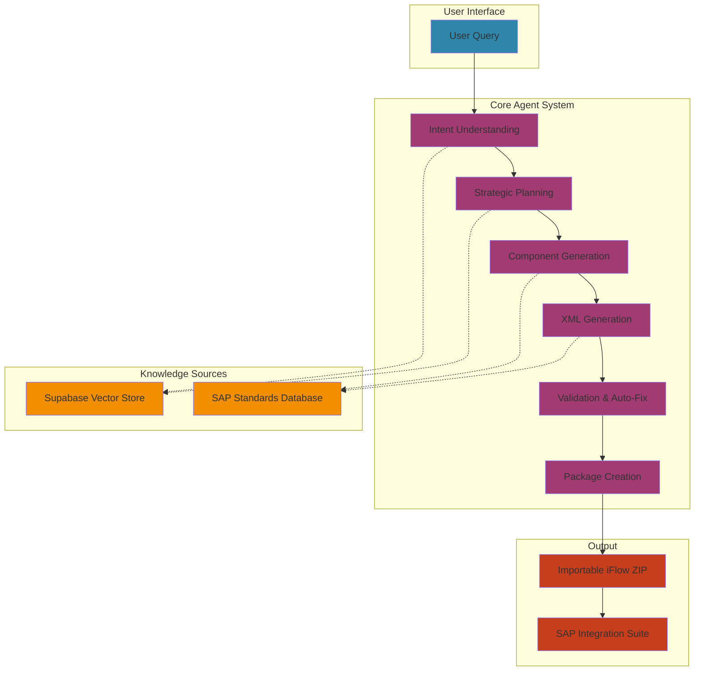
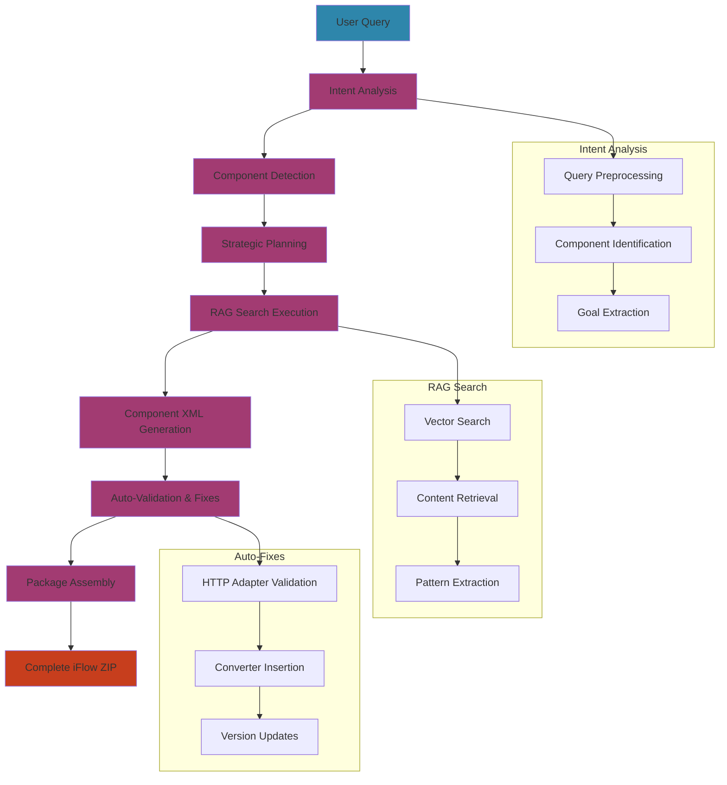
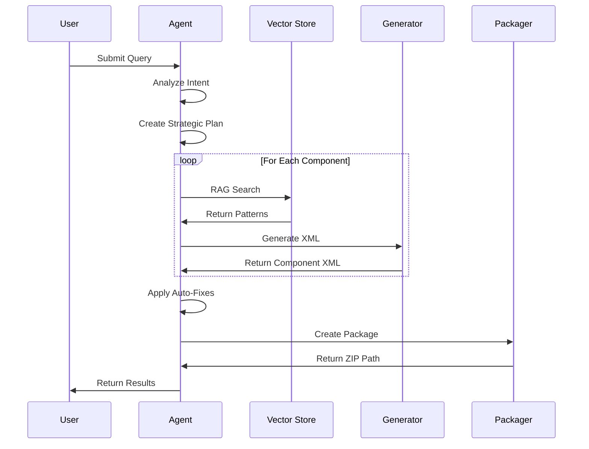
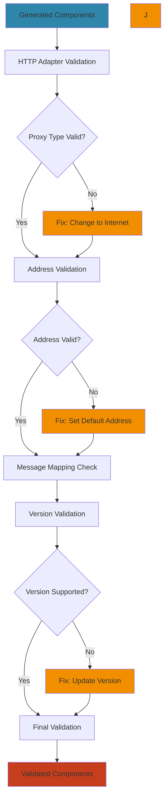
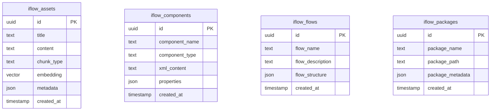
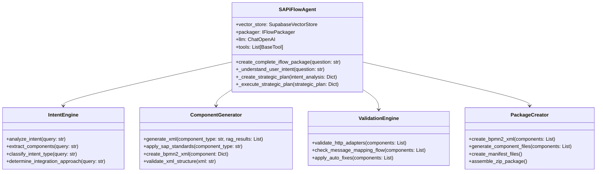

# SAP iFlow Agent Documentation

## Overview

The SAP iFlow Agent is an intelligent system that generates complete, importable SAP Integration Suite iFlow packages from natural language queries. It combines RAG (Retrieval Augmented Generation) with vector databases to understand user intent and create production-ready integration flows.

## System Architecture



## Complete Agent Workflow



## Component Generation Process



## Validation & Auto-Fix Process



## Database Schema

### Supabase Vector Store Schema



## Component Architecture

### SAPiFlowAgent Core Components



## Key Features

### 🧠 **Intelligent Intent Understanding**
- Natural language processing with GPT-4
- Component detection and classification
- Integration approach selection
- Goal extraction and interpretation

### 🔍 **RAG-Enhanced Generation**
- Semantic search in Supabase vector store
- Component pattern retrieval
- XML template generation
- SAP standards application

### 🔧 **Automatic Validation & Fixes**
- HTTP adapter validation
- Message mapping flow correction
- Version compatibility fixes

### 📦 **Complete Package Generation**
- BPMN2 XML generation
- Component file creation
- Manifest and parameter files
- Importable ZIP packages

## Supported Components

| Component Type | Description | XML Element | Activity Type |
|----------------|-------------|-------------|---------------|
| `StartEvent` | Start event | `startEvent` | `startEvent` |
| `EndEvent` | End event | `endEvent` | `endEvent` |
| `ContentModifier` | Content enricher/modifier | `callActivity` | `Enricher` |
| `GroovyScript` | Groovy script component | `callActivity` | `Script` |
| `MessageMapping` | Message mapping | `callActivity` | `Mapping` |
| `Router` | Router with branching | `exclusiveGateway` | `ExclusiveGateway` |
| `RequestReply` | Request-reply pattern | `serviceTask` | `RequestReply` |
| `Splitter` | General Splitter for message division | `callActivity` | `Splitter` |
| `EndpointSender` | HTTP/HTTPS sender | `participant` | `participant` |
| `EndpointReceiver` | HTTP/HTTPS receiver | `participant` | `participant` |
| `MessageFilter` | Message filter by XPath | `callActivity` | `Filter` |
| `JsonToXmlConverter` | Convert JSON to XML | `callActivity` | `JsonToXmlConverter` |
| `Gather` | Aggregate messages with identical format | `callActivity` | `Gather` |

## Validation Rules

The agent automatically applies the following validation and fixes: 

### HTTP/HTTPS Adapter Validation
- ✅ **Proxy Type**: Changes "default" to "Internet"
- ✅ **Address**: Ensures valid HTTP/HTTPS addresses
- ✅ **Authentication**: Sets default authentication methods
- ✅ **HTTP Method**: Ensures non-null HTTP methods

### Message Mapping Configuration
- ✅ **Mapping Files**: Automatically creates .mmap resource files
- ✅ **XML Structure**: Generates proper mapping XML structure
- ✅ **File References**: Ensures correct file path references

### Version Compatibility
- ✅ **Component Versions**: Updates to supported SAP IS versions
- ✅ **Protocol Versions**: Ensures compatibility with Cloud Integration
- ✅ **Adapter Versions**: Uses supported HTTP/HTTPS adapter versions

### General Splitter Component
- ✅ **Activity Type**: Protected field ensures correct "Splitter" activityType
- ✅ **Split Type**: Maintains "GeneralSplitter" for proper SAP IS recognition
- ✅ **Configuration**: Supports RAG-based configuration for streaming, threads, and expressions
- ✅ **Naming**: Uses "General Splitter" naming convention for clarity
- ✅ **XML Structure**: Generates proper `<bpmn2:callActivity>` elements

### JSON → XML Converter and Groovy JSON Preservation

- The agent detects `JsonToXmlConverter` using aliases: `JSON to XML converter`, `JsonToXmlConverter`, `JSON XML converter`, `JSON to XML`.
- Authoritative properties are applied from VectorDB:
  - `activityType=JsonToXmlConverter`
  - `cmdVariantUri=ctype::FlowstepVariant/cname::JsonToXmlConverter/version::1.0.2`
  - `componentVersion=1.0`
  - `useNamespaces=false`, `jsonNamespaceSeparator=:`
- Ordering: The agent preserves user-specified order exactly; no automatic reordering.
- Data flow: When a `GroovyScript` is immediately before `JsonToXmlConverter`, the agent injects a minimal, safe block only if JSON handling is missing:

```groovy
// AUTO-INJECTED: Ensure valid JSON for downstream JsonToXmlConverter
def body = message.getBody(String.class);
if (body == null || body.trim().isEmpty() || (!body.trim().startsWith("{") && !body.trim().startsWith("["))) {
    body = '{"data": "sample", "timestamp": "' + new Date().toString() + '", "processed": true}';
}
headers.put("Content-Type", "application/json");
message.setBody(body);
```

- The injection is non-destructive: if the script already sets `Content-Type` and body with JSON, no changes are made.

## Quick Start Guide

### 1. Installation and Setup

```bash
# Clone the repository
git clone <repository-url>
cd agentic-rag-knowledge-graph

# Install dependencies
pip install -r requirements.txt

# Set up environment variables
cp .env.example .env
# Edit .env with your credentials
```

### 2. Basic Usage

```python
import asyncio
from agent.agent import SAPiFlowAgent
from rag.supabase_vector_store import create_supabase_vector_store

async def main():
    # Initialize services
    vector_store = await create_supabase_vector_store()
    
    # Create agent
    agent = SAPiFlowAgent(
        vector_store=vector_store,
        graph_store=None,  # Not required for basic usage
        openai_api_key="your-openai-key"
    )
    
    # Generate iFlow
    result = await agent.create_complete_iflow_package(
        "Create an integration flow with HTTP sender, content modifier, "
        "message mapping, groovy script, router with 2 branches, and request reply"
    )
    
    print(f"✅ Package created: {result['package_path']}")
    print(f"📦 Components: {result['component_count']}")

if __name__ == "__main__":
    asyncio.run(main())
```

### 3. Advanced Configuration

```python
# Custom configuration
agent = SAPiFlowAgent(
    vector_store=vector_store,
    graph_store=None,
    openai_api_key=openai_key,
    context_document="My Custom Context"
)

# Enable debugging
agent.debug_level = "VERBOSE"

# Custom RAG strategy
rag_strategy = {
    'ContentModifier': {
        'search_queries': ['Content Modifier XML', 'Content Enricher'],
        'search_limit': 5,
        'chunk_types': ['xml', 'component']
    }
}
```

## API Reference

### Core Methods

#### `create_complete_iflow_package(question: str) -> Dict[str, Any]`

Creates a complete importable iFlow package using intelligent intent understanding.

**Parameters:**
- `question` (str): User query describing the desired iFlow

**Returns:**
```python
{
    'package_path': str,           # Path to generated ZIP file
    'iflow_name': str,          # Name of the iFlow
    'component_count': int,     # Number of components generated
    'components': List[Dict],   # List of generated components
    'sources_used': int,        # Number of RAG sources used
    'ready_for_import': bool,   # Whether package is ready for SAP IS
    'package_type': str,        # Type of package created
    'execution_time': float,    # Total execution time in seconds
    'validation_results': Dict, # Validation results and fixes applied
    'metadata': Dict           # Additional metadata
}
```

#### `_understand_user_intent(question: str) -> Dict[str, Any]`

Analyzes user query to extract intent, components, and goals.

**Returns:**
```python
{
    'intent_classification': str,      # Type of intent
    'user_goal': str,                 # Extracted user goal
    'query_interpretation': str,      # Interpretation of the query
    'components_detected': List[Dict], # List of detected components
    'integration_approach': str,       # Recommended integration approach
    'confidence_score': float         # Confidence in the analysis
}
```

#### `_generate_component_xml(component_type: str, component_name: str, 
                           retrieved_content: List[Dict], 
                           component_metadata: Dict = None) -> str`

Generates complete SAP iFlow XML for a specific component.

**Supported Component Types:**
- `ContentModifier`: Content enricher/modifier
- `GroovyScript`: Groovy script component
- `MessageMapping`: Message mapping component
- `Router`: Router with branching logic
- `RequestReply`: Request-reply pattern
- `Splitter`: General Splitter for message division
- `StartEvent`: Start event
- `EndEvent`: End event

## Performance Metrics

| Metric | Target | Description |
|--------|--------|-------------|
| Response Time | < 30s | Total time from query to package |
| Memory Usage | < 1GB | Peak memory consumption |
| Success Rate | > 95% | Successful package generation |
| Validation Rate | > 90% | Auto-fix success rate |

## Troubleshooting

### Common Issues

#### 1. Connection Errors
**Issue**: "Failed to connect to Supabase"
**Solution**: Check Supabase URL and key in environment variables

```python
# Check configuration
import os
print(f"Supabase URL: {os.getenv('SUPABASE_URL')}")
print(f"Supabase Key: {os.getenv('SUPABASE_KEY')[:10]}...")
```

#### 2. OpenAI API Issues
**Issue**: "OpenAI API key invalid"
**Solution**: Verify API key and check rate limits

```python
# Test API key
import openai
openai.api_key = "your-api-key"

try:
    response = openai.ChatCompletion.create(
        model="gpt-4",
        messages=[{"role": "user", "content": "Hello"}]
    )
    print("✅ OpenAI API key valid")
except Exception as e:
    print(f"❌ OpenAI API key invalid: {e}")
```

#### 3. Memory Issues
**Issue**: "Out of memory error"
**Solution**: Monitor memory usage and implement cleanup

```python
# Monitor memory usage
import psutil
import gc

def monitor_memory():
    process = psutil.Process()
    memory_mb = process.memory_info().rss / 1024 / 1024
    print(f"Memory usage: {memory_mb:.2f} MB")
    
    if memory_mb > 1000:  # 1GB threshold
        print("High memory usage detected, running garbage collection...")
        gc.collect()
```

### Error Messages and Fixes

#### "Invalid value 'default' in Proxy Type"
**Cause**: HTTP adapter has invalid proxy type
**Solution**: Auto-fix changes "default" to "Internet"

#### "Enter a valid address"
**Cause**: HTTP adapter missing address
**Solution**: Auto-fix adds default address (https://example.com)

#### "Component version not supported"
**Cause**: Unsupported SAP IS version
**Solution**: Auto-update to supported version (1.5)

## Best Practices

### 1. Error Handling
```python
try:
    result = await agent.create_complete_iflow_package(query)
except ConnectionError:
    # Handle connection issues
    pass
except ValidationError:
    # Handle validation issues
    pass
except Exception as e:
    # Handle unexpected errors
    logger.error(f"Unexpected error: {e}")
```

### 2. Performance Optimization
```python
# Use connection pooling
vector_store = await create_supabase_vector_store(
    pool_size=10,
    max_connections=20
)

# Enable caching
agent = SAPiFlowAgent(
    vector_store=vector_store,
    graph_store=None,
    openai_api_key=openai_key,
    enable_caching=True
)
```

### 3. Monitoring and Logging
```python
import logging

# Configure logging
logging.basicConfig(
    level=logging.INFO,
    format='%(asctime)s - %(name)s - %(levelname)s - %(message)s'
)

# Monitor performance
import time
start_time = time.time()
result = await agent.create_complete_iflow_package(query)
execution_time = time.time() - start_time
logger.info(f"Execution time: {execution_time:.2f} seconds")
```

## Package Contents

The generated package includes:

```
Package Structure:
├── Integration Flow XML (.iflw)
├── Component XML Files
├── Groovy Script Files (.groovy)
├── Message Mapping Files (.mmap)
├── Manifest Files (MANIFEST.MF)
└── Parameters Files (.prop)
```

## Configuration

### Environment Variables
```bash
# Required
OPENAI_API_KEY=your-openai-key
SUPABASE_URL=https://your-project.supabase.co
SUPABASE_KEY=your-supabase-key

# Optional
AGENT_MODEL=gpt-4
AGENT_TEMPERATURE=0.1
DEBUG_LEVEL=INFO
```

### Agent Configuration
```python
class AgentConfig:
    def __init__(self):
        self.model_name = "gpt-4"
        self.temperature = 0.1
        self.max_tokens = 4000
        self.streaming = False
        self.debug_level = "INFO"
        self.retry_attempts = 3
        self.timeout_seconds = 30
```

## Contributing

1. **Documentation**: Update relevant documentation
2. **Testing**: Add tests for new features
3. **Validation**: Ensure all validation rules work correctly
4. **Performance**: Monitor and optimize performance impact

## Support

For issues and questions:
1. Check the troubleshooting section above
2. Review the API reference
3. Examine the component architecture
4. Create an issue with detailed information

## License

This project is licensed under the MIT License - see the LICENSE file for details.

---

**Last Updated**: January 2025  
**Version**: 1.0.0  
**Status**: Production Ready