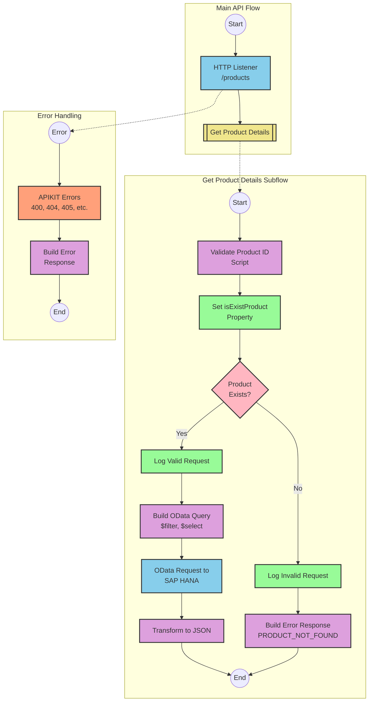

# SAP OData Product Information API Integration

## Table of Contents
- [API Overview](#api-overview)
- [Endpoints](#endpoints)
  - [GET /products](#get-products)
- [Current MuleSoft Flow Logic](#current-mulesoft-flow-logic)
  - [products-main Flow](#products-main-flow)
  - [products-console Flow](#products-console-flow)
  - [get:\products:products-config Flow](#getproductsproducts-config-flow)
  - [get-product-details-flow Subflow](#get-product-details-flow-subflow)
- [DataWeave Transformations Explained](#dataweave-transformations-explained)
  - [Product Identifier Validation](#product-identifier-validation)
  - [OData Query Parameters Construction](#odata-query-parameters-construction)
  - [Response Payload Transformation](#response-payload-transformation)
  - [Error Response Transformation](#error-response-transformation)
- [SAP Integration Suite Implementation](#sap-integration-suite-implementation)
  - [Component Mapping](#component-mapping)
  - [Integration Flow Visualization](#integration-flow-visualization)
  - [Configuration Details](#configuration-details)
- [Environment Configuration](#environment-configuration)
- [API Reference](#api-reference)

## API Overview
This API provides access to product information stored in an SAP HANA database through OData services. The integration retrieves detailed product information based on a product identifier provided as a query parameter. The API validates the product identifier against a configured list of valid identifiers before making the request to the backend system.

- **Base URL**: Determined by the HTTP_Listener_config
- **Authentication**: Not explicitly defined in the source documentation
- **Rate Limiting**: Not specified in the source documentation
- **General Response Format**: JSON

The API serves as a middleware layer between client applications and the SAP HANA backend, providing a simplified interface for retrieving product details while implementing validation logic and error handling.

## Endpoints

### GET /products
Retrieves detailed product information based on a product identifier.

- **HTTP Method**: GET
- **Path**: /products
- **Purpose**: Fetch product details from SAP HANA based on a product identifier

**Request Parameters**:
- **Query Parameters**:
  - `productIdentifier` (required): The unique identifier of the product to retrieve

**Response Format**:
- **Success Response (200 OK)**:
  - Content-Type: application/json
  - Body: Product details from SAP HANA OData service

- **Error Response (400 Bad Request)**:
  - Content-Type: application/json
  - Body:
    ```json
    {
      "status": "error",
      "message": "The product identifier {productIdentifier} was not found.",
      "errorCode": "PRODUCT_NOT_FOUND"
    }
    ```

**Error Handling**:
- If the product identifier is not provided or is invalid, returns a 400 Bad Request with a PRODUCT_NOT_FOUND error
- APIKIT error handling for standard HTTP errors (400, 404, 405, 406, 415, 501)

## Current MuleSoft Flow Logic

### products-main Flow
1. **Trigger**: HTTP listener configured with HTTP_Listener_config
2. **Processing**:
   - Sets response headers
   - Routes requests based on API specification
   - Handles errors with error-response component
3. **Outcome**: Routes API requests to appropriate implementation flows

### products-console Flow
1. **Trigger**: HTTP listener configured with HTTP_Listener_config
2. **Processing**:
   - Sets response headers
   - Logs information to console
   - Handles errors with error-response component
3. **Outcome**: Provides console logging functionality for the API

### get:\products:products-config Flow
1. **Trigger**: GET request to /products endpoint
2. **Processing**:
   - References the get-product-details-flow subflow
3. **Outcome**: Delegates processing to the get-product-details-flow subflow

### get-product-details-flow Subflow
1. **Trigger**: Flow reference from get:\products:products-config
2. **Processing Steps**:
   - Validates if the provided productIdentifier exists in the configured list
   - Sets variables for processing
   - Uses a choice router to handle valid vs. invalid product identifiers
   - For valid identifiers:
     - Logs the request processing
     - Constructs OData query parameters for the backend request
     - Makes HTTP request to SAP HANA backend
     - Transforms the response to JSON
   - For invalid identifiers:
     - Logs the validation failure
     - Constructs an error response
3. **Data Transformations**:
   - Validates product identifier against configured list
   - Constructs OData query parameters with $filter and $select
   - Transforms backend response to JSON
   - Constructs error response for invalid product identifiers
4. **Expected Outcomes**:
   - For valid product identifiers: Returns product details from SAP HANA
   - For invalid product identifiers: Returns error response with PRODUCT_NOT_FOUND

**Technical Details**:
- **OData Query Parameters**:
  ```
  {
    "$filter" : "ProductId eq '" ++ (attributes.queryParams.productIdentifier default '') ++ "'",
    "$select" : "ProductId,Category,CategoryName,CurrencyCode,DimensionDepth,DimensionHeight,DimensionUnit,DimensionWidth,LongDescription,Name,PictureUrl,Price,QuantityUnit,ShortDescription,SupplierId,Weight,WeightUnit"
  }
  ```

## DataWeave Transformations Explained

### Product Identifier Validation
This transformation checks if the provided product identifier exists in a configured list of valid product identifiers.

**Input**: Query parameters from the HTTP request
**Output**: Boolean value indicating if the product identifier is valid

```dw
%dw 2.0
output application/java
var productidentifer=p('odata.productIdentifiers') splitBy(",")
---
sizeOf(productidentifer filter ($ == attributes.queryParams.productIdentifier))>0
```

**Explanation**:
1. Retrieves a comma-separated list of valid product identifiers from a property `odata.productIdentifiers`
2. Splits the list into an array using `splitBy(",")`
3. Filters the array to find elements matching the provided product identifier
4. Checks if the size of the filtered array is greater than 0 (indicating a match was found)

### OData Query Parameters Construction
This transformation constructs the OData query parameters for the backend request.

**Input**: HTTP request attributes
**Output**: OData query parameters as a Java object

```dw
#[output application/java
---
{
	"$filter" : "ProductId eq '" ++ (attributes.queryParams.productIdentifier default '') ++ "'",
	"$select" : "ProductId,Category,CategoryName,CurrencyCode,DimensionDepth,DimensionHeight,DimensionUnit,DimensionWidth,LongDescription,Name,PictureUrl,Price,QuantityUnit,ShortDescription,SupplierId,Weight,WeightUnit"
}]
```

**Explanation**:
1. Creates a Java object with OData query parameters
2. Sets `$filter` to filter products by the provided product identifier
3. Sets `$select` to specify which fields to retrieve from the backend
4. Uses the `default ''` operator to handle cases where productIdentifier might be null

### Response Payload Transformation
This transformation passes through the backend response as JSON.

**Input**: Backend response
**Output**: JSON response

```dw
%dw 2.0
output application/json
---
payload
```

**Explanation**:
1. Sets the output MIME type to application/json
2. Passes through the payload without modification

### Error Response Transformation
This transformation constructs an error response for invalid product identifiers.

**Input**: HTTP request attributes
**Output**: JSON error response

```dw
%dw 2.0
output application/json
---
{
	status: "error",
	message: "The product identifier " ++ attributes.queryParams.productIdentifier ++ " was not found.",
	errorCode: "PRODUCT_NOT_FOUND"
}
```

**Explanation**:
1. Creates a JSON object with error information
2. Sets status to "error"
3. Constructs a message that includes the invalid product identifier
4. Sets errorCode to "PRODUCT_NOT_FOUND"

## SAP Integration Suite Implementation

### Component Mapping

| MuleSoft Component | SAP Integration Suite Equivalent | Notes |
|--------------------|----------------------------------|-------|
| HTTP Listener | HTTPS Adapter (Receiver) | Configure with the same path and method |
| Flow Reference | Process Call | Used to call subflows |
| DataWeave Transform | Content Modifier with Script | Use Groovy or JavaScript for similar logic |
| Logger | Write to Message Log | Configure with the same log messages |
| HTTP Request | OData Adapter (Sender) | Configure with the same OData parameters |
| Choice Router | Router | Configure with the same conditions |
| Set Variable | Content Modifier | Use to set exchange properties |
| Set Payload | Content Modifier | Use to set message body |
| Error Handler | Exception Subprocess | Configure with similar error handling logic |

### Integration Flow Visualization



### Configuration Details

#### HTTPS Adapter (Receiver)
- **Address**: `/products`
- **Authentication**: As per source system requirements
- **CSRF Protection**: Disabled (unless required)

#### OData Adapter (Sender)
- **Service**: SAP HANA OData service
- **Query Options**:
  - **$filter**: `ProductId eq '{productIdentifier}'`
  - **$select**: `ProductId,Category,CategoryName,CurrencyCode,DimensionDepth,DimensionHeight,DimensionUnit,DimensionWidth,LongDescription,Name,PictureUrl,Price,QuantityUnit,ShortDescription,SupplierId,Weight,WeightUnit`

#### Router
- **Condition 1**: `${property.isExistProduct} == true`
- **Default Route**: Error response path

#### Content Modifiers
1. **Set isExistProduct Property**:
   - **Script Type**: Groovy
   - **Script**:
     ```groovy
     def productIdentifiers = properties.get("odata.productIdentifiers").split(",")
     def requestedId = message.getHeaders().get("productIdentifier")
     def exists = productIdentifiers.find { it == requestedId } != null
     properties.put("isExistProduct", exists)
     return message
     ```

2. **Log Valid Request**:
   - **Log Level**: INFO
   - **Message**: `The request is processed and sent downstream with the product identifier (${header.productIdentifier}).`

3. **Log Invalid Request**:
   - **Log Level**: WARN
   - **Message**: `The product identifier (${header.productIdentifier}) was not passed in the request or was passed incorrectly.`

4. **Build Error Response**:
   - **Content Type**: application/json
   - **Content**:
     ```json
     {
       "status": "error",
       "message": "The product identifier ${header.productIdentifier} was not found.",
       "errorCode": "PRODUCT_NOT_FOUND"
     }
     ```

## Environment Configuration

### Configuration Parameters
- **odata.productIdentifiers**: Comma-separated list of valid product identifiers

### Environment Variables
- **HTTP_LISTENER_HOST**: Host for the HTTP listener (e.g., "0.0.0.0")
- **HTTP_LISTENER_PORT**: Port for the HTTP listener (e.g., "8081")
- **HANA_BASE_URL**: Base URL for the SAP HANA OData service
- **HANA_USERNAME**: Username for SAP HANA authentication
- **HANA_PASSWORD**: Password for SAP HANA authentication

### Dependencies on External Systems
- **SAP HANA**: OData service for product information
  - Requires network connectivity to the SAP HANA instance
  - Authentication credentials for the OData service

### Security Settings
- **Authentication**: Based on the requirements of the SAP HANA OData service
- **TLS/SSL**: Recommended for production deployments
- **Credentials**: Stored securely in environment variables or secure storage

### Deployment Considerations
- **Memory**: Minimum 1GB recommended
- **CPU**: 1 vCPU minimum
- **Disk Space**: 500MB minimum
- **Network**: Outbound connectivity to SAP HANA required
- **Scaling**: Horizontal scaling possible for high-load scenarios

## API Reference

### Endpoints

#### GET /products
Retrieves product information based on a product identifier.

**Request**:
- **Method**: GET
- **Path**: /products
- **Query Parameters**:
  - `productIdentifier` (required): The unique identifier of the product to retrieve

**Response**:
- **Success Response (200 OK)**:
  - **Content-Type**: application/json
  - **Schema**:
    ```json
    {
      "ProductId": "string",
      "Category": "string",
      "CategoryName": "string",
      "CurrencyCode": "string",
      "DimensionDepth": "number",
      "DimensionHeight": "number",
      "DimensionUnit": "string",
      "DimensionWidth": "number",
      "LongDescription": "string",
      "Name": "string",
      "PictureUrl": "string",
      "Price": "number",
      "QuantityUnit": "string",
      "ShortDescription": "string",
      "SupplierId": "string",
      "Weight": "number",
      "WeightUnit": "string"
    }
    ```

- **Error Response (400 Bad Request)**:
  - **Content-Type**: application/json
  - **Schema**:
    ```json
    {
      "status": "error",
      "message": "string",
      "errorCode": "string"
    }
    ```

### Error Codes
- **PRODUCT_NOT_FOUND**: The specified product identifier was not found or is invalid
- **APIKIT:BAD_REQUEST**: The request was malformed
- **APIKIT:NOT_FOUND**: The requested resource was not found
- **APIKIT:METHOD_NOT_ALLOWED**: The HTTP method is not supported for this endpoint
- **APIKIT:NOT_ACCEPTABLE**: The server cannot produce a response matching the list of acceptable values
- **APIKIT:UNSUPPORTED_MEDIA_TYPE**: The request entity has a media type which the server does not support
- **APIKIT:NOT_IMPLEMENTED**: The server does not support the functionality required to fulfill the request

### Authentication
Authentication requirements are not explicitly defined in the source documentation. Implementation should follow the security requirements of the organization.

### Rate Limiting
Rate limiting information is not specified in the source documentation.

### Pagination
Pagination is not implemented for this API as it returns a single product record.

### Versioning
Versioning information is not specified in the source documentation.