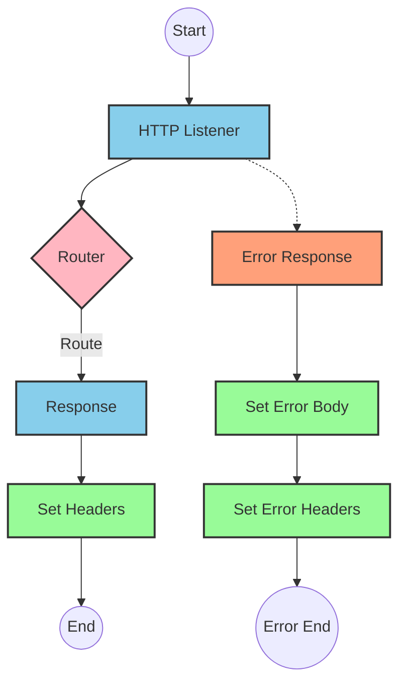
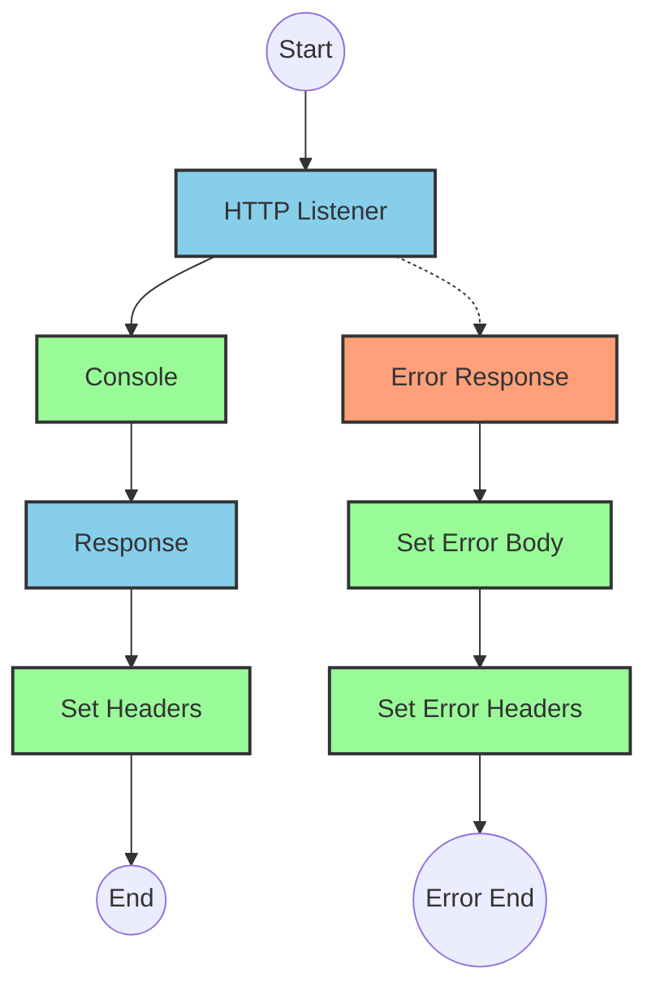
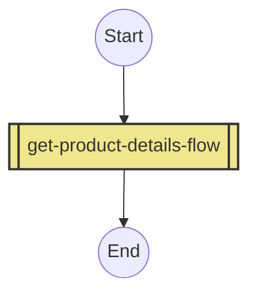
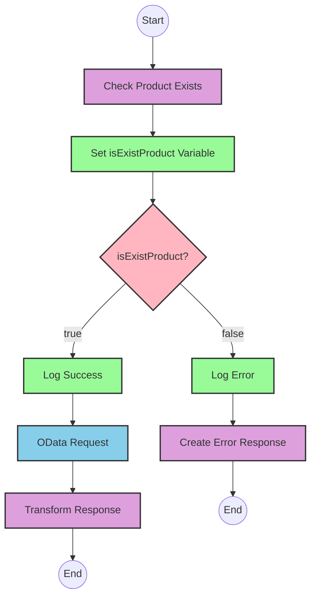

# API Overview
- This API provides product details from an SAP HANA database
- Base URL pattern: `/products`

# Endpoints

## GET /products
- **Purpose**: Retrieves product details based on a product identifier
- **Query Parameters**:
  - `productIdentifier` (required): The unique identifier for the product
- **Response Format**: JSON
- **Status Codes**:
  - 200: Success
  - 400: Bad Request
  - 404: Product Not Found
- **Response Body**:
  - Success: Product details including ProductId, Category, CategoryName, etc.
  - Error: JSON object with status, message, and errorCode

# Current MuleSoft Flow Logic

## Flow: products-main
This is the main entry point for the API that handles HTTP requests.
1. **Trigger**: HTTP listener
2. **Processing**: Routes requests to appropriate handlers
3. **Response**: Returns HTTP response with appropriate headers
4. **Error Handling**: Provides error responses with appropriate status codes

## Flow: products-console
This flow appears to be a console logging version of the main flow.
1. **Trigger**: HTTP listener
2. **Processing**: Logs information to the console
3. **Response**: Returns HTTP response with appropriate headers
4. **Error Handling**: Provides error responses with appropriate status codes

## Flow: get:\products:products-config
This flow handles GET requests to the /products endpoint.
1. **Trigger**: HTTP GET request to /products
2. **Processing**: References the get-product-details-flow subflow

## Subflow: get-product-details-flow
This subflow retrieves product details from SAP HANA.
1. **Validation**: Checks if the provided productIdentifier is valid
2. **Processing**:
   - If valid: Makes an HTTP request to the SAP HANA OData service
   - If invalid: Returns an error response
3. **Data Transformation**: Transforms the response to the required format
4. **Error Handling**: Logs errors and returns appropriate error messages

The flow uses these key technical components:
- Validates product identifier against a configurable list of valid identifiers
- Makes an OData request with specific query parameters:
  - `$filter`: `ProductId eq '" ++ (attributes.queryParams.productIdentifier default '') ++ "'`
  - `$select`: `ProductId,Category,CategoryName,CurrencyCode,DimensionDepth,DimensionHeight,DimensionUnit,DimensionWidth,LongDescription,Name,PictureUrl,Price,QuantityUnit,ShortDescription,SupplierId,Weight,WeightUnit`

# DataWeave Transformations Explained

## Product Identifier Validation Transformation
This transformation checks if the provided product identifier exists in a predefined list of valid product identifiers.

```dw
%dw 2.0
output application/java
var productidentifer=p('odata.productIdentifiers') splitBy(",")
---
sizeOf(productidentifer filter ($ == attributes.queryParams.productIdentifier))>0
```

- **Input**: The product identifier from query parameters
- **Output**: A boolean value indicating if the product identifier is valid
- **Key Operations**:
  - Retrieves a comma-separated list of valid product identifiers from a property
  - Splits the list into an array using `splitBy(",")`
  - Filters the array to find matches with the provided product identifier
  - Uses `sizeOf()` to check if any matches were found (returns true if > 0)

## OData Query Parameters Transformation
This transformation constructs the OData query parameters for the HTTP request to SAP HANA.

```dw
output application/java
---
{
	"$filter" : "ProductId eq '" ++ (attributes.queryParams.productIdentifier default '') ++ "'",
	"$select" : "ProductId,Category,CategoryName,CurrencyCode,DimensionDepth,DimensionHeight,DimensionUnit,DimensionWidth,LongDescription,Name,PictureUrl,Price,QuantityUnit,ShortDescription,SupplierId,Weight,WeightUnit"
}
```

- **Input**: The product identifier from query parameters
- **Output**: A Java map containing OData query parameters
- **Key Operations**:
  - Constructs a `$filter` parameter to filter by ProductId
  - Includes a `$select` parameter to specify which fields to retrieve
  - Uses string concatenation (`++`) to include the product identifier in the filter

## Response Payload Transformation (Success)
This transformation passes through the payload from the HTTP response.

```dw
%dw 2.0
output application/json
---
payload
```

- **Input**: The HTTP response payload from SAP HANA
- **Output**: The same payload converted to JSON format
- **Key Operations**: Simple pass-through transformation

## Error Response Transformation
This transformation creates an error response when the product identifier is invalid.

```dw
%dw 2.0
output application/json
---
{
	status: "error",
	message: "The product identifier " ++ attributes.queryParams.productIdentifier ++ " was not found.",
	errorCode: "PRODUCT_NOT_FOUND"
}
```

- **Input**: The product identifier from query parameters
- **Output**: A JSON error object
- **Key Operations**:
  - Creates a structured error response with status, message, and errorCode
  - Uses string concatenation (`++`) to include the product identifier in the error message

# SAP Integration Suite Implementation

## Component Mapping

| MuleSoft Component | SAP Integration Suite Equivalent | Notes |
|--------------------|----------------------------------|-------|
| HTTP Listener | HTTPS Adapter (Receiver) | Configure with the same path and method |
| Router | Content Modifier + Router | Use a Content Modifier to set properties and a Router for conditional logic |
| Flow Reference | Process Call | References another integration flow |
| Transform | Message Mapping | Maps data between different formats |
| Logger | Write to Log | Logs messages to the integration flow log |
| HTTP Request | OData Adapter (Sender) | Configure to connect to SAP HANA OData service |
| Set Variable | Content Modifier | Sets properties/headers in the message |
| Choice/When/Otherwise | Router | Implements conditional logic |
| Set Payload | Content Modifier | Sets the message body |
| Error Handler | Exception Subprocess | Handles errors in the integration flow |

## Integration Flow Visualization









## Configuration Details

### HTTP Listener Configuration
- **Component**: HTTPS Adapter (Receiver)
- **Parameters**:
  - Address: `/products`
  - Authentication: None (or as required)
  - CSRF Protection: As required

### OData Request Configuration
- **Component**: OData Adapter (Sender)
- **Parameters**:
  - Service URL: [SAP HANA OData service URL]
  - Authentication: As required for SAP HANA
  - Query Parameters:
    - $filter: `ProductId eq '{productIdentifier}'`
    - $select: `ProductId,Category,CategoryName,CurrencyCode,DimensionDepth,DimensionHeight,DimensionUnit,DimensionWidth,LongDescription,Name,PictureUrl,Price,QuantityUnit,ShortDescription,SupplierId,Weight,WeightUnit`

### Message Mapping (Product Identifier Validation)
- **Component**: Message Mapping
- **Parameters**:
  - Source: HTTP Request
  - Target: Property
  - Mapping: Extract productIdentifier from query parameters and check against configured list

### Router (Product Identifier Check)
- **Component**: Router
- **Parameters**:
  - Condition: `${property.isExistProduct}`
  - Default Route: Error path

### Content Modifier (Error Response)
- **Component**: Content Modifier
- **Parameters**:
  - Body: JSON error response with status, message, and errorCode
  - Headers: Content-Type: application/json

# Configuration

## Important Configuration Parameters
- `odata.productIdentifiers`: Comma-separated list of valid product identifiers

## Environment Variables
- SAP HANA connection details
- API base URL

## Dependencies on External Systems
- SAP HANA OData service for product data

## Security Settings
- HTTP Listener configuration for authentication
- SAP HANA connection authentication
- Error handling for security-related issues