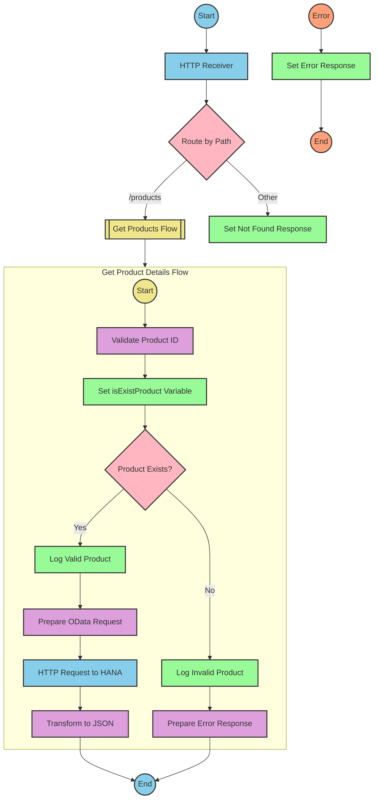

# SAP Integration Suite Implementation for Product API

# Table of Contents
- [API Overview](#api-overview)
- [Endpoints](#endpoints)
- [Current MuleSoft Flow Logic](#current-mulesoft-flow-logic)
- [DataWeave Transformations Explained](#dataweave-transformations-explained)
- [SAP Integration Suite Implementation](#sap-integration-suite-implementation)
  - [Component Mapping](#component-mapping)
  - [Integration Flow Visualization](#integration-flow-visualization)
- [Configuration Details](#configuration-details)
- [Configuration](#configuration)

# API Overview
This API provides access to product information from an SAP HANA backend system. It allows clients to retrieve product details by specifying a product identifier as a query parameter. The API validates the product identifier against a configured list of valid identifiers before retrieving the data from the backend system.

**Base URL**: `http://localhost:8081/api/v1`

# Endpoints

## GET /products
**Purpose**: Retrieves product details based on the provided product identifier.

**Request Parameters**:
- **Query Parameters**:
  - `productIdentifier` (required): The unique identifier of the product to retrieve

**Response Format**:
- **200 OK**: Successfully retrieved product details
  - Content-Type: application/json
  - Body: JSON object containing product details
- **400 Bad Request**: Invalid request format
- **404 Not Found**: Product identifier not found
- **500 Internal Server Error**: Server-side error

**Example Response (200 OK)**:
```json
{
  "ProductId": "HT-2000",
  "Category": "Notebooks",
  "CategoryName": "Notebooks",
  "CurrencyCode": "USD",
  "DimensionDepth": 30,
  "DimensionHeight": 3,
  "DimensionUnit": "cm",
  "DimensionWidth": 18,
  "LongDescription": "Notebook Basic 15 with 2,80 GHz quad core, 15\" LCD, 4 GB DDR3 RAM, 500 GB Hard Disc, Windows 8 Pro",
  "Name": "Notebook Basic 15",
  "PictureUrl": "/sap/public/bc/NWDEMO_MODEL/IMAGES/HT-2000.jpg",
  "Price": 956,
  "QuantityUnit": "EA",
  "ShortDescription": "Notebook Basic 15 with 2,80 GHz quad core, 15\" LCD, 4 GB DDR3 RAM, 500 GB Hard Disc, Windows 8 Pro",
  "SupplierId": "0100000046",
  "Weight": 4.2,
  "WeightUnit": "KG"
}
```

**Example Response (Error)**:
```json
{
  "status": "error",
  "message": "The product identifier HT-3000 was not found.",
  "errorCode": "PRODUCT_NOT_FOUND"
}
```

# Current MuleSoft Flow Logic

## products-main Flow
**Trigger**: HTTP listener configured to listen on `/api/v1/*`
**Purpose**: Main entry point for the API that handles routing to appropriate endpoints

1. Starts with an HTTP listener component
2. Sets up response headers
3. Includes error response handling
4. Routes requests to appropriate flows based on the API specification

## products-console Flow
**Trigger**: HTTP listener
**Purpose**: Provides console logging for API requests

1. Starts with an HTTP listener component
2. Sets up response headers
3. Includes error response handling
4. Logs request details to the console

## get:\products:products-config Flow
**Trigger**: HTTP GET request to `/products` endpoint
**Purpose**: Handles GET requests to the products endpoint

1. References the `get-product-details-flow` subflow to process the request

## get-product-details-flow Subflow
**Purpose**: Validates the product identifier and retrieves product details from the backend system

1. **Validate Product Identifier**:
   - Transforms the request to check if the provided product identifier exists in the configured list
   ```
   %dw 2.0
   output application/java
   var productidentifer=p('odata.productIdentifiers') splitBy(",")
   ---
   sizeOf(productidentifer filter ($ == attributes.queryParams.productIdentifier))>0
   ```
   - Sets a variable `isExistProduct` with the result of the validation

2. **Process Valid Product Identifier**:
   - If `isExistProduct` is true:
     - Logs a message: "The request is processed and sent downstream with the product identifier (#[attributes.queryParams.productIdentifier])."
     - Sends an HTTP request to the backend system with the following query parameters:
     ```
     #[output application/java
     ---
     {
         "$filter" : "ProductId eq '" ++ (attributes.queryParams.productIdentifier default '') ++ "'",
         "$select" : "ProductId,Category,CategoryName,CurrencyCode,DimensionDepth,DimensionHeight,DimensionUnit,DimensionWidth,LongDescription,Name,PictureUrl,Price,QuantityUnit,ShortDescription,SupplierId,Weight,WeightUnit"
     }]
     ```
     - Transforms the response to JSON format:
     ```
     %dw 2.0
     output application/json
     ---
     payload
     ```

3. **Handle Invalid Product Identifier**:
   - If `isExistProduct` is false:
     - Logs a message: "The product identifier (#[attributes.queryParams.productIdentifier]) was not passed in the request or was passed incorrectly."
     - Transforms the response to an error message:
     ```
     %dw 2.0
     output application/json
     ---
     {
         status: "error",
         message: "The product identifier " ++ attributes.queryParams.productIdentifier ++ " was not found.",
         errorCode: "PRODUCT_NOT_FOUND"
     }
     ```

# DataWeave Transformations Explained

## Product Identifier Validation Transformation
```
%dw 2.0
output application/java
var productidentifer=p('odata.productIdentifiers') splitBy(",")
---
sizeOf(productidentifer filter ($ == attributes.queryParams.productIdentifier))>0
```

**Explanation**:
1. This transformation validates if the provided product identifier exists in the configured list of valid identifiers.
2. **Input**: The query parameter `productIdentifier` from the HTTP request.
3. **Output**: A boolean value indicating whether the product identifier is valid.
4. **Key Operations**:
   - Retrieves the configured list of product identifiers from the property `odata.productIdentifiers`
   - Splits the comma-separated list into an array using `splitBy(",")`
   - Filters the array to find elements matching the provided product identifier
   - Returns true if at least one match is found (size > 0)

## OData Query Parameters Transformation
```
#[output application/java
---
{
    "$filter" : "ProductId eq '" ++ (attributes.queryParams.productIdentifier default '') ++ "'",
    "$select" : "ProductId,Category,CategoryName,CurrencyCode,DimensionDepth,DimensionHeight,DimensionUnit,DimensionWidth,LongDescription,Name,PictureUrl,Price,QuantityUnit,ShortDescription,SupplierId,Weight,WeightUnit"
}]
```

**Explanation**:
1. This transformation constructs the OData query parameters for the backend request.
2. **Input**: The query parameter `productIdentifier` from the HTTP request.
3. **Output**: A Java map containing OData query parameters.
4. **Key Operations**:
   - Constructs a `$filter` parameter to filter products by the provided product identifier
   - Specifies a `$select` parameter to select specific fields from the product data
   - Uses string concatenation (`++`) to build the filter expression
   - Uses the `default ''` operator to handle cases where the product identifier is not provided

## Response Transformation
```
%dw 2.0
output application/json
---
payload
```

**Explanation**:
1. This transformation converts the response from the backend system to JSON format.
2. **Input**: The response payload from the backend system.
3. **Output**: The same payload in JSON format.
4. **Key Operations**: Simple pass-through transformation that ensures the output is in JSON format.

## Error Response Transformation
```
%dw 2.0
output application/json
---
{
    status: "error",
    message: "The product identifier " ++ attributes.queryParams.productIdentifier ++ " was not found.",
    errorCode: "PRODUCT_NOT_FOUND"
}
```

**Explanation**:
1. This transformation constructs an error response when the product identifier is invalid.
2. **Input**: The query parameter `productIdentifier` from the HTTP request.
3. **Output**: A JSON object containing error details.
4. **Key Operations**:
   - Constructs a JSON object with status, message, and errorCode fields
   - Uses string concatenation (`++`) to include the product identifier in the error message

# SAP Integration Suite Implementation

## Component Mapping

| MuleSoft Component | SAP Integration Suite Equivalent | Notes |
|--------------------|----------------------------------|-------|
| HTTP Listener | HTTPS Adapter (Receiver) | Configure with the same path and port settings |
| Router | Content Modifier + Router | Use a Content Modifier to set routing conditions and a Router to direct the flow |
| Flow Reference | Process Call | Use a Process Call to reference another integration flow |
| Transform (DataWeave) | Groovy Script or Message Mapping | Convert DataWeave scripts to equivalent Groovy scripts or Message Mappings |
| Logger | Write to Message Headers | Use a Content Modifier to write log messages to message headers |
| HTTP Request | HTTPS Adapter (Sender) | Configure with the same URL and query parameters |
| Set Variable | Content Modifier | Use a Content Modifier to set process variables |
| Choice/When/Otherwise | Router | Use a Router with conditions equivalent to the Choice component |
| Error Handler | Exception Subprocess | Create an Exception Subprocess for error handling |

## REST API Integration Flow: GET /products



# Configuration Details

## HTTP Receiver Adapter
- **Name**: HTTP_Listener_config
- **Path**: `/api/v1/*`
- **Port**: 8081 (from dev.yaml)
- **Authentication**: None (based on source)

## HTTP Sender Adapter (HANA Connection)
- **Name**: Hana_HTTP_Request_Configuration
- **URL**: refapp-espm-ui-cf.cfapps.eu10.hana.ondemand.com (from dev.yaml)
- **Port**: 443 (from dev.yaml)
- **Path**: /espm-cloud-web/espm.svc/Products (from dev.yaml)
- **Authentication**: None (based on source)

## Content Modifiers
1. **Set isExistProduct Variable**
   - **Type**: Set Process Variable
   - **Name**: isExistProduct
   - **Value**: Result of product validation script

2. **Log Valid Product**
   - **Type**: Set Message Header
   - **Name**: logMessage
   - **Value**: "The request is processed and sent downstream with the product identifier (${property.productIdentifier})."

3. **Log Invalid Product**
   - **Type**: Set Message Header
   - **Name**: logMessage
   - **Value**: "The product identifier (${property.productIdentifier}) was not passed in the request or was passed incorrectly."

## Groovy Scripts (replacing DataWeave)
1. **Validate Product ID**
   ```groovy
   import com.sap.gateway.ip.core.customdev.util.Message;
   
   def Message processData(Message message) {
       def query = message.getProperty("SAP_MessageProcessingLogID");
       def productIdentifier = message.getProperty("productIdentifier");
       def validProducts = message.getProperty("odata.productIdentifiers").split(",");
       
       def isValid = false;
       for (product in validProducts) {
           if (product.trim() == productIdentifier) {
               isValid = true;
               break;
           }
       }
       
       message.setProperty("isExistProduct", isValid);
       return message;
   }
   ```

2. **Prepare OData Request**
   ```groovy
   import com.sap.gateway.ip.core.customdev.util.Message;
   
   def Message processData(Message message) {
       def productIdentifier = message.getProperty("productIdentifier") ?: "";
       
       def queryParams = [
           '$filter': "ProductId eq '" + productIdentifier + "'",
           '$select': "ProductId,Category,CategoryName,CurrencyCode,DimensionDepth,DimensionHeight,DimensionUnit,DimensionWidth,LongDescription,Name,PictureUrl,Price,QuantityUnit,ShortDescription,SupplierId,Weight,WeightUnit"
       ];
       
       message.setProperty("queryParams", queryParams);
       return message;
   }
   ```

3. **Prepare Error Response**
   ```groovy
   import com.sap.gateway.ip.core.customdev.util.Message;
   import groovy.json.JsonBuilder;
   
   def Message processData(Message message) {
       def productIdentifier = message.getProperty("productIdentifier");
       
       def errorResponse = [
           status: "error",
           message: "The product identifier " + productIdentifier + " was not found.",
           errorCode: "PRODUCT_NOT_FOUND"
       ];
       
       def jsonBuilder = new JsonBuilder(errorResponse);
       message.setBody(jsonBuilder.toString());
       message.setHeader("Content-Type", "application/json");
       
       return message;
   }
   ```

## Router Configurations
1. **Products Router**
   - **Condition 1**: ${header.CamelHttpPath} == '/products'
   - **Default Route**: Not Found Response

2. **Product Exists Router**
   - **Condition 1**: ${property.isExistProduct} == true
   - **Default Route**: Log Invalid Product

# Configuration

## Environment Variables
From the dev.yaml file, the following configuration parameters are needed:

```yaml
api:
  listener:
    port: "8081"
    path: /api/v1/*
    
hana:
  espm:
    url: refapp-espm-ui-cf.cfapps.eu10.hana.ondemand.com
    port: "443"
    path: /espm-cloud-web/espm.svc/Products
    
odata:
  productIdentifiers: "HT-2000,HT-2001"
```

## Dependencies on External Systems
1. **SAP HANA Backend**:
   - The integration depends on an SAP HANA backend system hosting the ESPM (Enterprise Sales and Procurement Model) service.
   - The service is accessed via OData protocol at the endpoint: `https://refapp-espm-ui-cf.cfapps.eu10.hana.ondemand.com:443/espm-cloud-web/espm.svc/Products`

## Security Settings
Based on the source documentation, there are no explicit security settings mentioned. However, for a production implementation, the following should be considered:

1. **HTTPS Communication**:
   - Configure TLS for all communication channels
   - Implement proper certificate management

2. **Authentication**:
   - Implement appropriate authentication mechanisms for both the API and backend connections
   - Consider OAuth, Basic Authentication, or client certificates based on requirements

3. **Authorization**:
   - Implement role-based access control if needed
   - Consider API rate limiting to prevent abuse