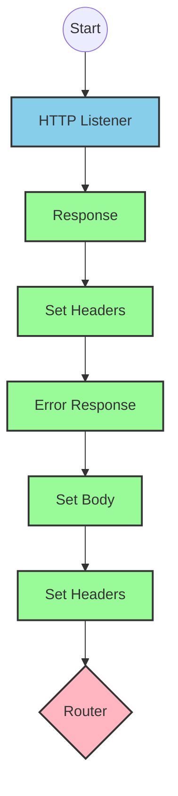
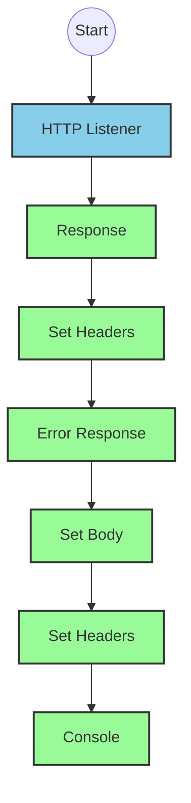
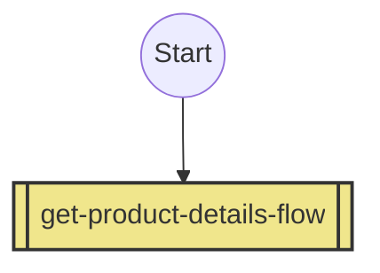
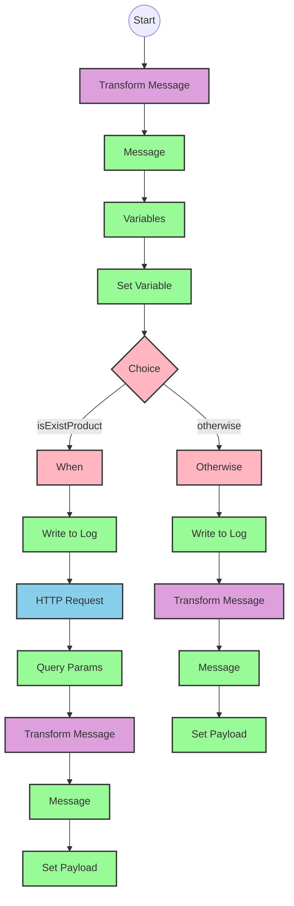

# API Overview
- This API provides product details from an SAP HANA database
- Base URL pattern: `/products`

# Endpoints

## GET /products
- **Purpose**: Retrieves product details based on a product identifier
- **Query Parameters**:
  - `productIdentifier` (required): The unique identifier for the product
- **Response Format**: JSON
- **Status Codes**:
  - 200: Success
  - 400: Bad Request
  - 404: Product Not Found
- **Response Body**:
  - Success: Product details including ProductId, Category, CategoryName, etc.
  - Error: JSON object with status, message, and errorCode

# Current MuleSoft Flow Logic

## Flow: products-main
This is the main entry point for the API. It:
1. Is triggered by an HTTP listener
2. Sets up response headers
3. Handles error responses
4. Routes requests to appropriate handlers

## Flow: products-console
This flow appears to be a console-based version of the API that:
1. Is triggered by an HTTP listener
2. Sets up response headers
3. Handles error responses
4. Outputs to console

## Flow: get:\products:products-config
This flow:
1. Is triggered when a GET request is made to the `/products` endpoint
2. References the `get-product-details-flow` subflow to process the request

## Subflow: get-product-details-flow
This subflow:
1. Validates if the provided product identifier is valid
2. If valid:
   - Logs the request
   - Makes an OData query to retrieve product details
   - Returns the product information
3. If invalid:
   - Logs an error
   - Returns an error response

The flow uses a DataWeave transformation to check if the product identifier is valid:
```
%dw 2.0
output application/java
var productidentifer=p('odata.productIdentifiers') splitBy(",")
---
sizeOf(productidentifer filter ($ == attributes.queryParams.productIdentifier))>0
```

When making the OData request, it uses these exact query parameters:
```
#[output application/java
---
{
	"$filter" : "ProductId eq '" ++ (attributes.queryParams.productIdentifier default '') ++ "'",
	"$select" : "ProductId,Category,CategoryName,CurrencyCode,DimensionDepth,DimensionHeight,DimensionUnit,DimensionWidth,LongDescription,Name,PictureUrl,Price,QuantityUnit,ShortDescription,SupplierId,Weight,WeightUnit"
}]
```

# DataWeave Transformations Explained

## Transformation 1: Product Identifier Validation
This transformation checks if the provided product identifier is in the list of valid product identifiers:

```
%dw 2.0
output application/java
var productidentifer=p('odata.productIdentifiers') splitBy(",")
---
sizeOf(productidentifer filter ($ == attributes.queryParams.productIdentifier))>0
```

- **Purpose**: Validates if the product identifier is in the allowed list
- **Input**: Query parameter `productIdentifier` from the request
- **Output**: Boolean value (true if valid, false if invalid)
- **Key Operations**:
  - Retrieves a comma-separated list of valid product identifiers from a property
  - Splits the list into an array
  - Filters the array to find matches with the provided identifier
  - Returns true if at least one match is found (size > 0)

## Transformation 2: OData Query Parameters
This transformation constructs the OData query parameters for the HTTP request:

```
#[output application/java
---
{
	"$filter" : "ProductId eq '" ++ (attributes.queryParams.productIdentifier default '') ++ "'",
	"$select" : "ProductId,Category,CategoryName,CurrencyCode,DimensionDepth,DimensionHeight,DimensionUnit,DimensionWidth,LongDescription,Name,PictureUrl,Price,QuantityUnit,ShortDescription,SupplierId,Weight,WeightUnit"
}]
```

- **Purpose**: Constructs OData query parameters for filtering and selecting specific fields
- **Input**: Product identifier from query parameters
- **Output**: Java map with OData query parameters
- **Key Operations**:
  - Creates a filter condition to match the exact product ID
  - Specifies the fields to be returned in the response

## Transformation 3: Pass-through Transformation
This transformation simply passes the payload through:

```
%dw 2.0
output application/json
---
payload
```

- **Purpose**: Converts the response payload to JSON format
- **Input**: Response from the OData request
- **Output**: Same data in JSON format

## Transformation 4: Error Response
This transformation creates an error response when the product identifier is invalid:

```
%dw 2.0
output application/json
---
{
	status: "error",
	message: "The product identifier " ++ attributes.queryParams.productIdentifier ++ " was not found.",
	errorCode: "PRODUCT_NOT_FOUND"
}
```

- **Purpose**: Generates a standardized error response
- **Input**: Query parameter `productIdentifier` from the request
- **Output**: JSON error object with status, message, and error code
- **Key Operations**:
  - Constructs a descriptive error message including the invalid product identifier

# SAP Integration Suite Implementation

## Component Mapping

| MuleSoft Component | SAP Integration Suite Equivalent |
|--------------------|----------------------------------|
| HTTP Listener | HTTPS Adapter (Server) |
| HTTP Request | HTTPS Adapter (Client) |
| Router | Router |
| Flow Reference | Process Call |
| Choice | Router (Content-Based) |
| Logger | Write to Log |
| Set Variable | Content Modifier (Set Property) |
| Transform Message | Message Mapping |
| Set Payload | Content Modifier (Set Body) |
| Error Handler | Exception Subprocess |

## Integration Flow Visualization









## Configuration Details

### HTTP Listener Configuration
- Component: HTTPS Adapter (Server)
- Parameters:
  - Name: HTTP_Listener_config
  - Port: [To be configured]
  - Host: [To be configured]
  - Path: /products

### HTTP Request Configuration
- Component: HTTPS Adapter (Client)
- Parameters:
  - Name: Hana_HTTP_Request_Configuration
  - URL: [SAP HANA OData service URL to be configured]
  - Method: GET
  - Authentication: [To be configured based on SAP HANA requirements]

### Router Configuration
- Component: Router
- Parameters:
  - Routes: Based on API endpoints defined in products.raml

### Content Modifier (Set Variable)
- Component: Content Modifier
- Parameters:
  - Property Name: isExistProduct
  - Property Value: [Result of DataWeave transformation]

### Message Mapping (Transform)
- Component: Message Mapping
- Parameters:
  - Source Format: [Input format]
  - Target Format: [Output format]
  - Mapping: [DataWeave transformation logic]

### Content-Based Router (Choice)
- Component: Router
- Parameters:
  - Condition: ${property.isExistProduct}
  - Routes:
    - True: Process valid product request
    - False: Return error response

### Write to Log (Logger)
- Component: Write to Log
- Parameters:
  - Log Level: INFO
  - Message: [Log message as defined in MuleSoft flow]

# Configuration

## Important Configuration Parameters
- `odata.productIdentifiers`: Comma-separated list of valid product identifiers

## Error Handling
The application implements several error handling strategies:
- APIKIT:BAD_REQUEST
- APIKIT:NOT_FOUND
- APIKIT:METHOD_NOT_ALLOWED
- APIKIT:NOT_ACCEPTABLE
- APIKIT:UNSUPPORTED_MEDIA_TYPE
- APIKIT:NOT_IMPLEMENTED

These would need to be implemented as Exception Subprocesses in SAP Integration Suite.

## Security Settings
- Authentication requirements for the SAP HANA connection would need to be configured
- API security settings would need to be defined based on the requirements