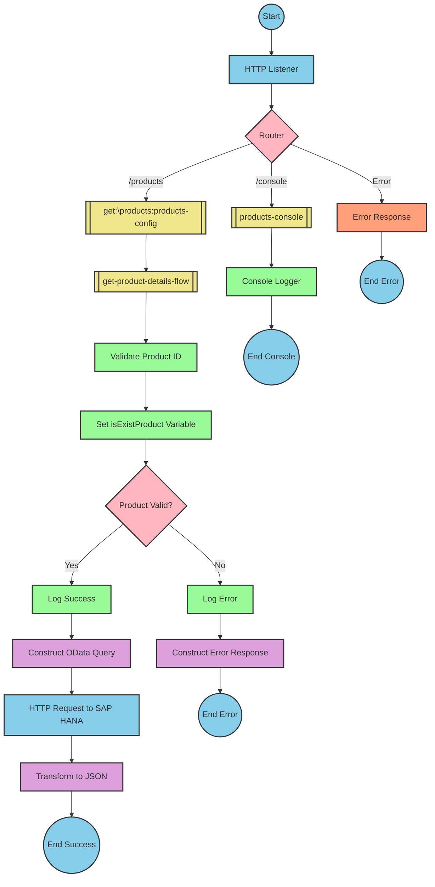

# Table of Contents
- [Table of Contents](#table-of-contents)
- [API Overview](#api-overview)
- [Endpoints](#endpoints)
- [Current MuleSoft Flow Logic](#current-mulesoft-flow-logic)
  - [products-main Flow](#products-main-flow)
  - [products-console Flow](#products-console-flow)
  - [get:\\products:products-config Flow](#getproductsproducts-config-flow)
  - [get-product-details-flow Subflow](#get-product-details-flow-subflow)
- [DataWeave Transformations Explained](#dataweave-transformations-explained)
  - [isExistProduct Transformation](#isexistproduct-transformation)
  - [OData Query Parameters Transformation](#odata-query-parameters-transformation)
  - [Payload Pass-through Transformation](#payload-pass-through-transformation)
  - [Error Response Transformation](#error-response-transformation)
- [SAP Integration Suite Implementation](#sap-integration-suite-implementation)
  - [Component Mapping](#component-mapping)
  - [Integration Flow Visualization](#integration-flow-visualization)
- [Configuration Details](#configuration-details)
- [Configuration](#configuration)
  - [Environment Variables](#environment-variables)
  - [External System Dependencies](#external-system-dependencies)

# API Overview
The Product API is a RESTful service that retrieves product details from an SAP HANA backend system. It allows clients to query product information by providing a product identifier. The API validates the product identifier against a configured list of valid identifiers before retrieving the product details from the backend system.

**Base URL:** `http://localhost:8081/api/v1`

# Endpoints

## GET /products
**Purpose:** Retrieves product details based on the provided product identifier.

**Request Parameters:**
- **Query Parameters:**
  - `productIdentifier` (required): The unique identifier of the product to retrieve.

**Response Format:**
- **200 OK**: Successfully retrieved product details
  - Content-Type: application/json
  - Body: Product details in JSON format
- **400 Bad Request**: Invalid request format
- **404 Not Found**: Product identifier not found or invalid
- **500 Internal Server Error**: Server-side error

**Example Request:**
```
GET /api/v1/products?productIdentifier=HT-2000
```

**Example Response (200 OK):**
```json
{
  "ProductId": "HT-2000",
  "Category": "Notebooks",
  "CategoryName": "Notebooks",
  "CurrencyCode": "USD",
  "DimensionDepth": 30,
  "DimensionHeight": 3,
  "DimensionUnit": "cm",
  "DimensionWidth": 40,
  "LongDescription": "Notebook Basic 17 with 2,80 GHz quad core, 17\" LCD, 4 GB DDR3 RAM, 500 GB Hard Disc, Windows 8 Pro",
  "Name": "Notebook Basic 17",
  "PictureUrl": "/sap/public/bc/NWDEMO_MODEL/IMAGES/HT-2000.jpg",
  "Price": 1249,
  "QuantityUnit": "EA",
  "ShortDescription": "Notebook Basic 17 with 2,80 GHz quad core, 17\" LCD, 4 GB DDR3 RAM, 500 GB Hard Disc",
  "SupplierId": "0100000046",
  "Weight": 4.2,
  "WeightUnit": "KG"
}
```

**Example Error Response (404 Not Found):**
```json
{
  "status": "error",
  "message": "The product identifier HT-9999 was not found.",
  "errorCode": "PRODUCT_NOT_FOUND"
}
```

# Current MuleSoft Flow Logic

## products-main Flow
**Trigger:** HTTP request to the API endpoint.

**Processing Steps:**
1. Receives an HTTP request through the listener component
2. Sets response headers
3. Routes the request to the appropriate handler based on the endpoint path
4. Handles errors and formats error responses

**Expected Outcomes:**
- Successful routing of the request to the appropriate handler
- Proper error handling and response formatting

## products-console Flow
**Trigger:** HTTP request to the console endpoint.

**Processing Steps:**
1. Receives an HTTP request through the listener component
2. Sets response headers
3. Logs the request to the console
4. Handles errors and formats error responses

**Expected Outcomes:**
- Logging of request details to the console
- Proper error handling and response formatting

## get:\\products:products-config Flow
**Trigger:** HTTP GET request to the `/products` endpoint.

**Processing Steps:**
1. Receives the GET request for products
2. Calls the `get-product-details-flow` subflow to process the request

**Expected Outcomes:**
- Delegation of request processing to the product details subflow
- Return of product details or appropriate error response

## get-product-details-flow Subflow
**Trigger:** Called by the `get:\products:products-config` flow.

**Processing Steps:**
1. Validates the product identifier against a configured list of valid identifiers
2. Sets a variable `isExistProduct` to indicate if the product identifier is valid
3. Logs the request processing status
4. If the product identifier is valid:
   - Constructs an OData query with specific filter and select parameters
   - Sends a request to the SAP HANA backend to retrieve product details
   - Transforms the response to JSON format
5. If the product identifier is invalid:
   - Logs an error message
   - Returns an error response with appropriate status and message

**Data Transformations:**
1. Validates product identifier against configured list:
   ```
   %dw 2.0
   output application/java
   var productidentifer=p('odata.productIdentifiers') splitBy(",")
   ---
   sizeOf(productidentifer filter ($ == attributes.queryParams.productIdentifier))>0
   ```

2. Constructs OData query parameters:
   ```
   #[output application/java
   ---
   {
     "$filter" : "ProductId eq '" ++ (attributes.queryParams.productIdentifier default '') ++ "'",
     "$select" : "ProductId,Category,CategoryName,CurrencyCode,DimensionDepth,DimensionHeight,DimensionUnit,DimensionWidth,LongDescription,Name,PictureUrl,Price,QuantityUnit,ShortDescription,SupplierId,Weight,WeightUnit"
   }]
   ```

3. Transforms payload to JSON:
   ```
   %dw 2.0
   output application/json
   ---
   payload
   ```

4. Constructs error response:
   ```
   %dw 2.0
   output application/json
   ---
   {
     status: "error",
     message: "The product identifier " ++ attributes.queryParams.productIdentifier ++ " was not found.",
     errorCode: "PRODUCT_NOT_FOUND"
   }
   ```

**Expected Outcomes:**
- If product identifier is valid: Return product details in JSON format
- If product identifier is invalid: Return error response with appropriate message
- Proper logging of request processing status

# DataWeave Transformations Explained

## isExistProduct Transformation
**Purpose:** Validates if the provided product identifier exists in the configured list of valid product identifiers.

**Input:** 
- Query parameter `productIdentifier` from the HTTP request
- Configuration property `odata.productIdentifiers` containing a comma-separated list of valid product identifiers

**Output:** Boolean value indicating if the product identifier is valid (true) or invalid (false)

**Logic:**
1. Splits the comma-separated list of valid product identifiers into an array
2. Filters the array to find elements matching the provided product identifier
3. Checks if the size of the filtered array is greater than 0 (indicating a match was found)

**Original DataWeave Code:**
```
%dw 2.0
output application/java
var productidentifer=p('odata.productIdentifiers') splitBy(",")
---
sizeOf(productidentifer filter ($ == attributes.queryParams.productIdentifier))>0
```

## OData Query Parameters Transformation
**Purpose:** Constructs OData query parameters for filtering and selecting specific product fields.

**Input:** Product identifier from query parameters

**Output:** OData query parameters object with $filter and $select parameters

**Logic:**
1. Creates a $filter parameter to filter products by the provided product identifier
2. Creates a $select parameter to specify which product fields to retrieve

**Original DataWeave Code:**
```
#[output application/java
---
{
  "$filter" : "ProductId eq '" ++ (attributes.queryParams.productIdentifier default '') ++ "'",
  "$select" : "ProductId,Category,CategoryName,CurrencyCode,DimensionDepth,DimensionHeight,DimensionUnit,DimensionWidth,LongDescription,Name,PictureUrl,Price,QuantityUnit,ShortDescription,SupplierId,Weight,WeightUnit"
}]
```

## Payload Pass-through Transformation
**Purpose:** Transforms the payload to JSON format without modifying its structure.

**Input:** Response payload from the SAP HANA backend

**Output:** Same payload in JSON format

**Logic:** Simple pass-through transformation that converts the payload to JSON format

**Original DataWeave Code:**
```
%dw 2.0
output application/json
---
payload
```

## Error Response Transformation
**Purpose:** Constructs an error response when the product identifier is invalid.

**Input:** Product identifier from query parameters

**Output:** JSON error response with status, message, and error code

**Logic:** Creates a structured error response with a dynamic message that includes the invalid product identifier

**Original DataWeave Code:**
```
%dw 2.0
output application/json
---
{
  status: "error",
  message: "The product identifier " ++ attributes.queryParams.productIdentifier ++ " was not found.",
  errorCode: "PRODUCT_NOT_FOUND"
}
```

# SAP Integration Suite Implementation

## Component Mapping

| MuleSoft Component | SAP Integration Suite Equivalent | Notes |
|--------------------|----------------------------------|-------|
| HTTP Listener | REST Adapter (Receiver) | Configure with the same path and port settings |
| Router | Content Modifier with Router | Use a Router step to direct flow based on conditions |
| Flow Reference | Process Call | Call to another integration flow |
| Logger | Write to Message Log | Configure with the same log message |
| Transform (DataWeave) | Content Modifier or Message Mapping | Use Content Modifier for simple transformations and Message Mapping for complex ones |
| Set Variable | Content Modifier | Set properties in the message header |
| Choice/When/Otherwise | Router | Configure with the same conditions |
| HTTP Request | REST Adapter (Sender) | Configure with the same endpoint and query parameters |
| Set Payload | Content Modifier | Set the message body |
| Error Handler | Exception Subprocess | Configure with the same error handling logic |

## Integration Flow Visualization

### REST API Integration Flow: GET /products



# Configuration Details

## HTTP Listener Configuration
- **Component:** REST Adapter (Receiver)
- **Parameters:**
  - Port: 8081 (from environment variable `api.listener.port`)
  - Path: /api/v1/* (from environment variable `api.listener.path`)
  - Protocol: HTTP

## HTTP Request Configuration
- **Component:** REST Adapter (Sender)
- **Parameters:**
  - URL: refapp-espm-ui-cf.cfapps.eu10.hana.ondemand.com (from environment variable `hana.espm.url`)
  - Port: 443 (from environment variable `hana.espm.port`)
  - Path: /espm-cloud-web/espm.svc/Products (from environment variable `hana.espm.path`)
  - Protocol: HTTPS
  - Authentication: None (configuration decision needed)

## Router Configuration
- **Component:** Router
- **Conditions:**
  - When path is "/products": Route to get-product-details-flow
  - When path is "/console": Route to products-console
  - Default: Route to error response

## Content Modifier (Validate Product ID)
- **Component:** Content Modifier
- **Script:**
  ```javascript
  var productidentifer = context.getProperty("odata.productIdentifiers").split(",");
  var productId = message.getHeaders().get("queryParams").get("productIdentifier");
  var isValid = false;
  
  for (var i = 0; i < productidentifer.length; i++) {
    if (productidentifer[i] === productId) {
      isValid = true;
      break;
    }
  }
  
  context.setProperty("isExistProduct", isValid);
  ```

## Router (Product Valid?)
- **Component:** Router
- **Condition:** `${context.isExistProduct}`
- **Routes:**
  - True: Route to success path
  - False: Route to error path

## Message Mapping (Construct OData Query)
- **Component:** Content Modifier
- **Headers:**
  - $filter: `ProductId eq '${message.getHeaders().get("queryParams").get("productIdentifier") || ""}'`
  - $select: `ProductId,Category,CategoryName,CurrencyCode,DimensionDepth,DimensionHeight,DimensionUnit,DimensionWidth,LongDescription,Name,PictureUrl,Price,QuantityUnit,ShortDescription,SupplierId,Weight,WeightUnit`

## Message Mapping (Transform to JSON)
- **Component:** Message Mapping
- **Mapping:** Pass-through mapping that preserves the structure of the payload

## Message Mapping (Construct Error Response)
- **Component:** Content Modifier
- **Body:**
  ```json
  {
    "status": "error",
    "message": "The product identifier ${message.getHeaders().get("queryParams").get("productIdentifier")} was not found.",
    "errorCode": "PRODUCT_NOT_FOUND"
  }
  ```

## Write to Message Log (Log Success)
- **Component:** Write to Message Log
- **Message:** `The request is processed and sent downstream with the product identifier (${message.getHeaders().get("queryParams").get("productIdentifier")}).`
- **Log Level:** INFO

## Write to Message Log (Log Error)
- **Component:** Write to Message Log
- **Message:** `The product identifier (${message.getHeaders().get("queryParams").get("productIdentifier")}) was not passed in the request or was passed incorrectly.`
- **Log Level:** ERROR

# Configuration

## Environment Variables
The following environment variables are used in the integration:

```yaml
api:
  listener:
    port: "8081"
    path: /api/v1/*
    
hana:
  espm:
    url: refapp-espm-ui-cf.cfapps.eu10.hana.ondemand.com
    port: "443"
    path: /espm-cloud-web/espm.svc/Products
    
odata:
  productIdentifiers: "HT-2000,HT-2001"
```

## External System Dependencies
- **SAP HANA Cloud Platform**: The integration relies on an SAP HANA backend system to retrieve product details.
  - **Endpoint**: refapp-espm-ui-cf.cfapps.eu10.hana.ondemand.com:443
  - **Service Path**: /espm-cloud-web/espm.svc/Products
  - **Protocol**: HTTPS
  - **Authentication**: Not specified in the source documentation (configuration decision needed)