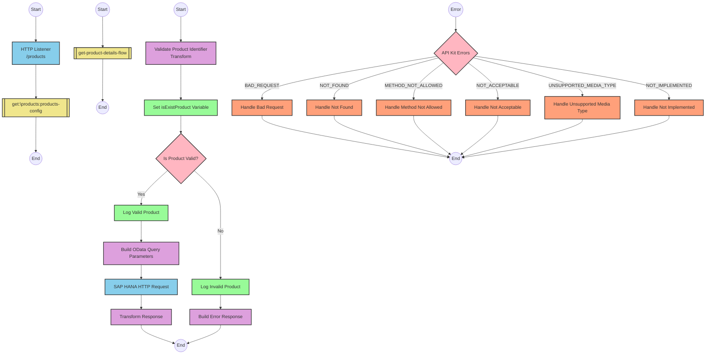

# SAP OData Product Information API Integration

## Table of Contents
- [API Overview](#api-overview)
- [Endpoints](#endpoints)
  - [GET /products](#get-products)
- [Current MuleSoft Flow Logic](#current-mulesoft-flow-logic)
  - [products-main Flow](#products-main-flow)
  - [products-console Flow](#products-console-flow)
  - [get:\products:products-config Flow](#getproductsproducts-config-flow)
  - [get-product-details-flow Subflow](#get-product-details-flow-subflow)
- [DataWeave Transformations Explained](#dataweave-transformations-explained)
  - [Product Identifier Validation](#product-identifier-validation)
  - [OData Query Parameters Construction](#odata-query-parameters-construction)
  - [Response Payload Transformation](#response-payload-transformation)
  - [Error Response Transformation](#error-response-transformation)
- [SAP Integration Suite Implementation](#sap-integration-suite-implementation)
  - [Component Mapping](#component-mapping)
  - [Integration Flow Visualization](#integration-flow-visualization)
  - [Configuration Details](#configuration-details)
- [Environment Configuration](#environment-configuration)
- [API Reference](#api-reference)

## API Overview
This API provides access to product information stored in an SAP HANA database through OData services. The integration retrieves detailed product information based on a product identifier provided as a query parameter. The API validates the product identifier against a configured list of valid identifiers before making the downstream request to the SAP HANA system.

- **Base URL**: Determined by the HTTP_Listener_config
- **Authentication**: Not explicitly defined in the source documentation
- **Rate Limiting**: Not specified in the source documentation
- **General Response Format**: JSON

## Endpoints

### GET /products
Retrieves detailed product information based on a product identifier.

- **HTTP Method**: GET
- **Path**: /products
- **Purpose**: Fetch product details from SAP HANA based on a product identifier

**Request Parameters**:
- **Query Parameters**:
  - `productIdentifier` (required): The unique identifier of the product to retrieve

**Response Format**:
- **Success Response (200 OK)**:
  - Content-Type: application/json
  - Body: Product details from SAP HANA

- **Error Response (400 Bad Request)**:
  - Content-Type: application/json
  - Body:
    ```json
    {
      "status": "error",
      "message": "The product identifier [productIdentifier] was not found.",
      "errorCode": "PRODUCT_NOT_FOUND"
    }
    ```

**Error Handling**:
- If the product identifier is not provided or is invalid, returns a 400 Bad Request with a PRODUCT_NOT_FOUND error
- APIKIT error handling for standard HTTP errors (400, 404, 405, 406, 415, 501)

## Current MuleSoft Flow Logic

### products-main Flow
1. **Trigger**: HTTP listener configured with products-config
2. **Processing**:
   - Sets response headers
   - Routes requests to appropriate handlers based on API specification
   - Includes error handling for API errors

### products-console Flow
1. **Trigger**: HTTP listener
2. **Processing**:
   - Sets response headers
   - Logs information to console
   - Includes error handling

### get:\products:products-config Flow
1. **Trigger**: GET request to /products endpoint
2. **Processing**:
   - References the get-product-details-flow subflow to handle the request

### get-product-details-flow Subflow
1. **Validation**:
   - Transforms the request to validate if the product identifier exists in the configured list
   - Sets a variable `isExistProduct` based on validation result
   
2. **Conditional Processing**:
   - If `isExistProduct` is true:
     - Logs that the request is being processed
     - Constructs OData query parameters for the downstream request
     - Makes a request to the SAP HANA system with specific OData parameters
     - Returns the response from SAP HANA
   - If `isExistProduct` is false:
     - Logs that the product identifier was not found or incorrect
     - Returns an error response with PRODUCT_NOT_FOUND error code

## DataWeave Transformations Explained

### Product Identifier Validation
This transformation checks if the provided product identifier exists in a configured list of valid identifiers.

**Input**: Query parameters from the HTTP request
**Output**: Boolean value indicating if the product identifier is valid

```dw
%dw 2.0
output application/java
var productidentifer=p('odata.productIdentifiers') splitBy(",")
---
sizeOf(productidentifer filter ($ == attributes.queryParams.productIdentifier))>0
```

**Explanation**:
1. Retrieves a comma-separated list of valid product identifiers from a property `odata.productIdentifiers`
2. Splits this string into an array using the `splitBy` function
3. Filters the array to find elements matching the provided product identifier
4. Checks if the size of the filtered array is greater than 0 (meaning a match was found)

### OData Query Parameters Construction
This transformation builds the OData query parameters for the downstream request to SAP HANA.

**Input**: HTTP request attributes
**Output**: OData query parameters as a Java map

```dw
#[output application/java
---
{
	"$filter" : "ProductId eq '" ++ (attributes.queryParams.productIdentifier default '') ++ "'",
	"$select" : "ProductId,Category,CategoryName,CurrencyCode,DimensionDepth,DimensionHeight,DimensionUnit,DimensionWidth,LongDescription,Name,PictureUrl,Price,QuantityUnit,ShortDescription,SupplierId,Weight,WeightUnit"
}]
```

**Explanation**:
1. Creates a map with two OData query parameters:
   - `$filter`: Constructs a filter expression to match the ProductId with the provided product identifier
   - `$select`: Specifies the fields to be returned in the response

### Response Payload Transformation
This transformation passes through the response from the SAP HANA system.

**Input**: Response from SAP HANA
**Output**: JSON response

```dw
%dw 2.0
output application/json
---
payload
```

**Explanation**:
- Simply outputs the payload as JSON without any transformation

### Error Response Transformation
This transformation creates an error response when the product identifier is invalid.

**Input**: HTTP request attributes
**Output**: JSON error response

```dw
%dw 2.0
output application/json
---
{
	status: "error",
	message: "The product identifier " ++ attributes.queryParams.productIdentifier ++ " was not found.",
	errorCode: "PRODUCT_NOT_FOUND"
}
```

**Explanation**:
- Creates a JSON object with error status, a message including the invalid product identifier, and an error code

## SAP Integration Suite Implementation

### Component Mapping

| MuleSoft Component | SAP Integration Suite Equivalent | Notes |
|--------------------|----------------------------------|-------|
| HTTP Listener | HTTPS Adapter (Receiver) | Configure with the same path and method |
| Flow Reference | Process Call | Used to reference other integration flows |
| DataWeave Transform | Content Modifier with Expression | For simple transformations |
| DataWeave Transform (complex) | Groovy Script or Message Mapping | For more complex transformations |
| Logger | Write to Log | Configure with the same log message |
| HTTP Request | HTTPS Adapter (Sender) | Configure with the same endpoint and parameters |
| Choice Router | Router | Configure with the same conditions |
| Set Variable | Content Modifier | Set properties or exchange properties |
| Error Handler | Exception Subprocess | Configure with the same error types |

### Integration Flow Visualization



### Configuration Details

#### HTTP Adapter (Receiver)
- **Address**: /products
- **Authentication**: To be determined based on security requirements
- **CSRF Protection**: Disabled (unless required)

#### Content Modifier for Product Validation
- **Type**: Expression
- **Expression Language**: Groovy
- **Expression**:
  ```groovy
  def productIdentifiers = properties.get("odata.productIdentifiers").split(",")
  def requestedProductId = message.getHeaders().get("productIdentifier")
  return productIdentifiers.find { it == requestedProductId } != null
  ```
- **Target**: Property "isExistProduct"

#### Router for Product Validation
- **Condition 1**: ${property.isExistProduct} == true
- **Condition 2**: ${property.isExistProduct} == false

#### HTTP Adapter (Sender) for SAP HANA
- **Address**: To be configured based on SAP HANA endpoint
- **Query Parameters**:
  - $filter: ProductId eq '${header.productIdentifier}'
  - $select: ProductId,Category,CategoryName,CurrencyCode,DimensionDepth,DimensionHeight,DimensionUnit,DimensionWidth,LongDescription,Name,PictureUrl,Price,QuantityUnit,ShortDescription,SupplierId,Weight,WeightUnit
- **Authentication**: To be determined based on SAP HANA requirements

#### Content Modifier for Error Response
- **Type**: Expression
- **Expression Language**: Groovy
- **Expression**:
  ```groovy
  import groovy.json.JsonBuilder
  
  def errorResponse = [
    status: "error",
    message: "The product identifier " + message.getHeaders().get("productIdentifier") + " was not found.",
    errorCode: "PRODUCT_NOT_FOUND"
  ]
  
  return new JsonBuilder(errorResponse).toString()
  ```
- **Target**: Body

## Environment Configuration

### Important Configuration Parameters
- **odata.productIdentifiers**: Comma-separated list of valid product identifiers

### Environment Variables
- **HTTP_LISTENER_PORT**: Port for the HTTP listener
- **HTTP_LISTENER_HOST**: Host for the HTTP listener
- **HANA_HTTP_BASE_URL**: Base URL for the SAP HANA HTTP requests
- **HANA_HTTP_TIMEOUT**: Timeout for SAP HANA HTTP requests (in milliseconds)

### Dependencies on External Systems
- **SAP HANA**: The integration depends on an SAP HANA system with OData services enabled
- **OData Service**: The integration requires an OData service that supports the $filter and $select query parameters

### Security Settings
- **Authentication**: Configuration for authentication to SAP HANA (not specified in source)
- **TLS/SSL**: Configuration for secure communication (not specified in source)

### Deployment Considerations
- Ensure network connectivity between the integration platform and SAP HANA
- Configure appropriate timeouts for HTTP requests
- Set up proper error handling and monitoring

## API Reference

### Complete List of Endpoints

#### GET /products
Retrieves product information based on a product identifier.

**Request**:
- **Method**: GET
- **Path**: /products
- **Query Parameters**:
  - `productIdentifier` (required): The unique identifier of the product to retrieve

**Response**:
- **Success (200 OK)**:
  ```json
  {
    "ProductId": "string",
    "Category": "string",
    "CategoryName": "string",
    "CurrencyCode": "string",
    "DimensionDepth": "number",
    "DimensionHeight": "number",
    "DimensionUnit": "string",
    "DimensionWidth": "number",
    "LongDescription": "string",
    "Name": "string",
    "PictureUrl": "string",
    "Price": "number",
    "QuantityUnit": "string",
    "ShortDescription": "string",
    "SupplierId": "string",
    "Weight": "number",
    "WeightUnit": "string"
  }
  ```

- **Error (400 Bad Request)**:
  ```json
  {
    "status": "error",
    "message": "The product identifier [productIdentifier] was not found.",
    "errorCode": "PRODUCT_NOT_FOUND"
  }
  ```

### Authentication Requirements
Authentication requirements are not explicitly defined in the source documentation.

### Error Codes
- **PRODUCT_NOT_FOUND**: The provided product identifier is not valid or not found
- **APIKIT:BAD_REQUEST**: The request is malformed
- **APIKIT:NOT_FOUND**: The requested resource was not found
- **APIKIT:METHOD_NOT_ALLOWED**: The HTTP method is not allowed for the requested resource
- **APIKIT:NOT_ACCEPTABLE**: The server cannot produce a response matching the list of acceptable values
- **APIKIT:UNSUPPORTED_MEDIA_TYPE**: The media type is not supported
- **APIKIT:NOT_IMPLEMENTED**: The requested functionality is not implemented

### Rate Limiting
Rate limiting information is not specified in the source documentation.

### Pagination
Pagination details are not applicable for this API.

### Versioning Information
Versioning information is not specified in the source documentation.