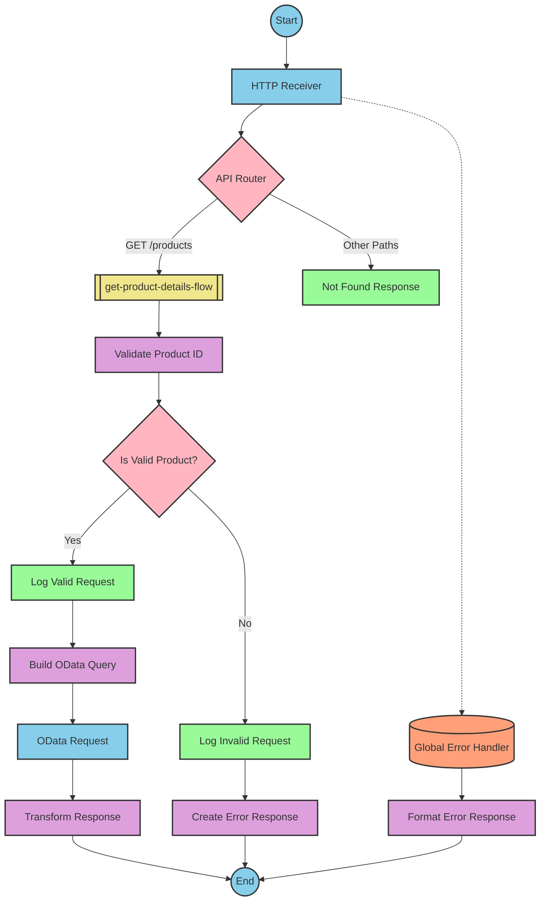

# SAP Integration Suite Documentation for Product API

# Table of Contents
- [API Overview](#api-overview)
- [Endpoints](#endpoints)
  - [GET /products](#get-products)
- [Current MuleSoft Flow Logic](#current-mulesoft-flow-logic)
  - [products-main Flow](#products-main-flow)
  - [products-console Flow](#products-console-flow)
  - [get:\products:products-config Flow](#getproductsproducts-config-flow)
  - [get-product-details-flow Subflow](#get-product-details-flow-subflow)
- [DataWeave Transformations Explained](#dataweave-transformations-explained)
  - [Product Identifier Validation](#product-identifier-validation)
  - [OData Query Parameters](#odata-query-parameters)
  - [Response Payload Transformation](#response-payload-transformation)
  - [Error Response Transformation](#error-response-transformation)
- [SAP Integration Suite Implementation](#sap-integration-suite-implementation)
  - [Component Mapping](#component-mapping)
  - [Integration Flow Visualization](#integration-flow-visualization)
- [Configuration Details](#configuration-details)
  - [HTTP Adapter Configuration](#http-adapter-configuration)
  - [OData Adapter Configuration](#odata-adapter-configuration)
  - [Content Modifier Configuration](#content-modifier-configuration)
  - [Router Configuration](#router-configuration)
- [Configuration](#configuration)
  - [Environment Variables](#environment-variables)
  - [External System Dependencies](#external-system-dependencies)

# API Overview

This API provides access to product information from an SAP HANA backend system. It allows clients to retrieve product details by specifying a product identifier as a query parameter. The API validates the product identifier against a configured list of valid identifiers before retrieving the data from the backend system.

**Base URL**: `/api/v1`

# Endpoints

## GET /products

This endpoint retrieves product details based on the provided product identifier.

**Query Parameters**:
- `productIdentifier` (required): The unique identifier of the product to retrieve

**Response Format**:
- Content-Type: `application/json`
- Status Codes:
  - 200: Success - Returns product details
  - 400: Bad Request - Invalid input parameters
  - 404: Not Found - Product identifier not found
  - 500: Internal Server Error - Server-side error

**Example Request**:
```
GET /api/v1/products?productIdentifier=HT-2000
```

**Example Response** (200 OK):
```json
{
  "ProductId": "HT-2000",
  "Category": "Notebooks",
  "CategoryName": "Notebooks",
  "CurrencyCode": "USD",
  "DimensionDepth": 30,
  "DimensionHeight": 3,
  "DimensionUnit": "cm",
  "DimensionWidth": 40,
  "LongDescription": "Notebook Basic 17 with 2,80 GHz quad core, 17\" LCD, 4 GB DDR3 RAM, 500 GB Hard Disc, Windows 8 Pro",
  "Name": "Notebook Basic 17",
  "PictureUrl": "/sap/public/bc/NWDEMO_MODEL/IMAGES/HT-2000.jpg",
  "Price": 1249,
  "QuantityUnit": "EA",
  "ShortDescription": "Notebook Basic 17 with 2,80 GHz quad core, 17\" LCD, 4 GB DDR3 RAM, 500 GB Hard Disc",
  "SupplierId": "0100000046",
  "Weight": 4.5,
  "WeightUnit": "KG"
}
```

**Example Error Response** (404 Not Found):
```json
{
  "status": "error",
  "message": "The product identifier HT-3000 was not found.",
  "errorCode": "PRODUCT_NOT_FOUND"
}
```

# Current MuleSoft Flow Logic

## products-main Flow

This is the main entry point for the API. It handles HTTP requests and routes them to the appropriate flow based on the API specification.

1. **Trigger**: HTTP listener configured to listen on `/api/v1/*`
2. **Processing Steps**:
   - Sets response headers
   - Routes the request based on the API specification
   - Handles errors and formats appropriate error responses

## products-console Flow

This flow is similar to the main flow but includes console logging for debugging purposes.

1. **Trigger**: HTTP listener (likely for development/testing)
2. **Processing Steps**:
   - Sets response headers
   - Logs request details to the console
   - Handles errors and formats appropriate error responses

## get:\products:products-config Flow

This flow handles the GET /products endpoint specifically.

1. **Trigger**: API request to GET /products
2. **Processing Steps**:
   - Calls the get-product-details-flow subflow to process the request

## get-product-details-flow Subflow

This subflow contains the core business logic for retrieving product details.

1. **Trigger**: Called from get:\products:products-config flow
2. **Processing Steps**:
   - Validates if the provided product identifier exists in the configured list
   - If valid, constructs an OData query to retrieve product details
   - If invalid, returns an error response
3. **Data Transformations**:
   - Transforms the input to validate the product identifier
   - Constructs OData query parameters
   - Transforms the response payload to JSON format
4. **Expected Outcomes**:
   - Success: Returns product details in JSON format
   - Error: Returns an error message with appropriate status code

The flow includes the following key technical components:

1. **Product Identifier Validation**:
```dw
%dw 2.0
output application/java
var productidentifer=p('odata.productIdentifiers') splitBy(",")
---
sizeOf(productidentifer filter ($ == attributes.queryParams.productIdentifier))>0
```

2. **OData Query Parameters**:
```
#[output application/java
---
{
	"$filter" : "ProductId eq '" ++ (attributes.queryParams.productIdentifier default '') ++ "'",
	"$select" : "ProductId,Category,CategoryName,CurrencyCode,DimensionDepth,DimensionHeight,DimensionUnit,DimensionWidth,LongDescription,Name,PictureUrl,Price,QuantityUnit,ShortDescription,SupplierId,Weight,WeightUnit"
}]
```

3. **Response Transformation**:
```dw
%dw 2.0
output application/json
---
payload
```

4. **Error Response Transformation**:
```dw
%dw 2.0
output application/json
---
{
	status: "error",
	message: "The product identifier " ++ attributes.queryParams.productIdentifier ++ " was not found.",
	errorCode: "PRODUCT_NOT_FOUND"
}
```

# DataWeave Transformations Explained

## Product Identifier Validation

This transformation validates whether the provided product identifier exists in the configured list of valid identifiers.

**Input**: Query parameter `productIdentifier` from the HTTP request
**Output**: Boolean value indicating if the product identifier is valid

**Logic**:
1. Retrieves the configured list of product identifiers from the properties file
2. Splits the comma-separated list into an array
3. Filters the array to find matches with the provided product identifier
4. Returns true if at least one match is found, false otherwise

```dw
%dw 2.0
output application/java
var productidentifer=p('odata.productIdentifiers') splitBy(",")
---
sizeOf(productidentifer filter ($ == attributes.queryParams.productIdentifier))>0
```

## OData Query Parameters

This transformation constructs the OData query parameters for retrieving product details from the backend system.

**Input**: Query parameter `productIdentifier` from the HTTP request
**Output**: OData query parameters as a Java map

**Logic**:
1. Constructs a `$filter` parameter to filter products by the provided product identifier
2. Specifies a `$select` parameter to retrieve specific fields from the product entity

```
#[output application/java
---
{
	"$filter" : "ProductId eq '" ++ (attributes.queryParams.productIdentifier default '') ++ "'",
	"$select" : "ProductId,Category,CategoryName,CurrencyCode,DimensionDepth,DimensionHeight,DimensionUnit,DimensionWidth,LongDescription,Name,PictureUrl,Price,QuantityUnit,ShortDescription,SupplierId,Weight,WeightUnit"
}]
```

## Response Payload Transformation

This transformation converts the response payload from the backend system to JSON format.

**Input**: Response payload from the OData request
**Output**: JSON representation of the product details

**Logic**:
Simply passes through the payload without modification, but ensures the output is in JSON format.

```dw
%dw 2.0
output application/json
---
payload
```

## Error Response Transformation

This transformation constructs an error response when the product identifier is not valid.

**Input**: Query parameter `productIdentifier` from the HTTP request
**Output**: JSON error response

**Logic**:
Constructs a JSON object with error status, message, and error code.

```dw
%dw 2.0
output application/json
---
{
	status: "error",
	message: "The product identifier " ++ attributes.queryParams.productIdentifier ++ " was not found.",
	errorCode: "PRODUCT_NOT_FOUND"
}
```

# SAP Integration Suite Implementation

## Component Mapping

| MuleSoft Component | SAP Integration Suite Equivalent | Notes |
|--------------------|----------------------------------|-------|
| HTTP Listener | HTTP Adapter (Receiver) | Configure with the same path and port settings |
| Router | Router | Maps to the same routing logic based on API paths |
| Flow Reference | Process Call | Used to call subflows |
| Transform Message | Content Modifier or Mapping | For simple transformations, use Content Modifier; for complex ones, use Mapping |
| Logger | Write to Log | Configure with the same log messages |
| HTTP Request | OData Adapter | Configure to connect to the same SAP HANA backend |
| Set Variable | Content Modifier | Used to set variables in the message processing |
| Choice/When/Otherwise | Router | Implements conditional logic |
| Set Payload | Content Modifier | Sets the message payload |
| Error Handler | Exception Subprocess | Handles errors with the same logic |

## Integration Flow Visualization

### REST API Integration Flow: GET /products



# Configuration Details

## HTTP Adapter Configuration

**HTTP Receiver Adapter**:
- Protocol: HTTPS
- Method: GET
- Path: `/api/v1/products`
- Port: 8081 (from dev.yaml)
- Authentication: None (based on source documentation)

## OData Adapter Configuration

**OData Sender Adapter**:
- URL: refapp-espm-ui-cf.cfapps.eu10.hana.ondemand.com (from dev.yaml)
- Port: 443 (from dev.yaml)
- Path: /espm-cloud-web/espm.svc/Products (from dev.yaml)
- Authentication: None (based on source documentation)
- OData Version: V2 (inferred from query parameters)
- Query Parameters:
  - $filter: ProductId eq '{productIdentifier}'
  - $select: ProductId,Category,CategoryName,CurrencyCode,DimensionDepth,DimensionHeight,DimensionUnit,DimensionWidth,LongDescription,Name,PictureUrl,Price,QuantityUnit,ShortDescription,SupplierId,Weight,WeightUnit

## Content Modifier Configuration

**Validate Product ID**:
- Action: Create variable
- Variable Name: isExistProduct
- Value Type: Expression
- Expression: 
  ```
  ${property.odata.productIdentifiers}.split(',').filter(item => item === ${header.productIdentifier}).length > 0
  ```

**Log Valid Request**:
- Action: Write to Log
- Log Level: INFO
- Message: "The request is processed and sent downstream with the product identifier (${header.productIdentifier})."

**Log Invalid Request**:
- Action: Write to Log
- Log Level: INFO
- Message: "The product identifier (${header.productIdentifier}) was not passed in the request or was passed incorrectly."

**Create Error Response**:
- Action: Create message body
- Content Type: application/json
- Content:
  ```json
  {
    "status": "error",
    "message": "The product identifier ${header.productIdentifier} was not found.",
    "errorCode": "PRODUCT_NOT_FOUND"
  }
  ```

## Router Configuration

**API Router**:
- Type: Content-Based Router
- Condition 1: ${header.CamelHttpMethod} = 'GET' AND ${header.CamelHttpPath} = '/products'
  - Route to: get-product-details-flow
- Default: Route to Not Found Response

**Is Valid Product?**:
- Type: Content-Based Router
- Condition 1: ${property.isExistProduct} = true
  - Route to: Log Valid Request
- Default: Route to Log Invalid Request

# Configuration

## Environment Variables

The following environment variables are required based on the source documentation:

```
api.listener.port=8081
api.listener.path=/api/v1/*
hana.espm.url=refapp-espm-ui-cf.cfapps.eu10.hana.ondemand.com
hana.espm.port=443
hana.espm.path=/espm-cloud-web/espm.svc/Products
odata.productIdentifiers=HT-2000,HT-2001
```

## External System Dependencies

The integration depends on the following external systems:

1. **SAP HANA ESPM Service**:
   - URL: refapp-espm-ui-cf.cfapps.eu10.hana.ondemand.com
   - Port: 443
   - Path: /espm-cloud-web/espm.svc/Products
   - This is an OData service that provides product information

The integration validates product identifiers against a configured list before making requests to the backend system. Currently, the valid product identifiers are "HT-2000" and "HT-2001" as specified in the configuration.