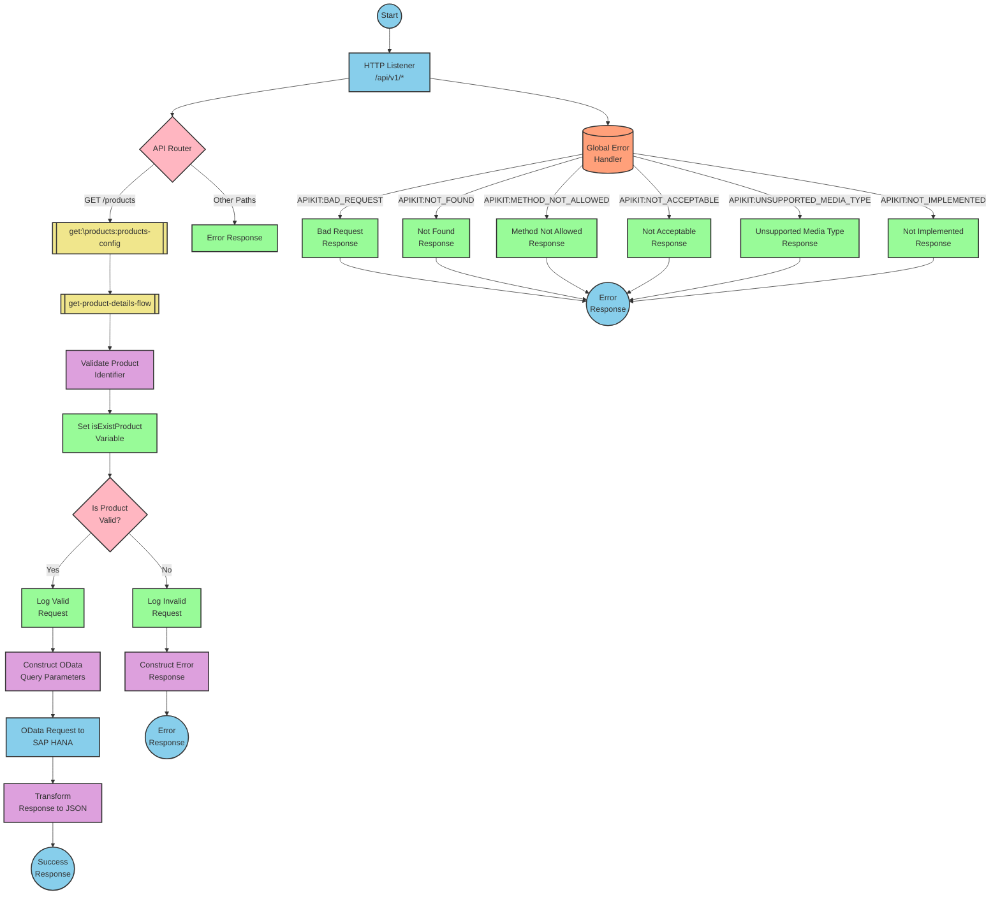

# SAP Integration Suite Implementation for Product API

# Table of Contents
- [API Overview](#api-overview)
- [Endpoints](#endpoints)
- [Current MuleSoft Flow Logic](#current-mulesoft-flow-logic)
- [DataWeave Transformations Explained](#dataweave-transformations-explained)
- [SAP Integration Suite Implementation](#sap-integration-suite-implementation)
  - [Component Mapping](#component-mapping)
  - [Integration Flow Visualization](#integration-flow-visualization)
- [Configuration Details](#configuration-details)
- [Configuration](#configuration)

# API Overview
This API provides access to product information from an SAP HANA backend system. It allows clients to retrieve product details by specifying a product identifier. The API validates the product identifier against a configured list of valid identifiers before retrieving the data from the backend system.

**Base URL**: `http://localhost:8081/api/v1`

# Endpoints

## GET /products
**Purpose**: Retrieves product details based on the provided product identifier.

**Query Parameters**:
- `productIdentifier` (required): The unique identifier of the product to retrieve.

**Response Format**:
- **200 OK**: Successfully retrieved product details
  - Content-Type: application/json
  - Body: Product details JSON object
- **400 Bad Request**: Invalid request format
- **404 Not Found**: Product identifier not found or invalid
- **500 Internal Server Error**: Server-side error

**Example Response (Success)**:
```json
{
  "ProductId": "HT-2000",
  "Category": "Notebooks",
  "CategoryName": "Notebooks",
  "CurrencyCode": "USD",
  "DimensionDepth": 30,
  "DimensionHeight": 3,
  "DimensionUnit": "cm",
  "DimensionWidth": 40,
  "LongDescription": "Notebook Basic 17 with 2,80 GHz quad core, 17\" LCD, 4 GB DDR3 RAM, 500 GB Hard Disc, Windows 8 Pro",
  "Name": "Notebook Basic 17",
  "PictureUrl": "/sap/public/bc/NWDEMO_MODEL/IMAGES/HT-2000.jpg",
  "Price": 1249,
  "QuantityUnit": "EA",
  "ShortDescription": "Notebook Basic 17 with 2,80 GHz quad core, 17\" LCD, 4 GB DDR3 RAM, 500 GB Hard Disc",
  "SupplierId": "0100000046",
  "Weight": 4.5,
  "WeightUnit": "KG"
}
```

**Example Response (Error)**:
```json
{
  "status": "error",
  "message": "The product identifier HT-3000 was not found.",
  "errorCode": "PRODUCT_NOT_FOUND"
}
```

# Current MuleSoft Flow Logic

## products-main Flow
**Trigger**: HTTP listener on `/api/v1/*`
1. Listens for incoming HTTP requests
2. Sets response headers
3. Routes the request based on the API specification
4. Handles errors and formats error responses

## products-console Flow
**Trigger**: HTTP listener
1. Listens for incoming HTTP requests
2. Sets response headers
3. Logs request details to console
4. Handles errors and formats error responses

## get:\products:products-config Flow
**Trigger**: HTTP GET request to `/products`
1. Receives the GET request for product details
2. Calls the `get-product-details-flow` subflow to process the request

## get-product-details-flow Subflow
**Purpose**: Validates and processes product detail requests
1. Validates if the requested product identifier is in the configured list of valid identifiers
2. If valid:
   - Logs the request processing
   - Constructs an OData query to retrieve product details
   - Sends the request to the SAP HANA backend
   - Returns the product details as JSON
3. If invalid:
   - Logs the validation failure
   - Returns an error response with appropriate message

**Key Processing Steps**:
1. **Validation**: Checks if the product identifier is in the configured list
   ```
   %dw 2.0
   output application/java
   var productidentifer=p('odata.productIdentifiers') splitBy(",")
   ---
   sizeOf(productidentifer filter ($ == attributes.queryParams.productIdentifier))>0
   ```

2. **OData Query Construction**: If valid, constructs an OData query with specific filters and field selection
   ```
   #[output application/java
   ---
   {
     "$filter" : "ProductId eq '" ++ (attributes.queryParams.productIdentifier default '') ++ "'",
     "$select" : "ProductId,Category,CategoryName,CurrencyCode,DimensionDepth,DimensionHeight,DimensionUnit,DimensionWidth,LongDescription,Name,PictureUrl,Price,QuantityUnit,ShortDescription,SupplierId,Weight,WeightUnit"
   }]
   ```

3. **Response Transformation**: Transforms the backend response to JSON
   ```
   %dw 2.0
   output application/json
   ---
   payload
   ```

4. **Error Response**: If validation fails, constructs an error response
   ```
   %dw 2.0
   output application/json
   ---
   {
     status: "error",
     message: "The product identifier " ++ attributes.queryParams.productIdentifier ++ " was not found.",
     errorCode: "PRODUCT_NOT_FOUND"
   }
   ```

# DataWeave Transformations Explained

## Validation Transformation
**Purpose**: Validates if the requested product identifier is in the configured list of valid identifiers.

**Input**: Query parameter `productIdentifier` from the HTTP request.
**Output**: Boolean value indicating if the product identifier is valid.

**Logic**:
1. Retrieves the configured list of valid product identifiers from the property `odata.productIdentifiers`
2. Splits the comma-separated list into an array
3. Filters the array to find matches with the requested product identifier
4. Returns true if at least one match is found (size > 0)

```dw
%dw 2.0
output application/java
var productidentifer=p('odata.productIdentifiers') splitBy(",")
---
sizeOf(productidentifer filter ($ == attributes.queryParams.productIdentifier))>0
```

## OData Query Parameters Transformation
**Purpose**: Constructs OData query parameters for filtering and selecting specific fields.

**Input**: Product identifier from query parameters.
**Output**: OData query parameters object with $filter and $select.

**Logic**:
1. Creates a $filter parameter that filters products by the requested product identifier
2. Creates a $select parameter that specifies which fields to include in the response

```dw
#[output application/java
---
{
  "$filter" : "ProductId eq '" ++ (attributes.queryParams.productIdentifier default '') ++ "'",
  "$select" : "ProductId,Category,CategoryName,CurrencyCode,DimensionDepth,DimensionHeight,DimensionUnit,DimensionWidth,LongDescription,Name,PictureUrl,Price,QuantityUnit,ShortDescription,SupplierId,Weight,WeightUnit"
}]
```

## Response Transformation
**Purpose**: Transforms the backend response to JSON format.

**Input**: Response payload from the SAP HANA backend.
**Output**: JSON representation of the product details.

**Logic**: Simple pass-through transformation that ensures the output is in JSON format.

```dw
%dw 2.0
output application/json
---
payload
```

## Error Response Transformation
**Purpose**: Constructs an error response when the product identifier is invalid.

**Input**: Product identifier from query parameters.
**Output**: JSON error object with status, message, and error code.

**Logic**: Creates a structured error response with a dynamic message that includes the invalid product identifier.

```dw
%dw 2.0
output application/json
---
{
  status: "error",
  message: "The product identifier " ++ attributes.queryParams.productIdentifier ++ " was not found.",
  errorCode: "PRODUCT_NOT_FOUND"
}
```

# SAP Integration Suite Implementation

## Component Mapping

| MuleSoft Component | SAP Integration Suite Equivalent | Notes |
|--------------------|----------------------------------|-------|
| HTTP Listener | HTTPS Adapter (Receiver) | Configure with the same path and port settings |
| Router | Content Modifier + Router | Use a Content Modifier to set routing conditions and a Router to implement the routing logic |
| Flow Reference | Process Call | Used to call subflows |
| Transform Message | Message Mapping | Implement the same DataWeave transformations using Message Mapping |
| Logger | Write to Log | Configure with the same log messages |
| HTTP Request | OData Adapter (Sender) | Configure with the same OData query parameters |
| Set Variable | Content Modifier | Use to set exchange properties |
| Choice/When/Otherwise | Router | Implement conditional logic using Router with conditions |
| Set Payload | Content Modifier | Set the message body |
| Error Handler | Exception Subprocess | Implement error handling logic |

## Integration Flow Visualization

### REST API Integration Flow: GET /products



## Configuration Details

### HTTP Adapter (Receiver)
- **Address**: `/api/v1/*`
- **Port**: `8081` (from dev.yaml)
- **Authentication**: None (based on source documentation)

### OData Adapter (Sender)
- **Address**: `refapp-espm-ui-cf.cfapps.eu10.hana.ondemand.com`
- **Port**: `443`
- **Path**: `/espm-cloud-web/espm.svc/Products`
- **Query Parameters**:
  - **$filter**: `ProductId eq '{productIdentifier}'`
  - **$select**: `ProductId,Category,CategoryName,CurrencyCode,DimensionDepth,DimensionHeight,DimensionUnit,DimensionWidth,LongDescription,Name,PictureUrl,Price,QuantityUnit,ShortDescription,SupplierId,Weight,WeightUnit`

### Content Modifier (Set isExistProduct Variable)
- **Exchange Property Name**: `isExistProduct`
- **Value Type**: Expression
- **Value**:
  ```
  ${property.productidentifer}.split(',').filter(item -> item == ${header.productIdentifier}).size() > 0
  ```

### Router (Product Validation)
- **Condition 1**: `${property.isExistProduct} == true`
  - **Route To**: Log Valid Request
- **Default Route**: Log Invalid Request

### Message Mapping (Construct Error Response)
- **Target Type**: JSON
- **Mapping**:
  ```json
  {
    "status": "error",
    "message": "The product identifier ${header.productIdentifier} was not found.",
    "errorCode": "PRODUCT_NOT_FOUND"
  }
  ```

### Write to Log (Log Valid Request)
- **Log Level**: INFO
- **Message**: `The request is processed and sent downstream with the product identifier (${header.productIdentifier}).`

### Write to Log (Log Invalid Request)
- **Log Level**: WARN
- **Message**: `The product identifier (${header.productIdentifier}) was not passed in the request or was passed incorrectly.`

# Configuration

## Environment Variables
The following environment variables are required based on the source documentation:

### From dev.yaml
```yaml
api:
  listener:
    port: "8081"
    path: /api/v1/*
    
hana:
  espm:
    url: refapp-espm-ui-cf.cfapps.eu10.hana.ondemand.com
    port: "443"
    path: /espm-cloud-web/espm.svc/Products
    
odata:
  productIdentifiers: "HT-2000,HT-2001"
```

## Dependencies on External Systems
- **SAP HANA Backend**: The integration depends on an SAP HANA backend system accessible at `refapp-espm-ui-cf.cfapps.eu10.hana.ondemand.com:443/espm-cloud-web/espm.svc/Products`

## Security Settings
- **HTTPS**: The connection to the SAP HANA backend uses HTTPS (port 443)
- **Authentication**: No explicit authentication mechanism is specified in the source documentation. In a production environment, appropriate authentication would need to be configured.

## Additional Configuration Notes
1. The list of valid product identifiers is configured as a comma-separated string in the `odata.productIdentifiers` property
2. Error handling is implemented for various API-related errors (BAD_REQUEST, NOT_FOUND, etc.)
3. The integration preserves the same flow logic and data transformations as the original MuleSoft implementation