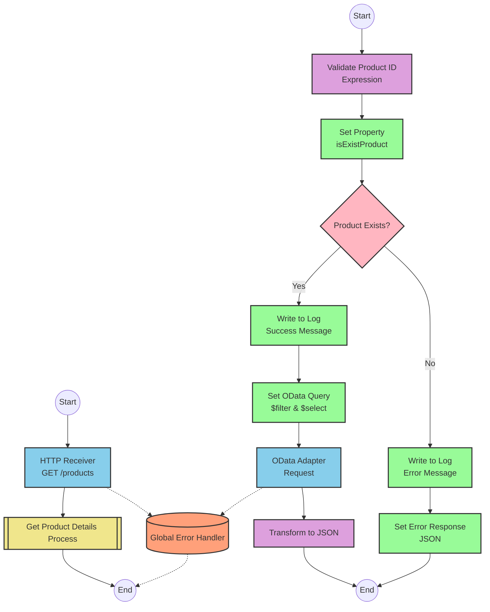

# SAP OData Product Information API Integration

## Table of Contents
- [API Overview](#api-overview)
- [Endpoints](#endpoints)
  - [GET /products](#get-products)
- [Current MuleSoft Flow Logic](#current-mulesoft-flow-logic)
  - [products-main Flow](#products-main-flow)
  - [products-console Flow](#products-console-flow)
  - [get:\products:products-config Flow](#getproductsproducts-config-flow)
  - [get-product-details-flow Subflow](#get-product-details-flow-subflow)
- [DataWeave Transformations Explained](#dataweave-transformations-explained)
  - [Product Identifier Validation](#product-identifier-validation)
  - [OData Query Parameters Construction](#odata-query-parameters-construction)
  - [Response Payload Transformation](#response-payload-transformation)
  - [Error Response Transformation](#error-response-transformation)
- [SAP Integration Suite Implementation](#sap-integration-suite-implementation)
  - [Component Mapping](#component-mapping)
  - [Integration Flow Visualization](#integration-flow-visualization)
  - [Configuration Details](#configuration-details)
- [Environment Configuration](#environment-configuration)
- [API Reference](#api-reference)

## API Overview
This API provides access to product information stored in an SAP HANA database through OData services. The integration retrieves detailed product information based on a product identifier provided as a query parameter. The API validates the product identifier against a configured list of valid identifiers before making the request to the backend system.

- **Base URL**: Determined by the HTTP_Listener_config
- **Authentication**: Not explicitly defined in the source documentation
- **Response Format**: JSON
- **Primary Function**: Retrieve product details by product identifier

## Endpoints

### GET /products
Retrieves detailed product information based on a product identifier.

- **HTTP Method**: GET
- **Path**: /products
- **Purpose**: Fetch product details from SAP HANA database via OData service

**Request Parameters**:
- **Query Parameters**:
  - `productIdentifier` (required): The unique identifier of the product to retrieve

**Response Format**:
- **Success Response (200 OK)**:
  - Content-Type: application/json
  - Body: Product details including ProductId, Category, CategoryName, CurrencyCode, dimensions, descriptions, price, etc.

- **Error Response (400 Bad Request)**:
  - Content-Type: application/json
  - Body: Error details including status, message, and errorCode

**Example Error Response**:
```json
{
  "status": "error",
  "message": "The product identifier ABC123 was not found.",
  "errorCode": "PRODUCT_NOT_FOUND"
}
```

## Current MuleSoft Flow Logic

### products-main Flow
1. **Trigger**: HTTP listener receives incoming requests
2. **Processing**:
   - Sets response headers
   - Routes the request to appropriate handlers
3. **Error Handling**: Provides error response with appropriate headers

### products-console Flow
1. **Trigger**: HTTP listener receives incoming requests
2. **Processing**:
   - Sets response headers
   - Logs request details to console
3. **Error Handling**: Provides error response with appropriate headers

### get:\products:products-config Flow
1. **Trigger**: API Kit router directs GET requests to /products endpoint
2. **Processing**:
   - References the get-product-details-flow subflow to handle the request

### get-product-details-flow Subflow
1. **Validation**:
   - Transforms the request to validate if the provided productIdentifier exists in the configured list
   - Sets a variable `isExistProduct` based on validation result
   
2. **Conditional Processing**:
   - If `isExistProduct` is true:
     - Logs successful request processing
     - Constructs OData query parameters with $filter and $select
     - Makes HTTP request to backend system
     - Transforms response to JSON format
   - If `isExistProduct` is false:
     - Logs error about invalid product identifier
     - Returns error response with appropriate message

## DataWeave Transformations Explained

### Product Identifier Validation
This transformation checks if the provided product identifier exists in a configured list of valid identifiers.

**Input**: Query parameters from the HTTP request
**Output**: Boolean value indicating if the product identifier is valid

```dw
%dw 2.0
output application/java
var productidentifer=p('odata.productIdentifiers') splitBy(",")
---
sizeOf(productidentifer filter ($ == attributes.queryParams.productIdentifier))>0
```

**Explanation**:
1. Retrieves a comma-separated list of valid product identifiers from a property
2. Splits the string into an array using the comma as delimiter
3. Filters the array to find elements matching the provided productIdentifier
4. Returns true if at least one match is found (size > 0)

### OData Query Parameters Construction
This transformation constructs the OData query parameters for the backend request.

**Input**: HTTP request attributes
**Output**: OData query parameters as a Java map

```dw
#[output application/java
---
{
	"$filter" : "ProductId eq '" ++ (attributes.queryParams.productIdentifier default '') ++ "'",
	"$select" : "ProductId,Category,CategoryName,CurrencyCode,DimensionDepth,DimensionHeight,DimensionUnit,DimensionWidth,LongDescription,Name,PictureUrl,Price,QuantityUnit,ShortDescription,SupplierId,Weight,WeightUnit"
}]
```

**Explanation**:
1. Creates a map with two OData query parameters:
   - `$filter`: Constructs a filter expression to match the ProductId with the provided productIdentifier
   - `$select`: Specifies the fields to retrieve from the OData service

### Response Payload Transformation
This transformation passes through the response from the backend system.

**Input**: Response from the OData service
**Output**: JSON response

```dw
%dw 2.0
output application/json
---
payload
```

**Explanation**:
- Simply outputs the payload as JSON without modification

### Error Response Transformation
This transformation constructs an error response when the product identifier is invalid.

**Input**: HTTP request attributes
**Output**: JSON error response

```dw
%dw 2.0
output application/json
---
{
	status: "error",
	message: "The product identifier " ++ attributes.queryParams.productIdentifier ++ " was not found.",
	errorCode: "PRODUCT_NOT_FOUND"
}
```

**Explanation**:
1. Creates a JSON object with three fields:
   - `status`: Set to "error"
   - `message`: Dynamic error message including the invalid product identifier
   - `errorCode`: Set to "PRODUCT_NOT_FOUND"

## SAP Integration Suite Implementation

### Component Mapping

| MuleSoft Component | SAP Integration Suite Equivalent | Notes |
|-------------------|----------------------------------|-------|
| HTTP Listener | HTTPS Adapter (Receiver) | Configure with the same path and method |
| Flow Reference | Process Call | Used to reference the product details subflow |
| DataWeave Transform | Content Modifier with Expression | For simple transformations |
| DataWeave Transform (complex) | Groovy Script or Message Mapping | For more complex transformations |
| Logger | Write to Log | Configure with the same message content |
| HTTP Request | HTTPS Adapter (Sender) or OData Adapter | OData Adapter preferred for SAP OData services |
| Choice Router | Router | Configure with the same condition |
| Set Variable | Content Modifier (Create/Set Property) | For setting variables/properties |
| Set Payload | Content Modifier (Message Body) | For setting response payload |
| Error Handler | Exception Subprocess | Configure with appropriate error handling |

### Integration Flow Visualization



### Configuration Details

#### HTTP Receiver Adapter
- **Adapter Type**: HTTPS
- **Direction**: Receiver
- **Path**: /products
- **Method**: GET
- **Authentication**: To be determined based on security requirements

#### OData Adapter
- **Adapter Type**: OData
- **Direction**: Sender
- **Service URL**: To be configured based on SAP HANA endpoint
- **Query Parameters**:
  - **$filter**: ProductId eq '{productIdentifier}'
  - **$select**: ProductId,Category,CategoryName,CurrencyCode,DimensionDepth,DimensionHeight,DimensionUnit,DimensionWidth,LongDescription,Name,PictureUrl,Price,QuantityUnit,ShortDescription,SupplierId,Weight,WeightUnit
- **Authentication**: To be determined based on backend requirements

#### Content Modifiers
1. **Validate Product ID**:
   - **Type**: Groovy Script
   - **Script**:
     ```groovy
     def productIdentifiers = property.get("odata.productIdentifiers").split(",")
     def requestedId = message.getProperty("productIdentifier")
     def isValid = productIdentifiers.find { it == requestedId } != null
     message.setProperty("isExistProduct", isValid)
     return message
     ```

2. **Set Error Response**:
   - **Type**: Content Modifier
   - **Message Body**:
     ```json
     {
       "status": "error",
       "message": "The product identifier ${property.productIdentifier} was not found.",
       "errorCode": "PRODUCT_NOT_FOUND"
     }
     ```

#### Router Configuration
- **Name**: Product Exists Router
- **Condition**: ${property.isExistProduct}

#### Log Configurations
1. **Success Log**:
   - **Log Level**: INFO
   - **Message**: "The request is processed and sent downstream with the product identifier (${property.productIdentifier})."

2. **Error Log**:
   - **Log Level**: WARN
   - **Message**: "The product identifier (${property.productIdentifier}) was not passed in the request or was passed incorrectly."

## Environment Configuration

### Important Configuration Parameters
- **odata.productIdentifiers**: Comma-separated list of valid product identifiers

### External System Dependencies
- **SAP HANA OData Service**: Backend system providing product information
  - Requires proper connectivity and authentication configuration

### Security Settings
- **Authentication**: Configuration required for both API consumers and backend system access
- **Transport Layer Security**: HTTPS should be used for all communications

### Deployment Considerations
- **Integration Package**: Create a dedicated integration package for product-related integrations
- **Versioning**: Implement proper versioning strategy for the integration flow
- **Monitoring**: Configure alerts for error scenarios, especially for invalid product identifiers

## API Reference

### Complete Endpoint List
- **GET /products**: Retrieve product details by product identifier

### Request Parameters
- **productIdentifier** (query parameter, required): The unique identifier of the product to retrieve

### Response Schema
**Success Response**:
```json
{
  "ProductId": "string",
  "Category": "string",
  "CategoryName": "string",
  "CurrencyCode": "string",
  "DimensionDepth": "number",
  "DimensionHeight": "number",
  "DimensionUnit": "string",
  "DimensionWidth": "number",
  "LongDescription": "string",
  "Name": "string",
  "PictureUrl": "string",
  "Price": "number",
  "QuantityUnit": "string",
  "ShortDescription": "string",
  "SupplierId": "string",
  "Weight": "number",
  "WeightUnit": "string"
}
```

**Error Response**:
```json
{
  "status": "error",
  "message": "string",
  "errorCode": "string"
}
```

### Error Codes
- **PRODUCT_NOT_FOUND**: The requested product identifier was not found or is invalid

### Authentication
Authentication requirements should be determined based on the security needs of the implementation.

### Rate Limiting
Rate limiting information is not specified in the source documentation and should be configured based on the specific requirements of the implementation.