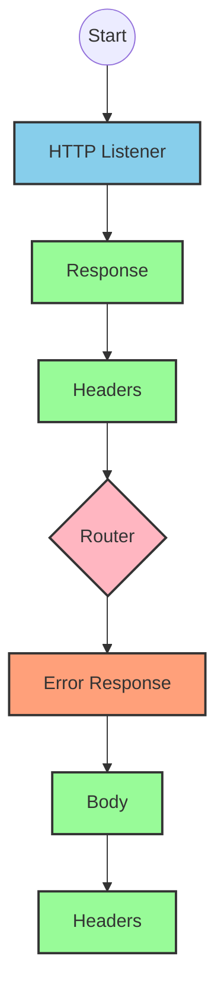
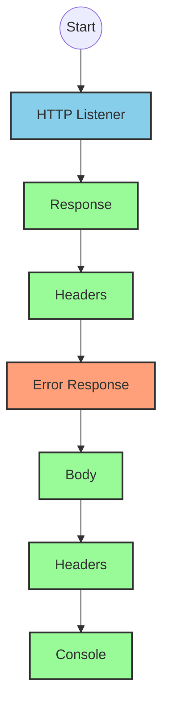
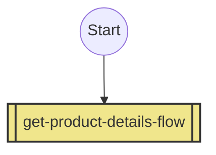
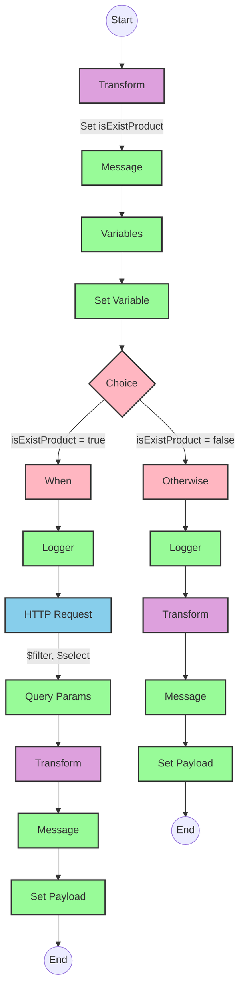

# API Overview
- This API provides product details from an SAP HANA database based on a product identifier
- Base URL pattern: `/products`

# Endpoints

## GET /products
- **Purpose**: Retrieves detailed product information based on a product identifier
- **Request Parameters**:
  - **Query Parameters**:
    - `productIdentifier` (required): The unique identifier for the product
- **Response Format**:
  - Content-Type: application/json
  - Success: Product details from SAP HANA
  - Error: JSON error object with status, message, and errorCode
- **Status Codes**:
  - 200: Success
  - 400: Bad Request
  - 404: Not Found
  - 405: Method Not Allowed
  - 406: Not Acceptable
  - 415: Unsupported Media Type
  - 501: Not Implemented

# Current MuleSoft Flow Logic

## Flow: products-main
1. **Trigger**: HTTP listener
2. **Processing**:
   - Sets response headers
   - Routes requests based on API configuration
   - Handles errors with a dedicated error response handler

## Flow: products-console
1. **Trigger**: HTTP listener
2. **Processing**:
   - Sets response headers
   - Logs information to the console
   - Handles errors with a dedicated error response handler

## Flow: get:\products:products-config
1. **Trigger**: HTTP GET request to `/products` endpoint
2. **Processing**:
   - References the `get-product-details-flow` subflow to process the request

## Subflow: get-product-details-flow
1. **Validation**:
   - Validates if the provided product identifier exists in the configured list
   - Sets a variable `isExistProduct` to track validation result
2. **Processing**:
   - If product identifier is valid:
     - Logs a message indicating the request is being processed
     - Makes an HTTP request to SAP HANA with specific OData query parameters
     - Returns the product details as JSON
   - If product identifier is invalid:
     - Logs an error message
     - Returns a standardized error response

3. **OData Query Parameters**:
   - Uses exact OData query parameters:
     - `$filter`: `ProductId eq '" ++ (attributes.queryParams.productIdentifier default '') ++ "'`
     - `$select`: `ProductId,Category,CategoryName,CurrencyCode,DimensionDepth,DimensionHeight,DimensionUnit,DimensionWidth,LongDescription,Name,PictureUrl,Price,QuantityUnit,ShortDescription,SupplierId,Weight,WeightUnit`

# DataWeave Transformations Explained

## Transformation 1: Validate Product Identifier
This transformation checks if the provided product identifier exists in a predefined list of valid product identifiers.

**Input**: Query parameter `productIdentifier`
**Output**: Boolean value indicating if the product identifier is valid

```dw
%dw 2.0
output application/java
var productidentifer=p('odata.productIdentifiers') splitBy(",")
---
sizeOf(productidentifer filter ($ == attributes.queryParams.productIdentifier))>0
```

**Explanation**:
1. Retrieves a comma-separated list of valid product identifiers from a property `odata.productIdentifiers`
2. Splits this string into an array using `splitBy(",")`
3. Filters the array to find elements matching the provided query parameter
4. Uses `sizeOf()` to check if any matches were found (returns true if count > 0)

## Transformation 2: OData Query Parameters
This transformation constructs the OData query parameters for the SAP HANA request.

**Input**: Query parameter `productIdentifier`
**Output**: OData query parameters as a Java map

```dw
#[output application/java
---
{
	"$filter" : "ProductId eq '" ++ (attributes.queryParams.productIdentifier default '') ++ "'",
	"$select" : "ProductId,Category,CategoryName,CurrencyCode,DimensionDepth,DimensionHeight,DimensionUnit,DimensionWidth,LongDescription,Name,PictureUrl,Price,QuantityUnit,ShortDescription,SupplierId,Weight,WeightUnit"
}]
```

**Explanation**:
1. Creates a Java map with two OData query parameters
2. `$filter` parameter filters products where ProductId equals the provided productIdentifier
3. `$select` parameter specifies which fields to include in the response
4. Uses string concatenation (`++`) to build the filter expression
5. Uses `default ''` to handle cases where productIdentifier might be null

## Transformation 3: Pass-through Response
This transformation simply passes the payload through without modification.

**Input**: SAP HANA response (JSON)
**Output**: Same JSON payload

```dw
%dw 2.0
output application/json
---
payload
```

## Transformation 4: Error Response
This transformation creates a standardized error response when the product identifier is invalid.

**Input**: Query parameter `productIdentifier`
**Output**: JSON error object

```dw
%dw 2.0
output application/json
---
{
	status: "error",
	message: "The product identifier " ++ attributes.queryParams.productIdentifier ++ " was not found.",
	errorCode: "PRODUCT_NOT_FOUND"
}
```

**Explanation**:
1. Creates a JSON object with three fields: status, message, and errorCode
2. Uses string concatenation to include the invalid product identifier in the error message
3. Sets a consistent error code "PRODUCT_NOT_FOUND" for this specific error scenario

# SAP Integration Suite Implementation

## Component Mapping

| MuleSoft Component | SAP Integration Suite Equivalent | Notes |
|--------------------|----------------------------------|-------|
| HTTP Listener | HTTP Adapter (Receiver) | Configure with same path and method |
| Flow Reference | Process Call | References another integration flow |
| Logger | Write to Message Log | Configure with same log message |
| Set Variable | Content Modifier | Set properties with same variable names |
| Choice/When/Otherwise | Router | Configure with same conditions |
| HTTP Request | HTTP Adapter (Sender) | Configure with same endpoint and query parameters |
| Transform Message | Message Mapping | Implement same DataWeave transformations |
| Set Payload | Content Modifier | Set message body |
| Error Handler | Exception Subprocess | Configure with same error types |

## Integration Flow Visualization









## Configuration Details

### HTTP Listener Configuration
- **Component**: HTTP Adapter (Receiver)
- **Parameters**:
  - Name: HTTP_Listener_config
  - Path: /products
  - Method: GET
  - Content Type: application/json

### HTTP Request Configuration
- **Component**: HTTP Adapter (Sender)
- **Parameters**:
  - Name: Hana_HTTP_Request_Configuration
  - URL: [SAP HANA OData service endpoint]
  - Method: GET
  - Query Parameters: 
    - $filter: ProductId eq '[productIdentifier]'
    - $select: ProductId,Category,CategoryName,CurrencyCode,DimensionDepth,DimensionHeight,DimensionUnit,DimensionWidth,LongDescription,Name,PictureUrl,Price,QuantityUnit,ShortDescription,SupplierId,Weight,WeightUnit

### Router Configuration
- **Component**: Router
- **Condition**: vars.isExistProduct
- **Routes**:
  - True: Process valid product request
  - False: Return error response

### Content Modifier (Set Variable)
- **Component**: Content Modifier
- **Parameters**:
  - Action: Create property
  - Name: isExistProduct
  - Value: [Result of validation transformation]

### Message Mapping (Transform)
- **Component**: Message Mapping
- **Mappings**:
  1. Validation mapping:
     - Source: Property 'odata.productIdentifiers' and query parameter
     - Target: Boolean value
  2. Pass-through mapping:
     - Source: HTTP response payload
     - Target: Output payload (no transformation)
  3. Error response mapping:
     - Source: Query parameter
     - Target: JSON error object

### Process Call
- **Component**: Process Call
- **Parameters**:
  - Process: get-product-details-flow

# Configuration

## Important Configuration Parameters
- **odata.productIdentifiers**: Comma-separated list of valid product identifiers

## Error Handling
- Global error handler configured to handle various APIKIT errors:
  - APIKIT:BAD_REQUEST
  - APIKIT:NOT_FOUND
  - APIKIT:METHOD_NOT_ALLOWED
  - APIKIT:NOT_ACCEPTABLE
  - APIKIT:UNSUPPORTED_MEDIA_TYPE
  - APIKIT:NOT_IMPLEMENTED

## External Dependencies
- SAP HANA OData service for product data retrieval