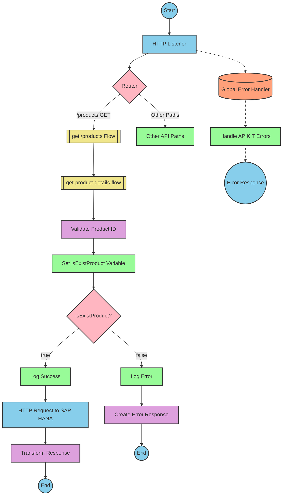

# SAP Integration Suite Implementation for Product API

# Table of Contents
- [API Overview](#api-overview)
- [Endpoints](#endpoints)
- [Current MuleSoft Flow Logic](#current-mulesoft-flow-logic)
- [DataWeave Transformations Explained](#dataweave-transformations-explained)
- [SAP Integration Suite Implementation](#sap-integration-suite-implementation)
  - [Component Mapping](#component-mapping)
  - [Integration Flow Visualization](#integration-flow-visualization)
- [Configuration Details](#configuration-details)
- [Configuration](#configuration)

# API Overview
This API provides access to product information from an SAP HANA backend system. It allows clients to retrieve product details by specifying a product identifier. The API validates the product identifier against a configured list of valid identifiers before retrieving the data from the SAP HANA system.

**Base URL**: `http://localhost:8081/api/v1`

# Endpoints

## GET /products
**Purpose**: Retrieves product details based on the provided product identifier.

**Request Parameters**:
- **Query Parameters**:
  - `productIdentifier` (required): The identifier of the product to retrieve

**Response Format**:
- **200 OK**: Successfully retrieved product details
  - Content-Type: application/json
  - Body: Product details JSON object
- **400 Bad Request**: Invalid request format
- **404 Not Found**: Product identifier not found
- **500 Internal Server Error**: Server-side error

**Error Response Example**:
```json
{
  "status": "error",
  "message": "The product identifier HT-9999 was not found.",
  "errorCode": "PRODUCT_NOT_FOUND"
}
```

# Current MuleSoft Flow Logic

## products-main Flow
**Trigger**: HTTP listener configured at `/api/v1/*`
**Purpose**: Main entry point for the API that handles routing to appropriate endpoints

1. Receives HTTP requests via the listener component
2. Sets response headers
3. Routes the request to the appropriate flow based on the endpoint path
4. Handles errors and formats error responses

## products-console Flow
**Trigger**: HTTP listener configured at `/api/v1/*`
**Purpose**: Logs API requests to the console for monitoring purposes

1. Receives HTTP requests via the listener component
2. Sets response headers
3. Logs request details to the console
4. Handles errors and formats error responses

## get:\products:products-config Flow
**Trigger**: HTTP GET request to `/products` endpoint
**Purpose**: Handles product retrieval requests

1. Receives the GET request for the `/products` endpoint
2. Calls the `get-product-details-flow` subflow to process the request

## get-product-details-flow Subflow
**Purpose**: Validates the product identifier and retrieves product details from the SAP HANA backend

1. Transforms the request to validate if the product identifier exists in the configured list:
   ```
   %dw 2.0
   output application/java
   var productidentifer=p('odata.productIdentifiers') splitBy(",")
   ---
   sizeOf(productidentifer filter ($ == attributes.queryParams.productIdentifier))>0
   ```

2. Sets a variable `isExistProduct` with the validation result

3. Conditional processing based on the validation result:
   - If `isExistProduct` is true:
     - Logs that the request is being processed
     - Sends an HTTP request to the SAP HANA backend with OData query parameters:
       - `$filter`: `ProductId eq '" ++ (attributes.queryParams.productIdentifier default '') ++ "'`
       - `$select`: `ProductId,Category,CategoryName,CurrencyCode,DimensionDepth,DimensionHeight,DimensionUnit,DimensionWidth,LongDescription,Name,PictureUrl,Price,QuantityUnit,ShortDescription,SupplierId,Weight,WeightUnit`
     - Transforms the response to JSON format:
       ```
       %dw 2.0
       output application/json
       ---
       payload
       ```

   - If `isExistProduct` is false:
     - Logs that the product identifier was not found or was passed incorrectly
     - Returns an error response:
       ```
       %dw 2.0
       output application/json
       ---
       {
         status: "error",
         message: "The product identifier " ++ attributes.queryParams.productIdentifier ++ " was not found.",
         errorCode: "PRODUCT_NOT_FOUND"
       }
       ```

## Error Handling
The application implements global error handling for various APIKIT errors:
- APIKIT:BAD_REQUEST
- APIKIT:NOT_FOUND
- APIKIT:METHOD_NOT_ALLOWED
- APIKIT:NOT_ACCEPTABLE
- APIKIT:UNSUPPORTED_MEDIA_TYPE
- APIKIT:NOT_IMPLEMENTED

# DataWeave Transformations Explained

## Product Identifier Validation Transformation
**Purpose**: Validates if the provided product identifier exists in the configured list of valid identifiers.

**Input**: Query parameters from the HTTP request
**Output**: Boolean value indicating if the product identifier is valid

**Logic**:
1. Retrieves the configured list of product identifiers from the properties file
2. Splits the comma-separated list into an array
3. Filters the array to find matches with the provided product identifier
4. Returns true if at least one match is found, false otherwise

```dw
%dw 2.0
output application/java
var productidentifer=p('odata.productIdentifiers') splitBy(",")
---
sizeOf(productidentifer filter ($ == attributes.queryParams.productIdentifier))>0
```

## OData Query Parameters Transformation
**Purpose**: Constructs OData query parameters for filtering and selecting specific product fields.

**Input**: Query parameters from the HTTP request
**Output**: OData query parameters for the HTTP request to the SAP HANA backend

**Logic**:
1. Constructs a `$filter` parameter to filter products by the provided product identifier
2. Specifies a `$select` parameter to retrieve only the required product fields

```dw
#[output application/java
---
{
	"$filter" : "ProductId eq '" ++ (attributes.queryParams.productIdentifier default '') ++ "'",
	"$select" : "ProductId,Category,CategoryName,CurrencyCode,DimensionDepth,DimensionHeight,DimensionUnit,DimensionWidth,LongDescription,Name,PictureUrl,Price,QuantityUnit,ShortDescription,SupplierId,Weight,WeightUnit"
}]
```

## Response Transformation
**Purpose**: Passes through the response from the SAP HANA backend without modification.

**Input**: Response payload from the SAP HANA backend
**Output**: JSON response payload

```dw
%dw 2.0
output application/json
---
payload
```

## Error Response Transformation
**Purpose**: Constructs an error response when the product identifier is not valid.

**Input**: Query parameters from the HTTP request
**Output**: JSON error response

**Logic**:
1. Creates a JSON object with error status, message, and error code
2. Includes the invalid product identifier in the error message

```dw
%dw 2.0
output application/json
---
{
	status: "error",
	message: "The product identifier " ++ attributes.queryParams.productIdentifier ++ " was not found.",
	errorCode: "PRODUCT_NOT_FOUND"
}
```

# SAP Integration Suite Implementation

## Component Mapping

| MuleSoft Component | SAP Integration Suite Equivalent | Notes |
|--------------------|----------------------------------|-------|
| HTTP Listener | HTTPS Adapter (Receiver) | Configure with the same path and port settings |
| Router | Content Modifier with Router | Use a Content Modifier to set properties and a Router for conditional processing |
| Flow Reference | Process Call | Use Process Call to invoke other integration flows |
| Logger | Write to Message Log | Configure with the same log messages |
| Transform | Message Mapping | Use Message Mapping for DataWeave transformations |
| Set Variable | Content Modifier | Use Content Modifier to set properties (equivalent to variables) |
| Choice/When/Otherwise | Router | Use Router with conditions for conditional processing |
| HTTP Request | HTTPS Adapter (Sender) | Configure with the same URL and query parameters |
| Set Payload | Content Modifier | Use Content Modifier to set the message body |
| Error Handler | Exception Subprocess | Create exception subprocesses for error handling |

## REST API Integration Flow: GET /products



# Configuration Details

## HTTP Listener Configuration
- **Component**: HTTPS Adapter (Receiver)
- **Parameters**:
  - Address: `/api/v1/*`
  - Port: `8081` (from `api.listener.port` property)
  - Supported Methods: GET, POST, PUT, DELETE

## Router Configuration
- **Component**: Router
- **Parameters**:
  - Condition for `/products` path: `${property.http.path} = '/products' AND ${property.http.method} = 'GET'`

## Process Call Configuration
- **Component**: Process Call
- **Parameters**:
  - Process: `get-product-details-flow`

## Validate Product ID Configuration
- **Component**: Message Mapping
- **Parameters**:
  - Source: HTTP Request
  - Target: Property
  - Mapping Script (equivalent to DataWeave):
    ```
    def productidentifer = split(property.odata.productIdentifiers, ",");
    def requestedProduct = property.http.queryParams.productIdentifier;
    def isExistProduct = contains(productidentifer, requestedProduct);
    return isExistProduct;
    ```

## Set isExistProduct Variable Configuration
- **Component**: Content Modifier
- **Parameters**:
  - Action: Create Property
  - Name: `isExistProduct`
  - Value: Result from validation mapping

## Product Router Configuration
- **Component**: Router
- **Parameters**:
  - Condition: `${property.isExistProduct} = 'true'`

## HTTP Request to SAP HANA Configuration
- **Component**: HTTPS Adapter (Sender)
- **Parameters**:
  - URL: `https://refapp-espm-ui-cf.cfapps.eu10.hana.ondemand.com:443/espm-cloud-web/espm.svc/Products` (from properties)
  - Query Parameters:
    - `$filter`: `ProductId eq '${property.http.queryParams.productIdentifier}'`
    - `$select`: `ProductId,Category,CategoryName,CurrencyCode,DimensionDepth,DimensionHeight,DimensionUnit,DimensionWidth,LongDescription,Name,PictureUrl,Price,QuantityUnit,ShortDescription,SupplierId,Weight,WeightUnit`

## Transform Response Configuration
- **Component**: Message Mapping
- **Parameters**:
  - Source: HTTP Response
  - Target: Message Body
  - Mapping: Direct pass-through of payload

## Create Error Response Configuration
- **Component**: Content Modifier
- **Parameters**:
  - Action: Create Message Body
  - Content Type: application/json
  - Content:
    ```json
    {
      "status": "error",
      "message": "The product identifier ${property.http.queryParams.productIdentifier} was not found.",
      "errorCode": "PRODUCT_NOT_FOUND"
    }
    ```

## Global Error Handler Configuration
- **Component**: Exception Subprocess
- **Parameters**:
  - Error Types: APIKIT:BAD_REQUEST, APIKIT:NOT_FOUND, APIKIT:METHOD_NOT_ALLOWED, APIKIT:NOT_ACCEPTABLE, APIKIT:UNSUPPORTED_MEDIA_TYPE, APIKIT:NOT_IMPLEMENTED
  - Response: Appropriate error messages for each error type

# Configuration

## Environment Variables
The following environment variables are required for the integration:

### API Configuration
- `api.listener.port`: Port for the HTTP listener (default: 8081)
- `api.listener.path`: Base path for the API (default: /api/v1/*)

### SAP HANA Configuration
- `hana.espm.url`: URL of the SAP HANA ESPM application (default: refapp-espm-ui-cf.cfapps.eu10.hana.ondemand.com)
- `hana.espm.port`: Port for the SAP HANA ESPM application (default: 443)
- `hana.espm.path`: Path to the Products OData service (default: /espm-cloud-web/espm.svc/Products)

### OData Configuration
- `odata.productIdentifiers`: Comma-separated list of valid product identifiers (default: "HT-2000,HT-2001")

## Dependencies on External Systems
- **SAP HANA ESPM Application**: The integration depends on the availability of the SAP HANA ESPM application for retrieving product data.
- **OData Service**: The integration uses the OData service provided by the SAP HANA ESPM application.

## Security Settings
- HTTPS should be configured for all external communications
- Authentication to the SAP HANA backend should be configured based on the target system requirements
- API security should be implemented according to organizational standards (OAuth, API Key, etc.)