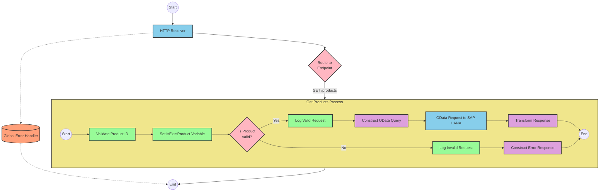

# SAP Integration Suite Documentation: Product API Integration

# Table of Contents
- [API Overview](#api-overview)
- [Endpoints](#endpoints)
  - [GET /products](#get-products)
- [Current MuleSoft Flow Logic](#current-mulesoft-flow-logic)
  - [products-main Flow](#products-main-flow)
  - [products-console Flow](#products-console-flow)
  - [get:\products:products-config Flow](#getproductsproducts-config-flow)
  - [get-product-details-flow Subflow](#get-product-details-flow-subflow)
- [DataWeave Transformations Explained](#dataweave-transformations-explained)
  - [Product Identifier Validation](#product-identifier-validation)
  - [OData Query Parameters](#odata-query-parameters)
  - [Response Payload Transformation](#response-payload-transformation)
  - [Error Response Transformation](#error-response-transformation)
- [SAP Integration Suite Implementation](#sap-integration-suite-implementation)
  - [Component Mapping](#component-mapping)
  - [Integration Flow Visualization](#integration-flow-visualization)
- [Configuration Details](#configuration-details)
  - [HTTP Adapter Configuration](#http-adapter-configuration)
  - [OData Adapter Configuration](#odata-adapter-configuration)
  - [Content Modifier Configuration](#content-modifier-configuration)
  - [Router Configuration](#router-configuration)
- [Configuration](#configuration)
  - [Environment Variables](#environment-variables)
  - [External Dependencies](#external-dependencies)

# API Overview

The Product API is a RESTful service that retrieves product details from an SAP HANA backend system. It allows clients to query product information by providing a product identifier. The API validates the product identifier against a predefined list and returns either the product details or an appropriate error message.

- **Base URL**: http://localhost:8081/api/v1
- **API Version**: v1

# Endpoints

## GET /products

This endpoint retrieves product details based on the provided product identifier.

- **HTTP Method**: GET
- **Path**: /products
- **Purpose**: Retrieve product information from the SAP HANA backend

### Request Parameters

| Parameter | Type | Required | Description |
|-----------|------|----------|-------------|
| productIdentifier | Query | Yes | The unique identifier of the product to retrieve |

### Response Format

**Success Response (200 OK)**
```json
{
  // Product details from SAP HANA backend
}
```

**Error Response (400 Bad Request)**
```json
{
  "status": "error",
  "message": "The product identifier [identifier] was not found.",
  "errorCode": "PRODUCT_NOT_FOUND"
}
```

# Current MuleSoft Flow Logic

## products-main Flow

This is the main entry point for the API, which handles HTTP requests.

1. **Trigger**: HTTP listener configured to listen on `/api/v1/*`
2. **Processing**:
   - Sets response headers
   - Routes requests to appropriate handlers based on the API specification
   - Handles errors and formats error responses

## products-console Flow

This flow provides console logging capabilities for the API.

1. **Trigger**: HTTP listener
2. **Processing**:
   - Sets response headers
   - Logs information to the console
   - Handles errors

## get:\products:products-config Flow

This flow handles the GET /products endpoint.

1. **Trigger**: HTTP GET request to `/products`
2. **Processing**:
   - Calls the `get-product-details-flow` subflow to process the request

## get-product-details-flow Subflow

This subflow processes product detail requests and is the core business logic of the API.

1. **Validate Product Identifier**:
   - Transforms the request to check if the provided product identifier exists in the predefined list
   - Sets a variable `isExistProduct` based on the validation result

2. **Process Valid Product Requests**:
   - If the product identifier is valid:
     - Logs the request processing
     - Constructs an OData query with specific filter and select parameters
     - Sends a request to the SAP HANA backend
     - Transforms the response to JSON format

3. **Handle Invalid Product Requests**:
   - If the product identifier is invalid:
     - Logs the error
     - Returns an error response with appropriate message

4. **Query Parameters**:
   - Uses exact OData query parameters:
     - `$filter`: `ProductId eq '[productIdentifier]'`
     - `$select`: `ProductId,Category,CategoryName,CurrencyCode,DimensionDepth,DimensionHeight,DimensionUnit,DimensionWidth,LongDescription,Name,PictureUrl,Price,QuantityUnit,ShortDescription,SupplierId,Weight,WeightUnit`

# DataWeave Transformations Explained

## Product Identifier Validation

This transformation checks if the provided product identifier exists in the predefined list of valid product identifiers.

- **Input**: Product identifier from query parameters
- **Output**: Boolean value indicating if the product identifier is valid
- **Key Operations**: 
  - Splits the predefined list of product identifiers
  - Filters the list to find matches
  - Returns true if a match is found

```dw
%dw 2.0
output application/java
var productidentifer=p('odata.productIdentifiers') splitBy(",")
---
sizeOf(productidentifer filter ($ == attributes.queryParams.productIdentifier))>0
```

## OData Query Parameters

This transformation constructs the OData query parameters for the SAP HANA backend request.

- **Input**: Product identifier from query parameters
- **Output**: OData query parameters as a Java map
- **Key Operations**: 
  - Constructs a filter expression using the product identifier
  - Specifies the fields to select in the response

```dw
#[output application/java
---
{
	"$filter" : "ProductId eq '" ++ (attributes.queryParams.productIdentifier default '') ++ "'",
	"$select" : "ProductId,Category,CategoryName,CurrencyCode,DimensionDepth,DimensionHeight,DimensionUnit,DimensionWidth,LongDescription,Name,PictureUrl,Price,QuantityUnit,ShortDescription,SupplierId,Weight,WeightUnit"
}]
```

## Response Payload Transformation

This transformation passes through the response from the SAP HANA backend.

- **Input**: Response from SAP HANA backend
- **Output**: JSON response
- **Key Operations**: Simple pass-through of the payload

```dw
%dw 2.0
output application/json
---
payload
```

## Error Response Transformation

This transformation constructs an error response when the product identifier is invalid.

- **Input**: Product identifier from query parameters
- **Output**: JSON error response
- **Key Operations**: Constructs an error object with status, message, and error code

```dw
%dw 2.0
output application/json
---
{
	status: "error",
	message: "The product identifier " ++ attributes.queryParams.productIdentifier ++ " was not found.",
	errorCode: "PRODUCT_NOT_FOUND"
}
```

# SAP Integration Suite Implementation

## Component Mapping

| MuleSoft Component | SAP Integration Suite Equivalent | Notes |
|--------------------|----------------------------------|-------|
| HTTP Listener | HTTP Adapter (Receiver) | Configure with the same path and port |
| Flow Reference | Process Call | Used to call subflows |
| Transform Message | Content Modifier or Message Mapping | For DataWeave transformations |
| Logger | Write to Message Log | For logging messages |
| HTTP Request | OData Adapter (Sender) | For SAP HANA backend communication |
| Choice Router | Router | For conditional processing |
| Set Variable | Content Modifier | For setting variables |
| Set Payload | Content Modifier | For setting response payload |
| Error Handler | Exception Subprocess | For handling errors |

## Integration Flow Visualization

### REST API Integration Flow: GET /products



# Configuration Details

## HTTP Adapter Configuration

### HTTP Receiver Adapter
- **Address**: /api/v1/*
- **Port**: 8081 (from environment variable)
- **Authentication**: None (based on source)
- **CSRF Protection**: None (based on source)

### OData Sender Adapter
- **Address**: ${hana.espm.url}:${hana.espm.port}${hana.espm.path}
- **URL**: refapp-espm-ui-cf.cfapps.eu10.hana.ondemand.com
- **Port**: 443
- **Path**: /espm-cloud-web/espm.svc/Products
- **Query Parameters**: Dynamically set from Content Modifier
- **Authentication**: None (based on source)

## Content Modifier Configuration

### Validate Product ID
- **Message Body**: 
  ```
  var productidentifer=p('odata.productIdentifiers') splitBy(",")
  ---
  sizeOf(productidentifer filter ($ == ${property.queryParams.productIdentifier}))>0
  ```
- **Result Target**: isExistProduct (variable)

### Log Valid Request
- **Message**: "The request is processed and sent downstream with the product identifier (${property.queryParams.productIdentifier})."
- **Log Level**: INFO

### Log Invalid Request
- **Message**: "The product identifier (${property.queryParams.productIdentifier}) was not passed in the request or was passed incorrectly."
- **Log Level**: WARN

### Construct OData Query
- **Message Body**:
  ```
  {
    "$filter" : "ProductId eq '" + ${property.queryParams.productIdentifier} + "'",
    "$select" : "ProductId,Category,CategoryName,CurrencyCode,DimensionDepth,DimensionHeight,DimensionUnit,DimensionWidth,LongDescription,Name,PictureUrl,Price,QuantityUnit,ShortDescription,SupplierId,Weight,WeightUnit"
  }
  ```
- **Result Target**: Query Parameters for OData Request

### Construct Error Response
- **Message Body**:
  ```
  {
    "status": "error",
    "message": "The product identifier " + ${property.queryParams.productIdentifier} + " was not found.",
    "errorCode": "PRODUCT_NOT_FOUND"
  }
  ```
- **Result Target**: Message Body

## Router Configuration

### ProductsRouter
- **Condition 1**: ${header.http.requesturi} matches '/products'
- **Route 1**: To Get Products Process
- **Default Route**: To Error Handler

### ProductRouter
- **Condition 1**: ${property.isExistProduct} equals 'true'
- **Route 1**: To Log Valid Request
- **Default Route**: To Log Invalid Request

# Configuration

## Environment Variables

The integration uses the following environment variables from the source configuration:

```yaml
api:
  listener:
    port: "8081"
    path: /api/v1/*
    
hana:
  espm:
    url: refapp-espm-ui-cf.cfapps.eu10.hana.ondemand.com
    port: "443"
    path: /espm-cloud-web/espm.svc/Products
    
odata:
  productIdentifiers: "HT-2000,HT-2001"
```

These should be configured in the SAP Integration Suite as externalized parameters.

## External Dependencies

The integration depends on the following external systems:

1. **SAP HANA Backend**
   - Endpoint: refapp-espm-ui-cf.cfapps.eu10.hana.ondemand.com:443
   - Service: /espm-cloud-web/espm.svc/Products
   - Protocol: HTTPS
   - Authentication: None specified in source (may need to be configured)

No specific security settings or certificates were mentioned in the source documentation, but production deployments should consider appropriate security measures for the SAP HANA backend connection.