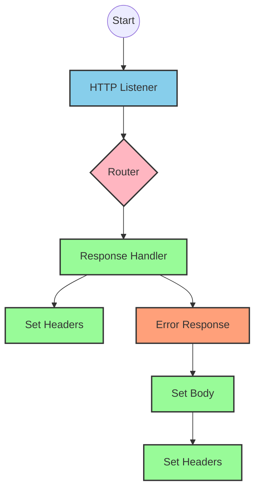
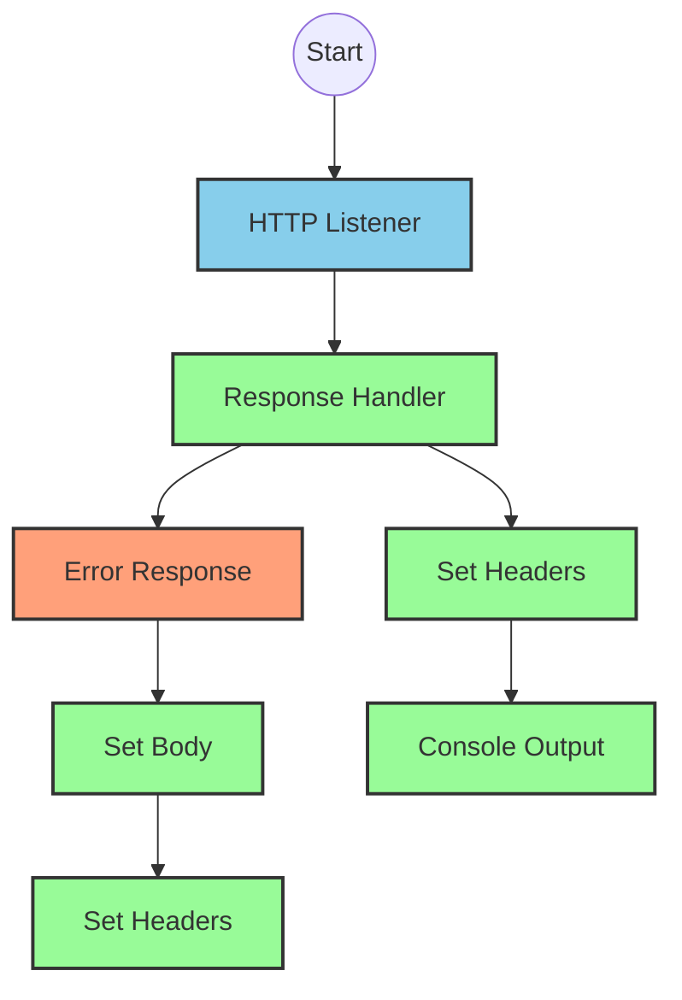
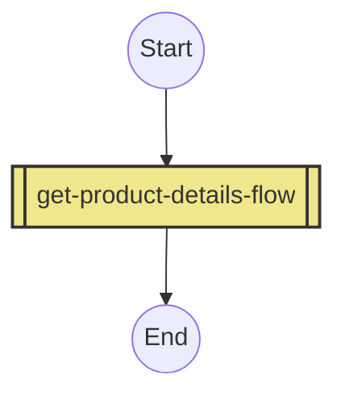
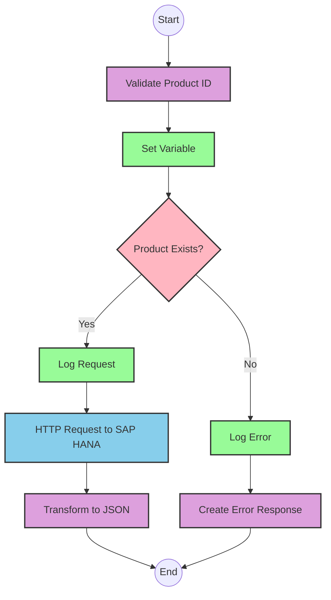
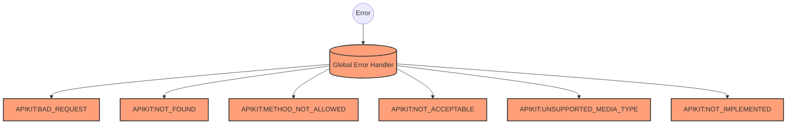

# API Overview
- This API provides product details from an SAP HANA database
- Base URL pattern: `/products`

# Endpoints

## GET /products
- **Purpose**: Retrieves product details based on a product identifier
- **Query Parameters**:
  - `productIdentifier` (required): The unique identifier of the product
- **Response Format**: JSON
- **Status Codes**:
  - 200: Success
  - 400: Bad Request
  - 404: Product Not Found
- **Response Body**: Product details including ProductId, Category, CategoryName, CurrencyCode, dimensions, descriptions, price, and other product attributes

# Current MuleSoft Flow Logic

## Flow: products-main
This is the main entry point for the API, triggered by an HTTP listener. It handles routing to the appropriate endpoints defined in the RAML specification.

1. **Trigger**: HTTP listener
2. **Processing**:
   - Sets response headers
   - Routes requests based on the API configuration
   - Handles errors with a dedicated error response handler
3. **Outcome**: Routes to the appropriate flow based on the endpoint requested

## Flow: products-console
This appears to be a console/logging version of the API, likely for debugging or monitoring purposes.

1. **Trigger**: HTTP listener
2. **Processing**:
   - Sets response headers
   - Outputs to console
   - Handles errors with a dedicated error response handler
3. **Outcome**: Logs API activity to the console

## Flow: get:\products:products-config
This flow handles GET requests to the `/products` endpoint.

1. **Trigger**: GET request to `/products`
2. **Processing**: Calls the `get-product-details-flow` subflow
3. **Outcome**: Returns product details or an error response

## Subflow: get-product-details-flow
This subflow retrieves product details from SAP HANA.

1. **Validation**: Checks if the provided product identifier is valid
   ```
   %dw 2.0
   output application/java
   var productidentifer=p('odata.productIdentifiers') splitBy(",")
   ---
   sizeOf(productidentifer filter ($ == attributes.queryParams.productIdentifier))>0
   ```

2. **Conditional Processing**:
   - If product identifier is valid:
     - Logs the request
     - Makes an HTTP request to SAP HANA with OData query parameters:
       - `$filter`: `ProductId eq '" ++ (attributes.queryParams.productIdentifier default '') ++ "'`
       - `$select`: `ProductId,Category,CategoryName,CurrencyCode,DimensionDepth,DimensionHeight,DimensionUnit,DimensionWidth,LongDescription,Name,PictureUrl,Price,QuantityUnit,ShortDescription,SupplierId,Weight,WeightUnit`
     - Transforms the response to JSON
   - If product identifier is invalid:
     - Logs the error
     - Returns an error response

3. **Error Handling**: Global error handler for API Kit errors (BAD_REQUEST, NOT_FOUND, etc.)

# DataWeave Transformations Explained

## Product Identifier Validation
```
%dw 2.0
output application/java
var productidentifer=p('odata.productIdentifiers') splitBy(",")
---
sizeOf(productidentifer filter ($ == attributes.queryParams.productIdentifier))>0
```

This transformation:
1. Retrieves a comma-separated list of valid product identifiers from a property
2. Splits the string into an array
3. Filters the array to find matches with the requested product identifier
4. Returns true if at least one match is found (size > 0)

## OData Query Parameters Construction
```
#[output application/java
---
{
	"$filter" : "ProductId eq '" ++ (attributes.queryParams.productIdentifier default '') ++ "'",
	"$select" : "ProductId,Category,CategoryName,CurrencyCode,DimensionDepth,DimensionHeight,DimensionUnit,DimensionWidth,LongDescription,Name,PictureUrl,Price,QuantityUnit,ShortDescription,SupplierId,Weight,WeightUnit"
}]
```

This transformation:
1. Creates a map with OData query parameters
2. Constructs a filter expression that matches the exact product identifier
3. Specifies which fields to select from the product data

## Response Payload Transformation
```
%dw 2.0
output application/json
---
payload
```

This simple transformation converts the response payload to JSON format without modifying its structure.

## Error Response Transformation
```
%dw 2.0
output application/json
---
{
	status: "error",
	message: "The product identifier " ++ attributes.queryParams.productIdentifier ++ " was not found.",
	errorCode: "PRODUCT_NOT_FOUND"
}
```

This transformation:
1. Creates a standardized error response structure
2. Includes the invalid product identifier in the error message
3. Sets a specific error code for product not found scenarios

# SAP Integration Suite Implementation

## Component Mapping

| MuleSoft Component | SAP Integration Suite Equivalent |
|--------------------|----------------------------------|
| HTTP Listener | HTTPS Adapter (Server) |
| HTTP Request | HTTPS Adapter (Client) |
| Router | Content Modifier + Router |
| Flow Reference | Process Call |
| Transform | Message Mapping |
| Logger | Write to Log |
| Choice/When/Otherwise | Router with multiple branches |
| Set Variable | Content Modifier (with header/property assignment) |
| Set Payload | Content Modifier (with body assignment) |
| Error Handler | Exception Subprocess |

## Integration Flow Visualization











## Configuration Details

### HTTP Listener Configuration
- Component: HTTPS Adapter (Server)
- Parameters:
  - Name: HTTP_Listener_config
  - Port: [Configure based on deployment environment]
  - Host: [Configure based on deployment environment]
  - Path: /api/*

### HTTP Request Configuration
- Component: HTTPS Adapter (Client)
- Parameters:
  - Name: Hana_HTTP_Request_Configuration
  - Base URL: [SAP HANA OData service URL]
  - Authentication: [Configure based on SAP HANA requirements]

### Router Configuration
- Component: Router
- Routes defined in RAML specification (products.raml)
- Outbound Headers Map Name: outboundHeaders
- HTTP Status Variable Name: httpStatus

### OData Request Configuration
- Component: HTTPS Adapter (Client)
- Query Parameters:
  - $filter: ProductId eq '[productIdentifier]'
  - $select: ProductId,Category,CategoryName,CurrencyCode,DimensionDepth,DimensionHeight,DimensionUnit,DimensionWidth,LongDescription,Name,PictureUrl,Price,QuantityUnit,ShortDescription,SupplierId,Weight,WeightUnit

# Configuration

## Important Configuration Parameters
- odata.productIdentifiers: Comma-separated list of valid product identifiers

## Environment Variables
- None explicitly mentioned in the source documentation

## Dependencies on External Systems
- SAP HANA database (accessed via HTTP/OData)

## Security Settings
- Authentication configuration for SAP HANA access (not explicitly defined in source)