# SAP OData Product Information API Integration

## Table of Contents
- [API Overview](#api-overview)
- [Endpoints](#endpoints)
  - [GET /products](#get-products)
- [Current MuleSoft Flow Logic](#current-mulesoft-flow-logic)
  - [products-main Flow](#products-main-flow)
  - [products-console Flow](#products-console-flow)
  - [get:\products:products-config Flow](#getproductsproducts-config-flow)
  - [get-product-details-flow Subflow](#get-product-details-flow-subflow)
- [DataWeave Transformations Explained](#dataweave-transformations-explained)
  - [Product Identifier Validation](#product-identifier-validation)
  - [OData Query Parameters Construction](#odata-query-parameters-construction)
  - [Response Payload Transformation](#response-payload-transformation)
  - [Error Response Transformation](#error-response-transformation)
- [SAP Integration Suite Implementation](#sap-integration-suite-implementation)
  - [Component Mapping](#component-mapping)
  - [Integration Flow Visualization](#integration-flow-visualization)
  - [Configuration Details](#configuration-details)
- [Environment Configuration](#environment-configuration)
- [API Reference](#api-reference)

## API Overview
This API provides access to product information stored in an SAP HANA database through OData services. The integration retrieves detailed product information based on a product identifier provided as a query parameter. The API validates the product identifier against a configured list of valid identifiers before making the request to the backend system.

- **Base URL**: Determined by the HTTP_Listener_config
- **Authentication**: Not explicitly defined in the source documentation
- **Response Format**: JSON
- **Primary Function**: Retrieve product details by product identifier

## Endpoints

### GET /products
Retrieves detailed product information based on a product identifier.

- **HTTP Method**: GET
- **Path**: /products
- **Purpose**: Fetch product details from SAP HANA database via OData service

**Request Parameters**:
- **Query Parameters**:
  - `productIdentifier` (required): The unique identifier of the product to retrieve

**Response Format**:
- **Success Response (200 OK)**:
  - Content-Type: application/json
  - Body: Product details including ID, name, description, price, dimensions, etc.

- **Error Response (400 Bad Request)**:
  - Content-Type: application/json
  - Body: Error details with status, message, and error code
  ```json
  {
    "status": "error",
    "message": "The product identifier [identifier] was not found.",
    "errorCode": "PRODUCT_NOT_FOUND"
  }
  ```

**Example Request**:
```
GET /products?productIdentifier=HT-1000
```

**Error Handling**:
- If the product identifier is not provided or is invalid, returns a PRODUCT_NOT_FOUND error
- APIKIT error handling for standard HTTP errors (400, 404, 405, 406, 415, 501)

## Current MuleSoft Flow Logic

### products-main Flow
1. **Trigger**: HTTP listener receives incoming requests
2. **Processing**:
   - Sets response headers
   - Routes the request to appropriate handlers
   - Handles errors with a standardized error response format

### products-console Flow
1. **Trigger**: HTTP listener receives incoming requests
2. **Processing**:
   - Sets response headers
   - Logs request details to console
   - Handles errors with a standardized error response format

### get:\products:products-config Flow
1. **Trigger**: Receives GET requests to the /products endpoint
2. **Processing**:
   - References the get-product-details-flow subflow to process the request

### get-product-details-flow Subflow
1. **Validation**:
   - Validates if the provided productIdentifier exists in the configured list of valid product identifiers
   - Sets a variable `isExistProduct` based on the validation result

2. **Conditional Processing**:
   - If `isExistProduct` is true:
     - Logs that the request is being processed
     - Constructs OData query parameters with $filter and $select
     - Makes an HTTP request to the SAP HANA backend
     - Transforms the response to JSON format
   - If `isExistProduct` is false:
     - Logs that the product identifier was not found or incorrectly passed
     - Returns an error response with PRODUCT_NOT_FOUND error code

## DataWeave Transformations Explained

### Product Identifier Validation
This transformation checks if the provided product identifier exists in a configured list of valid product identifiers.

**Input**: Query parameters from the HTTP request
**Output**: Boolean value indicating if the product identifier is valid

```dw
%dw 2.0
output application/java
var productidentifer=p('odata.productIdentifiers') splitBy(",")
---
sizeOf(productidentifer filter ($ == attributes.queryParams.productIdentifier))>0
```

**Explanation**:
1. Retrieves a comma-separated list of valid product identifiers from a property `odata.productIdentifiers`
2. Splits the string into an array using `splitBy(",")`
3. Filters the array to find elements matching the provided product identifier
4. Checks if the size of the filtered array is greater than 0 (meaning a match was found)

### OData Query Parameters Construction
This transformation constructs the OData query parameters for the HTTP request to the backend system.

**Input**: Query parameters from the HTTP request
**Output**: OData query parameters for the backend request

```dw
#[output application/java
---
{
	"$filter" : "ProductId eq '" ++ (attributes.queryParams.productIdentifier default '') ++ "'",
	"$select" : "ProductId,Category,CategoryName,CurrencyCode,DimensionDepth,DimensionHeight,DimensionUnit,DimensionWidth,LongDescription,Name,PictureUrl,Price,QuantityUnit,ShortDescription,SupplierId,Weight,WeightUnit"
}]
```

**Explanation**:
1. Creates a map with two OData query parameters:
   - `$filter`: Constructs a filter expression to match the product ID with the provided product identifier
   - `$select`: Specifies the fields to retrieve from the backend system

### Response Payload Transformation
This transformation passes through the payload from the backend system.

**Input**: Response from the backend system
**Output**: JSON response to the client

```dw
%dw 2.0
output application/json
---
payload
```

**Explanation**:
- Simply outputs the payload as JSON without any transformation

### Error Response Transformation
This transformation constructs an error response when the product identifier is not valid.

**Input**: Query parameters from the HTTP request
**Output**: JSON error response

```dw
%dw 2.0
output application/json
---
{
	status: "error",
	message: "The product identifier " ++ attributes.queryParams.productIdentifier ++ " was not found.",
	errorCode: "PRODUCT_NOT_FOUND"
}
```

**Explanation**:
1. Creates a JSON object with three fields:
   - `status`: Set to "error"
   - `message`: A descriptive error message including the invalid product identifier
   - `errorCode`: Set to "PRODUCT_NOT_FOUND"

## SAP Integration Suite Implementation

### Component Mapping

| MuleSoft Component | SAP Integration Suite Equivalent | Notes |
|--------------------|----------------------------------|-------|
| HTTP Listener | HTTPS Adapter (Server) | Configure with the same path and port settings |
| Router | Content Modifier with Router | Used for routing based on conditions |
| Flow Reference | Process Call | References to other integration flows |
| Logger | Write to Log | For logging messages to the integration flow log |
| Transform (DataWeave) | Content Modifier or Message Mapping | For data transformations |
| HTTP Request | HTTPS Adapter (Client) or OData Adapter | For making requests to the SAP HANA backend |
| Set Variable | Content Modifier | For setting variables in the message processing |
| Choice/When/Otherwise | Router with multiple branches | For conditional processing |
| Error Handler | Exception Subprocess | For handling errors in the integration flow |

### Integration Flow Visualization

```mermaid
flowchart TD
    %% Define node styles
    classDef httpAdapter fill:#87CEEB,stroke:#333,stroke-width:2px
    classDef contentModifier fill:#98FB98,stroke:#333,stroke-width:2px
    classDef router fill:#FFB6C1,stroke:#333,stroke-width:2px
    classDef mapping fill:#DDA0DD,stroke:#333,stroke-width:2px
    classDef exception fill:#FFA07A,stroke:#333,stroke-width:2px
    classDef processCall fill:#F0E68C,stroke:#333,stroke-width:2px

    %% Main Flow
    subgraph MainFlow["Products API Main Flow"]
        A((Start)) --> B[HTTP Listener]:::httpAdapter
        B --> C[Set Response Headers]:::contentModifier
        C --> D{Router}:::router
        D -->|Route to handler| E[[Get Products Flow]]:::processCall
    end

    %% Get Products Flow
    subgraph GetProductsFlow["Get Products Flow"]
        F((Start)) --> G[[Get Product Details Subflow]]:::processCall
    end

    %% Get Product Details Subflow
    subgraph ProductDetailsSubflow["Get Product Details Subflow"]
        H((Start)) --> I[Validate Product Identifier]:::mapping
        I --> J[Set isExistProduct Variable]:::contentModifier
        J --> K{Product Valid?}:::router
        
        K -->|Yes| L[Log Request Processing]:::contentModifier
        L --> M[Construct OData Query]:::mapping
        M --> N[HTTP Request to SAP HANA]:::httpAdapter
        N --> O[Transform Response]:::mapping
        
        K -->|No| P[Log Invalid Product]:::contentModifier
        P --> Q[Create Error Response]:::mapping
    end

    %% Error Handling
    subgraph ErrorHandling["Error Handling"]
        R[(Global Error Handler)]:::exception --> S[Set Error Response]:::contentModifier
        S --> T[Set Error Headers]:::contentModifier
    end

    %% Console Flow
    subgraph ConsoleFlow["Console Flow"]
        U((Start)) --> V[HTTP Listener]:::httpAdapter
        V --> W[Set Response Headers]:::contentModifier
        W --> X[Log to Console]:::contentModifier
    end
```



### Configuration Details

#### HTTPS Adapter (Server) Configuration
- **Address**: `/products`
- **Port**: Same as HTTP_Listener_config
- **Authentication**: Configure based on security requirements

#### OData Adapter Configuration
- **Service URL**: URL of the SAP HANA OData service
- **Query Options**:
  - **$filter**: `ProductId eq '{productIdentifier}'`
  - **$select**: `ProductId,Category,CategoryName,CurrencyCode,DimensionDepth,DimensionHeight,DimensionUnit,DimensionWidth,LongDescription,Name,PictureUrl,Price,QuantityUnit,ShortDescription,SupplierId,Weight,WeightUnit`

#### Content Modifier for Product Validation
- **Operation**: Create variable
- **Variable Name**: `isExistProduct`
- **Value**: Result of Groovy script that checks if product identifier is in the configured list

#### Router Configuration
- **Condition 1**: `${property.isExistProduct} = true`
- **Condition 2**: `${property.isExistProduct} = false`

#### Exception Subprocess
- **Error Types**: HTTP errors (400, 404, 405, 406, 415, 501)
- **Response Code**: Appropriate HTTP status code
- **Response Body**: JSON error message

## Environment Configuration

### Important Configuration Parameters
- **odata.productIdentifiers**: Comma-separated list of valid product identifiers

### External System Dependencies
- **SAP HANA OData Service**: Backend system providing product data
  - Requires proper connectivity and authentication configuration

### Security Settings
- Configure appropriate authentication for both the API endpoint and backend connections
- Consider implementing:
  - API key validation
  - OAuth 2.0 authentication
  - Transport layer security (HTTPS)

### Deployment Considerations
- Ensure proper network connectivity between SAP Integration Suite and SAP HANA
- Configure appropriate timeouts for HTTP requests
- Implement monitoring for integration flow execution

## API Reference

### Complete Endpoint List
- **GET /products**: Retrieve product details by product identifier

### Request Parameters
- **productIdentifier** (query parameter, required): The unique identifier of the product to retrieve

### Response Schema
**Success Response (200 OK)**:
```json
{
  "ProductId": "string",
  "Category": "string",
  "CategoryName": "string",
  "CurrencyCode": "string",
  "DimensionDepth": "number",
  "DimensionHeight": "number",
  "DimensionUnit": "string",
  "DimensionWidth": "number",
  "LongDescription": "string",
  "Name": "string",
  "PictureUrl": "string",
  "Price": "number",
  "QuantityUnit": "string",
  "ShortDescription": "string",
  "SupplierId": "string",
  "Weight": "number",
  "WeightUnit": "string"
}
```

**Error Response**:
```json
{
  "status": "error",
  "message": "string",
  "errorCode": "string"
}
```

### Error Codes
- **PRODUCT_NOT_FOUND**: The requested product identifier was not found or is invalid
- Standard HTTP error codes (400, 404, 405, 406, 415, 501)

### Authentication
Authentication requirements should be configured based on security needs:
- API key authentication
- OAuth 2.0
- Basic authentication
- Client certificates

### Rate Limiting
Rate limiting information not specified in the source documentation. Consider implementing appropriate rate limiting based on expected usage patterns and backend system capabilities.