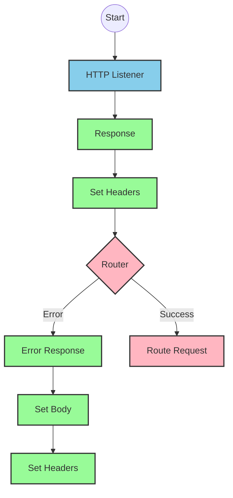
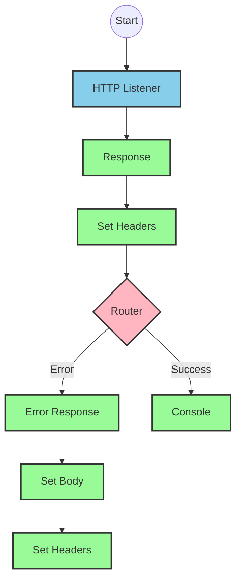
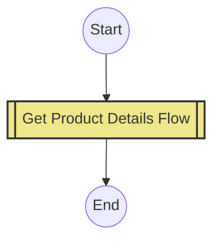
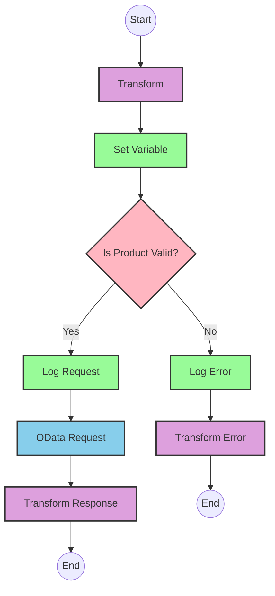

# API Overview
- This API provides product details from an SAP HANA database based on product identifiers
- Base URL pattern: `/products`

# Endpoints

## GET /products
- **Purpose**: Retrieves product details based on a product identifier
- **Request Parameters**:
  - **Query Parameters**:
    - `productIdentifier` (required): The unique identifier for the product
  - **Headers**: Standard HTTP headers
- **Response Format**:
  - Content-Type: application/json
  - Status Codes:
    - 200: Success
    - 400: Bad Request
    - 404: Not Found
    - 405: Method Not Allowed
    - 406: Not Acceptable
    - 415: Unsupported Media Type
    - 501: Not Implemented
- **Response Body**:
  - Success: Product details including ProductId, Category, CategoryName, etc.
  - Error: JSON object with status, message, and errorCode

# Current MuleSoft Flow Logic

## Flow: products-main
1. **Trigger**: HTTP listener
2. **Processing**:
   - Sets response headers
   - Routes requests based on API configuration
   - Handles errors with appropriate responses

## Flow: products-console
1. **Trigger**: HTTP listener
2. **Processing**:
   - Sets response headers
   - Logs information to console
   - Handles errors with appropriate responses

## Flow: get:\products:products-config
1. **Trigger**: HTTP GET request to `/products`
2. **Processing**:
   - References the `get-product-details-flow` subflow

## Subflow: get-product-details-flow
1. **Validation**:
   - Transforms input to check if the product identifier exists in the configured list
   ```
   %dw 2.0
   output application/java
   var productidentifer=p('odata.productIdentifiers') splitBy(",")
   ---
   sizeOf(productidentifer filter ($ == attributes.queryParams.productIdentifier))>0
   ```
   - Sets variable `isExistProduct` with the result

2. **Conditional Processing**:
   - If `isExistProduct` is true:
     - Logs that the request is being processed
     - Makes an HTTP request to the SAP HANA system with specific OData parameters:
       - `$filter`: `ProductId eq '" ++ (attributes.queryParams.productIdentifier default '') ++ "'`
       - `$select`: `ProductId,Category,CategoryName,CurrencyCode,DimensionDepth,DimensionHeight,DimensionUnit,DimensionWidth,LongDescription,Name,PictureUrl,Price,QuantityUnit,ShortDescription,SupplierId,Weight,WeightUnit`
     - Transforms the response to JSON format
   - Otherwise (if product identifier is invalid):
     - Logs that the product identifier was not found or was incorrect
     - Returns an error response with status "error", appropriate message, and errorCode "PRODUCT_NOT_FOUND"

3. **Error Handling**:
   - Global error handler for API Kit errors (BAD_REQUEST, NOT_FOUND, etc.)

# DataWeave Transformations Explained

## Product Identifier Validation Transformation
```
%dw 2.0
output application/java
var productidentifer=p('odata.productIdentifiers') splitBy(",")
---
sizeOf(productidentifer filter ($ == attributes.queryParams.productIdentifier))>0
```

**Explanation**:
1. This transformation checks if the provided product identifier is valid
2. **Input**: Query parameter `productIdentifier` from the HTTP request
3. **Output**: Boolean value (true/false) in Java format
4. **Key operations**:
   - Retrieves a comma-separated list of valid product identifiers from a property `odata.productIdentifiers`
   - Splits this string into an array using `splitBy(",")`
   - Uses the `filter` operation to find matches between the array elements and the query parameter
   - Uses `sizeOf()` to count matches and returns true if at least one match is found (count > 0)

## OData Query Parameters Transformation
```
#[output application/java
---
{
	"$filter" : "ProductId eq '" ++ (attributes.queryParams.productIdentifier default '') ++ "'",
	"$select" : "ProductId,Category,CategoryName,CurrencyCode,DimensionDepth,DimensionHeight,DimensionUnit,DimensionWidth,LongDescription,Name,PictureUrl,Price,QuantityUnit,ShortDescription,SupplierId,Weight,WeightUnit"
}]
```

**Explanation**:
1. This transformation creates OData query parameters for the HTTP request to SAP HANA
2. **Input**: Query parameter `productIdentifier` from the HTTP request
3. **Output**: Java map containing OData query parameters
4. **Key operations**:
   - Constructs a `$filter` parameter that filters products by the provided product identifier
   - Specifies a `$select` parameter to retrieve specific fields from the product data
   - Uses string concatenation (`++`) to build the filter expression
   - Uses the `default ''` operator to handle cases where productIdentifier might be null

## Response Transformation (Success Path)
```
%dw 2.0
output application/json
---
payload
```

**Explanation**:
1. This transformation simply passes through the payload from the HTTP response
2. **Input**: Response from the SAP HANA system (likely already in JSON format)
3. **Output**: JSON format (unchanged from input)
4. This is a simple pass-through transformation that ensures the output is in JSON format

## Error Response Transformation
```
%dw 2.0
output application/json
---
{
	status: "error",
	message: "The product identifier " ++ attributes.queryParams.productIdentifier ++ " was not found.",
	errorCode: "PRODUCT_NOT_FOUND"
}
```

**Explanation**:
1. This transformation creates a standardized error response
2. **Input**: Query parameter `productIdentifier` from the HTTP request
3. **Output**: JSON object with error details
4. **Key operations**:
   - Constructs a JSON object with three fields: status, message, and errorCode
   - Uses string concatenation (`++`) to include the product identifier in the error message
   - Sets a specific error code "PRODUCT_NOT_FOUND" for this type of error

# SAP Integration Suite Implementation

## Component Mapping

| MuleSoft Component | SAP Integration Suite Equivalent | Notes |
|--------------------|----------------------------------|-------|
| HTTP Listener | HTTPS Adapter (Server) | Configure with the same path and method |
| Flow Reference | Process Call | Used to call the product details subflow |
| DataWeave Transform | Content Modifier + Groovy Script | For complex transformations, use Groovy Script; for simple ones, use Content Modifier |
| Logger | Write to Message Log | Configure with the same log message |
| HTTP Request | OData Adapter | Configure with the same OData query parameters |
| Choice Router | Router | Configure with the same condition |
| Set Variable | Content Modifier | Set properties with the same variable names |
| Set Payload | Content Modifier | Set message body with the same payload |
| Error Handler | Exception Subprocess | Configure with the same error types and responses |

## Integration Flow Visualization









## Configuration Details

### HTTP Adapter (Server) Configuration
- Protocol: HTTPS
- Path: `/products`
- Method: GET
- Authentication: As per source system requirements

### OData Adapter Configuration
- Connection: SAP HANA Connection
- Service: Product Service
- Query Parameters:
  - $filter: `ProductId eq '{productIdentifier}'`
  - $select: `ProductId,Category,CategoryName,CurrencyCode,DimensionDepth,DimensionHeight,DimensionUnit,DimensionWidth,LongDescription,Name,PictureUrl,Price,QuantityUnit,ShortDescription,SupplierId,Weight,WeightUnit`

### Router Configuration
- Condition: `${property.isExistProduct}`
- Default route: Error path

### Content Modifier (for Transform)
- Action: Create new message
- Set Property `isExistProduct` using Groovy script:
  ```groovy
  def productIdentifiers = properties.get("odata.productIdentifiers").split(",")
  def productId = message.getHeaders().get("productIdentifier")
  return productIdentifiers.any { it == productId }
  ```

### Process Call
- Process: get-product-details-flow
- Synchronous: Yes

### Exception Subprocess
- Handle exceptions for:
  - APIKIT:BAD_REQUEST
  - APIKIT:NOT_FOUND
  - APIKIT:METHOD_NOT_ALLOWED
  - APIKIT:NOT_ACCEPTABLE
  - APIKIT:UNSUPPORTED_MEDIA_TYPE
  - APIKIT:NOT_IMPLEMENTED

# Configuration

## Important Configuration Parameters
- `odata.productIdentifiers`: Comma-separated list of valid product identifiers

## Environment Variables
- None explicitly mentioned in the source documentation

## Dependencies on External Systems
- SAP HANA system for product data retrieval via OData

## Security Settings
- Standard HTTP security settings for the listener
- Authentication requirements for the SAP HANA connection (not explicitly specified in source)