# SAP Integration Suite Implementation for Product API

# Table of Contents
- [API Overview](#api-overview)
- [Endpoints](#endpoints)
- [Current MuleSoft Flow Logic](#current-mulesoft-flow-logic)
- [DataWeave Transformations Explained](#dataweave-transformations-explained)
- [SAP Integration Suite Implementation](#sap-integration-suite-implementation)
  - [Component Mapping](#component-mapping)
  - [Integration Flow Visualization](#integration-flow-visualization)
- [Configuration Details](#configuration-details)
- [Configuration](#configuration)

# API Overview
This API provides access to product information from an SAP HANA backend system. It allows clients to retrieve product details by specifying a product identifier. The API validates the product identifier against a configured list of valid identifiers before retrieving the data from the SAP HANA system.

**Base URL**: `http://localhost:8081/api/v1`

# Endpoints

## GET /products
**Purpose**: Retrieves product details based on the provided product identifier.

**Request Parameters**:
- **Query Parameters**:
  - `productIdentifier` (required): The identifier of the product to retrieve

**Response Format**:
- **200 OK**: Successfully retrieved product details
  - Content-Type: application/json
  - Body: Product details JSON object
- **400 Bad Request**: Invalid request format
- **404 Not Found**: Product identifier not found
- **500 Internal Server Error**: Server-side error

**Error Response Example**:
```json
{
  "status": "error",
  "message": "The product identifier HT-9999 was not found.",
  "errorCode": "PRODUCT_NOT_FOUND"
}
```

# Current MuleSoft Flow Logic

## products-main Flow
**Trigger**: HTTP listener configured at `/api/v1/*`
**Purpose**: Main entry point for the API that handles routing to appropriate endpoints

1. Receives HTTP requests via the listener
2. Sets response headers
3. Routes requests to appropriate flows based on the API specification
4. Handles errors and formats error responses

## products-console Flow
**Trigger**: HTTP listener
**Purpose**: Provides console logging functionality for debugging

1. Receives HTTP requests
2. Sets response headers
3. Logs information to the console
4. Handles errors

## get:\products:products-config Flow
**Trigger**: HTTP GET request to `/products` endpoint
**Purpose**: Routes product requests to the product details flow

1. Receives GET requests to the `/products` endpoint
2. Calls the `get-product-details-flow` subflow

## get-product-details-flow Subflow
**Purpose**: Validates product identifier and retrieves product details

1. Validates if the provided product identifier exists in the configured list:
   ```
   %dw 2.0
   output application/java
   var productidentifer=p('odata.productIdentifiers') splitBy(",")
   ---
   sizeOf(productidentifer filter ($ == attributes.queryParams.productIdentifier))>0
   ```

2. Sets a variable `isExistProduct` with the validation result

3. Conditional processing based on validation:
   - If `isExistProduct` is true:
     - Logs: "The request is processed and sent downstream with the product identifier (#[attributes.queryParams.productIdentifier])."
     - Makes an HTTP request to the SAP HANA backend with the following query parameters:
       ```
       #[output application/java
       ---
       {
         "$filter" : "ProductId eq '" ++ (attributes.queryParams.productIdentifier default '') ++ "'",
         "$select" : "ProductId,Category,CategoryName,CurrencyCode,DimensionDepth,DimensionHeight,DimensionUnit,DimensionWidth,LongDescription,Name,PictureUrl,Price,QuantityUnit,ShortDescription,SupplierId,Weight,WeightUnit"
       }]
       ```
     - Transforms the response payload:
       ```
       %dw 2.0
       output application/json
       ---
       payload
       ```

   - If `isExistProduct` is false:
     - Logs: "The product identifier (#[attributes.queryParams.productIdentifier]) was not passed in the request or was passed incorrectly."
     - Transforms the payload to an error response:
       ```
       %dw 2.0
       output application/json
       ---
       {
         status: "error",
         message: "The product identifier " ++ attributes.queryParams.productIdentifier ++ " was not found.",
         errorCode: "PRODUCT_NOT_FOUND"
       }
       ```

# DataWeave Transformations Explained

## Product Identifier Validation Transformation
**Purpose**: Validates if the provided product identifier exists in the configured list of valid identifiers.

**Input**: Query parameter `productIdentifier` from the HTTP request
**Output**: Boolean value indicating if the product identifier is valid

**Logic**:
1. Retrieves the configured list of product identifiers from the property `odata.productIdentifiers`
2. Splits the comma-separated list into an array
3. Filters the array to find matches with the provided product identifier
4. Returns true if at least one match is found (size > 0)

```dw
%dw 2.0
output application/java
var productidentifer=p('odata.productIdentifiers') splitBy(",")
---
sizeOf(productidentifer filter ($ == attributes.queryParams.productIdentifier))>0
```

## OData Query Parameters Transformation
**Purpose**: Constructs OData query parameters for filtering and selecting product fields.

**Input**: Query parameter `productIdentifier` from the HTTP request
**Output**: OData query parameters object with $filter and $select

**Logic**:
1. Creates a $filter parameter that filters products by the provided product identifier
2. Creates a $select parameter that specifies which product fields to retrieve

```dw
#[output application/java
---
{
  "$filter" : "ProductId eq '" ++ (attributes.queryParams.productIdentifier default '') ++ "'",
  "$select" : "ProductId,Category,CategoryName,CurrencyCode,DimensionDepth,DimensionHeight,DimensionUnit,DimensionWidth,LongDescription,Name,PictureUrl,Price,QuantityUnit,ShortDescription,SupplierId,Weight,WeightUnit"
}]
```

## Product Response Transformation
**Purpose**: Passes through the product data from the backend response.

**Input**: JSON response from the SAP HANA backend
**Output**: Same JSON response (pass-through)

```dw
%dw 2.0
output application/json
---
payload
```

## Error Response Transformation
**Purpose**: Constructs an error response when the product identifier is invalid.

**Input**: Query parameter `productIdentifier` from the HTTP request
**Output**: JSON error response with status, message, and error code

```dw
%dw 2.0
output application/json
---
{
  status: "error",
  message: "The product identifier " ++ attributes.queryParams.productIdentifier ++ " was not found.",
  errorCode: "PRODUCT_NOT_FOUND"
}
```

# SAP Integration Suite Implementation

## Component Mapping

| MuleSoft Component | SAP Integration Suite Equivalent | Notes |
|--------------------|----------------------------------|-------|
| HTTP Listener | HTTPS Adapter (Receiver) | Configure with the same path and port settings |
| Router | Content Modifier + Router | Use a Content Modifier to set properties and a Router for conditional processing |
| Flow Reference | Process Call | Use Process Call to invoke another integration flow |
| Logger | Write to Message Log | Configure with the same log message |
| Transform Message | Message Mapping | Use a Message Mapping step with the same transformation logic |
| Set Variable | Content Modifier | Use Content Modifier to set properties (equivalent to variables) |
| HTTP Request | HTTPS Adapter (Sender) | Configure with the same URL and query parameters |
| Choice/When/Otherwise | Router | Use a Router with conditions equivalent to the Choice component |
| Set Payload | Content Modifier | Use Content Modifier to set the message body |
| Error Handler | Exception Subprocess | Configure exception handling with the same error types |

## Integration Flow Visualization

### REST API Integration Flow: GET /products

```mermaid
flowchart TD
%% Define node styles
classDef httpAdapter fill:#87CEEB,stroke:#333,stroke-width:2px
classDef contentModifier fill:#98FB98,stroke:#333,stroke-width:2px
classDef router fill:#FFB6C1,stroke:#333,stroke-width:2px
classDef mapping fill:#DDA0DD,stroke:#333,stroke-width:2px
classDef exception fill:#FFA07A,stroke:#333,stroke-width:2px
classDef processCall fill:#F0E68C,stroke:#333,stroke-width:2px

%% Main Flow: products-main
subgraph products-main[products-main Flow]
  start_main((Start)) --> http_listener[HTTP Listener<br>/api/v1/*]:::httpAdapter
  http_listener --> set_headers1[Set Response Headers]:::contentModifier
  set_headers1 --> router{API Router}:::router
  router -->|GET /products| get_products_flow[[get:\products:products-config]]:::processCall
  
  %% Error handling
  http_listener -.-> error_handler[(Error Handler)]:::exception
  error_handler --> set_error_body[Set Error Response]:::contentModifier
  set_error_body --> set_error_headers[Set Error Headers]:::contentModifier
end

%% Flow: get:\products:products-config
subgraph get_products_flow[get:\products:products-config Flow]
  start_get_products((Start)) --> get_product_details[[get-product-details-flow]]:::processCall
end

%% Subflow: get-product-details-flow
subgraph get_product_details[get-product-details-flow]
  start_details((Start)) --> validate_product[Validate Product ID<br>Transform]:::mapping
  validate_product --> set_var[Set isExistProduct Variable]:::contentModifier
  set_var --> product_exists{Product Exists?}:::router
  
  %% When product exists
  product_exists -->|true| log_success[Log Success]:::contentModifier
  log_success --> http_request[HTTP Request to SAP HANA<br>with OData Parameters]:::httpAdapter
  http_request --> transform_response[Transform Response]:::mapping
  
  %% When product doesn't exist
  product_exists -->|false| log_error[Log Error]:::contentModifier
  log_error --> transform_error[Transform Error Response]:::mapping
end

%% Console Flow
subgraph products_console[products-console Flow]
  start_console((Start)) --> console_listener[HTTP Listener]:::httpAdapter
  console_listener --> set_console_headers[Set Response Headers]:::contentModifier
  set_console_headers --> console_log[Console Log]:::contentModifier
  
  %% Error handling
  console_listener -.-> console_error[(Error Handler)]:::exception
  console_error --> set_console_error[Set Error Response]:::contentModifier
  set_console_error --> set_console_error_headers[Set Error Headers]:::contentModifier
end

%% Connections between flows
get_products_flow --> get_product_details
```



# Configuration Details

## HTTP Listener Configuration
- **Component**: HTTPS Adapter (Receiver)
- **Parameters**:
  - Address: `/api/v1/*`
  - Port: `8081` (from dev.yaml)
  - Authentication: None (based on source)

## HTTP Request Configuration (SAP HANA)
- **Component**: HTTPS Adapter (Sender)
- **Parameters**:
  - URL: `https://refapp-espm-ui-cf.cfapps.eu10.hana.ondemand.com:443/espm-cloud-web/espm.svc/Products` (from dev.yaml)
  - Method: GET
  - Query Parameters: Dynamically set with OData parameters ($filter, $select)

## Router Configuration (Product Exists)
- **Component**: Router
- **Condition**: `${property.isExistProduct}` (equivalent to MuleSoft's `vars.isExistProduct`)
- **Routes**:
  - True: Continue to HTTP Request
  - False: Continue to Error Response

## Message Mapping (Validate Product ID)
- **Component**: Message Mapping
- **Source Format**: XML/JSON
- **Target Format**: Java
- **Mapping Script**: Equivalent to the DataWeave script that validates product identifiers

## Content Modifier (Set isExistProduct)
- **Component**: Content Modifier
- **Action**: Create Property
- **Property Name**: isExistProduct
- **Property Value**: Result from validation mapping

## Message Mapping (Transform Response)
- **Component**: Message Mapping
- **Source Format**: JSON
- **Target Format**: JSON
- **Mapping Script**: Pass-through mapping (equivalent to the DataWeave script)

## Message Mapping (Transform Error)
- **Component**: Message Mapping
- **Source Format**: None
- **Target Format**: JSON
- **Mapping Script**: Equivalent to the DataWeave script that creates the error response

## Write to Message Log (Logger)
- **Component**: Write to Message Log
- **Log Level**: INFO
- **Message**: Same as in MuleSoft logger components

# Configuration

## Environment Variables
From the dev.yaml file:

```yaml
api:
  listener:
    port: "8081"
    path: /api/v1/*
    
hana:
  espm:
    url: refapp-espm-ui-cf.cfapps.eu10.hana.ondemand.com
    port: "443"
    path: /espm-cloud-web/espm.svc/Products
    
odata:
  productIdentifiers: "HT-2000,HT-2001"
```

## External System Dependencies
- **SAP HANA System**: The integration relies on an SAP HANA backend system accessible at `refapp-espm-ui-cf.cfapps.eu10.hana.ondemand.com:443/espm-cloud-web/espm.svc/Products`
- The system must support OData queries with $filter and $select parameters

## Security Settings
- No explicit security settings are defined in the source documentation
- For production deployment, appropriate authentication and authorization mechanisms should be configured for both the API endpoint and the connection to the SAP HANA system

## Error Handling
The integration includes error handling for:
- APIKIT:BAD_REQUEST
- APIKIT:NOT_FOUND
- APIKIT:METHOD_NOT_ALLOWED
- APIKIT:NOT_ACCEPTABLE
- APIKIT:UNSUPPORTED_MEDIA_TYPE
- APIKIT:NOT_IMPLEMENTED

These should be mapped to appropriate exception subprocesses in the SAP Integration Suite implementation.