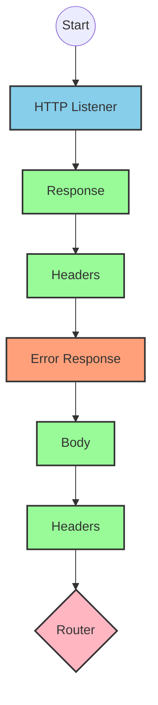
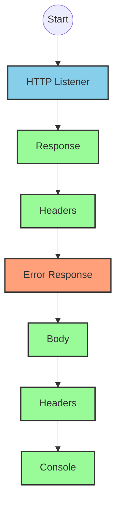
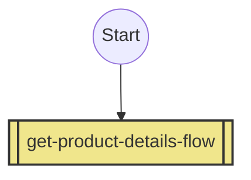
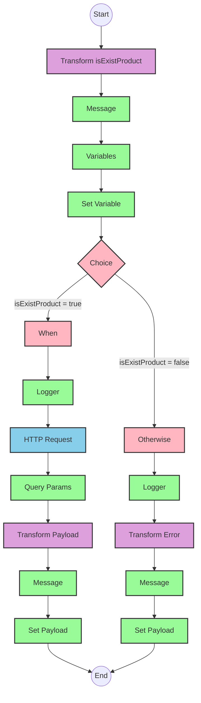

# API Overview
- This API provides product details from an SAP HANA database
- Base URL pattern: `/products`

# Endpoints

## GET /products
- **Purpose**: Retrieves product details based on a product identifier
- **Query Parameters**:
  - `productIdentifier` (required): The unique identifier for the product
- **Response Format**: JSON
- **Status Codes**:
  - 200: Success
  - 400: Bad Request
  - 404: Product Not Found
- **Response Body**: Product details including ProductId, Category, CategoryName, CurrencyCode, dimensions, descriptions, price, and other product attributes

# Current MuleSoft Flow Logic

## Flow: products-main
This is the main entry point for the API that handles HTTP requests.
1. **Trigger**: HTTP listener
2. **Processing**:
   - Sets response headers
   - Routes requests to appropriate handlers
   - Includes error response handling
3. **Outcome**: Routes API requests to the appropriate flow based on the endpoint

## Flow: products-console
This flow appears to be a console/logging version of the API.
1. **Trigger**: HTTP listener
2. **Processing**:
   - Sets response headers
   - Includes error response handling
   - Logs information to the console
3. **Outcome**: Provides console output for API requests

## Flow: get:\products:products-config
This flow handles GET requests to the /products endpoint.
1. **Trigger**: HTTP GET request to /products
2. **Processing**: Calls the `get-product-details-flow` subflow
3. **Outcome**: Returns product details based on the provided product identifier

## Subflow: get-product-details-flow
This subflow retrieves product details from SAP HANA.
1. **Processing Steps**:
   - Validates if the product identifier exists in the configured list
   - If valid, makes an HTTP request to retrieve product details
   - If invalid, returns an error response
2. **Data Transformations**:
   - Transforms the product identifier into an OData query
   - Transforms the response payload to JSON
3. **Technical Details**:
   - OData query parameters:
     - `$filter`: `ProductId eq '" ++ (attributes.queryParams.productIdentifier default '') ++ "'`
     - `$select`: `ProductId,Category,CategoryName,CurrencyCode,DimensionDepth,DimensionHeight,DimensionUnit,DimensionWidth,LongDescription,Name,PictureUrl,Price,QuantityUnit,ShortDescription,SupplierId,Weight,WeightUnit`
4. **Error Scenarios**:
   - If product identifier is not valid, returns a custom error message

# DataWeave Transformations Explained

## Product Identifier Validation Transformation
This transformation checks if the provided product identifier exists in a predefined list.

```dw
%dw 2.0
output application/java
var productidentifer=p('odata.productIdentifiers') splitBy(",")
---
sizeOf(productidentifer filter ($ == attributes.queryParams.productIdentifier))>0
```

- **Purpose**: Validates if the requested product identifier is in the allowed list
- **Input**: Query parameter `productIdentifier` from the request
- **Output**: Boolean value indicating if the product identifier is valid
- **Logic**:
  1. Retrieves a comma-separated list of valid product identifiers from a property
  2. Splits the list into an array
  3. Filters the array to find matches with the requested product identifier
  4. Returns true if at least one match is found (size > 0)

## OData Query Parameters Transformation
This transformation builds the OData query parameters for the HTTP request.

```dw
#[output application/java
---
{
	"$filter" : "ProductId eq '" ++ (attributes.queryParams.productIdentifier default '') ++ "'",
	"$select" : "ProductId,Category,CategoryName,CurrencyCode,DimensionDepth,DimensionHeight,DimensionUnit,DimensionWidth,LongDescription,Name,PictureUrl,Price,QuantityUnit,ShortDescription,SupplierId,Weight,WeightUnit"
}]
```

- **Purpose**: Creates OData query parameters for filtering and selecting product data
- **Input**: Product identifier from query parameters
- **Output**: Java map containing OData query parameters
- **Logic**:
  1. Creates a `$filter` parameter that equals the product identifier
  2. Creates a `$select` parameter that specifies which product fields to retrieve

## Response Payload Transformation
This transformation passes through the response payload as JSON.

```dw
%dw 2.0
output application/json
---
payload
```

- **Purpose**: Transforms the response payload to JSON format
- **Input**: Response from the HTTP request
- **Output**: JSON representation of the product data

## Error Response Transformation
This transformation creates a custom error response when the product identifier is invalid.

```dw
%dw 2.0
output application/json
---
{
	status: "error",
	message: "The product identifier " ++ attributes.queryParams.productIdentifier ++ " was not found.",
	errorCode: "PRODUCT_NOT_FOUND"
}
```

- **Purpose**: Creates a standardized error response
- **Input**: Query parameter `productIdentifier` from the request
- **Output**: JSON error object with status, message, and error code
- **Logic**: Constructs an error message that includes the invalid product identifier

# SAP Integration Suite Implementation

## Component Mapping

| MuleSoft Component | SAP Integration Suite Equivalent |
|-------------------|----------------------------------|
| HTTP Listener | HTTPS Adapter (Server) |
| HTTP Request | HTTP Adapter (Client) |
| Router | Router |
| Choice | Content Modifier with Router |
| Logger | Write to Log |
| Transform (DataWeave) | Message Mapping |
| Set Variable | Content Modifier |
| Set Payload | Content Modifier |
| Flow Reference | Process Call |
| Error Handler | Exception Subprocess |

## Integration Flow Visualization









## Configuration Details

### HTTPS Adapter (Server) Configuration
- **Address**: `/products`
- **Port**: 8081 (from HTTP_Listener_config)
- **Authentication**: None (based on available information)

### HTTP Adapter (Client) Configuration
- **Address**: From Hana_HTTP_Request_Configuration
- **Authentication**: To be determined based on SAP HANA requirements
- **Query Parameters**: 
  - `$filter`: Dynamic based on product identifier
  - `$select`: Product fields as specified in the original flow

### Message Mapping
- **isExistProduct Mapping**:
  - Input: Query parameters
  - Output: Boolean
  - Logic: Check if product identifier exists in configured list
- **Response Mapping**:
  - Input: HTTP response
  - Output: JSON payload
- **Error Mapping**:
  - Input: Error details
  - Output: Standardized error JSON

### Router Configuration
- **Choice Router**:
  - Condition: `vars.isExistProduct`
  - True path: Proceed with HTTP request
  - False path: Return error response

### Content Modifier
- **Set Variable**:
  - Variable Name: isExistProduct
  - Value: Result of product identifier validation
- **Set Payload**:
  - For success: HTTP response payload
  - For error: Custom error message

# Configuration

## Important Configuration Parameters
- **HTTP Listener Configuration**: HTTP_Listener_config
- **HTTP Request Configuration**: Hana_HTTP_Request_Configuration
- **API Configuration**: products-config with RAML definition

## Environment Variables
- `odata.productIdentifiers`: Comma-separated list of valid product identifiers

## Dependencies on External Systems
- SAP HANA database for product information retrieval

## Error Handling
- Global error handler for API Kit errors:
  - BAD_REQUEST
  - NOT_FOUND
  - METHOD_NOT_ALLOWED
  - NOT_ACCEPTABLE
  - UNSUPPORTED_MEDIA_TYPE
  - NOT_IMPLEMENTED