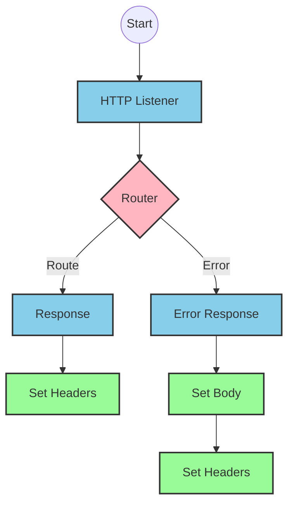
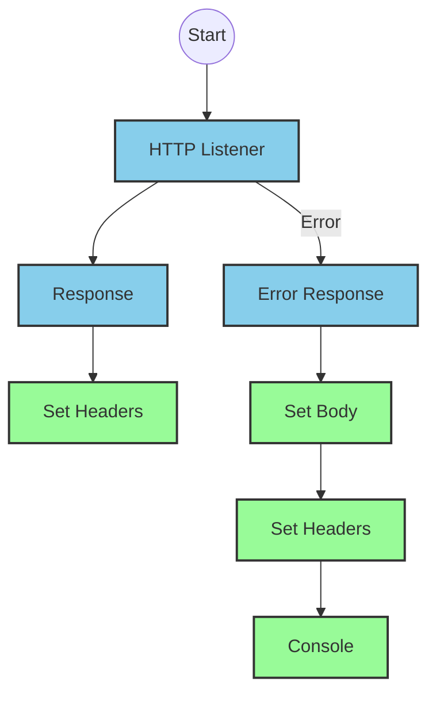
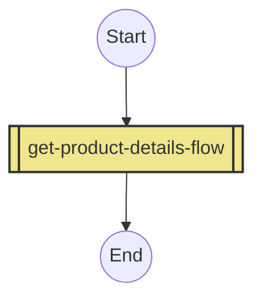
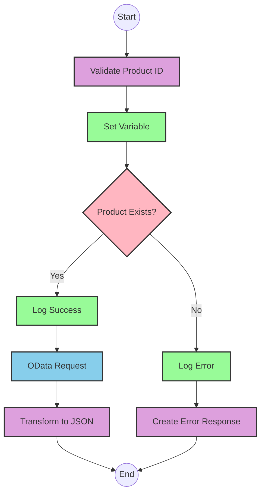

# API Overview
- This API provides product details from an SAP HANA database
- Base URL pattern: `/products`

# Endpoints

## GET /products
- **Purpose**: Retrieves product details based on a product identifier
- **Query Parameters**:
  - `productIdentifier` (required): The unique identifier for the product
- **Response Format**: JSON
- **Status Codes**:
  - 200: Success
  - 400: Bad Request
  - 404: Product Not Found
- **Response Body**:
  - Success: Product details including ProductId, Category, CategoryName, etc.
  - Error: JSON object with status, message, and errorCode

# Current MuleSoft Flow Logic

## Flow: products-main
This is the main entry point for the API that handles HTTP requests.
1. **Trigger**: HTTP listener
2. **Processing**: Routes requests to appropriate handlers
3. **Response**: Returns HTTP response with appropriate headers
4. **Error Handling**: Provides error responses with appropriate status codes

## Flow: products-console
This flow appears to be a console/logging version of the main flow.
1. **Trigger**: HTTP listener
2. **Processing**: Logs request details to console
3. **Response**: Returns HTTP response with appropriate headers
4. **Error Handling**: Provides error responses with appropriate status codes

## Flow: get:\products:products-config
This flow handles GET requests to the /products endpoint.
1. **Trigger**: HTTP GET request to /products
2. **Processing**: Calls the get-product-details-flow subflow
3. **Outcome**: Returns product details or error message

## Subflow: get-product-details-flow
This subflow retrieves product details from SAP HANA.
1. **Validation**: Checks if the provided productIdentifier is valid
2. **Processing**:
   - If valid: Queries SAP HANA for product details
   - If invalid: Returns an error message
3. **Data Transformations**:
   - Transforms the query parameters for the SAP HANA request
   - Transforms the response payload to JSON
4. **Query Parameters**:
   - Uses OData query with exact filter expressions:
     - `$filter`: `ProductId eq '" ++ (attributes.queryParams.productIdentifier default '') ++ "'`
     - `$select`: `ProductId,Category,CategoryName,CurrencyCode,DimensionDepth,DimensionHeight,DimensionUnit,DimensionWidth,LongDescription,Name,PictureUrl,Price,QuantityUnit,ShortDescription,SupplierId,Weight,WeightUnit`

# DataWeave Transformations Explained

## Transformation 1: Validate Product Identifier
This transformation checks if the provided product identifier is in the list of valid product identifiers.

```dw
%dw 2.0
output application/java
var productidentifer=p('odata.productIdentifiers') splitBy(",")
---
sizeOf(productidentifer filter ($ == attributes.queryParams.productIdentifier))>0
```

- **Input**: Query parameter containing productIdentifier
- **Output**: Boolean value (true/false)
- **Logic**: 
  1. Retrieves a comma-separated list of valid product identifiers from a property
  2. Splits the list into an array
  3. Filters the array to find matches with the provided productIdentifier
  4. Returns true if at least one match is found (size > 0)

## Transformation 2: OData Query Parameters
This transformation constructs the OData query parameters for the SAP HANA request.

```dw
#[output application/java
---
{
	"$filter" : "ProductId eq '" ++ (attributes.queryParams.productIdentifier default '') ++ "'",
	"$select" : "ProductId,Category,CategoryName,CurrencyCode,DimensionDepth,DimensionHeight,DimensionUnit,DimensionWidth,LongDescription,Name,PictureUrl,Price,QuantityUnit,ShortDescription,SupplierId,Weight,WeightUnit"
}]
```

- **Input**: Query parameter containing productIdentifier
- **Output**: Java map with OData query parameters
- **Logic**:
  1. Creates a $filter parameter that filters products by the provided productIdentifier
  2. Creates a $select parameter that specifies which fields to return
  3. Uses string concatenation (++) to build the filter expression

## Transformation 3: Pass-through Transformation
This transformation simply passes the payload through without modification.

```dw
%dw 2.0
output application/json
---
payload
```

- **Input**: Response from SAP HANA
- **Output**: Same payload in JSON format
- **Logic**: Direct pass-through with no transformation

## Transformation 4: Error Response
This transformation creates an error response when the product identifier is not found.

```dw
%dw 2.0
output application/json
---
{
	status: "error",
	message: "The product identifier " ++ attributes.queryParams.productIdentifier ++ " was not found.",
	errorCode: "PRODUCT_NOT_FOUND"
}
```

- **Input**: Query parameter containing productIdentifier
- **Output**: JSON error object
- **Logic**:
  1. Creates a structured error response with status, message, and errorCode
  2. Uses string concatenation (++) to include the productIdentifier in the error message

# SAP Integration Suite Implementation

## Component Mapping

| MuleSoft Component | SAP Integration Suite Equivalent | Notes |
|--------------------|----------------------------------|-------|
| HTTP Listener | HTTPS Adapter (Server) | Configure with the same path and method |
| Router | Content Modifier + Router | Use a Content Modifier to set properties and a Router for conditional processing |
| Flow Reference | Process Call | References another integration flow |
| Transform | Message Mapping | Use for DataWeave transformations |
| Logger | Write to Log | Configure with the same log message |
| HTTP Request | OData Adapter (Client) | Configure with the same OData query parameters |
| Set Variable | Content Modifier | Use to set exchange properties |
| Choice/When/Otherwise | Router | Use for conditional processing |
| Set Payload | Content Modifier | Use to set the message body |
| Error Handler | Exception Subprocess | Configure with the same error types and handling logic |

## Integration Flow Visualization









## Configuration Details

### HTTP Listener (Server HTTPS Adapter)
- **Address**: /products
- **Port**: 8081 (or as configured in HTTP_Listener_config)
- **Authentication**: As per source configuration

### OData Adapter (Client)
- **Service URL**: As configured in Hana_HTTP_Request_Configuration
- **Query Parameters**:
  - $filter: ProductId eq '{productIdentifier}'
  - $select: ProductId,Category,CategoryName,CurrencyCode,DimensionDepth,DimensionHeight,DimensionUnit,DimensionWidth,LongDescription,Name,PictureUrl,Price,QuantityUnit,ShortDescription,SupplierId,Weight,WeightUnit
- **Authentication**: As per source configuration

### Message Mapping (for DataWeave transformations)
- **Validate Product ID Mapping**:
  - Source: Exchange Properties
  - Target: Exchange Property (isExistProduct)
  - Mapping: Check if productIdentifier is in the list of valid product identifiers
- **Error Response Mapping**:
  - Source: Exchange Properties
  - Target: Message Body
  - Mapping: Create error JSON with status, message, and errorCode

### Router (for Choice/When/Otherwise)
- **Condition**: ${property.isExistProduct} = true
- **Routes**:
  - True: Process valid product request
  - False: Return error response

### Content Modifier (for Set Variable)
- **Property Name**: isExistProduct
- **Property Value**: Result of validation mapping

### Write to Log (for Logger)
- **Log Level**: INFO
- **Messages**:
  - Success: "The request is processed and sent downstream with the product identifier (${property.productIdentifier})."
  - Error: "The product identifier (${property.productIdentifier}) was not passed in the request or was passed incorrectly."

# Configuration

## Properties
- **odata.productIdentifiers**: Comma-separated list of valid product identifiers (from source)

## HTTP Configuration
- **HTTP_Listener_config**: Configuration for HTTP listener
- **Hana_HTTP_Request_Configuration**: Configuration for HTTP requests to SAP HANA

## API Configuration
- **products-config**: RAML API configuration
  - API: products.raml
  - outboundHeadersMapName: outboundHeaders
  - httpStatusVarName: httpStatus

## Error Handling
- **Gobal_Error_Handler**: Handles various APIKIT errors:
  - APIKIT:BAD_REQUEST
  - APIKIT:NOT_FOUND
  - APIKIT:METHOD_NOT_ALLOWED
  - APIKIT:NOT_ACCEPTABLE
  - APIKIT:UNSUPPORTED_MEDIA_TYPE
  - APIKIT:NOT_IMPLEMENTED