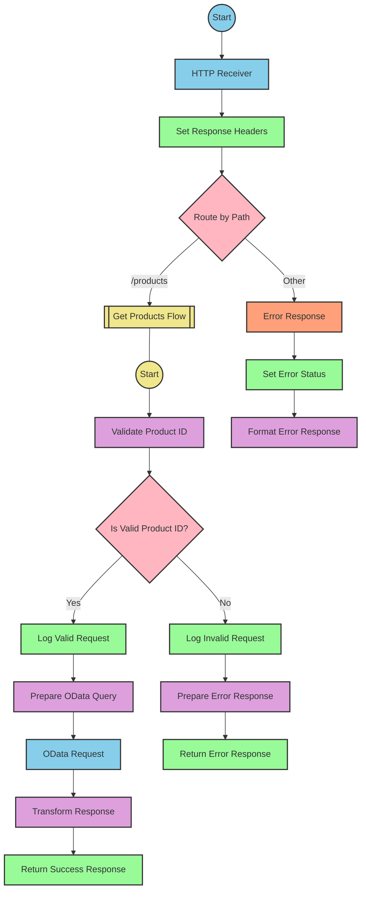

# SAP Integration Suite Documentation for Product API

# Table of Contents
- [API Overview](#api-overview)
- [Endpoints](#endpoints)
  - [GET /products](#get-products)
- [Current MuleSoft Flow Logic](#current-mulesoft-flow-logic)
  - [products-main Flow](#products-main-flow)
  - [products-console Flow](#products-console-flow)
  - [get:\products:products-config Flow](#getproductsproducts-config-flow)
  - [get-product-details-flow Subflow](#get-product-details-flow-subflow)
- [DataWeave Transformations Explained](#dataweave-transformations-explained)
  - [Product Identifier Validation](#product-identifier-validation)
  - [OData Query Parameters](#odata-query-parameters)
  - [Response Payload Transformation](#response-payload-transformation)
  - [Error Response Transformation](#error-response-transformation)
- [SAP Integration Suite Implementation](#sap-integration-suite-implementation)
  - [Component Mapping](#component-mapping)
  - [Integration Flow Visualization](#integration-flow-visualization)
- [Configuration Details](#configuration-details)
  - [HTTP Adapter Configuration](#http-adapter-configuration)
  - [OData Adapter Configuration](#odata-adapter-configuration)
  - [Content Modifier Configuration](#content-modifier-configuration)
  - [Router Configuration](#router-configuration)
- [Configuration](#configuration)
  - [Environment Variables](#environment-variables)
  - [External System Dependencies](#external-system-dependencies)

# API Overview
The Product API provides access to product information from an SAP HANA backend system. It allows clients to retrieve product details by specifying a product identifier. The API validates the product identifier against a configured list of valid identifiers before retrieving the data from the backend system.

- Base URL: `http://localhost:8081/api/v1`

# Endpoints

## GET /products
This endpoint retrieves product details based on the provided product identifier.

**Request Parameters:**
- Query Parameters:
  - `productIdentifier` (required): The unique identifier of the product to retrieve

**Response Format:**
- Content-Type: `application/json`
- Status Codes:
  - 200: Success - Returns product details
  - 400: Bad Request - Invalid input
  - 404: Not Found - Product not found
  - 500: Internal Server Error

**Example Request:**
```
GET /api/v1/products?productIdentifier=HT-2000
```

**Example Response (200 OK):**
```json
{
  "ProductId": "HT-2000",
  "Category": "Notebooks",
  "CategoryName": "Notebooks",
  "CurrencyCode": "USD",
  "DimensionDepth": 30,
  "DimensionHeight": 3,
  "DimensionUnit": "cm",
  "DimensionWidth": 40,
  "LongDescription": "Notebook Basic 17 with 2,80 GHz quad core, 17\" LCD, 4 GB DDR3 RAM, 500 GB Hard Disc, Windows 8 Pro",
  "Name": "Notebook Basic 17",
  "PictureUrl": "/sap/public/bc/NWDEMO_MODEL/IMAGES/HT-2000.jpg",
  "Price": 1249,
  "QuantityUnit": "EA",
  "ShortDescription": "Notebook Basic 17 with 2,80 GHz quad core, 17\" LCD, 4 GB DDR3 RAM, 500 GB Hard Disc",
  "SupplierId": "0100000046",
  "Weight": 4.5,
  "WeightUnit": "KG"
}
```

**Example Error Response (404 Not Found):**
```json
{
  "status": "error",
  "message": "The product identifier HT-3000 was not found.",
  "errorCode": "PRODUCT_NOT_FOUND"
}
```

# Current MuleSoft Flow Logic

## products-main Flow
This is the main entry point for the API. It handles HTTP requests, routes them to the appropriate flow based on the endpoint, and manages error responses.

1. **Trigger**: HTTP Listener configured to listen on `/api/v1/*`
2. **Processing Steps**:
   - Sets response headers
   - Routes requests to the appropriate flow based on the endpoint path
   - Handles errors and formats error responses

## products-console Flow
This flow is similar to the main flow but includes console logging for debugging purposes.

1. **Trigger**: HTTP Listener (likely for development/testing)
2. **Processing Steps**:
   - Sets response headers
   - Logs request details to the console
   - Handles errors and formats error responses

## get:\products:products-config Flow
This flow handles GET requests to the `/products` endpoint.

1. **Trigger**: Routed from the main flow when a GET request to `/products` is received
2. **Processing Steps**:
   - Calls the `get-product-details-flow` subflow to process the request

## get-product-details-flow Subflow
This subflow handles the core business logic for retrieving product details.

1. **Trigger**: Called from the `get:\products:products-config` flow
2. **Processing Steps**:
   - Validates the product identifier against a configured list of valid identifiers
   - If valid, logs the request and sends it to the backend system
   - If invalid, logs an error and returns an error response
3. **Data Transformations**:
   - Transforms the request to include OData query parameters
   - Transforms the response to the expected JSON format
4. **Error Handling**:
   - Returns a formatted error response if the product identifier is invalid

The flow includes these key technical components:

1. **Product Identifier Validation**:
   ```
   %dw 2.0
   output application/java
   var productidentifer=p('odata.productIdentifiers') splitBy(",")
   ---
   sizeOf(productidentifer filter ($ == attributes.queryParams.productIdentifier))>0
   ```

2. **OData Query Parameters**:
   ```
   #[output application/java
   ---
   {
       "$filter" : "ProductId eq '" ++ (attributes.queryParams.productIdentifier default '') ++ "'",
       "$select" : "ProductId,Category,CategoryName,CurrencyCode,DimensionDepth,DimensionHeight,DimensionUnit,DimensionWidth,LongDescription,Name,PictureUrl,Price,QuantityUnit,ShortDescription,SupplierId,Weight,WeightUnit"
   }]
   ```

3. **Response Transformation**:
   ```
   %dw 2.0
   output application/json
   ---
   payload
   ```

4. **Error Response Transformation**:
   ```
   %dw 2.0
   output application/json
   ---
   {
       status: "error",
       message: "The product identifier " ++ attributes.queryParams.productIdentifier ++ " was not found.",
       errorCode: "PRODUCT_NOT_FOUND"
   }
   ```

# DataWeave Transformations Explained

## Product Identifier Validation
This transformation validates if the provided product identifier is in the list of configured valid identifiers.

**Input**: Query parameter `productIdentifier` from the HTTP request
**Output**: Boolean value indicating if the product identifier is valid

```dw
%dw 2.0
output application/java
var productidentifer=p('odata.productIdentifiers') splitBy(",")
---
sizeOf(productidentifer filter ($ == attributes.queryParams.productIdentifier))>0
```

**Explanation**:
1. The transformation retrieves the list of valid product identifiers from the configuration property `odata.productIdentifiers`
2. It splits the comma-separated string into an array using `splitBy(",")`
3. It filters the array to find elements that match the provided `productIdentifier` query parameter
4. It checks if the size of the filtered array is greater than 0, returning `true` if a match is found

## OData Query Parameters
This transformation constructs the OData query parameters for the backend request.

**Input**: Query parameter `productIdentifier` from the HTTP request
**Output**: OData query parameters as a Java map

```dw
#[output application/java
---
{
    "$filter" : "ProductId eq '" ++ (attributes.queryParams.productIdentifier default '') ++ "'",
    "$select" : "ProductId,Category,CategoryName,CurrencyCode,DimensionDepth,DimensionHeight,DimensionUnit,DimensionWidth,LongDescription,Name,PictureUrl,Price,QuantityUnit,ShortDescription,SupplierId,Weight,WeightUnit"
}]
```

**Explanation**:
1. The transformation creates a map with two OData query parameters:
   - `$filter`: Filters products where the ProductId equals the provided product identifier
   - `$select`: Specifies which fields to include in the response
2. It uses string concatenation (`++`) to insert the product identifier into the filter expression
3. It uses the `default ''` operator to handle cases where the product identifier is not provided

## Response Payload Transformation
This simple transformation passes the payload through without modification.

**Input**: Response from the backend system
**Output**: JSON response to the client

```dw
%dw 2.0
output application/json
---
payload
```

**Explanation**:
1. The transformation sets the output MIME type to `application/json`
2. It passes the payload through without modification, assuming the backend response is already in the desired format

## Error Response Transformation
This transformation creates a standardized error response when the product identifier is invalid.

**Input**: Query parameter `productIdentifier` from the HTTP request
**Output**: JSON error response

```dw
%dw 2.0
output application/json
---
{
    status: "error",
    message: "The product identifier " ++ attributes.queryParams.productIdentifier ++ " was not found.",
    errorCode: "PRODUCT_NOT_FOUND"
}
```

**Explanation**:
1. The transformation creates a JSON object with three fields:
   - `status`: Set to "error" to indicate an error response
   - `message`: A descriptive error message that includes the invalid product identifier
   - `errorCode`: A standardized error code "PRODUCT_NOT_FOUND"
2. It uses string concatenation (`++`) to insert the product identifier into the error message

# SAP Integration Suite Implementation

## Component Mapping

| MuleSoft Component | SAP Integration Suite Equivalent | Notes |
|--------------------|----------------------------------|-------|
| HTTP Listener | HTTP Adapter (Receiver) | Configure with the same path and port settings |
| Router | Router | Maps to the same conditional routing logic |
| Flow Reference | Process Call | Used to call subflows |
| Transform (DataWeave) | Content Modifier with Script | Use Groovy or JavaScript for similar transformations |
| Logger | Write to Message Log | Configure with the same log messages |
| HTTP Request | OData Adapter (Sender) | Configure with the same OData query parameters |
| Set Variable | Content Modifier | Used to set exchange properties |
| Choice/When/Otherwise | Router with multiple branches | Implements the same conditional logic |
| Error Handler | Exception Subprocess | Handles errors with the same status codes |

## Integration Flow Visualization

### REST API Integration Flow: GET /products



# Configuration Details

## HTTP Adapter Configuration

### HTTP Receiver
- **Address**: `/api/v1/*`
- **Port**: `8081` (from `api.listener.port` property)
- **CSRF Protection**: Disabled
- **Authentication**: None (based on source documentation)
- **Message Protocol**: REST

## OData Adapter Configuration

### OData Sender
- **Address**: `https://refapp-espm-ui-cf.cfapps.eu10.hana.ondemand.com:443/espm-cloud-web/espm.svc/Products` (from `hana.espm.*` properties)
- **Query Options**:
  - **$filter**: `ProductId eq '{productIdentifier}'`
  - **$select**: `ProductId,Category,CategoryName,CurrencyCode,DimensionDepth,DimensionHeight,DimensionUnit,DimensionWidth,LongDescription,Name,PictureUrl,Price,QuantityUnit,ShortDescription,SupplierId,Weight,WeightUnit`
- **Authentication**: None (based on source documentation)

## Content Modifier Configuration

### Validate Product ID
- **Script Language**: Groovy
- **Script**:
  ```groovy
  def productIdentifiers = properties.get("odata.productIdentifiers").split(",")
  def productId = message.getHeaders().get("productIdentifier")
  def isValid = productIdentifiers.any { it == productId }
  message.setProperty("isExistProduct", isValid)
  return message
  ```

### Prepare OData Query
- **Script Language**: Groovy
- **Script**:
  ```groovy
  def productId = message.getHeaders().get("productIdentifier") ?: ""
  def filter = "ProductId eq '" + productId + "'"
  def select = "ProductId,Category,CategoryName,CurrencyCode,DimensionDepth,DimensionHeight,DimensionUnit,DimensionWidth,LongDescription,Name,PictureUrl,Price,QuantityUnit,ShortDescription,SupplierId,Weight,WeightUnit"
  
  message.setHeader("$filter", filter)
  message.setHeader("$select", select)
  return message
  ```

### Prepare Error Response
- **Script Language**: Groovy
- **Script**:
  ```groovy
  def productId = message.getHeaders().get("productIdentifier")
  def errorResponse = [
    status: "error",
    message: "The product identifier " + productId + " was not found.",
    errorCode: "PRODUCT_NOT_FOUND"
  ]
  
  message.setBody(groovy.json.JsonOutput.toJson(errorResponse))
  message.setHeader("Content-Type", "application/json")
  return message
  ```

## Router Configuration

### Route by Path
- **Condition 1**: `${header.CamelHttpPath} == '/products'`
  - **True**: Route to Get Products Flow
  - **False**: Route to Error Response

### Is Valid Product ID?
- **Condition 1**: `${property.isExistProduct} == true`
  - **True**: Route to Log Valid Request
  - **False**: Route to Log Invalid Request

# Configuration

## Environment Variables
Based on the source documentation, the following environment variables or properties are required:

```yaml
api:
  listener:
    port: "8081"
    path: /api/v1/*
    
hana:
  espm:
    url: refapp-espm-ui-cf.cfapps.eu10.hana.ondemand.com
    port: "443"
    path: /espm-cloud-web/espm.svc/Products
    
odata:
  productIdentifiers: "HT-2000,HT-2001"
```

## External System Dependencies
The integration depends on the following external systems:

1. **SAP HANA ESPM Service**
   - **URL**: `https://refapp-espm-ui-cf.cfapps.eu10.hana.ondemand.com:443/espm-cloud-web/espm.svc/Products`
   - **Protocol**: OData
   - **Authentication**: None specified in source documentation (would need to be configured based on actual requirements)