# SAP OData Product Information API Integration

## Table of Contents
- [API Overview](#api-overview)
- [Endpoints](#endpoints)
  - [GET /products](#get-products)
- [Current MuleSoft Flow Logic](#current-mulesoft-flow-logic)
  - [products-main Flow](#products-main-flow)
  - [products-console Flow](#products-console-flow)
  - [get:\products:products-config Flow](#getproductsproducts-config-flow)
  - [get-product-details-flow Subflow](#get-product-details-flow-subflow)
- [DataWeave Transformations Explained](#dataweave-transformations-explained)
  - [Product Identifier Validation](#product-identifier-validation)
  - [OData Query Parameters Construction](#odata-query-parameters-construction)
  - [Response Payload Transformation](#response-payload-transformation)
  - [Error Response Transformation](#error-response-transformation)
- [SAP Integration Suite Implementation](#sap-integration-suite-implementation)
  - [Component Mapping](#component-mapping)
  - [Integration Flow Visualization](#integration-flow-visualization)
  - [Configuration Details](#configuration-details)
- [Environment Configuration](#environment-configuration)
- [API Reference](#api-reference)

## API Overview
This API provides access to product information stored in an SAP HANA database through OData services. The integration retrieves detailed product information based on a product identifier provided as a query parameter. The API validates the product identifier against a configured list of valid identifiers before making the request to the backend system.

- **Base URL**: Determined by the HTTP_Listener_config
- **Authentication**: Not explicitly defined in the source documentation
- **Response Format**: JSON
- **Primary Function**: Retrieve product details by product identifier

## Endpoints

### GET /products
Retrieves detailed product information based on a product identifier.

- **HTTP Method**: GET
- **Path**: /products
- **Purpose**: Fetch product details from SAP HANA database via OData service

**Request Parameters**:
- **Query Parameters**:
  - `productIdentifier` (required): The unique identifier of the product to retrieve

**Response Format**:
- **Success Response**:
  - **Status Code**: 200 OK
  - **Content Type**: application/json
  - **Body**: Product details including ProductId, Category, CategoryName, CurrencyCode, dimensions, descriptions, price, and other product attributes

- **Error Response**:
  - **Status Code**: 400 Bad Request (or other appropriate error code)
  - **Content Type**: application/json
  - **Body**: Error object with status, message, and errorCode
    ```json
    {
      "status": "error",
      "message": "The product identifier {identifier} was not found.",
      "errorCode": "PRODUCT_NOT_FOUND"
    }
    ```

## Current MuleSoft Flow Logic

### products-main Flow
1. **Trigger**: HTTP listener receives incoming requests
2. **Processing**:
   - Sets response headers
   - Routes the request to appropriate handler based on path and method
   - Handles errors and formats error responses

### products-console Flow
1. **Trigger**: HTTP listener receives incoming requests
2. **Processing**:
   - Sets response headers
   - Logs request details to console
   - Handles errors and formats error responses

### get:\products:products-config Flow
1. **Trigger**: Receives GET requests to the /products endpoint
2. **Processing**:
   - Calls the get-product-details-flow subflow to process the request

### get-product-details-flow Subflow
1. **Validation**:
   - Transforms the request to validate if the provided productIdentifier is in the list of valid product identifiers
   - Sets a variable `isExistProduct` based on the validation result

2. **Conditional Processing**:
   - If `isExistProduct` is true:
     - Logs that the request is being processed
     - Constructs OData query parameters with $filter and $select
     - Makes HTTP request to SAP HANA backend
     - Transforms the response to JSON format
   - If `isExistProduct` is false:
     - Logs that the product identifier was not found or incorrectly passed
     - Returns an error response with PRODUCT_NOT_FOUND error code

## DataWeave Transformations Explained

### Product Identifier Validation
This transformation checks if the provided product identifier exists in a configured list of valid product identifiers.

**Input**: Query parameters from the HTTP request
**Output**: Boolean value indicating if the product identifier is valid

```dw
%dw 2.0
output application/java
var productidentifer=p('odata.productIdentifiers') splitBy(",")
---
sizeOf(productidentifer filter ($ == attributes.queryParams.productIdentifier))>0
```

**Explanation**:
1. Retrieves the list of valid product identifiers from a property `odata.productIdentifiers`
2. Splits the comma-separated list into an array
3. Filters the array to find matches with the provided productIdentifier
4. Returns true if at least one match is found (size > 0)

### OData Query Parameters Construction
This transformation constructs the OData query parameters for the backend request.

**Input**: HTTP request attributes
**Output**: OData query parameters as a Java map

```dw
#[output application/java
---
{
	"$filter" : "ProductId eq '" ++ (attributes.queryParams.productIdentifier default '') ++ "'",
	"$select" : "ProductId,Category,CategoryName,CurrencyCode,DimensionDepth,DimensionHeight,DimensionUnit,DimensionWidth,LongDescription,Name,PictureUrl,Price,QuantityUnit,ShortDescription,SupplierId,Weight,WeightUnit"
}]
```

**Explanation**:
1. Creates a map with two OData query parameters:
   - `$filter`: Filters products where ProductId equals the provided productIdentifier
   - `$select`: Specifies which fields to include in the response

### Response Payload Transformation
This transformation passes through the response from the backend system.

**Input**: Response from the backend OData service
**Output**: JSON response to be returned to the client

```dw
%dw 2.0
output application/json
---
payload
```

**Explanation**:
- Simply converts the payload to JSON format without modifying its structure

### Error Response Transformation
This transformation creates an error response when the product identifier is invalid.

**Input**: HTTP request attributes
**Output**: JSON error response

```dw
%dw 2.0
output application/json
---
{
	status: "error",
	message: "The product identifier " ++ attributes.queryParams.productIdentifier ++ " was not found.",
	errorCode: "PRODUCT_NOT_FOUND"
}
```

**Explanation**:
1. Creates a JSON object with three fields:
   - `status`: Set to "error"
   - `message`: Dynamic error message including the invalid product identifier
   - `errorCode`: Set to "PRODUCT_NOT_FOUND"

## SAP Integration Suite Implementation

### Component Mapping

| MuleSoft Component | SAP Integration Suite Equivalent | Notes |
|--------------------|----------------------------------|-------|
| HTTP Listener | HTTPS Adapter (Receiver) | Configure with the same path and method settings |
| Router | Content Modifier + Router | Use a Content Modifier to set properties and a Router for conditional processing |
| Flow Reference | Process Call | References to other integration flows |
| Transform (DataWeave) | Groovy Script or Message Mapping | Convert DataWeave scripts to equivalent Groovy or Message Mapping |
| Logger | Write to Message Log | Configure with the same log messages |
| HTTP Request | OData Adapter (Sender) | Configure with the same OData query parameters |
| Set Variable | Content Modifier | Use to set exchange properties |
| Choice/When/Otherwise | Router | Implement conditional logic with Router component |
| Set Payload | Content Modifier | Set the message body |
| Error Handler | Exception Subprocess | Configure with appropriate error handling logic |

### Integration Flow Visualization

```mermaid
flowchart TD
    %% Define node styles
    classDef httpAdapter fill:#87CEEB,stroke:#333,stroke-width:2px
    classDef contentModifier fill:#98FB98,stroke:#333,stroke-width:2px
    classDef router fill:#FFB6C1,stroke:#333,stroke-width:2px
    classDef mapping fill:#DDA0DD,stroke:#333,stroke-width:2px
    classDef exception fill:#FFA07A,stroke:#333,stroke-width:2px
    classDef processCall fill:#F0E68C,stroke:#333,stroke-width:2px

    %% Main Flow
    subgraph MainFlow["Products API Main Flow"]
        A((Start)) --> B[HTTP Listener]:::httpAdapter
        B --> C[Set Response Headers]:::contentModifier
        C --> D{API Router}:::router
        D -->|GET /products| E[[Get Products Flow]]:::processCall
        D -->|Other Paths| F[Error Response]:::contentModifier
    end

    %% Get Products Flow
    subgraph GetProductsFlow["Get Products Flow"]
        G((Start)) --> H[[Get Product Details Subflow]]:::processCall
    end

    %% Get Product Details Subflow
    subgraph GetProductDetailsSubflow["Get Product Details Subflow"]
        I((Start)) --> J[Validate Product Identifier]:::mapping
        J --> K[Set isExistProduct Variable]:::contentModifier
        K --> L{Product Exists?}:::router
        L -->|Yes| M[Log Request Processing]:::contentModifier
        M --> N[Construct OData Query]:::mapping
        N --> O[OData Request to SAP HANA]:::httpAdapter
        O --> P[Transform Response to JSON]:::mapping
        L -->|No| Q[Log Invalid Product ID]:::contentModifier
        Q --> R[Create Error Response]:::mapping
    end

    %% Error Handling
    subgraph ErrorHandling["Error Handling"]
        ERR1[(Global Error Handler)]:::exception --> ERR2[Format Error Response]:::contentModifier
        ERR2 --> ERR3[Set Error Headers]:::contentModifier
    end
```



### Configuration Details

#### HTTP Adapter (Receiver)
- **Address**: `/products`
- **Supported Methods**: GET
- **Authentication**: To be determined based on security requirements
- **CSRF Protection**: Disabled

#### OData Adapter (Sender)
- **Connection**: SAP HANA HTTP Connection
- **OData Service Path**: To be determined based on SAP HANA configuration
- **Query Options**:
  - **$filter**: `ProductId eq '{productIdentifier}'`
  - **$select**: `ProductId,Category,CategoryName,CurrencyCode,DimensionDepth,DimensionHeight,DimensionUnit,DimensionWidth,LongDescription,Name,PictureUrl,Price,QuantityUnit,ShortDescription,SupplierId,Weight,WeightUnit`

#### Content Modifiers
1. **Set Response Headers**:
   - Content-Type: application/json

2. **Set isExistProduct Variable**:
   - Property Name: isExistProduct
   - Source: Script
   - Script Type: Groovy
   - Script:
     ```groovy
     def productIdentifiers = property.get("odata.productIdentifiers").split(",")
     def requestedId = message.getHeaders().get("productIdentifier")
     return productIdentifiers.any { it == requestedId }
     ```

3. **Log Request Processing**:
   - Log Level: INFO
   - Message: "The request is processed and sent downstream with the product identifier (${header.productIdentifier})."

4. **Log Invalid Product ID**:
   - Log Level: WARN
   - Message: "The product identifier (${header.productIdentifier}) was not passed in the request or was passed incorrectly."

#### Router Configurations
1. **API Router**:
   - Condition 1: ${header.CamelHttpMethod} == 'GET' && ${header.CamelHttpPath} == '/products'
   - Default: Error Response

2. **Product Exists Router**:
   - Condition: ${property.isExistProduct} == true
   - Default: Error Response Path

#### Exception Subprocess
- **Global Error Handler**:
  - Handle all exceptions
  - Set HTTP status code based on exception type
  - Format error response with status, message, and error code

## Environment Configuration

### Important Configuration Parameters
- **odata.productIdentifiers**: Comma-separated list of valid product identifiers

### Connection Details
1. **HTTP_Listener_config**:
   - Protocol: HTTP/HTTPS
   - Host: To be configured based on deployment environment
   - Port: To be configured based on deployment environment

2. **Hana_HTTP_Request_Configuration**:
   - Base URL: SAP HANA OData service endpoint
   - Authentication: To be determined based on SAP HANA configuration
   - Timeout: Recommended 30 seconds

### Security Settings
- Authentication mechanism not explicitly defined in source documentation
- Consider implementing OAuth2 or Basic Authentication based on security requirements
- HTTPS should be used for all production deployments

### Deployment Considerations
- Configure appropriate memory and CPU resources based on expected load
- Set up monitoring for API availability and response times
- Implement rate limiting if needed to prevent abuse

## API Reference

### Complete Endpoint List
- **GET /products**: Retrieve product details by product identifier

### Request Parameters
- **productIdentifier** (query parameter, required): The unique identifier of the product to retrieve

### Response Schema
**Success Response**:
```json
{
  "ProductId": "string",
  "Category": "string",
  "CategoryName": "string",
  "CurrencyCode": "string",
  "DimensionDepth": "number",
  "DimensionHeight": "number",
  "DimensionUnit": "string",
  "DimensionWidth": "number",
  "LongDescription": "string",
  "Name": "string",
  "PictureUrl": "string",
  "Price": "number",
  "QuantityUnit": "string",
  "ShortDescription": "string",
  "SupplierId": "string",
  "Weight": "number",
  "WeightUnit": "string"
}
```

**Error Response**:
```json
{
  "status": "error",
  "message": "string",
  "errorCode": "string"
}
```

### Error Codes
- **PRODUCT_NOT_FOUND**: The requested product identifier was not found or is invalid
- Additional error codes may be returned by the API framework for standard HTTP errors

### Authentication
Authentication requirements not explicitly defined in source documentation. Implementation should follow organizational security standards.

### Rate Limiting
Rate limiting information not provided in source documentation. Consider implementing based on expected usage patterns and backend system capabilities.