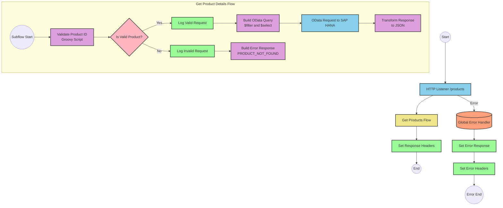

# SAP HANA Product Information API Integration

## Table of Contents
- [SAP HANA Product Information API Integration](#sap-hana-product-information-api-integration)
  - [Table of Contents](#table-of-contents)
  - [API Overview](#api-overview)
  - [Endpoints](#endpoints)
    - [GET /products](#get-products)
  - [Current MuleSoft Flow Logic](#current-mulesoft-flow-logic)
    - [Main Flows](#main-flows)
    - [Subflows](#subflows)
  - [DataWeave Transformations Explained](#dataweave-transformations-explained)
    - [Product Identifier Validation](#product-identifier-validation)
    - [OData Query Parameters Construction](#odata-query-parameters-construction)
    - [Response Transformation](#response-transformation)
    - [Error Response Construction](#error-response-construction)
  - [SAP Integration Suite Implementation](#sap-integration-suite-implementation)
    - [Component Mapping](#component-mapping)
    - [Integration Flow Visualization](#integration-flow-visualization)
    - [Configuration Details](#configuration-details)
  - [Environment Configuration](#environment-configuration)
  - [API Reference](#api-reference)
    - [GET /products](#get-products-1)
    - [Error Codes](#error-codes)

## API Overview
This API provides access to product information stored in SAP HANA. It allows clients to retrieve detailed product information by providing a product identifier. The API validates the product identifier against a configured list of valid identifiers before querying the SAP HANA database using OData queries.

- **Base URL**: Determined by the HTTP_Listener_config
- **Authentication**: Not explicitly defined in the source documentation
- **Rate Limiting**: Not specified in the source documentation
- **General Response Format**: JSON

The API serves as a middleware layer between client applications and the SAP HANA backend, providing a simplified interface for retrieving product details while handling validation and error scenarios.

## Endpoints

### GET /products
Retrieves detailed product information based on a provided product identifier.

- **HTTP Method**: GET
- **Path**: /products
- **Purpose**: Fetch detailed information about a specific product from SAP HANA

**Request Parameters**:
- **Query Parameters**:
  - `productIdentifier` (required): The unique identifier of the product to retrieve

**Response Format**:
- **Success Response (200 OK)**:
  - Content-Type: application/json
  - Body: JSON object containing product details from SAP HANA

**Error Responses**:
- **400 Bad Request**:
  - When the product identifier is invalid or not found
  - Content-Type: application/json
  - Body: JSON object with status, message, and errorCode

**Example Error Response**:
```json
{
  "status": "error",
  "message": "The product identifier ABC123 was not found.",
  "errorCode": "PRODUCT_NOT_FOUND"
}
```

## Current MuleSoft Flow Logic

### Main Flows

1. **products-main Flow**
   - Triggered by an HTTP listener
   - Sets response headers
   - Handles errors with an error-response component
   - Routes requests based on the API specification

2. **products-console Flow**
   - Triggered by an HTTP listener
   - Sets response headers
   - Handles errors with an error-response component
   - Logs information to the console

3. **get:\products:products-config Flow**
   - Triggered when a GET request is made to the /products endpoint
   - References the get-product-details-flow subflow to process the request

### Subflows

**get-product-details-flow**:
1. Validates the product identifier against a configured list of valid identifiers
   - Uses a DataWeave transformation to check if the provided productIdentifier exists in the configured list
   - Sets a variable `isExistProduct` with the result of this validation

2. Uses a choice router to handle valid and invalid product identifiers:
   - **When Valid**:
     - Logs that the request is being processed
     - Constructs an OData query with $filter and $select parameters
     - Sends the request to SAP HANA
     - Transforms the response to JSON format
   
   - **When Invalid**:
     - Logs that the product identifier was not found or incorrectly passed
     - Constructs an error response with status, message, and errorCode

## DataWeave Transformations Explained

### Product Identifier Validation

This transformation checks if the provided product identifier exists in a configured list of valid identifiers.

**Input**: The product identifier from the query parameters and a configured list of valid identifiers
**Output**: A boolean value indicating whether the product identifier is valid

```dw
%dw 2.0
output application/java
var productidentifer=p('odata.productIdentifiers') splitBy(",")
---
sizeOf(productidentifer filter ($ == attributes.queryParams.productIdentifier))>0
```

**Explanation**:
1. Retrieves the configured list of valid product identifiers from a property `odata.productIdentifiers`
2. Splits this comma-separated list into an array
3. Filters the array to find elements matching the provided product identifier
4. Checks if the size of the filtered array is greater than 0 (indicating a match was found)

### OData Query Parameters Construction

This transformation builds the OData query parameters for the SAP HANA request.

**Input**: The product identifier from the query parameters
**Output**: A map of OData query parameters

```dw
#[output application/java
---
{
	"$filter" : "ProductId eq '" ++ (attributes.queryParams.productIdentifier default '') ++ "'",
	"$select" : "ProductId,Category,CategoryName,CurrencyCode,DimensionDepth,DimensionHeight,DimensionUnit,DimensionWidth,LongDescription,Name,PictureUrl,Price,QuantityUnit,ShortDescription,SupplierId,Weight,WeightUnit"
}]
```

**Explanation**:
1. Constructs a $filter parameter that filters products where ProductId equals the provided product identifier
2. Includes a default empty string if the product identifier is not provided
3. Specifies a $select parameter to retrieve specific fields from the product record

### Response Transformation

This transformation passes through the response from SAP HANA without modification.

**Input**: The response payload from SAP HANA
**Output**: The same payload in JSON format

```dw
%dw 2.0
output application/json
---
payload
```

### Error Response Construction

This transformation builds an error response when the product identifier is invalid.

**Input**: The invalid product identifier from the query parameters
**Output**: A JSON error object

```dw
%dw 2.0
output application/json
---
{
	status: "error",
	message: "The product identifier " ++ attributes.queryParams.productIdentifier ++ " was not found.",
	errorCode: "PRODUCT_NOT_FOUND"
}
```

**Explanation**:
1. Creates a JSON object with three fields: status, message, and errorCode
2. Includes the invalid product identifier in the error message

## SAP Integration Suite Implementation

### Component Mapping

| MuleSoft Component | SAP Integration Suite Equivalent | Notes |
|--------------------|----------------------------------|-------|
| HTTP Listener | HTTPS Adapter (Receiver) | Configure with the same path and method |
| Flow Reference | Process Call | Used to call the product details subflow |
| DataWeave Transformation | Content Modifier + Groovy Script | For complex transformations, use Groovy Script; for simple mappings, use Content Modifier |
| Logger | Write to Log | Configure with the same log message |
| Choice Router | Router | Configure with the same condition |
| HTTP Request | OData Adapter (Sender) | Configure with the same OData query parameters |
| Set Payload | Content Modifier | Set the message body |
| Set Variable | Content Modifier | Set properties in the message header |
| Error Handler | Exception Subprocess | Configure to handle the same error types |

### Integration Flow Visualization



### Configuration Details

**HTTPS Adapter (Receiver)**:
- Path: /products
- Method: GET
- Authentication: To be determined based on security requirements

**Process Call**:
- Referenced Process: Get Product Details Flow

**Content Modifier (Response Headers)**:
- Action: Create header
- Header Name: Content-Type
- Header Value: application/json

**Groovy Script (Validate Product ID)**:
```groovy
def productIdentifiers = property.get("odata.productIdentifiers").split(",")
def productId = message.getHeaders().get("productIdentifier")
def isExistProduct = productIdentifiers.find { it == productId } != null
message.setProperty("isExistProduct", isExistProduct)
return message
```

**Router (Is Valid Product?)**:
- Condition: ${property.isExistProduct} == true

**Write to Log (Log Valid Request)**:
- Log Level: INFO
- Message: "The request is processed and sent downstream with the product identifier (${header.productIdentifier})."

**Content Modifier (Build OData Query)**:
- Action: Create header
- Header Name: $filter
- Header Value: ProductId eq '${header.productIdentifier}'
- Action: Create header
- Header Name: $select
- Header Value: ProductId,Category,CategoryName,CurrencyCode,DimensionDepth,DimensionHeight,DimensionUnit,DimensionWidth,LongDescription,Name,PictureUrl,Price,QuantityUnit,ShortDescription,SupplierId,Weight,WeightUnit

**OData Adapter (Sender)**:
- Service: SAP HANA OData Service
- Entity Set: Products
- Query Options: From headers $filter and $select

**Content Modifier (Transform Response)**:
- Action: Replace body
- Body Type: Expression
- Body Content: ${body}

**Write to Log (Log Invalid Request)**:
- Log Level: WARN
- Message: "The product identifier (${header.productIdentifier}) was not passed in the request or was passed incorrectly."

**Content Modifier (Build Error Response)**:
- Action: Replace body
- Body Type: Expression
- Body Content: 
```json
{
  "status": "error",
  "message": "The product identifier ${header.productIdentifier} was not found.",
  "errorCode": "PRODUCT_NOT_FOUND"
}
```

## Environment Configuration

**Important Configuration Parameters**:
- `odata.productIdentifiers`: A comma-separated list of valid product identifiers

**Environment Variables**:
- `HTTP_LISTENER_PORT`: The port on which the HTTP listener should run (e.g., 8081)
- `HTTP_LISTENER_HOST`: The host on which the HTTP listener should run (e.g., 0.0.0.0)
- `HANA_HTTP_REQUEST_BASE_URL`: The base URL for SAP HANA OData service

**Dependencies on External Systems**:
- SAP HANA: The application requires access to a SAP HANA instance with product data

**Security Settings**:
- Authentication mechanism for accessing SAP HANA (not specified in source)
- API security settings (not specified in source)

**Deployment Considerations**:
- Ensure network connectivity between the integration platform and SAP HANA
- Configure appropriate timeouts for HTTP requests to SAP HANA
- Set up proper error handling and monitoring

**Required Resources**:
- Memory and CPU requirements not specified in source documentation
- Storage requirements minimal (configuration only)

## API Reference

### GET /products

Retrieves detailed product information from SAP HANA.

**Request**:
- Method: GET
- Path: /products
- Query Parameters:
  - `productIdentifier` (required): The unique identifier of the product to retrieve

**Response**:
- Status Code: 200 OK
- Content-Type: application/json
- Body: JSON object containing product details from SAP HANA with the following fields:
  - ProductId
  - Category
  - CategoryName
  - CurrencyCode
  - DimensionDepth
  - DimensionHeight
  - DimensionUnit
  - DimensionWidth
  - LongDescription
  - Name
  - PictureUrl
  - Price
  - QuantityUnit
  - ShortDescription
  - SupplierId
  - Weight
  - WeightUnit

### Error Codes

| Error Code | Description | HTTP Status |
|------------|-------------|-------------|
| PRODUCT_NOT_FOUND | The specified product identifier was not found or is invalid | 400 Bad Request |
| APIKIT:BAD_REQUEST | The request was malformed or contained invalid parameters | 400 Bad Request |
| APIKIT:NOT_FOUND | The requested resource was not found | 404 Not Found |
| APIKIT:METHOD_NOT_ALLOWED | The HTTP method is not supported for the requested resource | 405 Method Not Allowed |
| APIKIT:NOT_ACCEPTABLE | The server cannot produce a response matching the list of acceptable values | 406 Not Acceptable |
| APIKIT:UNSUPPORTED_MEDIA_TYPE | The request entity has a media type which the server does not support | 415 Unsupported Media Type |
| APIKIT:NOT_IMPLEMENTED | The server does not support the functionality required to fulfill the request | 501 Not Implemented |