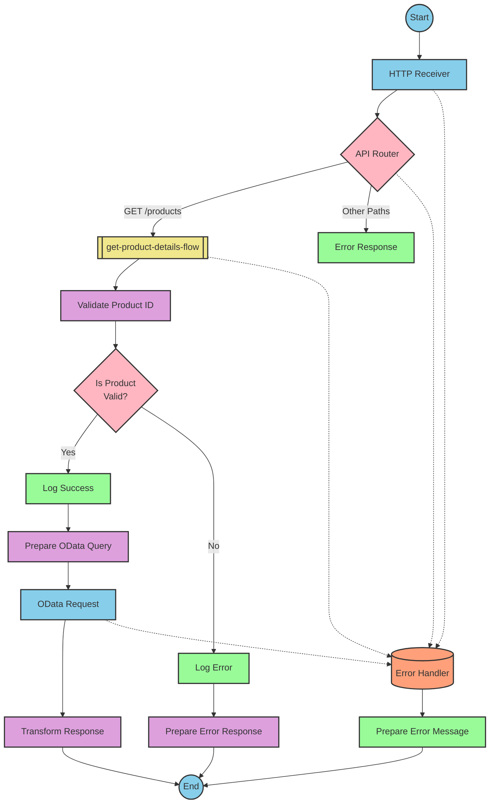

# SAP Integration Suite Documentation for Product API

# Table of Contents
- [API Overview](#api-overview)
- [Endpoints](#endpoints)
  - [GET /products](#get-products)
- [Current MuleSoft Flow Logic](#current-mulesoft-flow-logic)
  - [products-main Flow](#products-main-flow)
  - [products-console Flow](#products-console-flow)
  - [get:\products:products-config Flow](#getproductsproducts-config-flow)
  - [get-product-details-flow Subflow](#get-product-details-flow-subflow)
- [DataWeave Transformations Explained](#dataweave-transformations-explained)
  - [Product Identifier Validation](#product-identifier-validation)
  - [OData Query Parameters](#odata-query-parameters)
  - [Response Payload Transformation](#response-payload-transformation)
  - [Error Response Transformation](#error-response-transformation)
- [SAP Integration Suite Implementation](#sap-integration-suite-implementation)
  - [Component Mapping](#component-mapping)
  - [Integration Flow Visualization](#integration-flow-visualization)
- [Configuration Details](#configuration-details)
  - [HTTP Adapter Configuration](#http-adapter-configuration)
  - [OData Adapter Configuration](#odata-adapter-configuration)
  - [Content Modifier Configuration](#content-modifier-configuration)
  - [Router Configuration](#router-configuration)
- [Configuration](#configuration)
  - [Environment Variables](#environment-variables)
  - [External System Dependencies](#external-system-dependencies)

# API Overview

This API provides access to product information from an SAP HANA backend system. It allows clients to retrieve detailed product information by specifying a product identifier as a query parameter. The API validates the product identifier against a configured list of valid identifiers before retrieving the product details from the backend system.

**Base URL**: `/api/v1`

# Endpoints

## GET /products

This endpoint retrieves product details based on the provided product identifier.

**Request Parameters**:
- Query Parameters:
  - `productIdentifier` (string): The identifier of the product to retrieve (e.g., HT-2000, HT-2001)

**Response Format**:
- Content-Type: `application/json`
- Status Codes:
  - 200: Successful response with product details
  - 400: Bad request (invalid input)
  - 404: Product not found
  - 500: Server error

**Example Request**:
```
GET /api/v1/products?productIdentifier=HT-2000
```

**Example Response** (200 OK):
```json
{
  "ProductId": "HT-2000",
  "Category": "Notebooks",
  "CategoryName": "Notebooks",
  "CurrencyCode": "USD",
  "DimensionDepth": 30,
  "DimensionHeight": 3,
  "DimensionUnit": "cm",
  "DimensionWidth": 40,
  "LongDescription": "Notebook Basic 17 with 2,80 GHz quad core, 17\" LCD, 4 GB DDR3 RAM, 500 GB Hard Disc, Windows 8 Pro",
  "Name": "Notebook Basic 17",
  "PictureUrl": "/sap/public/bc/NWDEMO_MODEL/IMAGES/HT-2000.jpg",
  "Price": 1249,
  "QuantityUnit": "EA",
  "ShortDescription": "Notebook Basic 17 with 2,80 GHz quad core, 17\" LCD, 4 GB DDR3 RAM, 500 GB Hard Disc",
  "SupplierId": "0100000046",
  "Weight": 4.5,
  "WeightUnit": "KG"
}
```

**Example Error Response** (404 Not Found):
```json
{
  "status": "error",
  "message": "The product identifier HT-3000 was not found.",
  "errorCode": "PRODUCT_NOT_FOUND"
}
```

# Current MuleSoft Flow Logic

## products-main Flow

This is the main entry point for the API. It handles HTTP requests and routes them to the appropriate flow based on the request path.

1. **Trigger**: HTTP listener configured to listen on `/api/v1/*`
2. **Processing Steps**:
   - Sets response headers
   - Routes the request based on the API specification (products.raml)
   - Handles errors and formats error responses

## products-console Flow

This flow is used for console-based debugging and logging of API requests.

1. **Trigger**: HTTP listener
2. **Processing Steps**:
   - Sets response headers
   - Logs request details to the console
   - Handles errors and formats error responses

## get:\products:products-config Flow

This flow handles GET requests to the `/products` endpoint.

1. **Trigger**: HTTP GET request to `/products`
2. **Processing Steps**:
   - Calls the `get-product-details-flow` subflow to process the request

## get-product-details-flow Subflow

This subflow processes product detail requests and is the core business logic of the application.

1. **Trigger**: Called from the `get:\products:products-config` flow
2. **Processing Steps**:
   - Validates the product identifier against a configured list of valid identifiers
   - If valid, logs the request and retrieves product details from the backend system
   - If invalid, logs an error and returns an error response
3. **Data Transformations**:
   - Transforms the product identifier validation result
   - Constructs OData query parameters for the backend request
   - Transforms the backend response to the API response format
   - Constructs error responses when needed
4. **Expected Outcomes**:
   - Success: Returns product details in JSON format
   - Error: Returns an error response with appropriate message and code

The flow includes the following key technical details:

- **Product Identifier Validation**:
  ```
  %dw 2.0
  output application/java
  var productidentifer=p('odata.productIdentifiers') splitBy(",")
  ---
  sizeOf(productidentifer filter ($ == attributes.queryParams.productIdentifier))>0
  ```

- **OData Query Parameters**:
  ```
  #[output application/java
  ---
  {
    "$filter" : "ProductId eq '" ++ (attributes.queryParams.productIdentifier default '') ++ "'",
    "$select" : "ProductId,Category,CategoryName,CurrencyCode,DimensionDepth,DimensionHeight,DimensionUnit,DimensionWidth,LongDescription,Name,PictureUrl,Price,QuantityUnit,ShortDescription,SupplierId,Weight,WeightUnit"
  }]
  ```

- **Response Transformation**:
  ```
  %dw 2.0
  output application/json
  ---
  payload
  ```

- **Error Response Transformation**:
  ```
  %dw 2.0
  output application/json
  ---
  {
    status: "error",
    message: "The product identifier " ++ attributes.queryParams.productIdentifier ++ " was not found.",
    errorCode: "PRODUCT_NOT_FOUND"
  }
  ```

# DataWeave Transformations Explained

## Product Identifier Validation

This transformation validates if the provided product identifier is in the list of valid product identifiers configured in the application.

**Input**: Query parameter `productIdentifier` from the HTTP request
**Output**: Boolean value indicating if the product identifier is valid

**Logic**:
1. Retrieves the list of valid product identifiers from the configuration
2. Splits the comma-separated list into an array
3. Filters the array to find matches with the provided product identifier
4. Returns true if at least one match is found, false otherwise

```dw
%dw 2.0
output application/java
var productidentifer=p('odata.productIdentifiers') splitBy(",")
---
sizeOf(productidentifer filter ($ == attributes.queryParams.productIdentifier))>0
```

## OData Query Parameters

This transformation constructs the OData query parameters for the backend request.

**Input**: Query parameter `productIdentifier` from the HTTP request
**Output**: OData query parameters for the backend request

**Logic**:
1. Constructs a `$filter` parameter to filter products by the provided product identifier
2. Specifies the fields to retrieve using the `$select` parameter

```dw
#[output application/java
---
{
  "$filter" : "ProductId eq '" ++ (attributes.queryParams.productIdentifier default '') ++ "'",
  "$select" : "ProductId,Category,CategoryName,CurrencyCode,DimensionDepth,DimensionHeight,DimensionUnit,DimensionWidth,LongDescription,Name,PictureUrl,Price,QuantityUnit,ShortDescription,SupplierId,Weight,WeightUnit"
}]
```

## Response Payload Transformation

This transformation passes the backend response directly to the API response.

**Input**: Backend response payload
**Output**: API response payload in JSON format

**Logic**: Simply outputs the input payload as JSON

```dw
%dw 2.0
output application/json
---
payload
```

## Error Response Transformation

This transformation constructs an error response when the product identifier is invalid or not found.

**Input**: Query parameter `productIdentifier` from the HTTP request
**Output**: Error response in JSON format

**Logic**: Constructs an error response with status, message, and error code

```dw
%dw 2.0
output application/json
---
{
  status: "error",
  message: "The product identifier " ++ attributes.queryParams.productIdentifier ++ " was not found.",
  errorCode: "PRODUCT_NOT_FOUND"
}
```

# SAP Integration Suite Implementation

## Component Mapping

| MuleSoft Component | SAP Integration Suite Equivalent | Notes |
|--------------------|----------------------------------|-------|
| HTTP Listener | HTTP Adapter (Receiver) | Configure with the same path and port |
| Router | Router | Used for conditional processing |
| Flow Reference | Process Call | Used to call subflows |
| Logger | Content Modifier with Write to Log option | For logging messages |
| Set Variable | Content Modifier | For setting variables |
| Choice/When/Otherwise | Router with multiple branches | For conditional processing |
| Transform | Message Mapping | For data transformations |
| HTTP Request | OData Adapter (Sender) | For making OData requests to the backend |
| Set Payload | Content Modifier | For setting the response payload |
| Error Handler | Exception Subprocess | For handling errors |

## Integration Flow Visualization

### REST API Integration Flow: GET /products



# Configuration Details

## HTTP Adapter Configuration

### HTTP Receiver Adapter
- **Adapter Type**: HTTP
- **Direction**: Receiver
- **Path**: `/api/v1/*`
- **Port**: `${api.listener.port}` (default: 8081)
- **Authentication**: None (based on source configuration)
- **CSRF Protection**: Disabled
- **Connection Timeout**: 60000 ms (default)

## OData Adapter Configuration

### OData Sender Adapter
- **Adapter Type**: OData
- **Direction**: Sender
- **URL**: `https://${hana.espm.url}:${hana.espm.port}${hana.espm.path}`
- **Authentication**: None (based on source configuration)
- **OData Version**: V2
- **Query Options**:
  - **$filter**: `ProductId eq '${productIdentifier}'`
  - **$select**: `ProductId,Category,CategoryName,CurrencyCode,DimensionDepth,DimensionHeight,DimensionUnit,DimensionWidth,LongDescription,Name,PictureUrl,Price,QuantityUnit,ShortDescription,SupplierId,Weight,WeightUnit`

## Content Modifier Configuration

### Log Success Content Modifier
- **Type**: Content Modifier
- **Action**: Write to Log
- **Log Level**: INFO
- **Message**: `The request is processed and sent downstream with the product identifier (${productIdentifier}).`

### Log Error Content Modifier
- **Type**: Content Modifier
- **Action**: Write to Log
- **Log Level**: ERROR
- **Message**: `The product identifier (${productIdentifier}) was not passed in the request or was passed incorrectly.`

### Prepare Error Response Content Modifier
- **Type**: Content Modifier
- **Action**: Create Message
- **Message Body**:
  ```json
  {
    "status": "error",
    "message": "The product identifier ${productIdentifier} was not found.",
    "errorCode": "PRODUCT_NOT_FOUND"
  }
  ```
- **Headers**:
  - Content-Type: application/json

## Router Configuration

### API Router
- **Type**: Router
- **Condition Type**: XPath
- **Conditions**:
  - `/api/v1/products`: Route to get-product-details-flow
  - Default: Route to Error Response

### Is Product Valid Router
- **Type**: Router
- **Condition Type**: XPath
- **Conditions**:
  - `${isExistProduct}`: Route to Log Success
  - Default: Route to Log Error

# Configuration

## Environment Variables

The following environment variables are required for the integration:

```yaml
api:
  listener:
    port: "8081"
    path: /api/v1/*
    
hana:
  espm:
    url: refapp-espm-ui-cf.cfapps.eu10.hana.ondemand.com
    port: "443"
    path: /espm-cloud-web/espm.svc/Products
    
odata:
  productIdentifiers: "HT-2000,HT-2001"
```

## External System Dependencies

The integration depends on the following external systems:

1. **SAP HANA ESPM Service**
   - **URL**: refapp-espm-ui-cf.cfapps.eu10.hana.ondemand.com
   - **Port**: 443
   - **Path**: /espm-cloud-web/espm.svc/Products
   - **Protocol**: HTTPS
   - **Authentication**: None specified in source configuration

The integration retrieves product details from this SAP HANA backend system using OData queries.