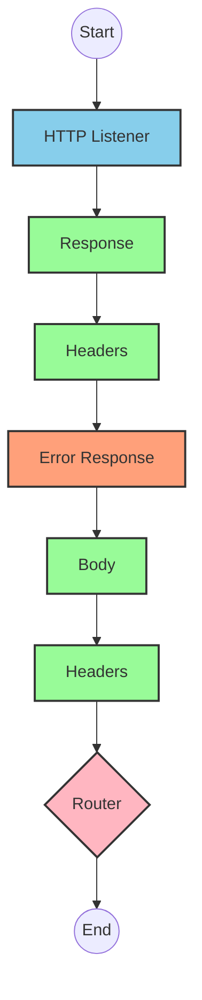
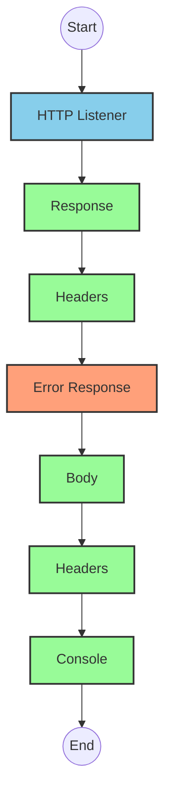
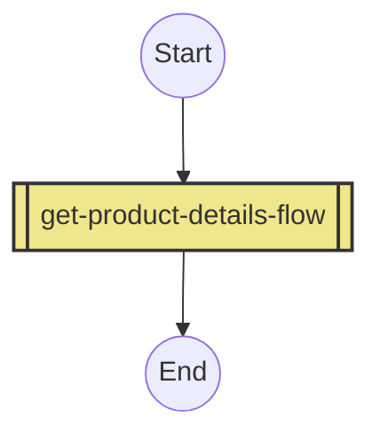
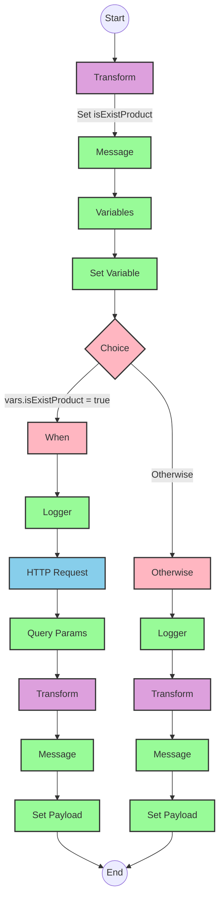

# API Overview
- This API provides product details from an SAP HANA database
- Base URL pattern: `/products`

# Endpoints

## GET /products
- **Purpose**: Retrieves product details based on a product identifier
- **Query Parameters**:
  - `productIdentifier` (required): The unique identifier for the product
- **Response Format**: JSON
- **Status Codes**:
  - 200: Success
  - 400: Bad Request
  - 404: Product Not Found
- **Response Body**:
  - Success: Product details including ProductId, Category, CategoryName, etc.
  - Error: JSON object with status, message, and errorCode

# Current MuleSoft Flow Logic

## Flow: products-main
This is the main entry point for the API that handles HTTP requests.

1. **Trigger**: HTTP listener
2. **Processing**:
   - Sets response headers
   - Routes requests to appropriate handlers
   - Includes error response handling
3. **Outcome**: Routes to appropriate flow based on the request

## Flow: products-console
This flow appears to be a console-based version of the API, possibly for testing or monitoring.

1. **Trigger**: HTTP listener
2. **Processing**:
   - Sets response headers
   - Outputs to console
   - Includes error response handling
3. **Outcome**: Console output of API requests

## Flow: get:\products:products-config
This flow handles GET requests to the /products endpoint.

1. **Trigger**: HTTP GET request to /products
2. **Processing**: Calls the get-product-details-flow subflow
3. **Outcome**: Returns product details or error response

## Subflow: get-product-details-flow
This subflow retrieves product details from SAP HANA.

1. **Processing Steps**:
   - Validates if the product identifier exists in the configured list
   - Sets variables for processing
   - Logs request information
   - Makes HTTP request to SAP HANA OData service with specific query parameters
   - Transforms the response to JSON format

2. **Key Technical Details**:
   - OData query parameters:
     - `$filter`: `ProductId eq '" ++ (attributes.queryParams.productIdentifier default '') ++ "'`
     - `$select`: `ProductId,Category,CategoryName,CurrencyCode,DimensionDepth,DimensionHeight,DimensionUnit,DimensionWidth,LongDescription,Name,PictureUrl,Price,QuantityUnit,ShortDescription,SupplierId,Weight,WeightUnit`

3. **Conditional Logic**:
   - If `vars.isExistProduct` is true: Processes the request and retrieves product details
   - Otherwise: Returns an error response indicating the product was not found

4. **Error Handling**:
   - Returns appropriate error messages when product identifier is invalid or not found

# DataWeave Transformations Explained

## Transformation 1: Validate Product Identifier
This transformation checks if the provided product identifier exists in a predefined list of valid identifiers.

```dw
%dw 2.0
output application/java
var productidentifer=p('odata.productIdentifiers') splitBy(",")
---
sizeOf(productidentifer filter ($ == attributes.queryParams.productIdentifier))>0
```

- **Purpose**: Validates if the requested product identifier is in the allowed list
- **Input**: Query parameter `productIdentifier` from the request
- **Output**: Boolean value indicating if the product identifier is valid
- **Key Operations**:
  - Retrieves a comma-separated list of valid product identifiers from a property
  - Splits the string into an array using `splitBy(",")`
  - Filters the array to find matches with the requested product identifier
  - Returns true if at least one match is found (size > 0)

## Transformation 2: OData Query Parameters
This transformation constructs the OData query parameters for the SAP HANA request.

```dw
#[output application/java
---
{
	"$filter" : "ProductId eq '" ++ (attributes.queryParams.productIdentifier default '') ++ "'",
	"$select" : "ProductId,Category,CategoryName,CurrencyCode,DimensionDepth,DimensionHeight,DimensionUnit,DimensionWidth,LongDescription,Name,PictureUrl,Price,QuantityUnit,ShortDescription,SupplierId,Weight,WeightUnit"
}]
```

- **Purpose**: Creates OData query parameters for filtering and selecting specific fields
- **Input**: Product identifier from query parameters
- **Output**: Java map containing OData query parameters
- **Key Operations**:
  - Constructs a filter expression to match the exact product identifier
  - Specifies which fields to retrieve in the select parameter

## Transformation 3: Pass-through Transformation
This transformation simply passes the payload through without modification.

```dw
%dw 2.0
output application/json
---
payload
```

- **Purpose**: Converts the response to JSON format
- **Input**: Response from the SAP HANA OData service
- **Output**: Same payload in JSON format

## Transformation 4: Error Response
This transformation creates an error response when the product identifier is invalid or not found.

```dw
%dw 2.0
output application/json
---
{
	status: "error",
	message: "The product identifier " ++ attributes.queryParams.productIdentifier ++ " was not found.",
	errorCode: "PRODUCT_NOT_FOUND"
}
```

- **Purpose**: Generates a standardized error response
- **Input**: Query parameter `productIdentifier` from the request
- **Output**: JSON error object with status, message, and error code
- **Key Operations**:
  - Concatenates the product identifier into the error message

# SAP Integration Suite Implementation

## Component Mapping

| MuleSoft Component | SAP Integration Suite Equivalent | Notes |
|--------------------|----------------------------------|-------|
| HTTP Listener | HTTPS Adapter (Receiver) | Configure with the same path and method |
| Flow Reference | Process Call | Used to call subflows |
| DataWeave Transform | Message Mapping | Implement the same transformation logic |
| Logger | Write to Message Processing Log | Configure with the same log messages |
| HTTP Request | HTTPS Adapter (Sender) | Configure with the same endpoint and parameters |
| Choice Router | Router | Implement the same conditional logic |
| Set Variable | Content Modifier | Set the same variables with identical values |
| Set Payload | Content Modifier | Set the payload with the same content |
| Error Handler | Exception Subprocess | Implement the same error handling logic |

## Integration Flow Visualization









## Configuration Details

### HTTP Listener Configuration
- **Component**: HTTPS Adapter (Receiver)
- **Parameters**:
  - Name: HTTP_Listener_config
  - Path: /products
  - Method: GET
  - Content Type: application/json

### HTTP Request Configuration
- **Component**: HTTPS Adapter (Sender)
- **Parameters**:
  - Name: Hana_HTTP_Request_Configuration
  - URL: [SAP HANA OData service endpoint]
  - Method: GET
  - Query Parameters: 
    - $filter: ProductId eq '[productIdentifier]'
    - $select: ProductId,Category,CategoryName,CurrencyCode,DimensionDepth,DimensionHeight,DimensionUnit,DimensionWidth,LongDescription,Name,PictureUrl,Price,QuantityUnit,ShortDescription,SupplierId,Weight,WeightUnit

### Router Configuration
- **Component**: Router
- **Condition**: vars.isExistProduct
- **Routes**:
  - True: Process product request
  - False: Return error response

### Message Mapping (Transform)
- **Component**: Message Mapping
- **Mappings**:
  1. Validate Product Identifier:
     - Source: attributes.queryParams.productIdentifier
     - Target: vars.isExistProduct
     - Mapping: Check if product identifier exists in configured list
  
  2. Pass-through Transformation:
     - Source: payload
     - Target: payload
     - Mapping: Direct pass-through
  
  3. Error Response:
     - Source: attributes.queryParams.productIdentifier
     - Target: Custom error JSON object
     - Mapping: Create error response with product identifier

### Content Modifier (Set Variable)
- **Component**: Content Modifier
- **Parameters**:
  - Name: isExistProduct
  - Value: Result of product identifier validation

### Logger Configuration
- **Component**: Write to Message Processing Log
- **Parameters**:
  - Success Message: "The request is processed and sent downstream with the product identifier (#[attributes.queryParams.productIdentifier])."
  - Error Message: "The product identifier (#[attributes.queryParams.productIdentifier]) was not passed in the request or was passed incorrectly."

# Configuration

## Important Configuration Parameters
- **odata.productIdentifiers**: Comma-separated list of valid product identifiers

## Error Handling
- **Global Error Handler**: Handles various API errors including:
  - APIKIT:BAD_REQUEST
  - APIKIT:NOT_FOUND
  - APIKIT:METHOD_NOT_ALLOWED
  - APIKIT:NOT_ACCEPTABLE
  - APIKIT:UNSUPPORTED_MEDIA_TYPE
  - APIKIT:NOT_IMPLEMENTED

## Dependencies
- SAP HANA OData service for product data retrieval