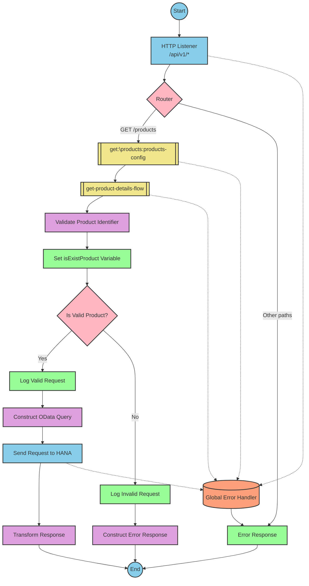

# SAP Integration Suite Implementation for Product API

## Document Navigation
- [API Overview](#api-overview)
- [Endpoints](#endpoints)
- [Current MuleSoft Flow Logic](#current-mulesoft-flow-logic)
- [DataWeave Transformations Explained](#dataweave-transformations-explained)
- [SAP Integration Suite Implementation](#sap-integration-suite-implementation)
  - [Component Mapping](#component-mapping)
  - [Integration Flow Visualization](#integration-flow-visualization)
- [Configuration Details](#configuration-details)
- [Configuration](#configuration)

# API Overview
This API provides access to product information from an SAP HANA backend system. It allows clients to retrieve product details by specifying a product identifier. The API validates the product identifier against a configured list of valid identifiers before retrieving the data from the SAP HANA system.

**Base URL**: `http://localhost:8081/api/v1`

# Endpoints

## GET /products
**Purpose**: Retrieves product details based on the provided product identifier.

**Query Parameters**:
- `productIdentifier` (required): The unique identifier of the product to retrieve.

**Response Format**:
- **200 OK**: Successfully retrieved product details
  - Content-Type: application/json
  - Body: Product details JSON object
- **400 Bad Request**: Invalid request format
- **404 Not Found**: Product identifier not found
- **500 Internal Server Error**: Server-side error

**Error Response Format**:
```json
{
  "status": "error",
  "message": "The product identifier [identifier] was not found.",
  "errorCode": "PRODUCT_NOT_FOUND"
}
```

# Current MuleSoft Flow Logic

## products-main Flow
**Trigger**: HTTP listener configured at `/api/v1/*`
This is the main entry point for the API. It handles incoming HTTP requests, routes them to the appropriate flow based on the path, and handles error responses.

## products-console Flow
**Trigger**: HTTP listener
This flow appears to be a diagnostic flow that logs requests to the console.

## get:\products:products-config Flow
**Trigger**: HTTP GET request to `/products`
This flow is triggered when a GET request is made to the `/products` endpoint. It references the `get-product-details-flow` subflow to process the request.

## get-product-details-flow Subflow
This is the core processing flow that:

1. **Validates the product identifier**:
   - Checks if the provided `productIdentifier` query parameter is in the list of valid product identifiers defined in the configuration.
   - The validation uses a DataWeave expression to split the configured product identifiers string and check if the provided identifier is in the list.

2. **Processes valid product requests**:
   - If the product identifier is valid, it logs the request and sends a request to the SAP HANA backend.
   - The request includes OData query parameters:
     - `$filter`: `ProductId eq '[productIdentifier]'`
     - `$select`: `ProductId,Category,CategoryName,CurrencyCode,DimensionDepth,DimensionHeight,DimensionUnit,DimensionWidth,LongDescription,Name,PictureUrl,Price,QuantityUnit,ShortDescription,SupplierId,Weight,WeightUnit`
   - The response from the backend is returned as-is to the client.

3. **Handles invalid product identifiers**:
   - If the product identifier is invalid or not provided, it logs an error message.
   - Returns an error response with status "error", a descriptive message, and error code "PRODUCT_NOT_FOUND".

# DataWeave Transformations Explained

## Product Identifier Validation Transformation
This transformation checks if the provided product identifier is in the list of valid identifiers.

**Input**: The application configuration and query parameters
**Output**: A boolean value indicating if the product identifier is valid

```dw
%dw 2.0
output application/java
var productidentifer=p('odata.productIdentifiers') splitBy(",")
---
sizeOf(productidentifer filter ($ == attributes.queryParams.productIdentifier))>0
```

**Explanation**:
1. The transformation retrieves the configured product identifiers from the application properties (`p('odata.productIdentifiers')`)
2. It splits this string by comma to create an array of valid product identifiers
3. It filters this array to find elements that match the provided query parameter
4. It checks if the size of the filtered array is greater than 0, returning true if the product identifier is valid

## OData Query Parameters Transformation
This transformation constructs the OData query parameters for the backend request.

**Input**: The query parameters from the HTTP request
**Output**: OData query parameters for the backend request

```dw
#[output application/java
---
{
	"$filter" : "ProductId eq '" ++ (attributes.queryParams.productIdentifier default '') ++ "'",
	"$select" : "ProductId,Category,CategoryName,CurrencyCode,DimensionDepth,DimensionHeight,DimensionUnit,DimensionWidth,LongDescription,Name,PictureUrl,Price,QuantityUnit,ShortDescription,SupplierId,Weight,WeightUnit"
}]
```

**Explanation**:
1. The transformation constructs an OData `$filter` parameter that filters products by the provided product identifier
2. It includes a `$select` parameter that specifies which fields to include in the response
3. The product identifier is extracted from the query parameters, with a default empty string if not provided

## Response Transformation (Valid Product)
This transformation passes through the backend response without modification.

**Input**: The backend response
**Output**: The same response in JSON format

```dw
%dw 2.0
output application/json
---
payload
```

**Explanation**:
This is a simple pass-through transformation that ensures the output is in JSON format.

## Error Response Transformation
This transformation constructs an error response when the product identifier is invalid.

**Input**: The query parameters from the HTTP request
**Output**: An error response object

```dw
%dw 2.0
output application/json
---
{
	status: "error",
	message: "The product identifier " ++ attributes.queryParams.productIdentifier ++ " was not found.",
	errorCode: "PRODUCT_NOT_FOUND"
}
```

**Explanation**:
1. The transformation constructs an error response object with three fields:
   - `status`: Set to "error"
   - `message`: A descriptive message that includes the invalid product identifier
   - `errorCode`: Set to "PRODUCT_NOT_FOUND"

# SAP Integration Suite Implementation

## Component Mapping

| MuleSoft Component | SAP Integration Suite Equivalent | Notes |
|--------------------|----------------------------------|-------|
| HTTP Listener | HTTPS Adapter (Receiver) | Configure with the same path and port |
| Router | Content Modifier + Router | Use a content modifier to set properties and a router for conditional branching |
| Flow Reference | Process Call | References another integration flow |
| Transform | Message Mapping | Maps between different message formats |
| Logger | Write to Message Log | Logs messages to the integration flow log |
| Set Variable | Content Modifier | Sets variables in the message header |
| Choice/When/Otherwise | Router | Implements conditional branching |
| HTTP Request | HTTPS Adapter (Sender) | Sends requests to external systems |
| Set Payload | Content Modifier | Sets the message body |
| Error Handler | Exception Subprocess | Handles errors in the integration flow |

## Integration Flow Visualization

### REST API Integration Flow: GET /products



## Configuration Details

### HTTP Listener
- **Adapter Type**: HTTPS Adapter (Receiver)
- **Path**: `/api/v1/*`
- **Port**: `8081` (from dev.yaml)
- **Authentication**: None (based on source)

### Router
- **Condition 1**: Path equals `/products` and method equals `GET`
  - **Route To**: get:\products:products-config
- **Default Route**: Error Response

### get-product-details-flow
- **Validate Product Identifier**:
  - **Mapping Type**: Expression
  - **Expression**: Split configured product identifiers and check if provided ID is in the list
  - **Output Variable**: isExistProduct

- **Product Router**:
  - **Condition**: `${header.isExistProduct}` equals `true`
  - **True Route**: Process valid product request
  - **False Route**: Construct error response

- **Send Request to HANA**:
  - **Adapter Type**: HTTPS Adapter (Sender)
  - **URL**: `https://refapp-espm-ui-cf.cfapps.eu10.hana.ondemand.com:443/espm-cloud-web/espm.svc/Products` (from dev.yaml)
  - **Method**: GET
  - **Query Parameters**:
    - `$filter`: `ProductId eq '${header.productIdentifier}'`
    - `$select`: `ProductId,Category,CategoryName,CurrencyCode,DimensionDepth,DimensionHeight,DimensionUnit,DimensionWidth,LongDescription,Name,PictureUrl,Price,QuantityUnit,ShortDescription,SupplierId,Weight,WeightUnit`

### Error Handler
- **Error Types**:
  - APIKIT:BAD_REQUEST
  - APIKIT:NOT_FOUND
  - APIKIT:METHOD_NOT_ALLOWED
  - APIKIT:NOT_ACCEPTABLE
  - APIKIT:UNSUPPORTED_MEDIA_TYPE
  - APIKIT:NOT_IMPLEMENTED
- **Action**: Propagate error with appropriate status code and message

# Configuration

## Environment Variables
The following configuration parameters are defined in the dev.yaml file:

```yaml
api:
  listener:
    port: "8081"
    path: /api/v1/*
    
hana:
  espm:
    url: refapp-espm-ui-cf.cfapps.eu10.hana.ondemand.com
    port: "443"
    path: /espm-cloud-web/espm.svc/Products
    
odata:
  productIdentifiers: "HT-2000,HT-2001"
```

## Dependencies on External Systems
- **SAP HANA Backend**: The integration depends on an SAP HANA backend system accessible at `refapp-espm-ui-cf.cfapps.eu10.hana.ondemand.com:443/espm-cloud-web/espm.svc/Products`.

## Security Settings
- No explicit security settings are defined in the source documentation.
- For production deployment in SAP Integration Suite, consider implementing:
  - OAuth or Basic Authentication for the HTTPS Adapter (Sender)
  - API Management policies for the exposed API
  - Transport layer security (HTTPS) for all communications