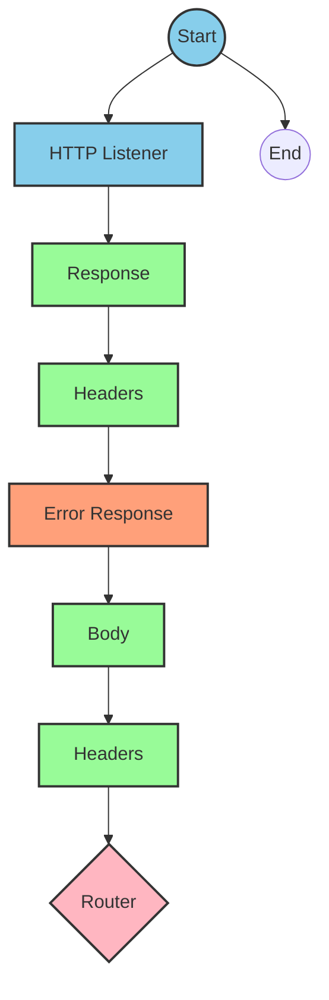
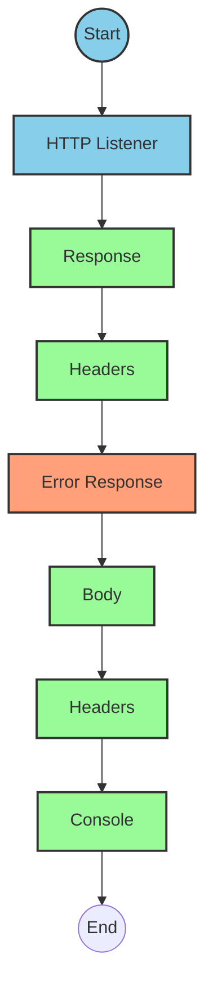
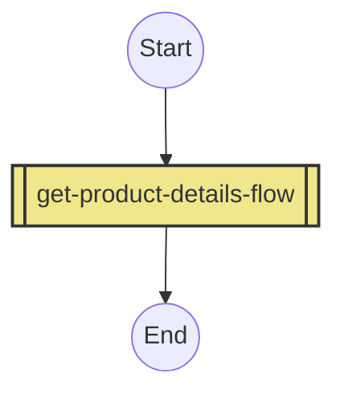
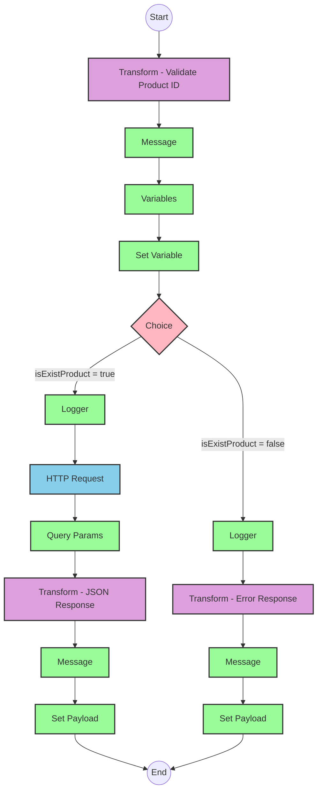

# API Overview
- This API provides product details from an SAP HANA system
- Base URL pattern: `/products`

# Endpoints

## GET /products
- **Purpose**: Retrieves product details based on a product identifier
- **Query Parameters**:
  - `productIdentifier` (required): The unique identifier of the product
- **Response Format**: JSON
- **Status Codes**:
  - 200: Success
  - 400: Bad Request
  - 404: Product Not Found
- **Response Body**: Product details including ProductId, Category, CategoryName, CurrencyCode, dimensions, descriptions, price, and other product attributes

# Current MuleSoft Flow Logic

## Flow: products-main
This is the main entry point for the API, triggered by an HTTP listener. It handles routing to the appropriate endpoints based on the API specification defined in products.raml.

## Flow: products-console
This flow is triggered by an HTTP listener and logs information to the console. It appears to be a monitoring or debugging flow.

## Flow: get:\products:products-config
This flow is triggered when a GET request is made to the `/products` endpoint. It references the `get-product-details-flow` subflow to handle the request.

## Subflow: get-product-details-flow
1. **Triggered by**: Reference from the `get:\products:products-config` flow
2. **Main processing steps**:
   - Validates if the provided product identifier is in the allowed list
   - Logs the request details
   - Makes an OData request to retrieve product details
   - Transforms the response to JSON format
3. **Data transformations**:
   - Validates product identifier against a configured list
   - Constructs OData query parameters
   - Transforms the OData response to JSON
4. **Error handling**:
   - Returns a custom error message if the product identifier is invalid or not found

### Key Technical Details:
- OData query parameters:
  - `$filter`: `ProductId eq '" ++ (attributes.queryParams.productIdentifier default '') ++ "'`
  - `$select`: `ProductId,Category,CategoryName,CurrencyCode,DimensionDepth,DimensionHeight,DimensionUnit,DimensionWidth,LongDescription,Name,PictureUrl,Price,QuantityUnit,ShortDescription,SupplierId,Weight,WeightUnit`

# DataWeave Transformations Explained

## Product Identifier Validation Transformation
This transformation checks if the provided product identifier is in the allowed list of product identifiers.

```dw
%dw 2.0
output application/java
var productidentifer=p('odata.productIdentifiers') splitBy(",")
---
sizeOf(productidentifer filter ($ == attributes.queryParams.productIdentifier))>0
```

- **Purpose**: Validates if the product identifier is allowed
- **Input**: Query parameter `productIdentifier`
- **Output**: Boolean value indicating if the product identifier is valid
- **Key operations**:
  - Retrieves allowed product identifiers from a property `odata.productIdentifiers`
  - Splits the comma-separated list into an array
  - Filters the array to find matches with the provided product identifier
  - Returns true if at least one match is found

## OData Query Parameters Transformation
This transformation constructs the OData query parameters for the HTTP request.

```dw
#[output application/java
---
{
	"$filter" : "ProductId eq '" ++ (attributes.queryParams.productIdentifier default '') ++ "'",
	"$select" : "ProductId,Category,CategoryName,CurrencyCode,DimensionDepth,DimensionHeight,DimensionUnit,DimensionWidth,LongDescription,Name,PictureUrl,Price,QuantityUnit,ShortDescription,SupplierId,Weight,WeightUnit"
}]
```

- **Purpose**: Constructs OData query parameters
- **Input**: Query parameter `productIdentifier`
- **Output**: Map of OData query parameters
- **Key operations**:
  - Constructs a filter expression to match the product identifier
  - Specifies the fields to select in the response

## Response Transformation
This transformation passes through the payload from the OData response.

```dw
%dw 2.0
output application/json
---
payload
```

- **Purpose**: Transforms the OData response to JSON
- **Input**: OData response
- **Output**: JSON representation of the product details

## Error Response Transformation
This transformation constructs an error response when the product identifier is invalid or not found.

```dw
%dw 2.0
output application/json
---
{
	status: "error",
	message: "The product identifier " ++ attributes.queryParams.productIdentifier ++ " was not found.",
	errorCode: "PRODUCT_NOT_FOUND"
}
```

- **Purpose**: Constructs an error response
- **Input**: Query parameter `productIdentifier`
- **Output**: JSON error message
- **Key operations**:
  - Constructs a standardized error response with status, message, and error code

# SAP Integration Suite Implementation

## Component Mapping

| MuleSoft Component | SAP Integration Suite Equivalent |
|--------------------|----------------------------------|
| HTTP Listener | HTTP Adapter (Receiver) |
| Router | Content Modifier + Router |
| Flow Reference | Process Call |
| Transform (DataWeave) | Mapping (with Groovy or JavaScript) |
| Logger | Write to Log |
| HTTP Request | HTTP Adapter (Sender) |
| Set Variable | Content Modifier |
| Choice/When/Otherwise | Router |
| Error Handler | Exception Subprocess |

## Integration Flow Visualization









## Configuration Details

### HTTP Listener Configuration
- **Component**: HTTP Adapter (Receiver)
- **Parameters**:
  - Name: HTTP_Listener_config
  - Port: To be configured based on environment
  - Host: To be configured based on environment
  - Path: /products

### HTTP Request Configuration
- **Component**: HTTP Adapter (Sender)
- **Parameters**:
  - Name: Hana_HTTP_Request_Configuration
  - URL: To be configured based on SAP HANA OData service endpoint
  - Authentication: To be configured based on SAP HANA authentication requirements

### Router Configuration
- **Component**: Router
- **Parameters**:
  - Condition: vars.isExistProduct
  - True path: Process product request
  - False path: Return error response

### Mapping Configuration
- **Component**: Mapping
- **Parameters**:
  - For product validation:
    - Source: Query parameters
    - Target: Boolean variable
    - Script: Equivalent to DataWeave script for product validation
  - For OData query parameters:
    - Source: Query parameters
    - Target: HTTP request parameters
    - Script: Equivalent to DataWeave script for OData query parameters
  - For response transformation:
    - Source: HTTP response
    - Target: JSON payload
    - Script: Equivalent to DataWeave script for response transformation
  - For error response:
    - Source: Query parameters
    - Target: JSON payload
    - Script: Equivalent to DataWeave script for error response

# Configuration

## Important Configuration Parameters
- **odata.productIdentifiers**: Comma-separated list of valid product identifiers

## Environment Variables
- HTTP listener host and port
- SAP HANA OData service endpoint
- Authentication credentials for SAP HANA

## Dependencies on External Systems
- SAP HANA OData service for product information

## Security Settings
- Authentication configuration for SAP HANA OData service
- API security settings (not explicitly defined in the source documentation)