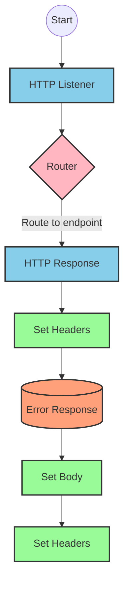
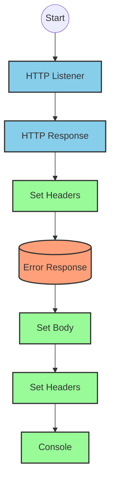
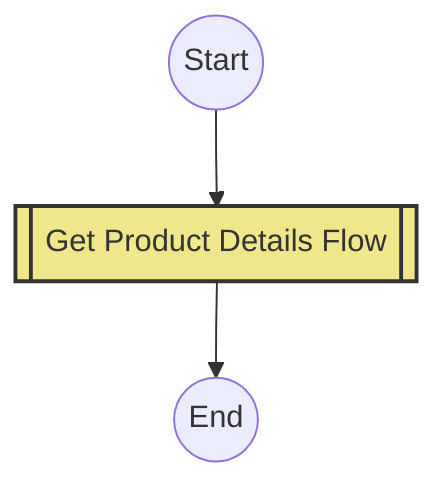
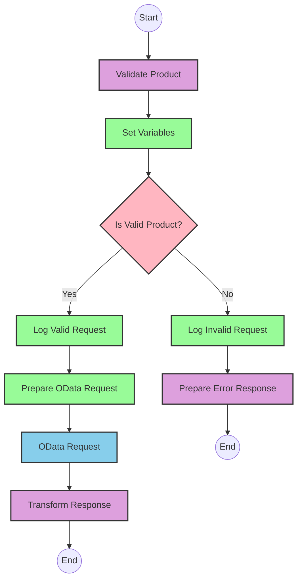

# API Overview
- This API provides product details from an SAP HANA database
- Base URL pattern: `/products`

# Endpoints

## GET /products
- **Purpose**: Retrieves product details based on a product identifier
- **Query Parameters**:
  - `productIdentifier` (required): The unique identifier for the product
- **Response Format**: JSON
- **Status Codes**:
  - 200: Success
  - 400: Bad Request
  - 404: Product Not Found
- **Response Body**:
  - Success: Product details including ProductId, Category, CategoryName, etc.
  - Error: JSON object with status, message, and errorCode

# Current MuleSoft Flow Logic

## Flow: products-main
This is the main entry point for the API, triggered by an HTTP listener. It handles routing to the appropriate endpoints based on the API specification defined in products.raml.

1. **Trigger**: HTTP listener configured with HTTP_Listener_config
2. **Processing**: Routes requests to the appropriate flow based on the API specification
3. **Response Handling**: Sets appropriate headers and handles errors
4. **Error Handling**: Uses error-response component to format error responses

## Flow: products-console
This appears to be a console/logging version of the API, likely for debugging or monitoring purposes.

1. **Trigger**: HTTP listener
2. **Processing**: Logs requests to the console
3. **Response Handling**: Sets appropriate headers
4. **Error Handling**: Uses error-response component to format error responses

## Flow: get:\products:products-config
This flow handles GET requests to the /products endpoint.

1. **Trigger**: API request to GET /products
2. **Processing**: References the get-product-details-flow subflow to retrieve product details

## Subflow: get-product-details-flow
This subflow handles the core business logic for retrieving product details.

1. **Validation**: Checks if the provided productIdentifier is valid
   - Uses a DataWeave transformation to check if the productIdentifier is in a predefined list
   ```
   %dw 2.0
   output application/java
   var productidentifer=p('odata.productIdentifiers') splitBy(",")
   ---
   sizeOf(productidentifer filter ($ == attributes.queryParams.productIdentifier))>0
   ```

2. **Conditional Processing**:
   - If the product identifier is valid:
     - Logs the request
     - Makes an HTTP request to the SAP HANA system with OData query parameters:
       - `$filter`: `ProductId eq '" ++ (attributes.queryParams.productIdentifier default '') ++ "'`
       - `$select`: `ProductId,Category,CategoryName,CurrencyCode,DimensionDepth,DimensionHeight,DimensionUnit,DimensionWidth,LongDescription,Name,PictureUrl,Price,QuantityUnit,ShortDescription,SupplierId,Weight,WeightUnit`
     - Transforms the response to JSON format
   - If the product identifier is invalid:
     - Logs an error message
     - Returns an error response with status "error", appropriate message, and errorCode "PRODUCT_NOT_FOUND"

3. **Response**: Returns either the product details or an error message

# DataWeave Transformations Explained

## Product Identifier Validation Transformation
```
%dw 2.0
output application/java
var productidentifer=p('odata.productIdentifiers') splitBy(",")
---
sizeOf(productidentifer filter ($ == attributes.queryParams.productIdentifier))>0
```

This transformation:
1. Defines the output format as Java
2. Creates a variable `productidentifer` that retrieves a comma-separated list of valid product identifiers from a property and splits it into an array
3. Filters the array to find elements matching the productIdentifier from the query parameters
4. Returns a boolean value indicating whether the size of the filtered array is greater than 0 (i.e., whether the productIdentifier is valid)

## OData Query Parameters Transformation
```
#[output application/java
---
{
	"$filter" : "ProductId eq '" ++ (attributes.queryParams.productIdentifier default '') ++ "'",
	"$select" : "ProductId,Category,CategoryName,CurrencyCode,DimensionDepth,DimensionHeight,DimensionUnit,DimensionWidth,LongDescription,Name,PictureUrl,Price,QuantityUnit,ShortDescription,SupplierId,Weight,WeightUnit"
}]
```

This transformation:
1. Defines the output format as Java
2. Creates a map with two OData query parameters:
   - `$filter`: Constructs a filter expression that matches the ProductId with the provided productIdentifier
   - `$select`: Specifies the fields to retrieve from the OData service

## Response Transformation (Valid Product)
```
%dw 2.0
output application/json
---
payload
```

This transformation:
1. Defines the output format as JSON
2. Simply passes through the payload received from the OData service without modification

## Error Response Transformation (Invalid Product)
```
%dw 2.0
output application/json
---
{
	status: "error",
	message: "The product identifier " ++ attributes.queryParams.productIdentifier ++ " was not found.",
	errorCode: "PRODUCT_NOT_FOUND"
}
```

This transformation:
1. Defines the output format as JSON
2. Creates an error response object with:
   - status: "error"
   - message: A descriptive message including the invalid product identifier
   - errorCode: "PRODUCT_NOT_FOUND"

# SAP Integration Suite Implementation

## Component Mapping

| MuleSoft Component | SAP Integration Suite Equivalent |
|--------------------|----------------------------------|
| listener | HTTP Adapter (Receiver) |
| router | Content Modifier + Router |
| flow-ref | Process Call |
| transform | Message Mapping |
| logger | Write to Log |
| request | OData Adapter (Sender) |
| query-params | Content Modifier |
| set-payload | Content Modifier |
| set-variable | Content Modifier |
| choice | Router |
| when | Router Condition |
| otherwise | Router Default |
| error-response | Exception Subprocess |
| headers | Content Modifier |
| body | Content Modifier |
| response | HTTP Response |

## Integration Flow Visualization









## Configuration Details

### HTTP Listener Configuration
- Component: HTTP Adapter (Receiver)
- Parameters:
  - Path: `/products`
  - Method: GET
  - Connection: HTTP_Listener_config

### OData Request Configuration
- Component: OData Adapter (Sender)
- Parameters:
  - Connection: Hana_HTTP_Request_Configuration
  - Query Parameters:
    - $filter: `ProductId eq '" ++ (attributes.queryParams.productIdentifier default '') ++ "'"`
    - $select: `ProductId,Category,CategoryName,CurrencyCode,DimensionDepth,DimensionHeight,DimensionUnit,DimensionWidth,LongDescription,Name,PictureUrl,Price,QuantityUnit,ShortDescription,SupplierId,Weight,WeightUnit`

### Router Configuration
- Component: Router
- Condition: `vars.isExistProduct`
- Routing based on condition evaluation

### Message Mapping Configuration
- Component: Message Mapping
- Mappings:
  1. Validate Product Identifier:
     - Input: Query Parameters
     - Output: Boolean (isExistProduct)
     - Mapping: Check if productIdentifier is in the allowed list
  2. Transform Response:
     - Input: OData Response
     - Output: JSON
  3. Error Response:
     - Input: Error Details
     - Output: JSON Error Object

# Configuration

## HTTP_Listener_config
- Type: listener-config
- Name: HTTP_Listener_config
- Used by HTTP listener components

## Hana_HTTP_Request_Configuration
- Type: request-config
- Name: Hana_HTTP_Request_Configuration
- Used for OData requests to SAP HANA

## products-config
- Type: config
- Name: products-config
- API: products.raml
- outboundHeadersMapName: outboundHeaders
- httpStatusVarName: httpStatus

## Error Handling
- Global Error Handler: Gobal_Error_Handler
- Handles various APIKIT errors:
  - APIKIT:BAD_REQUEST
  - APIKIT:NOT_FOUND
  - APIKIT:METHOD_NOT_ALLOWED
  - APIKIT:NOT_ACCEPTABLE
  - APIKIT:UNSUPPORTED_MEDIA_TYPE
  - APIKIT:NOT_IMPLEMENTED

## Properties
- odata.productIdentifiers: Comma-separated list of valid product identifiers