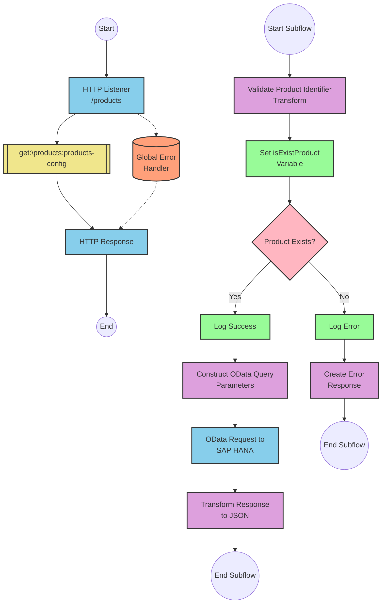

# SAP OData Product Information API Integration

## Table of Contents
- [API Overview](#api-overview)
- [Endpoints](#endpoints)
  - [GET /products](#get-products)
- [Current MuleSoft Flow Logic](#current-mulesoft-flow-logic)
  - [products-main Flow](#products-main-flow)
  - [products-console Flow](#products-console-flow)
  - [get:\products:products-config Flow](#getproductsproducts-config-flow)
  - [get-product-details-flow Subflow](#get-product-details-flow-subflow)
- [DataWeave Transformations Explained](#dataweave-transformations-explained)
  - [Product Identifier Validation](#product-identifier-validation)
  - [OData Query Parameters Construction](#odata-query-parameters-construction)
  - [Response Payload Transformation](#response-payload-transformation)
  - [Error Response Transformation](#error-response-transformation)
- [SAP Integration Suite Implementation](#sap-integration-suite-implementation)
  - [Component Mapping](#component-mapping)
  - [Integration Flow Visualization](#integration-flow-visualization)
  - [Configuration Details](#configuration-details)
- [Environment Configuration](#environment-configuration)
- [API Reference](#api-reference)

## API Overview
This API provides access to product information stored in an SAP HANA database through OData services. The integration retrieves detailed product information based on a product identifier passed as a query parameter. The API validates the product identifier against a configured list of valid identifiers before making the request to the backend system.

- **Base URL**: Determined by the HTTP_Listener_config
- **Authentication**: Not explicitly defined in the source documentation
- **Rate Limiting**: Not specified in the source documentation
- **General Response Format**: JSON

## Endpoints

### GET /products
Retrieves detailed product information based on a product identifier.

- **HTTP Method**: GET
- **Path**: /products
- **Purpose**: Fetch product details from SAP HANA OData service

**Request Parameters**:
- **Query Parameters**:
  - `productIdentifier` (required): The unique identifier of the product to retrieve

**Response Format**:
- **Success Response**: 
  - **Status Code**: 200 OK
  - **Content Type**: application/json
  - **Body**: Product details including ProductId, Category, CategoryName, CurrencyCode, dimensions, descriptions, price, and other attributes

- **Error Response**:
  - **Status Code**: 400 Bad Request
  - **Content Type**: application/json
  - **Body**: Error object with status, message, and errorCode
    ```json
    {
      "status": "error",
      "message": "The product identifier {productIdentifier} was not found.",
      "errorCode": "PRODUCT_NOT_FOUND"
    }
    ```

**Example Request**:
```
GET /products?productIdentifier=HT-1000
```

## Current MuleSoft Flow Logic

### products-main Flow
1. **Trigger**: HTTP listener receives incoming requests
2. **Processing**: Routes the request to the appropriate handler based on the API specification
3. **Response**: Returns the response with appropriate headers
4. **Error Handling**: Provides error responses when needed

### products-console Flow
1. **Trigger**: HTTP listener receives incoming requests
2. **Processing**: Logs request information to the console
3. **Response**: Returns the response with appropriate headers
4. **Error Handling**: Provides error responses when needed

### get:\products:products-config Flow
1. **Trigger**: Receives GET requests to the /products endpoint
2. **Processing**: Calls the get-product-details-flow subflow to process the request
3. **Outcome**: Returns product details or an error response

### get-product-details-flow Subflow
1. **Validation**: Validates if the provided productIdentifier is in the list of valid product identifiers
   - Uses a DataWeave transformation to check if the productIdentifier exists in the configured list
   - Sets a variable `isExistProduct` with the result of the validation

2. **Conditional Processing**:
   - If `isExistProduct` is true:
     - Logs that the request is being processed
     - Constructs an OData query with specific filter and select parameters
     - Makes a request to the SAP HANA OData service
     - Transforms the response to JSON format
   - If `isExistProduct` is false:
     - Logs that the product identifier was not found or incorrectly passed
     - Returns an error response

3. **Expected Outcomes**:
   - Success: Returns product details in JSON format
   - Error: Returns an error message indicating the product was not found

## DataWeave Transformations Explained

### Product Identifier Validation
This transformation checks if the provided product identifier exists in a configured list of valid product identifiers.

**Input**: Query parameter from the request
**Output**: Boolean value indicating if the product identifier is valid

```dw
%dw 2.0
output application/java
var productidentifer=p('odata.productIdentifiers') splitBy(",")
---
sizeOf(productidentifer filter ($ == attributes.queryParams.productIdentifier))>0
```

**Explanation**:
1. Retrieves a comma-separated list of valid product identifiers from a property `odata.productIdentifiers`
2. Splits the string into an array using `splitBy(",")`
3. Filters the array to find elements matching the provided `productIdentifier` query parameter
4. Checks if the size of the filtered array is greater than 0, returning true if a match is found

### OData Query Parameters Construction
This transformation constructs the OData query parameters for the request to the SAP HANA service.

**Input**: Query parameter from the request
**Output**: OData query parameters as a Java map

```dw
#[output application/java
---
{
	"$filter" : "ProductId eq '" ++ (attributes.queryParams.productIdentifier default '') ++ "'",
	"$select" : "ProductId,Category,CategoryName,CurrencyCode,DimensionDepth,DimensionHeight,DimensionUnit,DimensionWidth,LongDescription,Name,PictureUrl,Price,QuantityUnit,ShortDescription,SupplierId,Weight,WeightUnit"
}]
```

**Explanation**:
1. Creates a map with two OData query parameters:
   - `$filter`: Constructs a filter expression to match the ProductId with the provided productIdentifier
   - `$select`: Specifies the fields to be returned in the response

### Response Payload Transformation
This transformation passes through the payload from the OData service response.

**Input**: Response from the OData service
**Output**: JSON representation of the response

```dw
%dw 2.0
output application/json
---
payload
```

**Explanation**:
- Simply outputs the payload as JSON without any transformation

### Error Response Transformation
This transformation creates an error response when the product identifier is not valid.

**Input**: Query parameter from the request
**Output**: JSON error object

```dw
%dw 2.0
output application/json
---
{
	status: "error",
	message: "The product identifier " ++ attributes.queryParams.productIdentifier ++ " was not found.",
	errorCode: "PRODUCT_NOT_FOUND"
}
```

**Explanation**:
1. Creates a JSON object with three fields:
   - `status`: Set to "error"
   - `message`: Dynamic error message including the invalid product identifier
   - `errorCode`: Set to "PRODUCT_NOT_FOUND"

## SAP Integration Suite Implementation

### Component Mapping

| MuleSoft Component | SAP Integration Suite Equivalent | Notes |
|--------------------|----------------------------------|-------|
| HTTP Listener | HTTPS Adapter (Receiver) | Configure with the same path and method settings |
| Flow Router | Content Modifier + Router | Use a Content Modifier to set routing conditions and a Router to direct the flow |
| Flow Reference | Process Call | References to other integration flows |
| DataWeave Transform | Groovy Script or Message Mapping | Complex DataWeave transformations may require Groovy scripts |
| Logger | Write to Message Headers | Use to log information to monitoring |
| HTTP Request | OData Adapter (Sender) | Configure with the same OData query parameters |
| Set Variable | Content Modifier | Use to set exchange properties or headers |
| Choice/When/Otherwise | Router | Implement conditional logic with Router component |
| Set Payload | Content Modifier | Use to modify the message body |
| Error Handler | Exception Subprocess | Handle errors with dedicated exception subprocesses |

### Integration Flow Visualization



### Configuration Details

#### HTTP Listener Configuration
- **Component**: HTTPS Adapter (Receiver)
- **Parameters**:
  - Address: `/products`
  - Authentication: As per security requirements
  - CSRF Protection: As needed

#### OData Request Configuration
- **Component**: OData Adapter (Sender)
- **Parameters**:
  - Service URL: From configuration property
  - Query Options:
    - $filter: `ProductId eq '{productIdentifier}'`
    - $select: `ProductId,Category,CategoryName,CurrencyCode,DimensionDepth,DimensionHeight,DimensionUnit,DimensionWidth,LongDescription,Name,PictureUrl,Price,QuantityUnit,ShortDescription,SupplierId,Weight,WeightUnit`

#### Validate Product Identifier
- **Component**: Groovy Script
- **Script**:
  ```groovy
  def productIdentifiers = property.get("odata.productIdentifiers").split(",")
  def requestedId = message.getProperty("productIdentifier")
  def isValid = productIdentifiers.any { it == requestedId }
  message.setProperty("isExistProduct", isValid)
  return message
  ```

#### Router Configuration
- **Component**: Router
- **Condition 1**: `${property.isExistProduct} == true`
- **Condition 2**: Default (otherwise)

#### Error Response Content Modifier
- **Component**: Content Modifier
- **Message Body**:
  ```json
  {
    "status": "error",
    "message": "The product identifier ${property.productIdentifier} was not found.",
    "errorCode": "PRODUCT_NOT_FOUND"
  }
  ```

## Environment Configuration

### Important Configuration Parameters
- **odata.productIdentifiers**: Comma-separated list of valid product identifiers
- **HTTP_Listener_config**: Configuration for the HTTP listener
- **Hana_HTTP_Request_Configuration**: Configuration for the HTTP request to SAP HANA

### Environment Variables
- **SAP_HANA_URL**: Base URL for the SAP HANA OData service
  - Example: `https://sap-hana-instance.company.com/odata/v2/ProductService`
- **VALID_PRODUCT_IDS**: Comma-separated list of valid product identifiers
  - Example: `HT-1000,HT-1001,HT-1002,HT-1003`

### Dependencies on External Systems
- **SAP HANA**: The integration depends on an SAP HANA instance with an OData service for product information

### Security Settings
- **Authentication**: Configuration for authentication to the SAP HANA OData service
- **Certificates**: SSL certificates for secure communication with SAP HANA

### Deployment Considerations
- Ensure network connectivity between the integration platform and SAP HANA
- Configure appropriate timeouts for HTTP requests
- Set up monitoring for the integration flow

### Required Resources
- Memory: Minimum 1GB recommended
- CPU: 1 CPU core minimum
- Disk Space: 500MB minimum

## API Reference

### Complete Endpoint List
- **GET /products**: Retrieve product details by product identifier

### Request and Response Schemas

#### GET /products
**Request Parameters**:
- **Query Parameters**:
  - `productIdentifier` (string, required): The unique identifier of the product

**Response Schema**:
```json
{
  "ProductId": "string",
  "Category": "string",
  "CategoryName": "string",
  "CurrencyCode": "string",
  "DimensionDepth": "number",
  "DimensionHeight": "number",
  "DimensionUnit": "string",
  "DimensionWidth": "number",
  "LongDescription": "string",
  "Name": "string",
  "PictureUrl": "string",
  "Price": "number",
  "QuantityUnit": "string",
  "ShortDescription": "string",
  "SupplierId": "string",
  "Weight": "number",
  "WeightUnit": "string"
}
```

**Error Response Schema**:
```json
{
  "status": "string",
  "message": "string",
  "errorCode": "string"
}
```

### Error Codes
- **PRODUCT_NOT_FOUND**: The requested product identifier was not found or is invalid

### Authentication Requirements
Authentication requirements are not explicitly defined in the source documentation. Implement appropriate authentication mechanisms based on your security requirements.

### Rate Limiting
Rate limiting information is not specified in the source documentation. Implement rate limiting based on your system's capacity and requirements.

### Pagination
Pagination is not implemented for this API as it returns a single product's details.

### Versioning Information
Versioning information is not explicitly defined in the source documentation. Consider implementing API versioning for future updates.