# API Overview
The Financial Services Cloud Wealth Management API provides a comprehensive set of endpoints for managing investment accounts, beneficiaries, standing orders, and customer profiles. It enables financial institutions to handle wealth management operations including account creation, beneficiary management, payment processing, and specialized financial operations like ACATS (Automated Customer Account Transfer Service) and RMD (Required Minimum Distribution).

- Base URL: `/api/v1`

# Endpoints

## Investment Accounts

### POST /InvestmentAccounts/Initiate
- **Purpose**: Initialize a new investment account with beneficiaries
- **Request Body**: JSON containing account and beneficiary details
- **Response**: 201 Created with the created beneficiary details including generated BeneficiaryIds
- **Example Response**:
```json
{
  "InvestmentAccounts": {
    "AccountIds": ["123456789"],
    "Beneficiaries": {
      "Primary": [
        {
          "BeneficiaryName": "John Doe",
          "BeneficiaryType": "Individual",
          "BeneficiaryId": "BFR-1234567"
        }
      ],
      "Contingent": [
        {
          "BeneficiaryName": "Jane Doe",
          "BeneficiaryType": "Individual",
          "BeneficiaryId": "BFR-7654321"
        }
      ]
    }
  }
}
```

### GET /InvestmentAccounts/{accountId}/Retrieve
- **Purpose**: Retrieve details of a specific investment account
- **Path Parameters**: accountId - The unique identifier for the investment account
- **Response**: 200 OK with account details and beneficiaries
- **Example Response**:
```json
{
  "LinkedAccount": {
    "AccountNumber": "AMZ10012",
    "AccountHolderName": "Bob",
    "AccountType": "Individual"
  },
  "Beneficiaries": {
    "Primary": [
      {
        "BeneficiaryName": "Gabriel Basso",
        "BeneficiaryType": "Institution",
        "BeneficiaryId": "BFR-8066473"
      }
    ]
  }
}
```

### PATCH /InvestmentAccounts/Update
- **Purpose**: Update beneficiary information for investment accounts
- **Request Body**: JSON containing account IDs and updated beneficiary details
- **Response**: 200 OK with updated beneficiary information
- **Example Response**:
```json
{
  "InvestmentAccounts": {
    "AccountIds": ["123456789"],
    "Beneficiaries": {
      "Primary": [
        {
          "BeneficiaryName": "John Doe Updated",
          "BeneficiaryType": "Individual",
          "BeneficiaryId": "BFR-1234567"
        }
      ]
    }
  }
}
```

### DELETE /InvestmentAccounts/Delete
- **Purpose**: Delete beneficiaries from investment accounts
- **Request Body**: JSON containing account IDs and beneficiary IDs to delete
- **Response**: 200 OK with confirmation of deleted beneficiaries
- **Example Response**:
```json
{
  "InvestmentAccounts": {
    "AccountIds": ["123456789"],
    "Beneficiaries": [
      {
        "BeneficiaryId": "BFR-1234567",
        "Status": "DELETED"
      }
    ]
  }
}
```

## Payment Operations

### POST /InvestmentAccounts/{accountId}/Payments/Initiate
- **Purpose**: Create standing orders for an investment account
- **Path Parameters**: accountId - The unique identifier for the investment account
- **Request Body**: JSON containing payment details
- **Response**: 201 Created with payment details including generated PaymentId
- **Example Response**:
```json
{
  "Payments": [
    {
      "PaymentType": "standing order",
      "PaymentMode": "Bank Wire",
      "CreationDateTime": "2023-10-09T16:34:19.993+05:30",
      "PaymentId": "PMT3564864"
    }
  ]
}
```

### GET /InvestmentAccounts/{accountId}/Payments/Retrieve
- **Purpose**: Retrieve standing orders for an investment account
- **Path Parameters**: accountId - The unique identifier for the investment account
- **Query Parameters**: paymentId, payeeName, amount - Optional filters for the results
- **Response**: 200 OK with payment order details
- **Example Response**:
```json
{
  "PaymentOrders": [
    {
      "CreationDateTime": "2023-10-09T16:34:19.993+05:30",
      "PaymentId": "PMT3564864",
      "Payments": {
        "PaymentType": "standing order",
        "PaymentMode": "Bank Wire"
      }
    }
  ]
}
```

### PATCH /InvestmentAccounts/{accountId}/Payments/Update
- **Purpose**: Cancel standing orders for an investment account
- **Path Parameters**: accountId - The unique identifier for the investment account
- **Request Body**: JSON containing payment IDs to cancel
- **Response**: 200 OK with confirmation of canceled payments
- **Example Response**:
```json
{
  "PaymentIds": ["PMT3564864"],
  "CancelDateTime": "2023-10-09T16:40:19.993+05:30"
}
```

## Customer Profile Management

### PATCH /customers/{customerId}
- **Purpose**: Update customer profile information
- **Path Parameters**: customerId - The unique identifier for the customer
- **Request Body**: JSON containing updated profile information
- **Response**: 200 OK with updated profile details
- **Example Response**:
```json
{
  "ProfileInformation": {
    "Addresses": [
      {
        "AddressLine1": "415 Mission St",
        "City": "San Francisco",
        "State": "CA"
      }
    ],
    "FirstName": "John",
    "LastName": "Doe",
    "Email": "john.doe@example.com"
  }
}
```

## Specialized Financial Operations

### POST /InvestmentAccounts/{accountId}/Acats
- **Purpose**: Initiate an ACATS (Automated Customer Account Transfer Service) request
- **Path Parameters**: accountId - The unique identifier for the investment account
- **Request Body**: JSON containing ACATS details
- **Response**: 201 Created with ACATS details
- **Example Response**:
```json
{
  "AcatDetails": {
    "TransferType": "Full",
    "TransferAction": "Inwards",
    "ExternalAccountDetails": {
      "AccountNumber": "EXT12345",
      "AccountType": "Individual"
    }
  }
}
```

### POST /InvestmentAccounts/{accountId}/RMD
- **Purpose**: Process a Required Minimum Distribution (RMD) request
- **Path Parameters**: accountId - The unique identifier for the investment account
- **Request Body**: JSON containing RMD details
- **Response**: 201 Created with RMD details
- **Example Response**:
```json
{
  "PaymentOption": "Calculated Amount",
  "PaymentFrequency": "Annual",
  "TaxYear": "2023",
  "CalculateRMDAmount": true
}
```

# Current MuleSoft Flow Logic

## Main Flow: fsc-wealth-management-api-main
This is the main entry point for the API that handles HTTP requests, routes them to the appropriate subflows, and handles errors.

1. **Trigger**: HTTP listener configured to receive requests
2. **Processing Steps**:
   - Logs request details including requestId and flowRefId
   - Routes the request to the appropriate flow based on the HTTP method and path
   - Logs the response payload
3. **Error Handling**: Uses a common exception handler for API errors

## Flow: post:\InvestmentAccounts\Initiate:application\json:fsc-wealth-management-api-config
1. **Trigger**: POST request to /InvestmentAccounts/Initiate
2. **Processing Steps**: 
   - Routes to add-beneficiaries-sub-flow
   - Transforms the request payload to generate beneficiary IDs
3. **Expected Outcome**: Returns a 201 Created response with beneficiary details

## Flow: get:\InvestmentAccounts\(accountId)\Retrieve:fsc-wealth-management-api-config
1. **Trigger**: GET request to /InvestmentAccounts/{accountId}/Retrieve
2. **Processing Steps**:
   - Routes to retrieve-investment-account-details-sub-flow
   - Sets account ID as a variable
   - Transforms the response to include linked account and beneficiary details
3. **Expected Outcome**: Returns a 200 OK response with account details

## Flow: patch:\InvestmentAccounts\Update:application\json:fsc-wealth-management-api-config
1. **Trigger**: PATCH request to /InvestmentAccounts/Update
2. **Processing Steps**:
   - Routes to update-beneficiaries-sub-flow
   - Transforms the request payload to update beneficiary information
3. **Expected Outcome**: Returns a 200 OK response with updated beneficiary details

## Flow: delete:\InvestmentAccounts\Delete:application\json:fsc-wealth-management-api-config
1. **Trigger**: DELETE request to /InvestmentAccounts/Delete
2. **Processing Steps**:
   - Routes to delete-beneficiaries-sub-flow
   - Transforms the request payload to mark beneficiaries as deleted
3. **Expected Outcome**: Returns a 200 OK response with deletion confirmation

## Flow: post:\InvestmentAccounts\(accountId)\Payments\Initiate:application\json:fsc-wealth-management-api-config
1. **Trigger**: POST request to /InvestmentAccounts/{accountId}/Payments/Initiate
2. **Processing Steps**:
   - Routes to add-standing-orders-sub-flow
   - Transforms the request payload to generate payment IDs
3. **Expected Outcome**: Returns a 201 Created response with payment details

## Flow: get:\InvestmentAccounts\(accountId)\Payments\Retrieve:fsc-wealth-management-api-config
1. **Trigger**: GET request to /InvestmentAccounts/{accountId}/Payments/Retrieve
2. **Processing Steps**:
   - Routes to retrieve-standing-orders-sub-flow
   - Logs query parameters
   - Sets account ID as a variable
   - Filters payment orders based on query parameters
3. **Expected Outcome**: Returns a 200 OK response with filtered payment orders

## Flow: patch:\InvestmentAccounts\(accountId)\Payments\Update:application\json:fsc-wealth-management-api-config
1. **Trigger**: PATCH request to /InvestmentAccounts/{accountId}/Payments/Update
2. **Processing Steps**:
   - Routes to cancel-standing-orders-sub-flow
   - Transforms the request payload to include cancellation timestamp
3. **Expected Outcome**: Returns a 200 OK response with cancellation confirmation

## Flow: patch:\customers\(customerId):application\json:fsc-wealth-management-api-config
1. **Trigger**: PATCH request to /customers/{customerId}
2. **Processing Steps**:
   - Routes to update-customers-profile-sub-flow
   - Transforms the request payload to update customer profile information
3. **Expected Outcome**: Returns a 200 OK response with updated profile details

## Flow: post:\InvestmentAccounts\(accountId)\Acats:application\json:fsc-wealth-management-api-config
1. **Trigger**: POST request to /InvestmentAccounts/{accountId}/Acats
2. **Processing Steps**:
   - Routes to prepare-acats-response-sub-flow
   - Transforms the request payload to prepare ACATS response
3. **Expected Outcome**: Returns a 201 Created response with ACATS details

## Flow: post:\InvestmentAccounts\(accountId)\RMD:application\json:fsc-wealth-management-api-config
1. **Trigger**: POST request to /InvestmentAccounts/{accountId}/RMD
2. **Processing Steps**:
   - Routes to prepare-rmd-response-sub-flow
   - Transforms the request payload to prepare RMD response
3. **Expected Outcome**: Returns a 201 Created response with RMD details

# DataWeave Transformations Explained

## p-addBeneficiariesResponse.dwl
This transformation generates unique beneficiary IDs for new beneficiaries and structures the response.

```dataweave
%dw 2.0
var bfr= "BFR-"
var bfrTrack= "BFRTRACK"
var bfrNumbers= '0123456789'
var bfrCharSetLength= sizeOf(bfrNumbers) - 1
var bfrNumbersLength= 7
output application/json skipNullOn = "everywhere"
---
{
	InvestmentAccounts: {
		AccountIds: payload.InvestmentAccounts.AccountIds map ( accountId , indexOfAccountId ) -> accountId,
		Beneficiaries: {
			Primary: payload.InvestmentAccounts.Beneficiaries.Primary map ($ ++ {
				BeneficiaryId: bfr ++ (1 to bfrNumbersLength map bfrNumbers[randomInt(bfrCharSetLength)] joinBy '')
			}),
			Contingent: payload.InvestmentAccounts.Beneficiaries.Contingent map ($ ++ {
				BeneficiaryId: bfr ++ (1 to bfrNumbersLength map bfrNumbers[randomInt(bfrCharSetLength)] joinBy '')
			})
		}
	}
}
```

- **Input**: JSON with account IDs and beneficiary details
- **Output**: JSON with the same structure plus generated BeneficiaryId fields
- **Key Operations**:
  - Uses `map` to iterate through arrays of primary and contingent beneficiaries
  - Generates random numeric IDs with prefix "BFR-" using `randomInt`
  - Uses `++` to append the BeneficiaryId to each beneficiary object
  - Uses `skipNullOn = "everywhere"` to exclude null values from the output

## p-retrievePaymentOrdersResponse.dwl
This transformation filters payment orders based on query parameters.

```dataweave
%dw 2.0
output application/json  
---
{
  PaymentOrders: 
    if (attributes.queryParams.paymentId? and attributes.queryParams.payeeName? and attributes.queryParams.amount?)
      vars.paymentOrders filter ($.PaymentId ~= attributes.queryParams.paymentId and $.Payments.PayeeReference.PayeeName ~= attributes.queryParams.payeeName and $.Payments.PaymentDefinition.PaymentAmount.Amount ~= attributes.queryParams.amount)
    else if (attributes.queryParams.paymentId? and attributes.queryParams.payeeName?)
      vars.paymentOrders filter ($.PaymentId ~= attributes.queryParams.paymentId and $.Payments.PayeeReference.PayeeName ~= attributes.queryParams.payeeName)
    else if (attributes.queryParams.paymentId? and attributes.queryParams.amount?)
      vars.paymentOrders filter ($.PaymentId ~= attributes.queryParams.paymentId and $.Payments.PaymentDefinition.PaymentAmount.Amount ~= attributes.queryParams.amount)
    else if (attributes.queryParams.payeeName? and attributes.queryParams.amount?)
      vars.paymentOrders filter ($.Payments.PayeeReference.PayeeName ~= attributes.queryParams.payeeName and $.Payments.PaymentDefinition.PaymentAmount.Amount ~= attributes.queryParams.amount)
    else if (attributes.queryParams.paymentId?)
      vars.paymentOrders filter ($.PaymentId ~= attributes.queryParams.paymentId)
    else if (attributes.queryParams.payeeName?)
      vars.paymentOrders filter ($.Payments.PayeeReference.PayeeName ~= attributes.queryParams.payeeName)
    else if (attributes.queryParams.amount?)
      vars.paymentOrders filter ($.Payments.PaymentDefinition.PaymentAmount.Amount ~= attributes.queryParams.amount)
    else
      vars.paymentOrders
}
```

- **Input**: Query parameters and payment orders stored in a variable
- **Output**: Filtered payment orders based on query parameters
- **Key Operations**:
  - Uses nested `if/else if` conditions to handle different combinations of query parameters
  - Uses `filter` with the `~=` (contains) operator to match payment orders
  - Returns all payment orders if no query parameters are provided

## p-updateBeneficiariesResponse.dwl
This transformation updates beneficiary information and generates IDs for new beneficiaries.

```dataweave
%dw 2.0
var bfr= "BFR-"
var bfrTrack= "BFRTRACK"
var bfrNumbers= '0123456789'
var bfrCharSetLength= sizeOf(bfrNumbers) - 1
var bfrNumbersLength= 7

fun treeFilter(value: Any, predicate: (value:Any) -> Boolean) =
    value  match {
            case object is Object ->  do {
               object mapObject ((value, key, index) -> 
                    (key): treeFilter(value, predicate)
                )
                filterObject ((value, key, index) -> predicate(value))
            }
            case array is Array -> do {
                    array map ((item, index) -> treeFilter(item, predicate))
                                         filter ((item, index) -> predicate(item))                 
            }
            else -> $
    }
    
output application/json skipNullOn = "everywhere"
---
{
	InvestmentAccounts: {
		AccountIds: payload.InvestmentAccounts.AccountIds map ( accountId , indexOfAccountId ) -> accountId,
		Addresses: payload.InvestmentAccounts.Addresses,
		Beneficiaries: {
			Primary: payload.InvestmentAccounts.Beneficiaries.Primary map if ( $.BeneficiaryId == null ) ($ ++ {
				"BeneficiaryId": bfr ++ (1 to bfrNumbersLength map bfrNumbers[randomInt(bfrCharSetLength)] joinBy '')
			}) else $,
			Contingent: payload.InvestmentAccounts.Beneficiaries.Contingent map if ( $.BeneficiaryId == null ) ($ ++ {
				"BeneficiaryId": bfr ++ (1 to bfrNumbersLength map bfrNumbers[randomInt(bfrCharSetLength)] joinBy '')
			}) else $
		}
	}
} treeFilter ((value) -> 
    value match {
        case v is Array| Object | Null | "" -> !isEmpty(v)
        else -> true
    }
)
```

- **Input**: JSON with account IDs and updated beneficiary details
- **Output**: JSON with updated beneficiary information and generated IDs for new beneficiaries
- **Key Operations**:
  - Defines a recursive `treeFilter` function to remove empty values from the output
  - Uses conditional mapping to generate IDs only for beneficiaries without existing IDs
  - Uses pattern matching to handle different data types in the filter function
  - Applies the filter to the entire output to remove empty values

## p-addPaymentOrdersResponse.dwl
This transformation generates unique payment IDs for new payment orders.

```dataweave
%dw 2.0
var sot= "PMT"
var stordTrack= "STORDTRACK"
var sotNumbers= '0123456789'
var sotCharSetLength= sizeOf(sotNumbers) - 1
var sotNumbersLength= 7
output application/json skipNullOn = "everywhere"
---
{
	Payments: payload.Payments map ($ ++ {
		CreationDateTime: now(),
		PaymentId: sot ++ (1 to sotNumbersLength map sotNumbers[randomInt(sotCharSetLength)] joinBy '')
	})
}
```

- **Input**: JSON with payment details
- **Output**: JSON with the same structure plus generated PaymentId fields and creation timestamps
- **Key Operations**:
  - Uses `map` to iterate through the array of payments
  - Generates random numeric IDs with prefix "PMT" using `randomInt`
  - Adds the current timestamp using `now()`
  - Uses `++` to append the PaymentId and CreationDateTime to each payment object

## p-updateProfileResponse.dwl
This transformation structures the customer profile update response.

```dataweave
%dw 2.0
var ProfileInformation = payload.ProfileInformation
output application/json skipNullOn="everywhere"
---
{
	ProfileInformation: {
		Addresses: ProfileInformation.Addresses map ( address , indexOfAddress ) -> {
			AddressLine2: address.AddressLine2,
			AddressLine1: address.AddressLine1,
			State: address.State,
			PostalCode: address.PostalCode,
			City: address.City,
			AddressType: address.AddressType,
			Country: address.Country
		},
		Email: ProfileInformation.Email,
		FirstName: ProfileInformation.FirstName,
		Phone: ProfileInformation.Phone,
		LastName: ProfileInformation.LastName,
		Mobile: ProfileInformation.Mobile,
		BirthDate: ProfileInformation.BirthDate,
		MaritalStatus: ProfileInformation.MaritalStatus,
		EmploymentDetails: ProfileInformation.EmploymentDetails
	}
}
```

- **Input**: JSON with updated profile information
- **Output**: JSON with structured profile information
- **Key Operations**:
  - Stores the ProfileInformation object in a variable for easier access
  - Maps through the Addresses array to maintain the structure
  - Explicitly lists all fields to ensure consistent output format
  - Uses `skipNullOn="everywhere"` to exclude null values from the output

# SAP Integration Suite Implementation

## Component Mapping

| MuleSoft Component | SAP Integration Suite Equivalent | Notes |
|--------------------|----------------------------------|-------|
| listener | HTTPS Adapter | Configure with the same endpoint paths and methods |
| router | Router | Maps to Content Modifier with routing logic |
| flow-ref | Process Call | References to subflows become process calls |
| set-variable | Content Modifier | For variable assignment operations |
| transform | Message Mapping | For DataWeave transformations |
| set-payload | Content Modifier | For setting response payload |
| logger | Write to Log | For logging operations |
| error-handler | Exception Subprocess | For error handling logic |
| headers | Content Modifier | For setting response headers |
| response | End Message | For sending HTTP responses |

## Integration Flow Visualization

### Flow 1: fsc-wealth-management-api-main

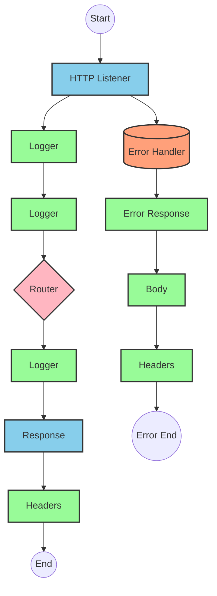

### Flow 2: post:\InvestmentAccounts\Initiate:application\json:fsc-wealth-management-api-config

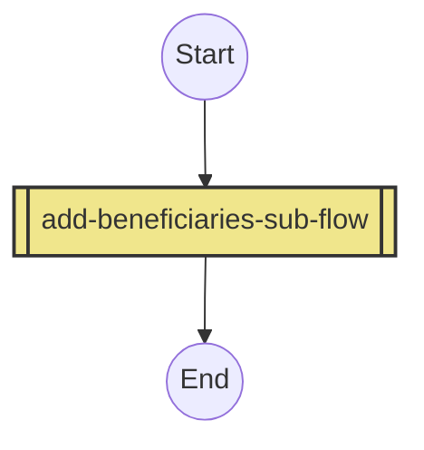

### Flow 3: get:\InvestmentAccounts\(accountId)\Retrieve:fsc-wealth-management-api-config

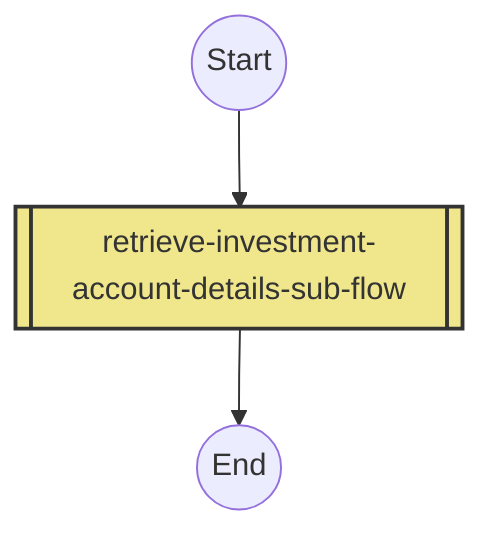

### Flow 4: patch:\InvestmentAccounts\Update:application\json:fsc-wealth-management-api-config

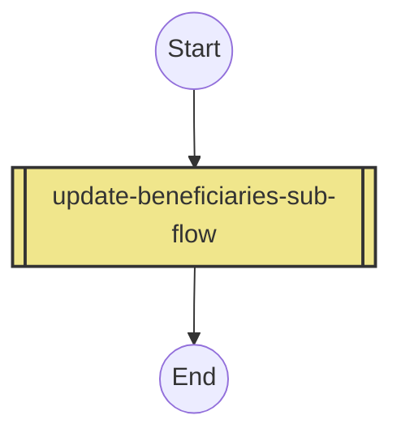

### Flow 5: delete:\InvestmentAccounts\Delete:application\json:fsc-wealth-management-api-config

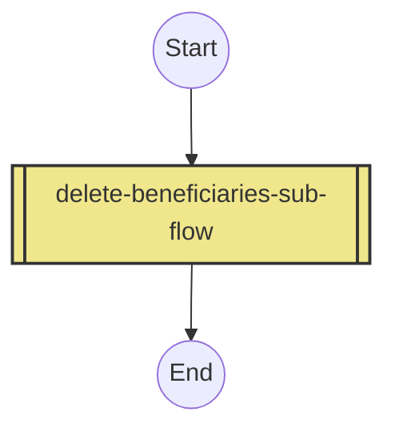

### Flow 6: post:\InvestmentAccounts\(accountId)\Payments\Initiate:application\json:fsc-wealth-management-api-config


### Flow 7: get:\InvestmentAccounts\(accountId)\Payments\Retrieve:fsc-wealth-management-api-config

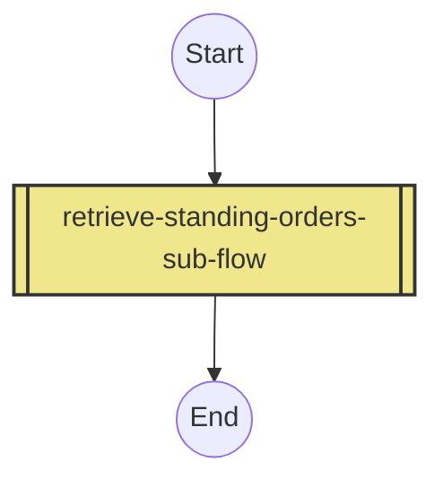

### Flow 8: patch:\InvestmentAccounts\(accountId)\Payments\Update:application\json:fsc-wealth-management-api-config

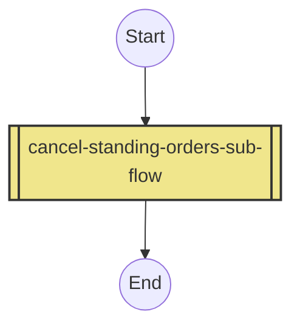

### Flow 9: patch:\customers\(customerId):application\json:fsc-wealth-management-api-config

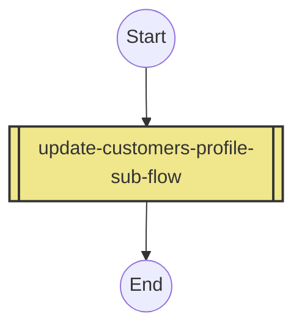

### Flow 10: post:\InvestmentAccounts\(accountId)\Acats:application\json:fsc-wealth-management-api-config


### Flow 11: post:\InvestmentAccounts\(accountId)\RMD:application\json:fsc-wealth-management-api-config

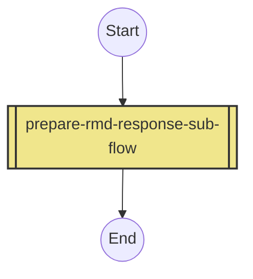

### Flow 12: delete-beneficiaries-sub-flow

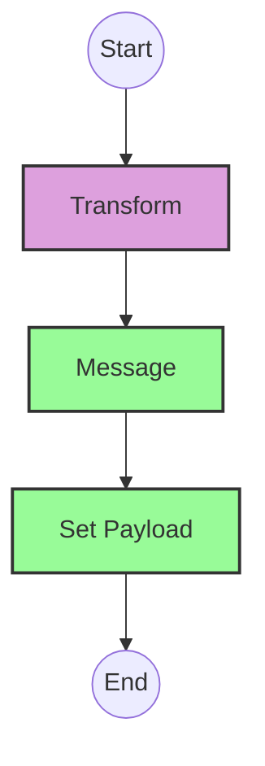

### Flow 13: retrieve-investment-account-details-sub-flow

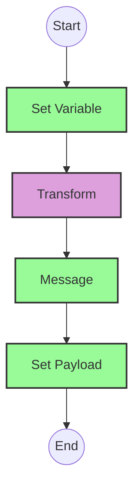

### Flow 14: retrieve-standing-orders-sub-flow

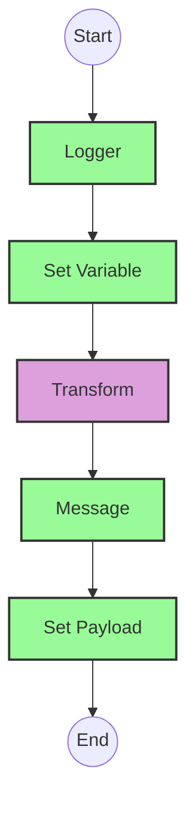

### Flow 15: update-customers-profile-sub-flow


### Flow 16: cancel-standing-orders-sub-flow


### Flow 17: update-beneficiaries-sub-flow


### Flow 18: prepare-acats-response-sub-flow


### Flow 19: add-standing-orders-sub-flow


### Flow 20: prepare-rmd-response-sub-flow


### Flow 21: add-beneficiaries-sub-flow

```mermaid
flowchart TD
%% Define node styles
classDef httpAdapter fill:#87CEEB,stroke:#333,stroke-width:2px
classDef contentModifier fill:#98FB98,stroke:#333,stroke-width:2px
classDef router fill:#FFB6C1,stroke:#333,stroke-width:2px
classDef mapping fill:#DDA0DD,stroke:#333,stroke-width:2px
classDef exception fill:#FFA07A,stroke:#333,stroke-width:2px
classDef processCall fill:#F0E68C,stroke:#333,stroke-width:2px

%% Subflow
Start((Start)) --> Transform[Transform]:::mapping
Transform --> Message[Message]:::contentModifier
Message --> SetPayload[Set Payload]:::contentModifier
SetPayload --> End((End))
```

## Configuration Details

### HTTPS Adapter (Main Listener)
- **Address**: `/api/v1`
- **Supported Methods**: GET, POST, PATCH, DELETE
- **CSRF Protection**: Enabled
- **Authentication**: Basic Authentication (configuration decision)

### Router
- **Condition Type**: XPath
- **Routing Rules**: Based on HTTP method and path patterns
- **Default Route**: Error handler

### Content Modifier (Set Variable)
- **Variable Name**: investmentAccountDetails
- **Variable Value**: JSON from file or mock data

### Message Mapping
- **Source Format**: JSON
- **Target Format**: JSON
- **Mapping Type**: Direct mapping with transformations
- **Script Collection**: Required for complex transformations like random ID generation

### Exception Subprocess
- **Error Types**: APIKIT:BAD_REQUEST, APIKIT:NOT_FOUND, APIKIT:METHOD_NOT_ALLOWED, APIKIT:NOT_ACCEPTABLE, APIKIT:UNSUPPORTED_MEDIA_TYPE, APIKIT:NOT_IMPLEMENTED, ANY
- **Error Handling**: Set appropriate HTTP status code and error message

### Process Call
- **Process Reference**: Name of the subflow to call
- **Process Interface**: Synchronous

# Configuration

## Important Configuration Parameters
- **HTTP Listener Configuration**: 
  - Name: fsc-wealth-management-api-httpListenerConfig
  - Base Path: /api/v1

- **API Configuration**:
  - Name: fsc-wealth-management-api-config
  - API: fsc-wealth-management-api.raml
  - outboundHeadersMapName: outboundHeaders
  - httpStatusVarName: httpStatus

## Environment Variables
- **TLS Configuration**:
  - keySecret: integration@keystore
  - keyStoreSecret: integration@keystore

## Dependencies on External Systems
- No explicit external system dependencies are mentioned in the source documentation.
- The application appears to be using mock data or file-based data sources.

## Security Settings
- **TLS Configuration**: Required for HTTPS communication
- **Authentication**: Not explicitly defined in the source, but should be configured based on security requirements
- **CSRF Protection**: Should be enabled for POST, PATCH, and DELETE operations