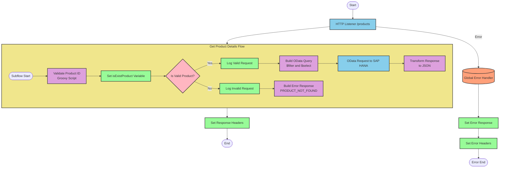

# SAP HANA Product Information API Integration

## Table of Contents
- [SAP HANA Product Information API Integration](#sap-hana-product-information-api-integration)
  - [Table of Contents](#table-of-contents)
  - [API Overview](#api-overview)
  - [Endpoints](#endpoints)
    - [GET /products](#get-products)
  - [Current MuleSoft Flow Logic](#current-mulesoft-flow-logic)
    - [Main Flows](#main-flows)
    - [Subflows](#subflows)
  - [DataWeave Transformations Explained](#dataweave-transformations-explained)
    - [Product Identifier Validation](#product-identifier-validation)
    - [OData Query Parameters Construction](#odata-query-parameters-construction)
    - [Response Transformation](#response-transformation)
    - [Error Response Transformation](#error-response-transformation)
  - [SAP Integration Suite Implementation](#sap-integration-suite-implementation)
    - [Component Mapping](#component-mapping)
    - [Integration Flow Visualization](#integration-flow-visualization)
    - [Configuration Details](#configuration-details)
  - [Environment Configuration](#environment-configuration)
  - [API Reference](#api-reference)
    - [GET /products](#get-products-1)
    - [Error Codes](#error-codes)

## API Overview
This API provides access to product information stored in SAP HANA. It allows clients to retrieve detailed product information by providing a product identifier as a query parameter. The API validates the product identifier against a configured list of valid identifiers before retrieving the product details from SAP HANA via OData queries.

- **Base URL**: Determined by the HTTP_Listener_config
- **Authentication**: Not explicitly defined in the source documentation
- **Rate Limiting**: Not specified in the source documentation
- **General Response Format**: JSON

## Endpoints

### GET /products
Retrieves detailed product information based on a product identifier.

- **HTTP Method**: GET
- **Path**: /products
- **Purpose**: Fetch product details from SAP HANA based on a product identifier

**Request Parameters**:
- **Query Parameters**:
  - `productIdentifier` (required): The unique identifier of the product to retrieve

**Response Format**:
- **Success Response (200 OK)**:
  - Content-Type: application/json
  - Body: Product details from SAP HANA

**Error Responses**:
- **400 Bad Request**:
  - When the product identifier is invalid or not found
  - Content-Type: application/json
  - Body:
    ```json
    {
      "status": "error",
      "message": "The product identifier {identifier} was not found.",
      "errorCode": "PRODUCT_NOT_FOUND"
    }
    ```

**Example Request**:
```
GET /products?productIdentifier=HT-1000
```

**Example Response**:
```json
{
  "ProductId": "HT-1000",
  "Category": "Laptops",
  "CategoryName": "Laptops",
  "CurrencyCode": "USD",
  "DimensionDepth": 30,
  "DimensionHeight": 3,
  "DimensionUnit": "cm",
  "DimensionWidth": 40,
  "LongDescription": "High-performance laptop for professional use",
  "Name": "Professional Laptop",
  "PictureUrl": "/images/HT-1000.jpg",
  "Price": 1299.99,
  "QuantityUnit": "EA",
  "ShortDescription": "Professional laptop",
  "SupplierId": "SUPP-001",
  "Weight": 2.5,
  "WeightUnit": "kg"
}
```

## Current MuleSoft Flow Logic

### Main Flows

1. **products-main**
   - Triggered by an HTTP listener
   - Sets response headers
   - Handles errors with an error-response component
   - Routes requests to appropriate handlers

2. **products-console**
   - Triggered by an HTTP listener
   - Sets response headers
   - Handles errors with an error-response component
   - Logs information to the console

3. **get:\products:products-config**
   - Triggered when a GET request is made to the /products endpoint
   - References the get-product-details-flow subflow to process the request

### Subflows

**get-product-details-flow**:
1. Validates the product identifier against a configured list of valid identifiers
   - Uses a DataWeave transformation to check if the product identifier is valid
   - Sets a variable `isExistProduct` based on the validation result

2. Branches based on the validation result:
   - If valid:
     - Logs that the request is being processed
     - Constructs an OData query with $filter and $select parameters
     - Sends a request to SAP HANA
     - Transforms the response to JSON
   - If invalid:
     - Logs that the product identifier was not found or incorrectly passed
     - Returns an error response with status "error" and errorCode "PRODUCT_NOT_FOUND"

## DataWeave Transformations Explained

### Product Identifier Validation

This transformation checks if the provided product identifier exists in a configured list of valid identifiers.

```dw
%dw 2.0
output application/java
var productidentifer=p('odata.productIdentifiers') splitBy(",")
---
sizeOf(productidentifer filter ($ == attributes.queryParams.productIdentifier))>0
```

- **Input**: The product identifier from the query parameters
- **Output**: A boolean value indicating if the product identifier is valid
- **Logic**:
  1. Retrieves a comma-separated list of valid product identifiers from a property
  2. Splits the list into an array
  3. Filters the array to find matches with the provided product identifier
  4. Checks if the size of the filtered array is greater than 0 (indicating a match was found)

### OData Query Parameters Construction

This transformation constructs the OData query parameters for retrieving product details from SAP HANA.

```dw
#[output application/java
---
{
	"$filter" : "ProductId eq '" ++ (attributes.queryParams.productIdentifier default '') ++ "'",
	"$select" : "ProductId,Category,CategoryName,CurrencyCode,DimensionDepth,DimensionHeight,DimensionUnit,DimensionWidth,LongDescription,Name,PictureUrl,Price,QuantityUnit,ShortDescription,SupplierId,Weight,WeightUnit"
}]
```

- **Input**: The product identifier from the query parameters
- **Output**: A map of OData query parameters
- **Logic**:
  1. Constructs a $filter parameter that filters products by the provided product identifier
  2. Specifies a $select parameter that selects specific fields to be returned in the response

### Response Transformation

This transformation passes through the payload from SAP HANA without modification.

```dw
%dw 2.0
output application/json
---
payload
```

- **Input**: The response from SAP HANA
- **Output**: The same response in JSON format
- **Logic**: Simple pass-through transformation that converts the payload to JSON

### Error Response Transformation

This transformation constructs an error response when the product identifier is invalid.

```dw
%dw 2.0
output application/json
---
{
	status: "error",
	message: "The product identifier " ++ attributes.queryParams.productIdentifier ++ " was not found.",
	errorCode: "PRODUCT_NOT_FOUND"
}
```

- **Input**: The product identifier from the query parameters
- **Output**: An error response in JSON format
- **Logic**: Constructs an error response with status "error", a message indicating the product identifier was not found, and an error code "PRODUCT_NOT_FOUND"

## SAP Integration Suite Implementation

### Component Mapping

| MuleSoft Component | SAP Integration Suite Equivalent | Notes |
|--------------------|----------------------------------|-------|
| HTTP Listener | HTTPS Adapter (Receiver) | Configure with the same path and method |
| Flow Reference | Process Call | Used to call the product details subflow |
| DataWeave Transform | Content Modifier + Groovy Script | For complex transformations, use Groovy Script; for simple ones, use Content Modifier |
| Logger | Content Modifier (with Write to Log option) | Set log level appropriately |
| Choice/When/Otherwise | Router | Configure with the same condition |
| HTTP Request | OData Adapter (Sender) | Configure with the same OData query parameters |
| Set Variable | Content Modifier | Set the same variable name and value |
| Set Payload | Content Modifier | Set the same payload content |
| Error Handler | Exception Subprocess | Configure with the same error types and handling logic |

### Integration Flow Visualization



### Configuration Details

**HTTP Adapter (Receiver)**:
- Path: /products
- Method: GET
- Authentication: As per deployment requirements

**OData Adapter (Sender)**:
- Connection to SAP HANA
- Service Path: As configured in Hana_HTTP_Request_Configuration
- Query Parameters:
  - $filter: ProductId eq '{productIdentifier}'
  - $select: ProductId,Category,CategoryName,CurrencyCode,DimensionDepth,DimensionHeight,DimensionUnit,DimensionWidth,LongDescription,Name,PictureUrl,Price,QuantityUnit,ShortDescription,SupplierId,Weight,WeightUnit

**Groovy Script for Product Validation**:
```groovy
def productIdentifiers = property.get("odata.productIdentifiers").split(",")
def requestedProductId = message.getHeaders().get("productIdentifier")
return productIdentifiers.any { it == requestedProductId }
```

**Router Configuration**:
- Condition: ${property.isExistProduct}
- Default route: No (error response)

**Content Modifiers**:
- Set isExistProduct: Result from Groovy Script
- Log Valid Request: "The request is processed and sent downstream with the product identifier (${header.productIdentifier})."
- Log Invalid Request: "The product identifier (${header.productIdentifier}) was not passed in the request or was passed incorrectly."
- Error Response: JSON structure with status, message, and errorCode

## Environment Configuration

**Important Configuration Parameters**:
- `odata.productIdentifiers`: A comma-separated list of valid product identifiers

**External System Dependencies**:
- SAP HANA: Required for retrieving product information via OData queries

**Security Settings**:
- Authentication for SAP HANA access (not specified in source documentation)
- API security (not specified in source documentation)

**Deployment Considerations**:
- Ensure the SAP HANA connection is properly configured
- Configure the list of valid product identifiers
- Set up appropriate logging levels

**Required Resources**:
- Memory and CPU requirements not specified in source documentation

## API Reference

### GET /products

**Request**:
- Method: GET
- Path: /products
- Query Parameters:
  - productIdentifier (required): The unique identifier of the product to retrieve

**Response**:
- Content-Type: application/json
- Body: Product details from SAP HANA with the following fields:
  - ProductId
  - Category
  - CategoryName
  - CurrencyCode
  - DimensionDepth
  - DimensionHeight
  - DimensionUnit
  - DimensionWidth
  - LongDescription
  - Name
  - PictureUrl
  - Price
  - QuantityUnit
  - ShortDescription
  - SupplierId
  - Weight
  - WeightUnit

### Error Codes

| Error Code | Description |
|------------|-------------|
| PRODUCT_NOT_FOUND | The requested product identifier was not found or is invalid |
| APIKIT:BAD_REQUEST | The request was malformed or missing required parameters |
| APIKIT:NOT_FOUND | The requested resource was not found |
| APIKIT:METHOD_NOT_ALLOWED | The HTTP method is not allowed for the requested resource |
| APIKIT:NOT_ACCEPTABLE | The server cannot produce a response matching the list of acceptable values |
| APIKIT:UNSUPPORTED_MEDIA_TYPE | The request entity has a media type which the server does not support |
| APIKIT:NOT_IMPLEMENTED | The server does not support the functionality required to fulfill the request |