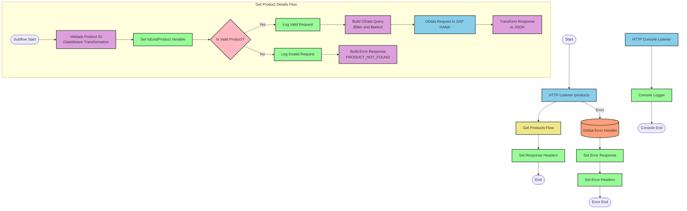

# SAP HANA Product Information API Integration

## Table of Contents
- [SAP HANA Product Information API Integration](#sap-hana-product-information-api-integration)
  - [Table of Contents](#table-of-contents)
  - [API Overview](#api-overview)
  - [Endpoints](#endpoints)
    - [GET /products](#get-products)
  - [Current MuleSoft Flow Logic](#current-mulesoft-flow-logic)
    - [Main Flows](#main-flows)
    - [Subflows](#subflows)
  - [DataWeave Transformations Explained](#dataweave-transformations-explained)
    - [Product Identifier Validation](#product-identifier-validation)
    - [OData Query Parameters Construction](#odata-query-parameters-construction)
    - [Response Payload Transformation](#response-payload-transformation)
    - [Error Response Transformation](#error-response-transformation)
  - [SAP Integration Suite Implementation](#sap-integration-suite-implementation)
    - [Component Mapping](#component-mapping)
    - [Integration Flow Visualization](#integration-flow-visualization)
    - [Configuration Details](#configuration-details)
  - [Environment Configuration](#environment-configuration)
  - [API Reference](#api-reference)

## API Overview
- This API provides access to product information stored in SAP HANA
- The API allows retrieving detailed product information by product identifier
- Base URL: Configured through HTTP_Listener_config
- Authentication: Not explicitly defined in the source documentation
- Response Format: JSON
- The API validates product identifiers against a configured list before processing requests

## Endpoints

### GET /products
- **Purpose**: Retrieves detailed product information based on a product identifier
- **Request Parameters**:
  - Query Parameters:
    - `productIdentifier` (required): The unique identifier of the product to retrieve
- **Response Format**:
  - Success: JSON object containing product details
  - Error: JSON object with status, message, and errorCode
- **Status Codes**:
  - 200: Successful response
  - 400: Bad Request
  - 404: Not Found
  - 405: Method Not Allowed
  - 406: Not Acceptable
  - 415: Unsupported Media Type
  - 501: Not Implemented
- **Error Handling**:
  - If the product identifier is not valid or not found, returns an error response with code "PRODUCT_NOT_FOUND"
  - API-specific errors are handled through the Global_Error_Handler

## Current MuleSoft Flow Logic

### Main Flows

1. **products-main**
   - Triggered by an HTTP request
   - Sets up response headers
   - Handles error responses
   - Routes the request to appropriate handlers

2. **products-console**
   - Triggered by an HTTP request
   - Sets up response headers
   - Handles error responses
   - Logs information to the console

3. **get:\products:products-config**
   - Triggered when a GET request is made to the /products endpoint
   - References the get-product-details-flow subflow to process the request

### Subflows

**get-product-details-flow**
1. Validates if the provided product identifier exists in the configured list
   - Uses a DataWeave transformation to check if the product identifier is valid
   - Sets a variable `isExistProduct` based on the validation result

2. Processes the request based on validation result:
   - If valid:
     - Logs that the request is being processed
     - Constructs OData query parameters for filtering and selecting fields
     - Makes a request to the SAP HANA system
     - Transforms the response to JSON format
   - If invalid:
     - Logs that the product identifier was not found or incorrectly passed
     - Returns an error response with appropriate message and error code

## DataWeave Transformations Explained

### Product Identifier Validation

```dw
%dw 2.0
output application/java
var productidentifer=p('odata.productIdentifiers') splitBy(",")
---
sizeOf(productidentifer filter ($ == attributes.queryParams.productIdentifier))>0
```

This transformation:
1. Retrieves a comma-separated list of valid product identifiers from a property `odata.productIdentifiers`
2. Splits the list into an array
3. Filters the array to find matches with the provided product identifier in the query parameters
4. Returns true if at least one match is found (size > 0), otherwise false

### OData Query Parameters Construction

```dw
#[output application/java
---
{
	"$filter" : "ProductId eq '" ++ (attributes.queryParams.productIdentifier default '') ++ "'",
	"$select" : "ProductId,Category,CategoryName,CurrencyCode,DimensionDepth,DimensionHeight,DimensionUnit,DimensionWidth,LongDescription,Name,PictureUrl,Price,QuantityUnit,ShortDescription,SupplierId,Weight,WeightUnit"
}]
```

This transformation:
1. Creates an OData query with two parameters:
   - `$filter`: Constructs a filter expression to match the ProductId with the provided product identifier
   - `$select`: Specifies the fields to be returned in the response
2. Uses string concatenation (`++`) to include the product identifier in the filter expression
3. Provides a default empty string if the product identifier is not present

### Response Payload Transformation

```dw
%dw 2.0
output application/json
---
payload
```

This simple transformation:
1. Takes the input payload (presumably from the SAP HANA response)
2. Outputs it as JSON without any modifications

### Error Response Transformation

```dw
%dw 2.0
output application/json
---
{
	status: "error",
	message: "The product identifier " ++ attributes.queryParams.productIdentifier ++ " was not found.",
	errorCode: "PRODUCT_NOT_FOUND"
}
```

This transformation:
1. Creates a structured error response in JSON format
2. Includes three fields:
   - `status`: Set to "error"
   - `message`: A descriptive message that includes the product identifier that was not found
   - `errorCode`: Set to "PRODUCT_NOT_FOUND"
3. Uses string concatenation to include the product identifier in the error message

## SAP Integration Suite Implementation

### Component Mapping

| MuleSoft Component | SAP Integration Suite Equivalent | Notes |
|--------------------|----------------------------------|-------|
| HTTP Listener | HTTPS Adapter (Receiver) | Configure with the same path and method settings |
| Flow Reference | Process Call | Used to call the product details subflow |
| DataWeave Transform | Content Modifier with Script | Use Groovy or JavaScript for equivalent logic |
| Logger | Content Modifier with Logging | Set log level to match MuleSoft configuration |
| HTTP Request | OData Adapter (Sender) | Configure with the same OData query parameters |
| Choice/When/Otherwise | Router | Configure with the same condition logic |
| Set Variable | Content Modifier | Store variables in the message header or exchange property |
| Set Payload | Content Modifier | Set the message body |
| Error Handler | Exception Subprocess | Configure with the same error types and handling logic |

### Integration Flow Visualization



### Configuration Details

1. **HTTPS Adapter (Receiver) - HTTP Listener**
   - Path: `/products`
   - Method: GET
   - Connection: HTTP_Listener_config (from source)

2. **Process Call - Get Products Flow**
   - Referenced Flow: get-product-details-flow

3. **Content Modifier with Script - Validate Product ID**
   - Script Type: Groovy or JavaScript
   - Script Logic: Equivalent to the DataWeave transformation for validating product identifiers
   - Output: Boolean value stored in exchange property

4. **Content Modifier - Set isExistProduct Variable**
   - Target: Exchange Property
   - Property Name: isExistProduct
   - Value: Result from validation script

5. **Router - Is Valid Product?**
   - Condition: ${property.isExistProduct} == true
   - Routes: Yes/No paths based on condition

6. **Content Modifier with Logging - Log Valid/Invalid Request**
   - Log Level: INFO
   - Log Messages: Same as in MuleSoft flow

7. **Content Modifier with Script - Build OData Query**
   - Script Type: Groovy or JavaScript
   - Output: OData query parameters with $filter and $select
   - Parameters preserved exactly as in MuleSoft flow

8. **OData Adapter (Sender) - OData Request to SAP HANA**
   - Connection: Hana_HTTP_Request_Configuration (from source)
   - Query Parameters: From previous script
   - Method: GET

9. **Content Modifier with Script - Transform Response/Build Error Response**
   - Script Type: Groovy or JavaScript
   - Output: JSON response format
   - Logic: Same as in MuleSoft DataWeave transformations

10. **Exception Subprocess - Global Error Handler**
    - Error Types: Same as in MuleSoft (APIKIT errors)
    - Error Handling: Set appropriate response and headers

## Environment Configuration

### Important Configuration Parameters
1. **HTTP_Listener_config**
   - Type: listener-config
   - Purpose: Configures the HTTP listener for the API

2. **Hana_HTTP_Request_Configuration**
   - Type: request-config
   - Purpose: Configures the connection to SAP HANA for OData requests

3. **products-config**
   - Type: config
   - Properties:
     - api: products.raml
     - outboundHeadersMapName: outboundHeaders
     - httpStatusVarName: httpStatus

### Environment Variables
1. **odata.productIdentifiers**
   - Description: Comma-separated list of valid product identifiers
   - Example Value: "P1001,P1002,P1003,P1004,P1005"
   - Usage: Used to validate product identifiers in requests

### Dependencies on External Systems
1. **SAP HANA**
   - The integration depends on an SAP HANA system that provides product information via OData services
   - The connection is configured through Hana_HTTP_Request_Configuration

### Security Settings
- No explicit security settings are defined in the source documentation
- Consider implementing:
  - Authentication for API access
  - Secure connections to SAP HANA
  - Data encryption for sensitive product information

### Deployment Considerations
1. **Error Handling**
   - The application includes a Global_Error_Handler for APIKIT errors
   - Ensure proper monitoring of error logs

2. **Performance**
   - Consider caching frequently accessed product information
   - Monitor response times for SAP HANA queries

## API Reference

### Endpoints

| HTTP Method | Path | Description |
|-------------|------|-------------|
| GET | /products | Retrieve product details by product identifier |

### Request Parameters

#### GET /products
- Query Parameters:
  - `productIdentifier` (required): The unique identifier of the product to retrieve

### Response Schemas

#### Success Response
```json
{
  "ProductId": "string",
  "Category": "string",
  "CategoryName": "string",
  "CurrencyCode": "string",
  "DimensionDepth": "number",
  "DimensionHeight": "number",
  "DimensionUnit": "string",
  "DimensionWidth": "number",
  "LongDescription": "string",
  "Name": "string",
  "PictureUrl": "string",
  "Price": "number",
  "QuantityUnit": "string",
  "ShortDescription": "string",
  "SupplierId": "string",
  "Weight": "number",
  "WeightUnit": "string"
}
```

#### Error Response
```json
{
  "status": "error",
  "message": "string",
  "errorCode": "string"
}
```

### Error Codes

| Error Code | Description |
|------------|-------------|
| PRODUCT_NOT_FOUND | The requested product identifier was not found or is invalid |

### APIKIT Error Types
- APIKIT:BAD_REQUEST
- APIKIT:NOT_FOUND
- APIKIT:METHOD_NOT_ALLOWED
- APIKIT:NOT_ACCEPTABLE
- APIKIT:UNSUPPORTED_MEDIA_TYPE
- APIKIT:NOT_IMPLEMENTED

### Authentication
No explicit authentication mechanism is defined in the source documentation.

### Rate Limiting
No rate limiting information is provided in the source documentation.

### Versioning
The API is defined in a RAML file (products.raml), but version information is not explicitly provided in the source documentation.