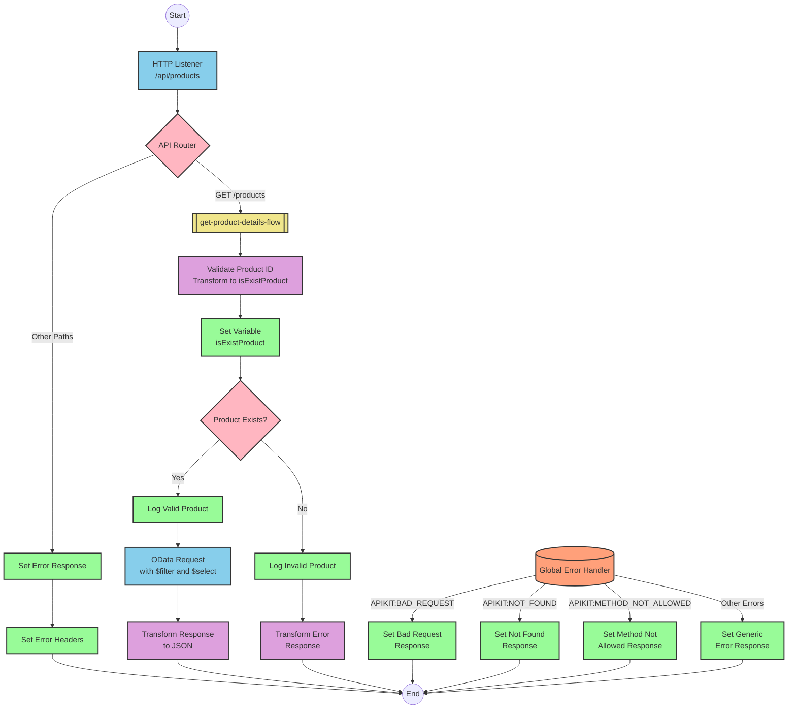

# Table of Contents
- [API Overview](#api-overview)
- [Endpoints](#endpoints)
- [Current MuleSoft Flow Logic](#current-mulesoft-flow-logic)
  - [products-main Flow](#products-main-flow)
  - [products-console Flow](#products-console-flow)
  - [get:\products:products-config Flow](#getproductsproducts-config-flow)
  - [get-product-details-flow Subflow](#get-product-details-flow-subflow)
- [DataWeave Transformations Explained](#dataweave-transformations-explained)
  - [isExistProduct Transformation](#isexistproduct-transformation)
  - [OData Query Parameters Transformation](#odata-query-parameters-transformation)
  - [Product Response Transformation](#product-response-transformation)
  - [Error Response Transformation](#error-response-transformation)
- [SAP Integration Suite Implementation](#sap-integration-suite-implementation)
  - [Component Mapping](#component-mapping)
  - [Integration Flow Visualization](#integration-flow-visualization)
  - [Configuration Details](#configuration-details)
- [Configuration](#configuration)
  - [HTTP Listener Configuration](#http-listener-configuration)
  - [HTTP Request Configuration](#http-request-configuration)
  - [API Configuration](#api-configuration)
  - [Error Handling](#error-handling)

# API Overview
This API provides product information by retrieving product details from an SAP HANA system via OData services. The API allows clients to query product information by providing a product identifier as a query parameter. The API validates the product identifier against a configured list of valid identifiers before making the request to the backend system.

- Base URL: `/api/products`

# Endpoints

## GET /products
- **Purpose**: Retrieves detailed product information based on a product identifier
- **Request Parameters**:
  - **Query Parameters**:
    - `productIdentifier` (required): The unique identifier of the product to retrieve
  - **Headers**: Standard HTTP headers
- **Response Format**:
  - **Success Response (200 OK)**:
    - Content-Type: application/json
    - Body: JSON object containing product details
  - **Error Response (400 Bad Request)**:
    - Content-Type: application/json
    - Body: JSON object with status, message, and errorCode
- **Example Response (Success)**:
  ```json
  {
    "ProductId": "HT-1000",
    "Category": "Laptops",
    "CategoryName": "Laptops",
    "CurrencyCode": "USD",
    "DimensionDepth": 30,
    "DimensionHeight": 3,
    "DimensionUnit": "cm",
    "DimensionWidth": 40,
    "LongDescription": "This laptop has 4GB RAM and 500GB SSD storage",
    "Name": "Notebook Basic 15",
    "PictureUrl": "/images/HT-1000.jpg",
    "Price": 956.00,
    "QuantityUnit": "EA",
    "ShortDescription": "Notebook Basic 15 with 2,80 GHz quad core",
    "SupplierId": "0100000046",
    "Weight": 4.2,
    "WeightUnit": "kg"
  }
  ```
- **Example Response (Error)**:
  ```json
  {
    "status": "error",
    "message": "The product identifier ABC123 was not found.",
    "errorCode": "PRODUCT_NOT_FOUND"
  }
  ```

# Current MuleSoft Flow Logic

## products-main Flow
1. **Trigger**: HTTP listener configured to listen for incoming API requests
2. **Processing**:
   - Sets response headers
   - Routes requests to appropriate handlers based on API specification
   - Handles errors and formats error responses
3. **Outcome**: Routes the request to the appropriate endpoint handler based on the API specification

## products-console Flow
1. **Trigger**: HTTP listener configured for console/admin access
2. **Processing**:
   - Sets response headers
   - Logs request details to console
3. **Outcome**: Provides administrative access or monitoring capabilities

## get:\products:products-config Flow
1. **Trigger**: GET request to the `/products` endpoint
2. **Processing**:
   - Calls the `get-product-details-flow` subflow to handle the request
3. **Outcome**: Returns product details or an error response

## get-product-details-flow Subflow
1. **Trigger**: Called by the `get:\products:products-config` flow
2. **Processing Steps**:
   - **Validate Product Identifier**:
     - Transforms the request to check if the provided product identifier exists in the configured list
     - Sets a variable `isExistProduct` to true if the product identifier is valid
   - **Conditional Processing**:
     - If `isExistProduct` is true:
       - Logs that the request is being processed
       - Makes an HTTP request to the SAP HANA backend with OData query parameters
       - Transforms the response to JSON format
     - If `isExistProduct` is false:
       - Logs that the product identifier was not found or incorrectly passed
       - Returns an error response
3. **Data Transformations**:
   - Validates product identifier against configured list
   - Constructs OData query parameters for backend request
   - Transforms backend response to API response format
4. **Error Scenarios**:
   - Invalid or missing product identifier
   - Backend system errors (handled by global error handler)

# DataWeave Transformations Explained

## isExistProduct Transformation
This transformation validates if the provided product identifier exists in a configured list of valid product identifiers.

**Input**: Query parameters from the HTTP request
**Output**: Boolean value indicating if the product identifier is valid

```dw
%dw 2.0
output application/java
var productidentifer=p('odata.productIdentifiers') splitBy(",")
---
sizeOf(productidentifer filter ($ == attributes.queryParams.productIdentifier))>0
```

**Explanation**:
1. Retrieves a comma-separated list of valid product identifiers from a property `odata.productIdentifiers`
2. Splits this string into an array using the `splitBy` function
3. Filters the array to find elements matching the `productIdentifier` query parameter
4. Checks if the size of the filtered array is greater than 0 (meaning a match was found)
5. Returns true if a match is found, false otherwise

## OData Query Parameters Transformation
This transformation constructs the OData query parameters for the backend request.

**Input**: Query parameters from the HTTP request
**Output**: OData query parameters for the backend request

```dw
#[output application/java
---
{
	"$filter" : "ProductId eq '" ++ (attributes.queryParams.productIdentifier default '') ++ "'",
	"$select" : "ProductId,Category,CategoryName,CurrencyCode,DimensionDepth,DimensionHeight,DimensionUnit,DimensionWidth,LongDescription,Name,PictureUrl,Price,QuantityUnit,ShortDescription,SupplierId,Weight,WeightUnit"
}]
```

**Explanation**:
1. Constructs an OData `$filter` parameter to filter products by the provided product identifier
2. Uses string concatenation (`++`) to embed the product identifier in the filter expression
3. Provides a default empty string if the product identifier is not present
4. Specifies a `$select` parameter to retrieve only the needed fields from the backend

## Product Response Transformation
This transformation passes through the backend response without modification.

**Input**: Response from the backend system
**Output**: JSON response for the API client

```dw
%dw 2.0
output application/json
---
payload
```

**Explanation**:
1. Simply outputs the payload received from the backend system as JSON
2. No transformation is applied as the data is already in the desired format

## Error Response Transformation
This transformation constructs an error response when the product identifier is invalid.

**Input**: Query parameters from the HTTP request
**Output**: JSON error response

```dw
%dw 2.0
output application/json
---
{
	status: "error",
	message: "The product identifier " ++ attributes.queryParams.productIdentifier ++ " was not found.",
	errorCode: "PRODUCT_NOT_FOUND"
}
```

**Explanation**:
1. Creates a JSON object with three fields: status, message, and errorCode
2. Uses string concatenation (`++`) to include the invalid product identifier in the error message
3. Sets a specific error code "PRODUCT_NOT_FOUND" to indicate the nature of the error

# SAP Integration Suite Implementation

## Component Mapping

| MuleSoft Component | SAP Integration Suite Equivalent | Notes |
|--------------------|----------------------------------|-------|
| HTTP Listener | HTTPS Adapter (Receiver) | Configure with the same path and method |
| Router | Content Modifier + Router | Use Content Modifier to set properties and Router for conditional paths |
| Flow Reference | Process Call | References another integration flow |
| Transform (DataWeave) | Groovy Script or Message Mapping | Convert DataWeave scripts to equivalent Groovy scripts or Message Mappings |
| Logger | Write to Message Headers (Content Modifier) | Use Content Modifier to write log messages to headers |
| HTTP Request | OData Adapter (Sender) | Configure with the same OData query parameters |
| Set Variable | Content Modifier | Use Content Modifier to set exchange properties |
| Choice/When/Otherwise | Router | Use Router with conditions equivalent to MuleSoft's choice conditions |
| Set Payload | Content Modifier | Use Content Modifier to set the message body |
| Error Handler | Exception Subprocess | Create exception subprocesses for error handling |

## Integration Flow Visualization



## Configuration Details

### HTTP Adapter (Receiver)
- **Address**: `/api/products`
- **Supported Methods**: GET
- **Authentication**: As per source system requirements
- **CSRF Protection**: Disabled

### OData Adapter (Sender)
- **Service**: SAP HANA OData service
- **Query Options**:
  - **$filter**: `ProductId eq '{productIdentifier}'`
  - **$select**: `ProductId,Category,CategoryName,CurrencyCode,DimensionDepth,DimensionHeight,DimensionUnit,DimensionWidth,LongDescription,Name,PictureUrl,Price,QuantityUnit,ShortDescription,SupplierId,Weight,WeightUnit`
- **Authentication**: As per target system requirements

### Content Modifier (Validate Product)
- **Script Type**: Groovy
- **Script Content**:
```groovy
def productIdentifiers = property.get("odata.productIdentifiers").split(",")
def productId = message.getHeaders().get("productIdentifier")
def isValid = productIdentifiers.any { it == productId }
return isValid
```

### Router (Product Exists)
- **Condition 1**: `${property.isExistProduct} == true`
- **Condition 2**: `${property.isExistProduct} == false`

### Content Modifier (Error Response)
- **Message Body**:
```json
{
  "status": "error",
  "message": "The product identifier ${header.productIdentifier} was not found.",
  "errorCode": "PRODUCT_NOT_FOUND"
}
```
- **Content Type**: application/json

# Configuration

## HTTP Listener Configuration
- **Name**: HTTP_Listener_config
- **Host**: As per deployment environment
- **Port**: As per deployment environment
- **Base Path**: /api

## HTTP Request Configuration
- **Name**: Hana_HTTP_Request_Configuration
- **Base URL**: SAP HANA OData service URL
- **Authentication**: As per target system requirements

## API Configuration
- **Name**: products-config
- **API Definition**: products.raml
- **Outbound Headers Map Name**: outboundHeaders
- **HTTP Status Variable Name**: httpStatus

## Error Handling
- **Global Error Handler**: Gobal_Error_Handler
- **Error Types Handled**:
  - APIKIT:BAD_REQUEST
  - APIKIT:NOT_FOUND
  - APIKIT:METHOD_NOT_ALLOWED
  - APIKIT:NOT_ACCEPTABLE
  - APIKIT:UNSUPPORTED_MEDIA_TYPE
  - APIKIT:NOT_IMPLEMENTED

## Environment Variables
- **odata.productIdentifiers**: Comma-separated list of valid product identifiers