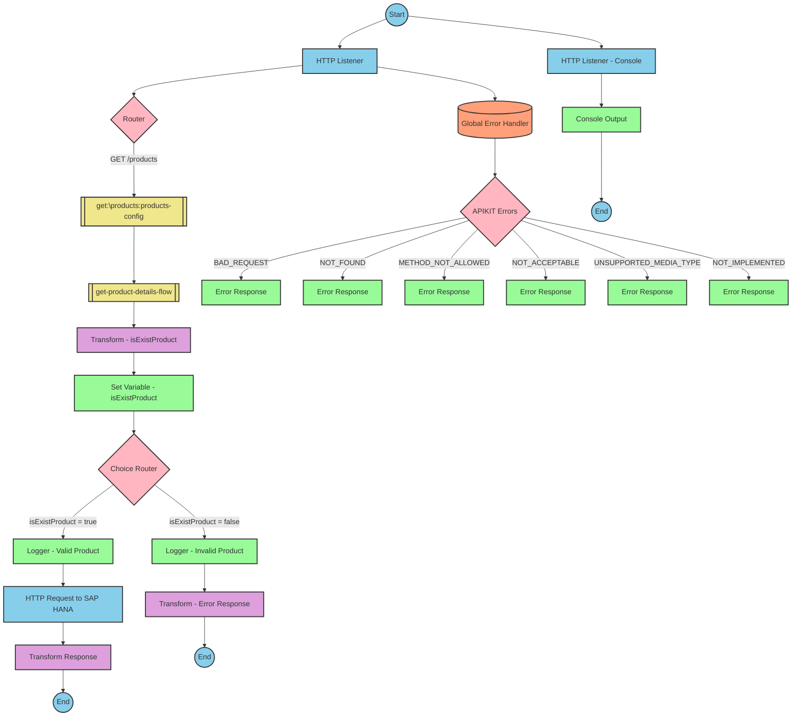

# Table of Contents
- [API Overview](#api-overview)
- [Endpoints](#endpoints)
- [Current MuleSoft Flow Logic](#current-mulesoft-flow-logic)
  - [products-main Flow](#products-main-flow)
  - [products-console Flow](#products-console-flow)
  - [get:\products:products-config Flow](#getproductsproducts-config-flow)
  - [get-product-details-flow Subflow](#get-product-details-flow-subflow)
- [DataWeave Transformations Explained](#dataweave-transformations-explained)
  - [isExistProduct Transformation](#isexistproduct-transformation)
  - [OData Query Parameters Transformation](#odata-query-parameters-transformation)
  - [Product Response Transformation](#product-response-transformation)
  - [Error Response Transformation](#error-response-transformation)
- [SAP Integration Suite Implementation](#sap-integration-suite-implementation)
  - [Component Mapping](#component-mapping)
  - [Integration Flow Visualization](#integration-flow-visualization)
- [Configuration Details](#configuration-details)
- [Configuration](#configuration)

# API Overview
This API provides product information from an SAP HANA database. It allows clients to retrieve detailed product information by providing a product identifier as a query parameter. The API validates the product identifier against a predefined list and returns either the product details or an error message if the product identifier is invalid or not found.

- Base URL: `/api/products`

# Endpoints

## GET /products
- **Purpose**: Retrieves detailed product information based on a product identifier
- **Request Parameters**:
  - **Query Parameters**:
    - `productIdentifier` (required): The unique identifier of the product to retrieve
  - **Headers**: Standard HTTP headers
- **Response Format**:
  - **Success (200 OK)**:
    - Content-Type: application/json
    - Body: JSON object containing product details including ProductId, Category, CategoryName, CurrencyCode, dimensions, descriptions, price, and other product attributes
  - **Error (400 Bad Request)**:
    - Content-Type: application/json
    - Body: JSON object with status, message, and errorCode fields
- **Example Response (Error)**:
  ```json
  {
    "status": "error",
    "message": "The product identifier ABC123 was not found.",
    "errorCode": "PRODUCT_NOT_FOUND"
  }
  ```

# Current MuleSoft Flow Logic

## products-main Flow
This is the main entry point for the API. It handles incoming HTTP requests and routes them to the appropriate flow based on the request path.

1. **Trigger**: HTTP listener configured with the `HTTP_Listener_config`
2. **Processing Steps**:
   - Sets response headers
   - Routes the request based on the API configuration in `products-config`
   - Handles errors with an error response component
3. **Expected Outcome**: Routes the request to the appropriate flow based on the API path

## products-console Flow
This flow appears to be a console-based entry point, possibly for testing or monitoring purposes.

1. **Trigger**: HTTP listener configured with the `HTTP_Listener_config`
2. **Processing Steps**:
   - Sets response headers
   - Outputs to console
   - Handles errors with an error response component
3. **Expected Outcome**: Logs information to the console

## get:\products:products-config Flow
This flow handles GET requests to the `/products` endpoint.

1. **Trigger**: Routed from the main flow when a GET request to `/products` is received
2. **Processing Steps**:
   - References the `get-product-details-flow` subflow to process the request
3. **Expected Outcome**: Returns product details or an error message

## get-product-details-flow Subflow
This subflow processes the product details request and retrieves the data from the SAP HANA database.

1. **Trigger**: Referenced from the `get:\products:products-config` flow
2. **Processing Steps**:
   - Validates the product identifier against a predefined list using a DataWeave transformation
   - Sets a variable `isExistProduct` based on the validation result
   - Uses a choice router to handle valid and invalid product identifiers
   - For valid product identifiers:
     - Logs the request processing
     - Sends an HTTP request to the SAP HANA database with OData query parameters
     - Transforms the response to JSON
   - For invalid product identifiers:
     - Logs the error
     - Returns an error response
3. **Data Transformations**:
   - Validates the product identifier against a list from a property
   - Constructs OData query parameters for filtering and selecting fields
   - Transforms the response payload to JSON
4. **Expected Outcomes**:
   - Success: Returns product details in JSON format
   - Error: Returns an error message if the product identifier is invalid or not found

# DataWeave Transformations Explained

## isExistProduct Transformation
This transformation validates the product identifier against a predefined list of valid product identifiers.

- **Purpose**: Determines if the provided product identifier exists in the allowed list
- **Input**: Product identifier from query parameters and a comma-separated list of valid identifiers from a property
- **Output**: Boolean value indicating if the product identifier is valid
- **Logic**: Splits the comma-separated list into an array, filters the array to find matches with the provided identifier, and checks if any matches were found

```dw
%dw 2.0
output application/java
var productidentifer=p('odata.productIdentifiers') splitBy(",")
---
sizeOf(productidentifer filter ($ == attributes.queryParams.productIdentifier))>0
```

## OData Query Parameters Transformation
This transformation constructs the OData query parameters for the HTTP request to the SAP HANA database.

- **Purpose**: Creates the OData query parameters for filtering and selecting fields
- **Input**: Product identifier from query parameters
- **Output**: OData query parameters as a Java object
- **Logic**: Constructs a $filter parameter to filter by ProductId and a $select parameter to specify the fields to return

```dw
#[output application/java
---
{
	"$filter" : "ProductId eq '" ++ (attributes.queryParams.productIdentifier default '') ++ "'",
	"$select" : "ProductId,Category,CategoryName,CurrencyCode,DimensionDepth,DimensionHeight,DimensionUnit,DimensionWidth,LongDescription,Name,PictureUrl,Price,QuantityUnit,ShortDescription,SupplierId,Weight,WeightUnit"
}]
```

## Product Response Transformation
This transformation passes through the response payload from the SAP HANA database.

- **Purpose**: Transforms the response payload to JSON
- **Input**: Response payload from the SAP HANA database
- **Output**: JSON representation of the payload
- **Logic**: Simple pass-through transformation

```dw
%dw 2.0
output application/json
---
payload
```

## Error Response Transformation
This transformation constructs an error response when the product identifier is invalid or not found.

- **Purpose**: Creates a standardized error response
- **Input**: Product identifier from query parameters
- **Output**: JSON error object with status, message, and errorCode
- **Logic**: Constructs an error message with the provided product identifier

```dw
%dw 2.0
output application/json
---
{
	status: "error",
	message: "The product identifier " ++ attributes.queryParams.productIdentifier ++ " was not found.",
	errorCode: "PRODUCT_NOT_FOUND"
}
```

# SAP Integration Suite Implementation

## Component Mapping

| MuleSoft Component | SAP Integration Suite Equivalent | Notes |
|--------------------|----------------------------------|-------|
| HTTP Listener | HTTPS Adapter (Receiver) | Configure with the same path and method |
| Router | Router | Standard component in both platforms |
| Flow Reference | Process Call | Used to call subflows |
| Transform Message | Content Modifier with script | Use Groovy or JavaScript for complex transformations |
| Logger | Write to Message Log | Standard logging component |
| HTTP Request | HTTPS Adapter (Sender) | Configure with the same endpoint and parameters |
| Set Variable | Content Modifier | Used to set variables in the message header |
| Choice Router | Router | Implement conditional routing |
| Set Payload | Content Modifier | Set the message body |
| Error Handler | Exception Subprocess | Handle errors with appropriate responses |

## REST API Integration Flow: Product Details API



## Configuration Details

### HTTP Adapter (Receiver) - Main Listener
- **Adapter Type**: HTTPS
- **Direction**: Receiver
- **Path**: `/api/products`
- **Method**: GET
- **Authentication**: As per source system requirements

### HTTP Adapter (Receiver) - Console Listener
- **Adapter Type**: HTTPS
- **Direction**: Receiver
- **Path**: `/console`
- **Method**: GET
- **Authentication**: As per source system requirements

### HTTP Adapter (Sender) - SAP HANA Request
- **Adapter Type**: HTTPS
- **Direction**: Sender
- **URL**: Target SAP HANA OData service URL
- **Method**: GET
- **Query Parameters**: Dynamically set using script
  - $filter: `ProductId eq '{productIdentifier}'`
  - $select: `ProductId,Category,CategoryName,CurrencyCode,DimensionDepth,DimensionHeight,DimensionUnit,DimensionWidth,LongDescription,Name,PictureUrl,Price,QuantityUnit,ShortDescription,SupplierId,Weight,WeightUnit`

### Router - Choice Router
- **Condition 1**: `${header.isExistProduct} == true`
- **Condition 2**: `${header.isExistProduct} == false`

### Content Modifier - Set Variable
- **Action**: Set Header
- **Name**: isExistProduct
- **Value**: Result of script evaluation

### Content Modifier - Transform Response
- **Action**: Set Body
- **Type**: Expression
- **Value**: `${body}`

### Content Modifier - Error Response
- **Action**: Set Body
- **Type**: Expression
- **Value**: JSON structure with error details

### Write to Message Log - Logger
- **Log Level**: INFO
- **Message**: Dynamic message based on context

### Exception Subprocess - Global Error Handler
- **Error Types**: Various APIKIT errors
- **Response**: Appropriate error messages for each error type

# Configuration

## Important Configuration Parameters
- **odata.productIdentifiers**: Comma-separated list of valid product identifiers

## HTTP Configuration
- **HTTP_Listener_config**: Configuration for the HTTP listener
- **Hana_HTTP_Request_Configuration**: Configuration for the HTTP request to SAP HANA

## API Configuration
- **products-config**: RAML API configuration
  - **api**: products.raml
  - **outboundHeadersMapName**: outboundHeaders
  - **httpStatusVarName**: httpStatus

## Error Handling
- **Global_Error_Handler**: Handles various APIKIT errors:
  - APIKIT:BAD_REQUEST
  - APIKIT:NOT_FOUND
  - APIKIT:METHOD_NOT_ALLOWED
  - APIKIT:NOT_ACCEPTABLE
  - APIKIT:UNSUPPORTED_MEDIA_TYPE
  - APIKIT:NOT_IMPLEMENTED