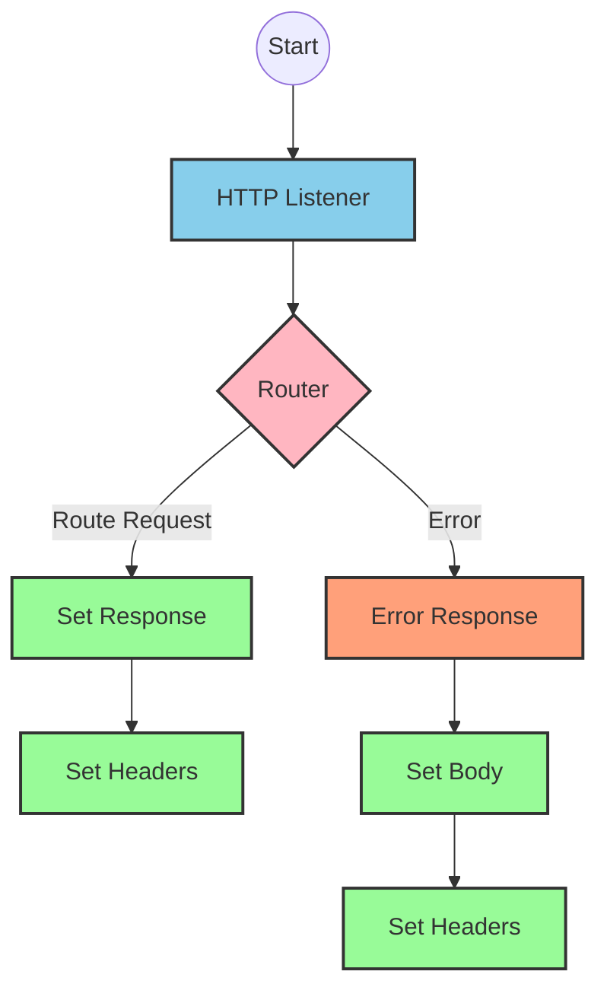
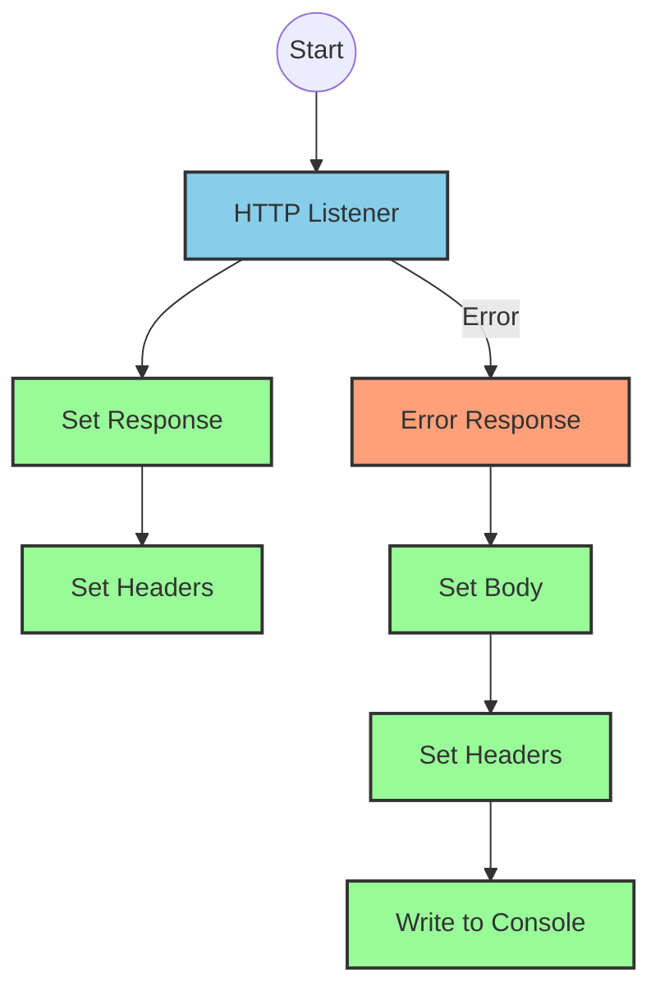
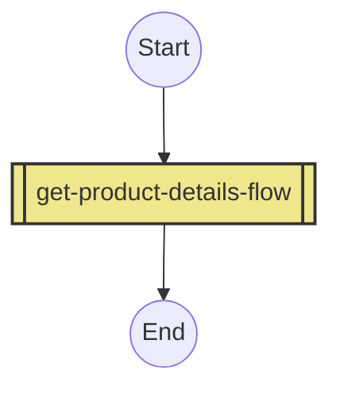
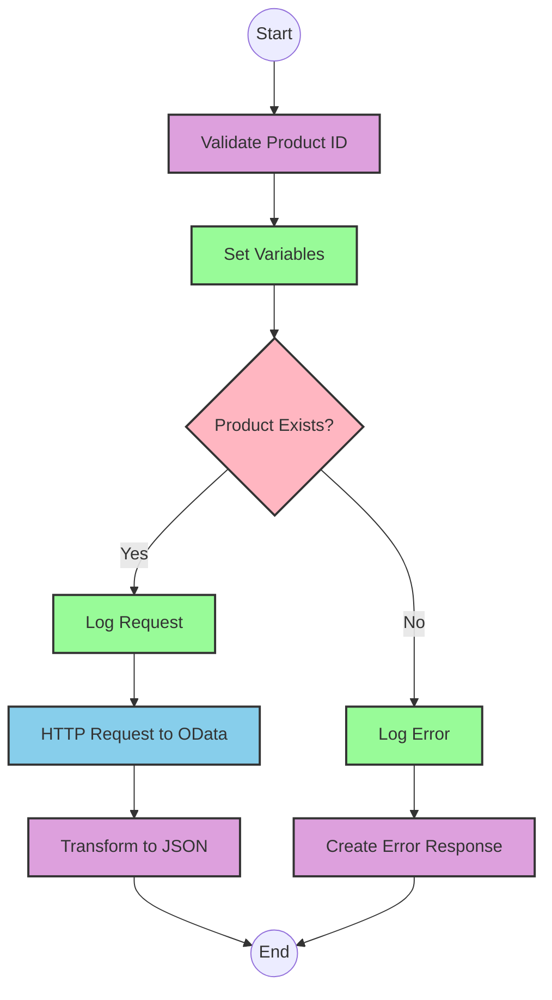

# API Overview
- This API provides product details from an SAP HANA database
- Base URL pattern: `/products`

# Endpoints

## GET /products
- **Purpose**: Retrieves product details based on a product identifier
- **Query Parameters**:
  - `productIdentifier` (required): The unique identifier of the product
- **Response Format**: JSON
- **Response Status Codes**:
  - 200: Success
  - 400: Bad Request
  - 404: Product Not Found
- **Response Body**:
  - Success: Product details including ProductId, Category, CategoryName, etc.
  - Error: JSON object with status, message, and errorCode

# Current MuleSoft Flow Logic

## Flow: products-main
This is the main entry point for the API that handles routing to the appropriate endpoints.

1. **Trigger**: HTTP listener
2. **Processing**:
   - Sets response headers
   - Routes requests based on API configuration
   - Handles errors with a dedicated error response handler

## Flow: products-console
This flow appears to be a console-based entry point, possibly for testing or monitoring.

1. **Trigger**: HTTP listener
2. **Processing**:
   - Sets response headers
   - Outputs to console
   - Handles errors with a dedicated error response handler

## Flow: get:\products:products-config
This flow handles GET requests to the `/products` endpoint.

1. **Trigger**: HTTP GET request to `/products`
2. **Processing**:
   - References the `get-product-details-flow` subflow to process the request

## Subflow: get-product-details-flow
This subflow handles the core business logic for retrieving product details.

1. **Processing Steps**:
   - Validates if the provided product identifier is in the allowed list
   - Sets variables for processing
   - Logs request information
   - Makes an OData query to retrieve product details
   - Transforms the response to JSON format

2. **Data Transformations**:
   - Validates product identifier against a configured list
   - Constructs OData query parameters with specific filters and select fields
   - Transforms the response payload to JSON

3. **Error Handling**:
   - Returns a custom error message if the product identifier is invalid or not found

4. **Technical Details**:
   - OData query parameters:
     - `$filter`: `ProductId eq '" ++ (attributes.queryParams.productIdentifier default '') ++ "'`
     - `$select`: `ProductId,Category,CategoryName,CurrencyCode,DimensionDepth,DimensionHeight,DimensionUnit,DimensionWidth,LongDescription,Name,PictureUrl,Price,QuantityUnit,ShortDescription,SupplierId,Weight,WeightUnit`

# DataWeave Transformations Explained

## Product Identifier Validation Transformation
This transformation checks if the provided product identifier is in the allowed list of product identifiers.

```dw
%dw 2.0
output application/java
var productidentifer=p('odata.productIdentifiers') splitBy(",")
---
sizeOf(productidentifer filter ($ == attributes.queryParams.productIdentifier))>0
```

- **Purpose**: Validates if the requested product identifier is allowed
- **Input**: Query parameter `productIdentifier` from the request
- **Output**: Boolean value indicating if the product identifier is valid
- **Logic**: 
  1. Retrieves the list of allowed product identifiers from a property
  2. Splits the comma-separated list into an array
  3. Filters the array to find matches with the requested product identifier
  4. Returns true if at least one match is found (size > 0)

## OData Query Parameters Transformation
This transformation constructs the OData query parameters for filtering and selecting specific product fields.

```dw
#[output application/java
---
{
	"$filter" : "ProductId eq '" ++ (attributes.queryParams.productIdentifier default '') ++ "'",
	"$select" : "ProductId,Category,CategoryName,CurrencyCode,DimensionDepth,DimensionHeight,DimensionUnit,DimensionWidth,LongDescription,Name,PictureUrl,Price,QuantityUnit,ShortDescription,SupplierId,Weight,WeightUnit"
}]
```

- **Purpose**: Constructs OData query parameters for the HTTP request
- **Input**: Product identifier from query parameters
- **Output**: Java map containing OData query parameters
- **Logic**:
  1. Creates a filter expression to match the exact product identifier
  2. Specifies the fields to be returned in the response

## Response Payload Transformation (Success)
This transformation passes through the payload from the OData response.

```dw
%dw 2.0
output application/json
---
payload
```

- **Purpose**: Transforms the OData response to JSON format
- **Input**: OData response payload
- **Output**: JSON representation of the product details
- **Logic**: Simple pass-through of the payload with output format set to JSON

## Error Response Transformation
This transformation creates a structured error response when the product identifier is invalid or not found.

```dw
%dw 2.0
output application/json
---
{
	status: "error",
	message: "The product identifier " ++ attributes.queryParams.productIdentifier ++ " was not found.",
	errorCode: "PRODUCT_NOT_FOUND"
}
```

- **Purpose**: Creates a standardized error response
- **Input**: Query parameter `productIdentifier` from the request
- **Output**: JSON error object with status, message, and error code
- **Logic**: Constructs an error message that includes the invalid product identifier

# SAP Integration Suite Implementation

## Component Mapping

| MuleSoft Component | SAP Integration Suite Equivalent | Notes |
|--------------------|----------------------------------|-------|
| HTTP Listener | HTTP Adapter (Receiver) | Configure with the same path and method |
| Flow Reference | Process Call | References another integration flow |
| Set Variable | Content Modifier | Sets variables for use in the flow |
| Logger | Write to Log | Logs messages for monitoring and debugging |
| Choice/When/Otherwise | Router | Implements conditional branching logic |
| HTTP Request | HTTP Adapter (Sender) | Makes OData requests to SAP HANA |
| Transform Message | Message Mapping | Transforms data between formats |
| Set Payload | Content Modifier | Sets the message payload |
| Error Handler | Exception Subprocess | Handles errors in the integration flow |

## Integration Flow Visualization









## Configuration Details

### HTTP Adapter (Receiver) Configuration
- **Address**: `/products`
- **Method**: GET
- **Authentication**: As per source system requirements

### Process Call Configuration
- **Process**: Reference to get-product-details-flow

### Content Modifier (Set Variable) Configuration
- **Variable Name**: `isExistProduct`
- **Value**: Result of product identifier validation

### Router Configuration
- **Condition**: `${property.isExistProduct}`
- **Default Route**: Error path

### HTTP Adapter (Sender) Configuration
- **Address**: SAP HANA OData endpoint
- **Method**: GET
- **Query Parameters**:
  - `$filter`: `ProductId eq '${property.productIdentifier}'`
  - `$select`: `ProductId,Category,CategoryName,CurrencyCode,DimensionDepth,DimensionHeight,DimensionUnit,DimensionWidth,LongDescription,Name,PictureUrl,Price,QuantityUnit,ShortDescription,SupplierId,Weight,WeightUnit`

### Message Mapping Configuration
- **Source Format**: OData response
- **Target Format**: JSON
- **Mapping Script**: As per DataWeave transformations

### Write to Log Configuration
- **Log Level**: INFO
- **Message**: 
  - Success: "The request is processed and sent downstream with the product identifier (${property.productIdentifier})."
  - Error: "The product identifier (${property.productIdentifier}) was not passed in the request or was passed incorrectly."

# Configuration

## Important Configuration Parameters
- `odata.productIdentifiers`: Comma-separated list of valid product identifiers

## HTTP Configurations
- **HTTP_Listener_config**: Main HTTP listener configuration
- **Hana_HTTP_Request_Configuration**: Configuration for HTTP requests to SAP HANA

## API Configuration
- **products-config**: RAML API configuration
  - API: products.raml
  - outboundHeadersMapName: outboundHeaders
  - httpStatusVarName: httpStatus

## Error Handling
- **Gobal_Error_Handler**: Handles various APIKIT errors:
  - APIKIT:BAD_REQUEST
  - APIKIT:NOT_FOUND
  - APIKIT:METHOD_NOT_ALLOWED
  - APIKIT:NOT_ACCEPTABLE
  - APIKIT:UNSUPPORTED_MEDIA_TYPE
  - APIKIT:NOT_IMPLEMENTED