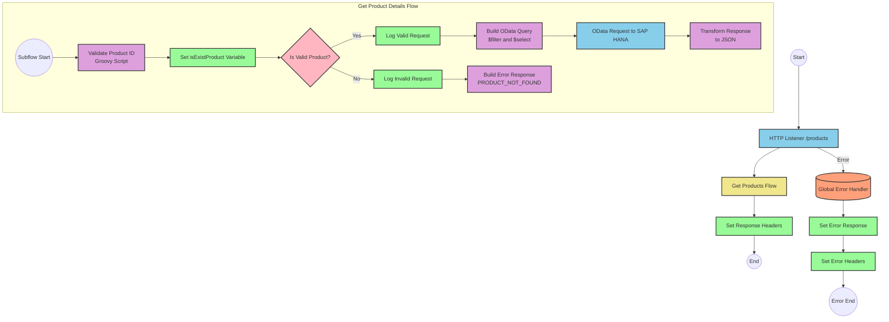

# SAP HANA Product Information API Integration

## Table of Contents
- [SAP HANA Product Information API Integration](#sap-hana-product-information-api-integration)
  - [Table of Contents](#table-of-contents)
  - [API Overview](#api-overview)
  - [Endpoints](#endpoints)
    - [GET /products](#get-products)
  - [Current MuleSoft Flow Logic](#current-mulesoft-flow-logic)
    - [Main Flows](#main-flows)
    - [Subflows](#subflows)
  - [DataWeave Transformations Explained](#dataweave-transformations-explained)
    - [Product Validation Transformation](#product-validation-transformation)
    - [OData Query Parameters Transformation](#odata-query-parameters-transformation)
    - [Response Payload Transformation](#response-payload-transformation)
    - [Error Response Transformation](#error-response-transformation)
  - [SAP Integration Suite Implementation](#sap-integration-suite-implementation)
    - [Component Mapping](#component-mapping)
    - [Integration Flow Visualization](#integration-flow-visualization)
    - [Configuration Details](#configuration-details)
  - [Environment Configuration](#environment-configuration)
  - [API Reference](#api-reference)

## API Overview
- This API provides access to product information stored in SAP HANA
- The API allows retrieval of detailed product information by product identifier
- Base URL: Determined by the HTTP_Listener_config
- Authentication: Not explicitly defined in the source documentation
- Response Format: JSON
- The API validates product identifiers against a predefined list before retrieving data from SAP HANA

## Endpoints

### GET /products
- **Purpose**: Retrieves detailed product information based on a product identifier
- **Request Parameters**:
  - Query Parameters:
    - `productIdentifier` (required): The unique identifier of the product to retrieve
- **Response Format**:
  - Success: JSON object containing product details
    - Status Code: 200 OK
  - Error: JSON object with error details
    - Status Code: Varies based on error type
    ```json
    {
      "status": "error",
      "message": "The product identifier {identifier} was not found.",
      "errorCode": "PRODUCT_NOT_FOUND"
    }
    ```
- **Error Handling**:
  - PRODUCT_NOT_FOUND: When the provided product identifier is not valid or not found
  - APIKIT:BAD_REQUEST, APIKIT:NOT_FOUND, APIKIT:METHOD_NOT_ALLOWED, APIKIT:NOT_ACCEPTABLE, APIKIT:UNSUPPORTED_MEDIA_TYPE, APIKIT:NOT_IMPLEMENTED: Standard API errors handled by the global error handler

## Current MuleSoft Flow Logic

### Main Flows

1. **products-main Flow**
   - Triggered by an HTTP request to the API endpoint
   - Sets up response headers
   - Handles error responses
   - Routes the request to the appropriate handler based on the endpoint

2. **products-console Flow**
   - Triggered by an HTTP request to the console endpoint
   - Sets up response headers
   - Handles error responses
   - Logs information to the console

3. **get:\products:products-config Flow**
   - Triggered when a GET request is made to the /products endpoint
   - References the get-product-details-flow subflow to process the request

### Subflows

**get-product-details-flow Subflow**
1. Validates if the provided product identifier exists in the predefined list
   - Uses a DataWeave transformation to check if the product identifier is valid
   - Sets a variable `isExistProduct` based on the validation result

2. Conditional Processing based on product identifier validation:
   - If valid (`vars.isExistProduct` is true):
     - Logs a message indicating the request is being processed
     - Builds an OData query with specific filter and select parameters
     - Makes a request to SAP HANA to retrieve product details
     - Transforms the response to JSON format
   
   - If invalid (`vars.isExistProduct` is false):
     - Logs a message indicating the product identifier was not found or incorrect
     - Returns an error response with PRODUCT_NOT_FOUND error code

## DataWeave Transformations Explained

### Product Validation Transformation
This transformation checks if the provided product identifier exists in a predefined list of valid product identifiers.

```dw
%dw 2.0
output application/java
var productidentifer=p('odata.productIdentifiers') splitBy(",")
---
sizeOf(productidentifer filter ($ == attributes.queryParams.productIdentifier))>0
```

- **Input**: The product identifier from the query parameters
- **Output**: A boolean value indicating if the product identifier is valid
- **Logic**:
  1. Retrieves a comma-separated list of valid product identifiers from a property
  2. Splits the list into an array
  3. Filters the array to find matches with the provided product identifier
  4. Checks if the size of the filtered array is greater than 0 (indicating a match was found)

### OData Query Parameters Transformation
This transformation builds the OData query parameters for retrieving product details from SAP HANA.

```dw
#[output application/java
---
{
	"$filter" : "ProductId eq '" ++ (attributes.queryParams.productIdentifier default '') ++ "'",
	"$select" : "ProductId,Category,CategoryName,CurrencyCode,DimensionDepth,DimensionHeight,DimensionUnit,DimensionWidth,LongDescription,Name,PictureUrl,Price,QuantityUnit,ShortDescription,SupplierId,Weight,WeightUnit"
}]
```

- **Input**: The product identifier from the query parameters
- **Output**: A Java map containing OData query parameters
- **Logic**:
  1. Creates a $filter parameter that filters products by the provided product identifier
  2. Creates a $select parameter that specifies which product fields to retrieve

### Response Payload Transformation
This transformation passes through the response payload from SAP HANA.

```dw
%dw 2.0
output application/json
---
payload
```

- **Input**: The response payload from SAP HANA
- **Output**: The same payload converted to JSON format
- **Logic**: Simple pass-through transformation that ensures the output is in JSON format

### Error Response Transformation
This transformation creates an error response when the product identifier is not valid.

```dw
%dw 2.0
output application/json
---
{
	status: "error",
	message: "The product identifier " ++ attributes.queryParams.productIdentifier ++ " was not found.",
	errorCode: "PRODUCT_NOT_FOUND"
}
```

- **Input**: The product identifier from the query parameters
- **Output**: A JSON error response
- **Logic**: Creates a structured error response with status, message, and error code

## SAP Integration Suite Implementation

### Component Mapping

| MuleSoft Component | SAP Integration Suite Equivalent | Notes |
|-------------------|----------------------------------|-------|
| HTTP Listener | HTTPS Adapter (Receiver) | Configure with the same path and method |
| Flow Reference | Process Call | Used to call the product details subflow |
| DataWeave Transform | Content Modifier + Groovy Script | For complex transformations, use Groovy Script; for simple mappings, use Content Modifier |
| Logger | Write to Message Log | Configure with the same log message |
| HTTP Request | OData Adapter (Sender) | Configure with the same OData query parameters |
| Choice/When/Otherwise | Router | Configure with the same condition |
| Set Variable | Content Modifier (with property assignment) | Set the same variable name and value |
| Set Payload | Content Modifier (with message body assignment) | Set the same payload content |
| Error Handler | Exception Subprocess | Configure with the same error types and handling logic |

### Integration Flow Visualization



### Configuration Details

1. **HTTPS Adapter (Receiver)**
   - Path: /products
   - Method: GET
   - Query Parameters: productIdentifier

2. **Content Modifier + Groovy Script (Validate Product)**
   - Script:
     ```groovy
     def productIdentifiers = property.get("odata.productIdentifiers").split(",")
     def productId = message.getHeaders().get("productIdentifier")
     return productIdentifiers.find { it == productId } != null
     ```
   - Output: Boolean value stored in the exchange property

3. **Content Modifier (Set isExistProduct Variable)**
   - Property Name: isExistProduct
   - Property Value: ${exchange.property.scriptResult}

4. **Router (Is Valid Product?)**
   - Condition 1: ${exchange.property.isExistProduct} == true
   - Condition 2: ${exchange.property.isExistProduct} == false

5. **Write to Message Log (Log Valid Request)**
   - Log Level: INFO
   - Message: "The request is processed and sent downstream with the product identifier (${header.productIdentifier})."

6. **Content Modifier + Groovy Script (Build OData Query)**
   - Script:
     ```groovy
     def productId = message.getHeaders().get("productIdentifier") ?: ""
     def queryParams = [
         '$filter': "ProductId eq '" + productId + "'",
         '$select': "ProductId,Category,CategoryName,CurrencyCode,DimensionDepth,DimensionHeight,DimensionUnit,DimensionWidth,LongDescription,Name,PictureUrl,Price,QuantityUnit,ShortDescription,SupplierId,Weight,WeightUnit"
     ]
     return queryParams
     ```
   - Output: Map stored in the exchange property

7. **OData Adapter (Sender)**
   - Service: SAP HANA OData Service
   - Query Parameters: ${exchange.property.queryParams}

8. **Content Modifier (Transform Response)**
   - Message Body: ${body}
   - Content Type: application/json

9. **Write to Message Log (Log Invalid Request)**
   - Log Level: WARN
   - Message: "The product identifier (${header.productIdentifier}) was not passed in the request or was passed incorrectly."

10. **Content Modifier + Groovy Script (Build Error Response)**
    - Script:
      ```groovy
      def productId = message.getHeaders().get("productIdentifier")
      def errorResponse = [
          status: "error",
          message: "The product identifier " + productId + " was not found.",
          errorCode: "PRODUCT_NOT_FOUND"
      ]
      return groovy.json.JsonOutput.toJson(errorResponse)
      ```
    - Output: JSON string set as the message body
    - Content Type: application/json

11. **Exception Subprocess (Global Error Handler)**
    - Handle exceptions: APIKIT:BAD_REQUEST, APIKIT:NOT_FOUND, APIKIT:METHOD_NOT_ALLOWED, APIKIT:NOT_ACCEPTABLE, APIKIT:UNSUPPORTED_MEDIA_TYPE, APIKIT:NOT_IMPLEMENTED
    - Set appropriate error responses and headers for each exception type

## Environment Configuration

1. **Required Properties**
   - `odata.productIdentifiers`: Comma-separated list of valid product identifiers

2. **Connection Details**
   - HTTP_Listener_config: Configuration for the HTTP listener
   - Hana_HTTP_Request_Configuration: Configuration for connecting to SAP HANA

3. **Security Settings**
   - Authentication details for SAP HANA connection (not explicitly defined in source)
   - API security settings (not explicitly defined in source)

4. **Deployment Considerations**
   - Ensure the SAP HANA OData service is accessible from the integration environment
   - Configure proper network connectivity between the integration platform and SAP HANA
   - Set up appropriate logging levels for troubleshooting

5. **Resource Requirements**
   - Memory and CPU requirements depend on expected traffic volume
   - Consider scaling requirements for high-volume scenarios

## API Reference

### Endpoints

| Method | Path | Description |
|--------|------|-------------|
| GET | /products | Retrieve product details by product identifier |

### Request Parameters

#### GET /products
- Query Parameters:
  - `productIdentifier` (required): The unique identifier of the product to retrieve

### Response Schemas

#### Success Response
```json
{
  "ProductId": "string",
  "Category": "string",
  "CategoryName": "string",
  "CurrencyCode": "string",
  "DimensionDepth": "number",
  "DimensionHeight": "number",
  "DimensionUnit": "string",
  "DimensionWidth": "number",
  "LongDescription": "string",
  "Name": "string",
  "PictureUrl": "string",
  "Price": "number",
  "QuantityUnit": "string",
  "ShortDescription": "string",
  "SupplierId": "string",
  "Weight": "number",
  "WeightUnit": "string"
}
```

#### Error Response
```json
{
  "status": "error",
  "message": "string",
  "errorCode": "string"
}
```

### Error Codes

| Error Code | Description |
|------------|-------------|
| PRODUCT_NOT_FOUND | The provided product identifier is not valid or not found |
| APIKIT:BAD_REQUEST | The request was malformed or contained invalid parameters |
| APIKIT:NOT_FOUND | The requested resource was not found |
| APIKIT:METHOD_NOT_ALLOWED | The HTTP method is not allowed for the requested resource |
| APIKIT:NOT_ACCEPTABLE | The server cannot produce a response matching the list of acceptable values |
| APIKIT:UNSUPPORTED_MEDIA_TYPE | The request entity has a media type which the server does not support |
| APIKIT:NOT_IMPLEMENTED | The server does not support the functionality required to fulfill the request |

### Authentication
Authentication details are not explicitly defined in the source documentation.

### Rate Limiting
Rate limiting information is not explicitly defined in the source documentation.

### Versioning
API versioning information is not explicitly defined in the source documentation.