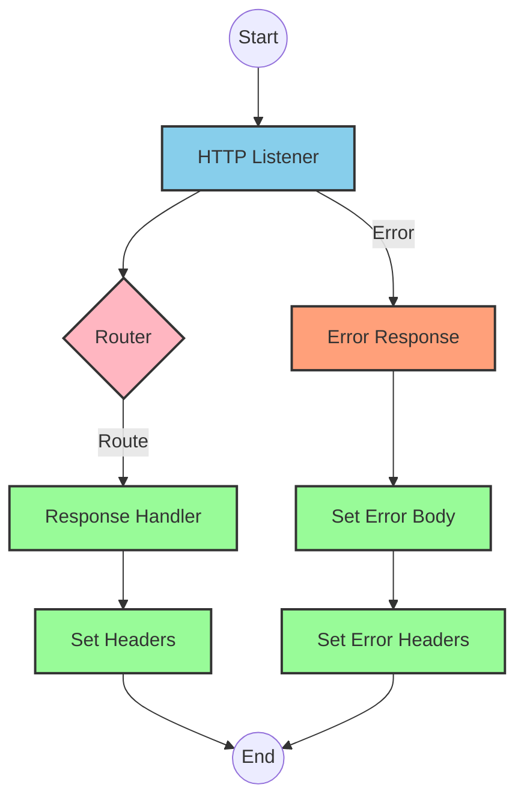
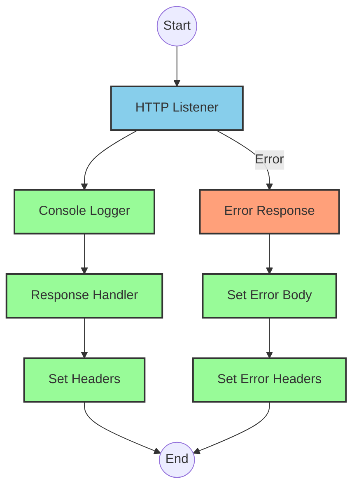
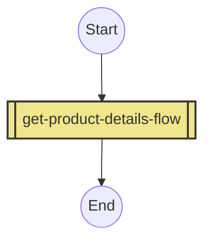
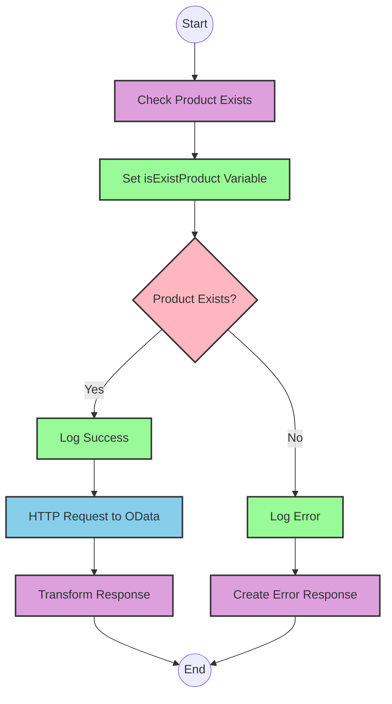

# API Overview
- This API provides product details from an SAP HANA database
- Base URL pattern: `/products`

# Endpoints

## GET /products
- **Purpose**: Retrieves product details based on a product identifier
- **Query Parameters**: 
  - `productIdentifier` (required): The unique identifier for the product
- **Response Format**: JSON
- **Status Codes**:
  - 200: Success
  - 400: Bad Request
  - 404: Product Not Found
- **Response Body**: Product details including ProductId, Category, CategoryName, CurrencyCode, dimensions, descriptions, price, and other product attributes

# Current MuleSoft Flow Logic

## Flow: products-main
This is the main API flow that handles incoming requests.
1. **Trigger**: HTTP listener
2. **Processing**: Routes requests to appropriate handlers
3. **Response**: Returns formatted responses with appropriate headers
4. **Error Handling**: Provides error responses with appropriate status codes

## Flow: products-console
This flow appears to be a console/logging version of the main flow.
1. **Trigger**: HTTP listener
2. **Processing**: Logs request information
3. **Response**: Returns formatted responses with appropriate headers
4. **Error Handling**: Provides error responses with appropriate status codes

## Flow: get:\products:products-config
This flow handles GET requests to the /products endpoint.
1. **Trigger**: GET request to /products
2. **Processing**: References the get-product-details-flow subflow

## Subflow: get-product-details-flow
This subflow retrieves product details from SAP HANA.
1. **Validation**: Checks if the provided productIdentifier is valid
2. **Processing**:
   - If valid: Makes an OData request to retrieve product details
   - If invalid: Returns an error message
3. **Data Transformation**: Transforms the response to the required format
4. **OData Query Parameters**:
   - `$filter`: `ProductId eq '" ++ (attributes.queryParams.productIdentifier default '') ++ "'`
   - `$select`: `ProductId,Category,CategoryName,CurrencyCode,DimensionDepth,DimensionHeight,DimensionUnit,DimensionWidth,LongDescription,Name,PictureUrl,Price,QuantityUnit,ShortDescription,SupplierId,Weight,WeightUnit`

# DataWeave Transformations Explained

## Transformation 1: Validate Product Identifier
This transformation checks if the provided product identifier is in the list of valid product identifiers.

```dw
%dw 2.0
output application/java
var productidentifer=p('odata.productIdentifiers') splitBy(",")
---
sizeOf(productidentifer filter ($ == attributes.queryParams.productIdentifier))>0
```

- **Input**: Query parameter containing productIdentifier
- **Output**: Boolean value indicating if the product identifier is valid
- **Key Operations**: 
  - Splits a comma-separated list of valid product identifiers
  - Filters the list to find matches with the provided identifier
  - Returns true if at least one match is found

## Transformation 2: OData Query Parameters
This transformation constructs the OData query parameters for the HTTP request.

```dw
#[output application/java
---
{
	"$filter" : "ProductId eq '" ++ (attributes.queryParams.productIdentifier default '') ++ "'",
	"$select" : "ProductId,Category,CategoryName,CurrencyCode,DimensionDepth,DimensionHeight,DimensionUnit,DimensionWidth,LongDescription,Name,PictureUrl,Price,QuantityUnit,ShortDescription,SupplierId,Weight,WeightUnit"
}]
```

- **Input**: Query parameter containing productIdentifier
- **Output**: OData query parameters for filtering and selecting product attributes
- **Key Operations**:
  - Constructs a filter expression to match the exact ProductId
  - Specifies the product attributes to be returned

## Transformation 3: Pass-through Transformation
This transformation simply passes the payload through without modification.

```dw
%dw 2.0
output application/json
---
payload
```

- **Input**: Response from the OData request
- **Output**: Same payload in JSON format
- **Key Operations**: Simple pass-through transformation

## Transformation 4: Error Response Transformation
This transformation constructs an error response when the product identifier is invalid.

```dw
%dw 2.0
output application/json
---
{
	status: "error",
	message: "The product identifier " ++ attributes.queryParams.productIdentifier ++ " was not found.",
	errorCode: "PRODUCT_NOT_FOUND"
}
```

- **Input**: Query parameter containing productIdentifier
- **Output**: JSON error response
- **Key Operations**: Constructs an error message including the invalid product identifier

# SAP Integration Suite Implementation

## Component Mapping

| MuleSoft Component | SAP Integration Suite Equivalent |
|--------------------|----------------------------------|
| HTTP Listener | HTTPS Adapter (Server) |
| HTTP Request | HTTP Adapter (Client) |
| Router | Router |
| Choice | Content Modifier + Router |
| Logger | Write to Log |
| Transform | Message Mapping |
| Set Variable | Content Modifier |
| Set Payload | Content Modifier |
| Flow Reference | Process Call |
| Error Handler | Exception Subprocess |

## Integration Flow Visualization









## Configuration Details

### HTTP Listener Configuration (products-main, products-console)
- **Component**: HTTPS Adapter (Server)
- **Parameters**:
  - Host: ${http.host}
  - Port: ${http.port}
  - Path: /api/*
  - Security: Basic Authentication (configuration decision)

### HTTP Request Configuration (get-product-details-flow)
- **Component**: HTTP Adapter (Client)
- **Parameters**:
  - URL: ${hana.base.url}/Products
  - Method: GET
  - Query Parameters: 
    - $filter: ProductId eq '{productIdentifier}'
    - $select: ProductId,Category,CategoryName,CurrencyCode,DimensionDepth,DimensionHeight,DimensionUnit,DimensionWidth,LongDescription,Name,PictureUrl,Price,QuantityUnit,ShortDescription,SupplierId,Weight,WeightUnit
  - Authentication: Basic Authentication (configuration decision)

### Router Configuration (products-main)
- **Component**: Router
- **Parameters**:
  - Routes based on API specification in products.raml

### Content Modifier (Set Variable in get-product-details-flow)
- **Component**: Content Modifier
- **Parameters**:
  - Action: Create variable
  - Variable Name: isExistProduct
  - Value: Result of DataWeave transformation

### Message Mapping (Transformations)
- **Component**: Message Mapping
- **Parameters**:
  - Source Format: Determined by input
  - Target Format: JSON
  - Mapping: As per DataWeave transformations

# Configuration

## Important Configuration Parameters
- HTTP Listener configuration: HTTP_Listener_config
- HTTP Request configuration: Hana_HTTP_Request_Configuration
- API configuration: products-config (based on products.raml)

## Environment Variables
- odata.productIdentifiers: Comma-separated list of valid product identifiers

## Dependencies on External Systems
- SAP HANA OData service for product information

## Error Handling
- Global error handler (Gobal_Error_Handler) for APIKIT errors:
  - BAD_REQUEST
  - NOT_FOUND
  - METHOD_NOT_ALLOWED
  - NOT_ACCEPTABLE
  - UNSUPPORTED_MEDIA_TYPE
  - NOT_IMPLEMENTED