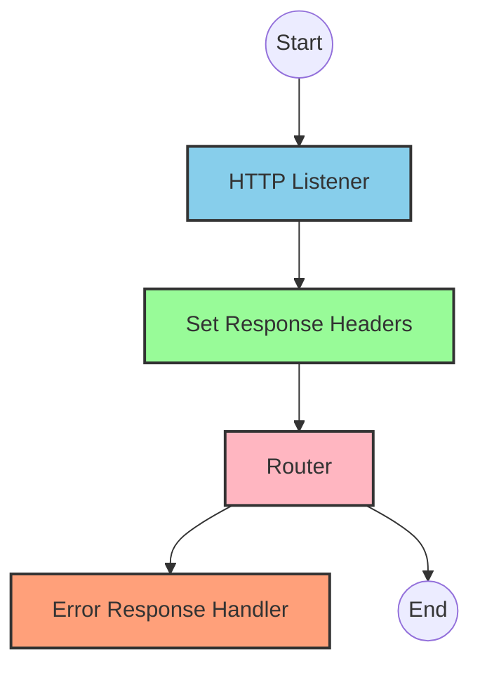
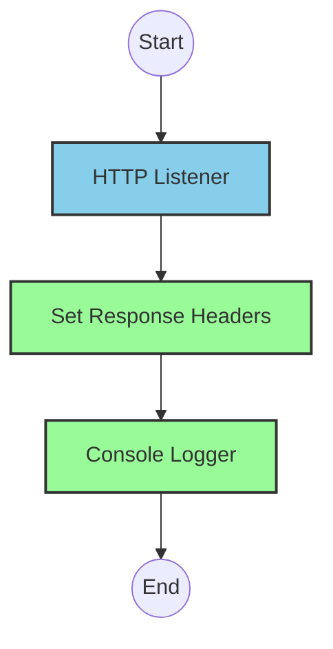
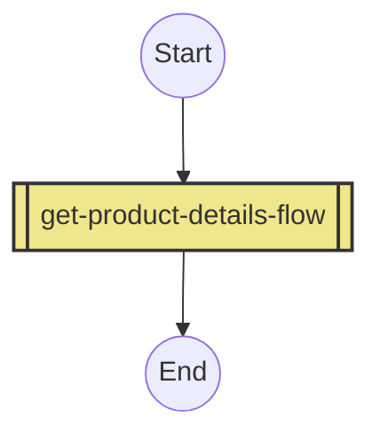
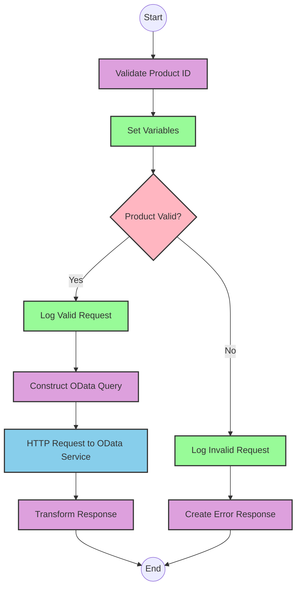

# API Overview
- This API provides product details from a backend system based on a product identifier
- Base URL pattern: `/products`

# Endpoints

## GET /products
- **Purpose**: Retrieves detailed product information based on a product identifier
- **Request Parameters**:
  - **Query Parameters**:
    - `productIdentifier`: The unique identifier for the product to retrieve
  - **Headers**: Standard HTTP headers
- **Response Format**:
  - Content-Type: application/json
  - Success: Product details in JSON format
  - Error: JSON error object with status, message, and errorCode
- **Status Codes**:
  - 200: Success
  - 400: Bad Request
  - 404: Not Found
  - 405: Method Not Allowed
  - 406: Not Acceptable
  - 415: Unsupported Media Type
  - 501: Not Implemented

# Current MuleSoft Flow Logic

## Flow: products-main
1. **Trigger**: HTTP listener receives incoming requests
2. **Processing**:
   - Sets response headers
   - Routes requests based on API configuration
   - Handles errors with appropriate responses
3. **Outcome**: Routes to appropriate endpoint handler based on the request

## Flow: products-console
1. **Trigger**: HTTP listener receives incoming requests
2. **Processing**:
   - Sets response headers
   - Logs request details to console
3. **Outcome**: Provides console logging functionality for API requests

## Flow: get:\products:products-config
1. **Trigger**: HTTP GET request to `/products` endpoint
2. **Processing**:
   - References the `get-product-details-flow` subflow to handle the request
3. **Outcome**: Returns product details or error response

## Subflow: get-product-details-flow
1. **Processing Steps**:
   - Validates if the provided product identifier is in the allowed list
   - If valid, makes an OData request to retrieve product details
   - If invalid, returns an error response
2. **Data Transformations**:
   - Transforms the incoming request to validate product identifier
   - Constructs OData query parameters with specific $filter and $select options
   - Transforms the response payload to JSON format
3. **Technical Details**:
   - Validates product identifier against a configurable list from properties file
   - Constructs OData query with:
     - **$filter**: `ProductId eq '" ++ (attributes.queryParams.productIdentifier default '') ++ "'`
     - **$select**: `ProductId,Category,CategoryName,CurrencyCode,DimensionDepth,DimensionHeight,DimensionUnit,DimensionWidth,LongDescription,Name,PictureUrl,Price,QuantityUnit,ShortDescription,SupplierId,Weight,WeightUnit`
4. **Error Handling**:
   - Returns custom error message when product identifier is invalid
   - Logs error details for troubleshooting

# DataWeave Transformations Explained

## Product Identifier Validation Transformation
This transformation checks if the provided product identifier is in the allowed list of product identifiers.

```dw
%dw 2.0
output application/java
var productidentifer=p('odata.productIdentifiers') splitBy(",")
---
sizeOf(productidentifer filter ($ == attributes.queryParams.productIdentifier))>0
```

- **Input**: Query parameter containing product identifier
- **Output**: Boolean value indicating if the product identifier is valid
- **Key Operations**:
  - Retrieves allowed product identifiers from properties file using `p('odata.productIdentifiers')`
  - Splits the comma-separated list into an array using `splitBy(",")`
  - Filters the array to find matches with the provided product identifier
  - Returns true if at least one match is found (size > 0)

## OData Query Parameters Transformation
This transformation constructs the OData query parameters for filtering and selecting specific product fields.

```dw
#[output application/java
---
{
	"$filter" : "ProductId eq '" ++ (attributes.queryParams.productIdentifier default '') ++ "'",
	"$select" : "ProductId,Category,CategoryName,CurrencyCode,DimensionDepth,DimensionHeight,DimensionUnit,DimensionWidth,LongDescription,Name,PictureUrl,Price,QuantityUnit,ShortDescription,SupplierId,Weight,WeightUnit"
}]
```

- **Input**: Query parameter containing product identifier
- **Output**: OData query parameters object with $filter and $select
- **Key Operations**:
  - Constructs a $filter expression that matches the exact ProductId
  - Specifies all required fields in the $select parameter
  - Uses default empty string if product identifier is not provided

## Response Payload Transformation
This transformation simply passes through the payload from the OData response.

```dw
%dw 2.0
output application/json
---
payload
```

- **Input**: Response from OData service
- **Output**: JSON representation of the same payload
- **Operation**: Direct pass-through of the payload with JSON output format

## Error Response Transformation
This transformation constructs an error response when the product identifier is invalid.

```dw
%dw 2.0
output application/json
---
{
	status: "error",
	message: "The product identifier " ++ attributes.queryParams.productIdentifier ++ " was not found.",
	errorCode: "PRODUCT_NOT_FOUND"
}
```

- **Input**: Query parameter containing invalid product identifier
- **Output**: Structured JSON error response
- **Key Operations**:
  - Constructs a standardized error object with status, message, and errorCode
  - Includes the invalid product identifier in the error message

# SAP Integration Suite Implementation

## Component Mapping

| MuleSoft Component | SAP Integration Suite Equivalent | Notes |
|--------------------|----------------------------------|-------|
| HTTP Listener | HTTPS Adapter (Receiver) | Configure with same path and method |
| Flow Reference | Process Call | References another integration flow |
| DataWeave Transform | Content Modifier with Expression/Script | Use Groovy or JavaScript for complex transformations |
| Logger | Write to Message Log | Configure with same log message |
| HTTP Request | HTTPS Adapter (Sender) | Configure with same endpoint and parameters |
| Choice Router | Router | Configure with same conditions |
| Set Variable | Content Modifier | Set properties in message header |
| Set Payload | Content Modifier | Set message body |
| Error Handler | Exception Subprocess | Configure with same error types |

## Integration Flow Visualization









## Configuration Details

### HTTP Adapter (Receiver) Configuration
- **Address**: `/products`
- **Authentication**: As per source system requirements
- **CSRF Protection**: As needed
- **Connection Timeout**: Default or as specified in source

### HTTP Adapter (Sender) Configuration
- **Address**: Target OData service endpoint
- **Query Parameters**: Dynamically constructed with:
  - $filter: `ProductId eq '[productIdentifier]'`
  - $select: `ProductId,Category,CategoryName,CurrencyCode,DimensionDepth,DimensionHeight,DimensionUnit,DimensionWidth,LongDescription,Name,PictureUrl,Price,QuantityUnit,ShortDescription,SupplierId,Weight,WeightUnit`
- **Authentication**: As required by target system

### Content Modifier (Transform) Configuration
- **Script**: Convert DataWeave to Groovy/JavaScript equivalent
- For product validation:
  ```javascript
  // Get product identifiers from property
  var productIdentifiers = properties.get("odata.productIdentifiers").split(",");
  // Check if current product ID is in the allowed list
  var isValidProduct = false;
  for (var i = 0; i < productIdentifiers.length; i++) {
    if (productIdentifiers[i] === message.headers.productIdentifier) {
      isValidProduct = true;
      break;
    }
  }
  // Set result to message property
  message.setProperty("isExistProduct", isValidProduct);
  ```

### Router Configuration
- **Condition**: `${property.isExistProduct} == true`
- **Default Route**: Error response path

### Exception Subprocess Configuration
- Configure exception handling for standard HTTP errors
- Map to appropriate error responses as defined in source

# Configuration

## Important Configuration Parameters
- **odata.productIdentifiers**: Comma-separated list of valid product identifiers
- **HTTP Listener Configuration**: Port and host settings
- **OData Request Configuration**: Base URL and authentication details

## Environment Variables
- No specific environment variables mentioned in source documentation

## Dependencies on External Systems
- OData backend service for product information retrieval

## Security Settings
- Standard HTTP security settings
- Authentication requirements for backend OData service (not explicitly specified in source)