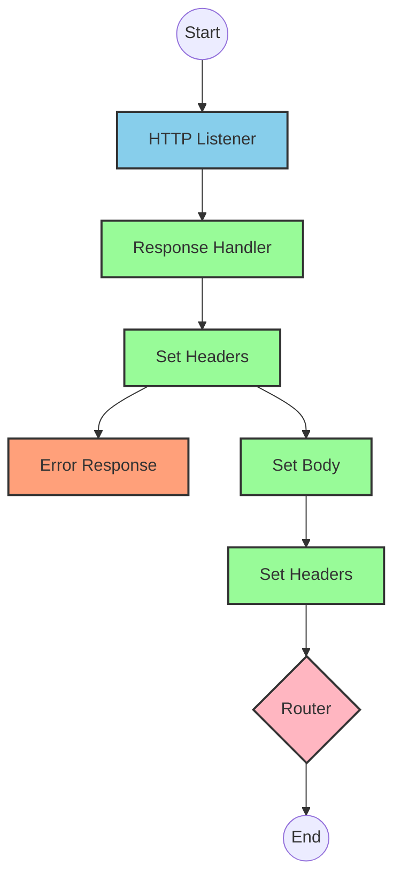
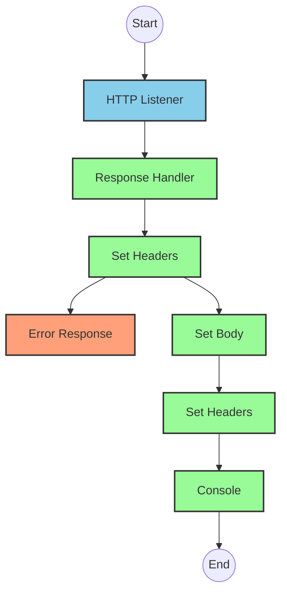
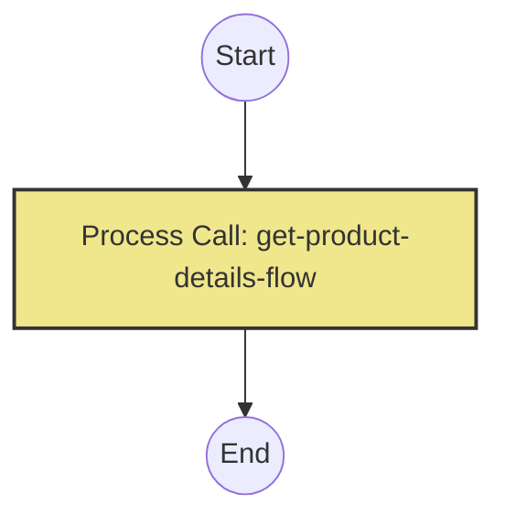
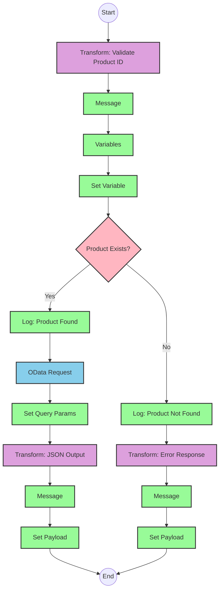

# API Overview
- This API provides product details from an SAP HANA database
- Base URL pattern: `/products`

# Endpoints

## GET /products
- **Purpose**: Retrieves product details based on a product identifier
- **Query Parameters**:
  - `productIdentifier` (required): The unique identifier for the product
- **Response Format**: JSON
- **Status Codes**:
  - 200: Success
  - 400: Bad Request
  - 404: Product Not Found
- **Response Body**:
  - Success: Product details including ProductId, Category, CategoryName, etc.
  - Error: JSON object with status, message, and errorCode

# Current MuleSoft Flow Logic

## Flow: products-main
This is the main entry point for the API. It:
1. Is triggered by an HTTP listener
2. Sets up response handling
3. Configures error handling
4. Routes requests to appropriate handlers

## Flow: products-console
This flow appears to be a console logging version that:
1. Is triggered by an HTTP listener
2. Sets up response handling
3. Configures error handling
4. Logs information to the console

## Flow: get:\products:products-config
This flow:
1. Is triggered when a GET request is made to the `/products` endpoint
2. References the `get-product-details-flow` subflow to process the request

## Subflow: get-product-details-flow
This subflow:
1. Validates if the provided product identifier is valid
2. If valid:
   - Logs the request
   - Makes an OData query to retrieve product details
   - Returns the product data
3. If invalid:
   - Logs an error
   - Returns an error response

The flow first checks if the product identifier is valid by comparing it against a list of allowed identifiers:
```dw
%dw 2.0
output application/java
var productidentifer=p('odata.productIdentifiers') splitBy(",")
---
sizeOf(productidentifer filter ($ == attributes.queryParams.productIdentifier))>0
```

When the product identifier is valid, it makes an OData query with these parameters:
- **$filter**: `ProductId eq '" ++ (attributes.queryParams.productIdentifier default '') ++ "'`
- **$select**: `ProductId,Category,CategoryName,CurrencyCode,DimensionDepth,DimensionHeight,DimensionUnit,DimensionWidth,LongDescription,Name,PictureUrl,Price,QuantityUnit,ShortDescription,SupplierId,Weight,WeightUnit`

For invalid product identifiers, it returns an error response:
```dw
%dw 2.0
output application/json
---
{
	status: "error",
	message: "The product identifier " ++ attributes.queryParams.productIdentifier ++ " was not found.",
	errorCode: "PRODUCT_NOT_FOUND"
}
```

# DataWeave Transformations Explained

## Product Identifier Validation
```dw
%dw 2.0
output application/java
var productidentifer=p('odata.productIdentifiers') splitBy(",")
---
sizeOf(productidentifer filter ($ == attributes.queryParams.productIdentifier))>0
```

This transformation:
1. Retrieves a comma-separated list of valid product identifiers from a property
2. Splits the string into an array
3. Filters the array to find matches with the provided product identifier
4. Returns true if at least one match is found (size > 0)

## OData Query Parameters Construction
```
#[output application/java
---
{
	"$filter" : "ProductId eq '" ++ (attributes.queryParams.productIdentifier default '') ++ "'",
	"$select" : "ProductId,Category,CategoryName,CurrencyCode,DimensionDepth,DimensionHeight,DimensionUnit,DimensionWidth,LongDescription,Name,PictureUrl,Price,QuantityUnit,ShortDescription,SupplierId,Weight,WeightUnit"
}]
```

This transformation:
1. Creates a Java map with OData query parameters
2. Constructs a $filter parameter that filters products by the provided product identifier
3. Specifies a $select parameter to retrieve specific product fields

## Error Response Transformation
```dw
%dw 2.0
output application/json
---
{
	status: "error",
	message: "The product identifier " ++ attributes.queryParams.productIdentifier ++ " was not found.",
	errorCode: "PRODUCT_NOT_FOUND"
}
```

This transformation:
1. Creates a JSON error response
2. Includes the invalid product identifier in the error message
3. Sets a specific error code for product not found scenarios

## Payload Pass-through Transformation
```dw
%dw 2.0
output application/json
---
payload
```

This simple transformation:
1. Takes the current payload (likely the OData response)
2. Outputs it as JSON without modification

# SAP Integration Suite Implementation

## Component Mapping

| MuleSoft Component | SAP Integration Suite Equivalent |
|--------------------|----------------------------------|
| HTTP Listener | HTTPS Adapter (Server) |
| Router | Content Modifier + Router |
| Flow Reference | Process Call |
| Transform | Message Mapping |
| Logger | Write to Log |
| HTTP Request | OData Adapter (Client) |
| Set Variable | Content Modifier |
| Choice/When/Otherwise | Router |
| Set Payload | Content Modifier |
| Error Handler | Exception Subprocess |

## Integration Flow Visualization









## Configuration Details

### HTTP Listener Configuration
- Component: HTTPS Adapter (Server)
- Parameters:
  - Name: HTTP_Listener_config
  - Port: [to be configured]
  - Host: [to be configured]
  - Path: /products

### OData Request Configuration
- Component: OData Adapter (Client)
- Parameters:
  - Name: Hana_HTTP_Request_Configuration
  - Service URL: [to be configured]
  - Authentication: [to be configured]
  - Query Parameters:
    - $filter: ProductId eq '{productIdentifier}'
    - $select: ProductId,Category,CategoryName,CurrencyCode,DimensionDepth,DimensionHeight,DimensionUnit,DimensionWidth,LongDescription,Name,PictureUrl,Price,QuantityUnit,ShortDescription,SupplierId,Weight,WeightUnit

### Router Configuration
- Component: Router
- Condition: vars.isExistProduct
- Routes:
  - True: Proceed to product retrieval
  - False: Return error response

### Error Handler Configuration
- Component: Exception Subprocess
- Handles:
  - APIKIT:BAD_REQUEST
  - APIKIT:NOT_FOUND
  - APIKIT:METHOD_NOT_ALLOWED
  - APIKIT:NOT_ACCEPTABLE
  - APIKIT:UNSUPPORTED_MEDIA_TYPE
  - APIKIT:NOT_IMPLEMENTED

# Configuration

## Property Configuration
- odata.productIdentifiers: Comma-separated list of valid product identifiers

## API Configuration
- Name: products-config
- RAML: products.raml
- outboundHeadersMapName: outboundHeaders
- httpStatusVarName: httpStatus

## Error Handling
- Global Error Handler: Gobal_Error_Handler
  - Handles various APIKIT errors using on-error-propagate