# SAP Product Information API Integration

## Table of Contents
- [API Overview](#api-overview)
- [Endpoints](#endpoints)
  - [GET /products](#get-products)
- [Current MuleSoft Flow Logic](#current-mulesoft-flow-logic)
  - [products-main Flow](#products-main-flow)
  - [products-console Flow](#products-console-flow)
  - [get:\products:products-config Flow](#getproductsproducts-config-flow)
  - [get-product-details-flow Subflow](#get-product-details-flow-subflow)
- [DataWeave Transformations Explained](#dataweave-transformations-explained)
  - [Product Identifier Validation](#product-identifier-validation)
  - [OData Query Parameters Construction](#odata-query-parameters-construction)
  - [Response Payload Transformation](#response-payload-transformation)
  - [Error Response Transformation](#error-response-transformation)
- [SAP Integration Suite Implementation](#sap-integration-suite-implementation)
  - [Component Mapping](#component-mapping)
  - [Integration Flow Visualization](#integration-flow-visualization)
  - [Configuration Details](#configuration-details)
- [Environment Configuration](#environment-configuration)
- [API Reference](#api-reference)

## API Overview
This API provides product information by retrieving product details from an SAP HANA database using OData queries. The API allows clients to request specific product information by providing a product identifier as a query parameter.

- **Base URL**: Determined by the HTTP_Listener_config
- **Authentication**: Not explicitly defined in the source documentation
- **Response Format**: JSON
- **Business Purpose**: To provide a standardized interface for retrieving product details from SAP HANA

## Endpoints

### GET /products
Retrieves detailed product information based on a provided product identifier.

- **HTTP Method**: GET
- **Path**: /products
- **Purpose**: Fetch detailed information about a specific product

**Request Parameters**:
- **Query Parameters**:
  - `productIdentifier` (required): The unique identifier of the product to retrieve

**Response Format**:
- **Success Response**: 
  - **Status Code**: 200 OK
  - **Content Type**: application/json
  - **Body**: JSON object containing product details including ProductId, Category, CategoryName, CurrencyCode, dimensions, descriptions, price, and other product attributes

- **Error Response**:
  - **Status Code**: 400 Bad Request
  - **Content Type**: application/json
  - **Body**: JSON object with status, message, and errorCode fields
  ```json
  {
    "status": "error",
    "message": "The product identifier [identifier] was not found.",
    "errorCode": "PRODUCT_NOT_FOUND"
  }
  ```

**Example Request**:
```
GET /products?productIdentifier=HT-1000
```

## Current MuleSoft Flow Logic

### products-main Flow
1. **Trigger**: HTTP listener receives incoming requests
2. **Processing**:
   - Sets response headers
   - Routes the request to appropriate handlers
   - Includes error response handling
3. **Outcome**: Routes API requests to the appropriate endpoint handlers

### products-console Flow
1. **Trigger**: HTTP listener receives incoming requests
2. **Processing**:
   - Sets response headers
   - Logs request information to the console
   - Includes error response handling
3. **Outcome**: Provides console logging for API requests

### get:\products:products-config Flow
1. **Trigger**: Receives GET requests to the /products endpoint
2. **Processing**: 
   - References the get-product-details-flow subflow to process the request
3. **Outcome**: Returns product details or an error response

### get-product-details-flow Subflow
1. **Trigger**: Called by the get:\products:products-config flow
2. **Processing**:
   - Validates if the provided productIdentifier is valid
   - If valid:
     - Logs the request processing
     - Constructs an OData query with specific filters and selects
     - Sends the request to the SAP HANA backend
     - Transforms the response to JSON
   - If invalid:
     - Logs the validation failure
     - Returns an error response
3. **Data Transformations**:
   - Validates product identifier against a configured list
   - Constructs OData query parameters with $filter and $select
   - Transforms the backend response to JSON
   - Creates error response for invalid product identifiers
4. **Expected Outcomes**:
   - Success: Returns product details in JSON format
   - Error: Returns a structured error response

## DataWeave Transformations Explained

### Product Identifier Validation
This transformation checks if the provided product identifier exists in a predefined list of valid identifiers.

**Input**: The product identifier from the query parameters and a configured list of valid identifiers
**Output**: A boolean value indicating if the product identifier is valid

```dw
%dw 2.0
output application/java
var productidentifer=p('odata.productIdentifiers') splitBy(",")
---
sizeOf(productidentifer filter ($ == attributes.queryParams.productIdentifier))>0
```

**Explanation**:
1. Retrieves a comma-separated list of valid product identifiers from a property
2. Splits the list into an array using the `splitBy` function
3. Filters the array to find matches with the provided product identifier
4. Returns true if at least one match is found (size > 0)

### OData Query Parameters Construction
This transformation constructs the OData query parameters for filtering and selecting specific product fields.

**Input**: The product identifier from the query parameters
**Output**: A map of OData query parameters

```dw
#[output application/java
---
{
	"$filter" : "ProductId eq '" ++ (attributes.queryParams.productIdentifier default '') ++ "'",
	"$select" : "ProductId,Category,CategoryName,CurrencyCode,DimensionDepth,DimensionHeight,DimensionUnit,DimensionWidth,LongDescription,Name,PictureUrl,Price,QuantityUnit,ShortDescription,SupplierId,Weight,WeightUnit"
}]
```

**Explanation**:
1. Creates a map with two OData parameters:
   - `$filter`: Constructs a filter expression to match the ProductId with the provided identifier
   - `$select`: Specifies the fields to retrieve from the product entity

### Response Payload Transformation
This transformation passes through the response payload from the backend.

**Input**: The response from the SAP HANA backend
**Output**: The same response in JSON format

```dw
%dw 2.0
output application/json
---
payload
```

**Explanation**:
1. Simply outputs the input payload as JSON without any transformation

### Error Response Transformation
This transformation creates an error response when the product identifier is invalid.

**Input**: The invalid product identifier from the query parameters
**Output**: A structured error response in JSON format

```dw
%dw 2.0
output application/json
---
{
	status: "error",
	message: "The product identifier " ++ attributes.queryParams.productIdentifier ++ " was not found.",
	errorCode: "PRODUCT_NOT_FOUND"
}
```

**Explanation**:
1. Creates a JSON object with three fields:
   - `status`: Set to "error"
   - `message`: A descriptive message including the invalid product identifier
   - `errorCode`: Set to "PRODUCT_NOT_FOUND"

## SAP Integration Suite Implementation

### Component Mapping

| MuleSoft Component | SAP Integration Suite Equivalent | Notes |
|--------------------|----------------------------------|-------|
| HTTP Listener | HTTPS Adapter (Receiver) | Configure with the same path and method settings |
| Flow Reference | Process Call | Used to call the product details subflow |
| Transform Message | Content Modifier + Groovy Script | For DataWeave transformations |
| Logger | Write to Message Log | For logging messages |
| HTTP Request | OData Adapter (Sender) | For connecting to SAP HANA |
| Set Variable | Content Modifier | For setting variables |
| Choice Router | Router | For conditional processing |
| Set Payload | Content Modifier | For setting the response payload |
| Error Handler | Exception Subprocess | For handling API errors |

### Integration Flow Visualization

```mermaid
flowchart TD
    %% Define node styles
    classDef httpAdapter fill:#87CEEB,stroke:#333,stroke-width:2px
    classDef contentModifier fill:#98FB98,stroke:#333,stroke-width:2px
    classDef router fill:#FFB6C1,stroke:#333,stroke-width:2px
    classDef mapping fill:#DDA0DD,stroke:#333,stroke-width:2px
    classDef exception fill:#FFA07A,stroke:#333,stroke-width:2px
    classDef processCall fill:#F0E68C,stroke:#333,stroke-width:2px

    %% Main API Flow
    subgraph MainFlow["Main API Flow"]
        Start((Start)) --> HttpListener[HTTP Listener<br>/products]:::httpAdapter
        HttpListener --> ProductsFlowRef[[Get Products<br>Process Call]]:::processCall
        ProductsFlowRef --> ResponseHeaders[Set Response<br>Headers]:::contentModifier
        ResponseHeaders --> End((End))
    end

    %% Get Products Flow
    subgraph ProductsFlow["Get Products Flow"]
        PStart((Start)) --> ValidateProduct[Validate Product<br>Identifier]:::mapping
        ValidateProduct --> SetIsExistVar[Set isExistProduct<br>Variable]:::contentModifier
        SetIsExistVar --> ProductRouter{Product<br>Exists?}:::router
        
        ProductRouter -->|Yes| LogSuccess[Log Success<br>Message]:::contentModifier
        LogSuccess --> BuildODataQuery[Build OData<br>Query]:::mapping
        BuildODataQuery --> ODataRequest[OData Request<br>to SAP HANA]:::httpAdapter
        ODataRequest --> TransformResponse[Transform<br>Response]:::mapping
        TransformResponse --> PEnd((End))
        
        ProductRouter -->|No| LogError[Log Error<br>Message]:::contentModifier
        LogError --> BuildErrorResponse[Build Error<br>Response]:::mapping
        BuildErrorResponse --> PEnd
    end

    %% Error Handling
    subgraph ErrorHandling["Error Handling"]
        EStart((Start)) --> ApiKitErrors[Handle API Kit<br>Errors]:::exception
        ApiKitErrors --> BuildErrorMsg[Build Error<br>Response]:::mapping
        BuildErrorMsg --> SetErrorHeaders[Set Error<br>Headers]:::contentModifier
        SetErrorHeaders --> EEnd((End))
    end

    %% Connect the flows
    MainFlow ~~~ ProductsFlow
    MainFlow ~~~ ErrorHandling
```



### Configuration Details

#### HTTP Adapter (Receiver)
- **Address**: /products
- **Authentication**: None (or as required by your environment)
- **HTTP Method**: GET
- **Query Parameters**: productIdentifier

#### OData Adapter (Sender)
- **Connection**: SAP HANA Connection
- **Entity Set**: Products
- **Query Options**:
  - **$filter**: ProductId eq '{productIdentifier}'
  - **$select**: ProductId,Category,CategoryName,CurrencyCode,DimensionDepth,DimensionHeight,DimensionUnit,DimensionWidth,LongDescription,Name,PictureUrl,Price,QuantityUnit,ShortDescription,SupplierId,Weight,WeightUnit

#### Content Modifiers
1. **Validate Product Identifier**:
   - Script Type: Groovy
   - Script:
     ```groovy
     def productIdentifiers = property.get("odata.productIdentifiers").split(",")
     def requestedId = message.getProperty("productIdentifier")
     def isValid = productIdentifiers.any { it == requestedId }
     message.setProperty("isExistProduct", isValid)
     return message
     ```

2. **Build OData Query**:
   - Set the following properties:
     - $filter: ProductId eq '{productIdentifier}'
     - $select: ProductId,Category,CategoryName,CurrencyCode,DimensionDepth,DimensionHeight,DimensionUnit,DimensionWidth,LongDescription,Name,PictureUrl,Price,QuantityUnit,ShortDescription,SupplierId,Weight,WeightUnit

3. **Error Response**:
   - Set Body:
     ```json
     {
       "status": "error",
       "message": "The product identifier ${property.productIdentifier} was not found.",
       "errorCode": "PRODUCT_NOT_FOUND"
     }
     ```

#### Router
- **Condition 1**: ${property.isExistProduct} == true
- **Condition 2**: ${property.isExistProduct} == false

#### Process Call
- **Process**: Get Product Details Process

#### Exception Subprocess
- Handle standard HTTP errors (400, 404, 405, 406, 415, 501)
- Return appropriate error responses with correct HTTP status codes

## Environment Configuration

### Important Configuration Parameters
- **HTTP Listener Configuration**:
  - Name: HTTP_Listener_config
  - Port: To be configured based on environment

- **HANA HTTP Request Configuration**:
  - Name: Hana_HTTP_Request_Configuration
  - Base URL: To be configured based on environment

- **API Configuration**:
  - Name: products-config
  - API: products.raml
  - Outbound Headers Map Name: outboundHeaders
  - HTTP Status Variable Name: httpStatus

### Environment Variables
- **odata.productIdentifiers**: Comma-separated list of valid product identifiers
  - Example value: "HT-1000,HT-1001,HT-1002,HT-1003"

### Dependencies on External Systems
- SAP HANA database with OData service for product information

### Security Settings
- Not explicitly defined in the source documentation
- Consider implementing:
  - API authentication (OAuth, API Key)
  - Transport layer security (HTTPS)
  - Rate limiting

### Deployment Considerations
- Ensure connectivity to SAP HANA is properly configured
- Configure appropriate memory and CPU resources based on expected load
- Set up monitoring and logging for the integration

## API Reference

### Endpoints

#### GET /products
Retrieves product information based on the provided product identifier.

**Request**:
- **Method**: GET
- **Path**: /products
- **Query Parameters**:
  - `productIdentifier` (required): The unique identifier of the product

**Response**:
- **Success Response (200 OK)**:
  ```json
  {
    "ProductId": "HT-1000",
    "Category": "Laptops",
    "CategoryName": "Laptops",
    "CurrencyCode": "USD",
    "DimensionDepth": 30,
    "DimensionHeight": 3,
    "DimensionUnit": "cm",
    "DimensionWidth": 40,
    "LongDescription": "Detailed product description...",
    "Name": "Product Name",
    "PictureUrl": "https://example.com/product.jpg",
    "Price": 1299.99,
    "QuantityUnit": "EA",
    "ShortDescription": "Brief product description",
    "SupplierId": "SUPP-001",
    "Weight": 2.5,
    "WeightUnit": "kg"
  }
  ```

- **Error Response (400 Bad Request)**:
  ```json
  {
    "status": "error",
    "message": "The product identifier HT-9999 was not found.",
    "errorCode": "PRODUCT_NOT_FOUND"
  }
  ```

### Error Codes
- **PRODUCT_NOT_FOUND**: The requested product identifier is not valid or does not exist

### Authentication
Authentication requirements are not explicitly defined in the source documentation.

### Rate Limiting
Rate limiting information is not explicitly defined in the source documentation.

### Versioning
Versioning information is not explicitly defined in the source documentation.