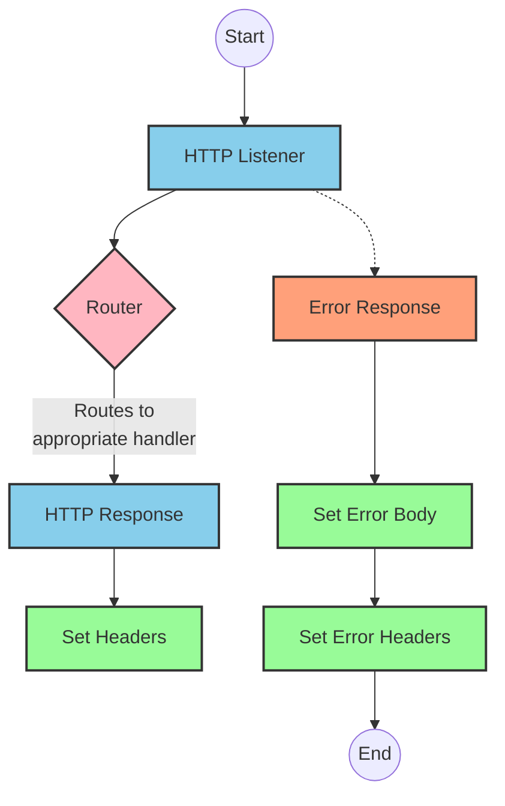
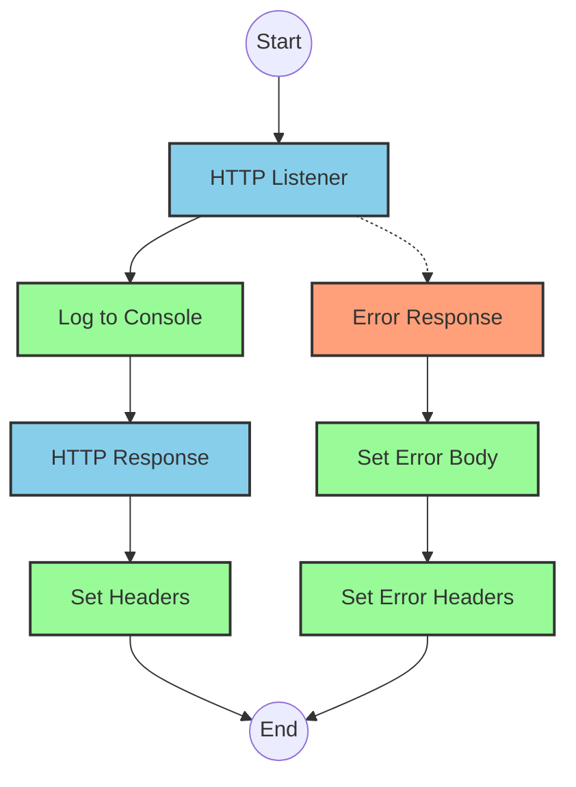
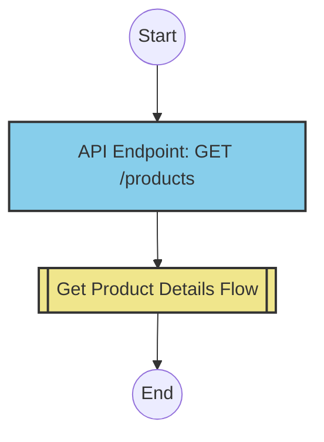
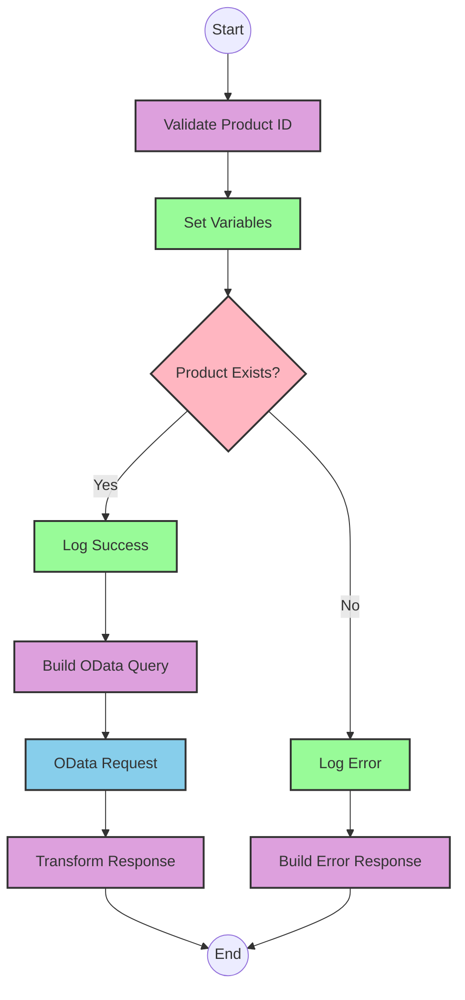

# API Overview
- This API provides product details from an SAP HANA database
- Base URL pattern: `/products`

# Endpoints

## GET /products
- **Purpose**: Retrieves product details based on a product identifier
- **Query Parameters**:
  - `productIdentifier` (required): The unique identifier for the product
- **Response Format**: JSON
- **Status Codes**:
  - 200: Success
  - 400: Bad Request
  - 404: Product Not Found
- **Response Body**:
  - Success: Product details including ProductId, Category, CategoryName, etc.
  - Error: JSON object with status, message, and errorCode

# Current MuleSoft Flow Logic

## Flow: products-main
This is the main entry point for the API that routes requests to appropriate handlers.
1. **Trigger**: HTTP listener
2. **Processing**:
   - Sets response headers
   - Routes requests based on API configuration
   - Handles errors with a dedicated error response handler

## Flow: products-console
This flow appears to be a console/logging version of the API.
1. **Trigger**: HTTP listener
2. **Processing**:
   - Sets response headers
   - Logs requests to console
   - Handles errors with a dedicated error response handler

## Flow: get:\products:products-config
This flow handles GET requests to the /products endpoint.
1. **Trigger**: API request matching GET /products
2. **Processing**:
   - References the get-product-details-flow subflow to retrieve product details

## Subflow: get-product-details-flow
This subflow handles the core business logic for retrieving product details.
1. **Processing Steps**:
   - Validates if the product identifier exists in the configured list
   - Sets variables for processing
   - Branches based on product identifier validation
   - If valid, makes an OData request to retrieve product details
   - If invalid, returns an error response
2. **Data Transformations**:
   - Transforms the product identifier into an OData query
   - Transforms the response payload to JSON format
3. **Error Scenarios**:
   - Product identifier not found or invalid

# DataWeave Transformations Explained

## Product Identifier Validation Transformation
This transformation checks if the provided product identifier exists in a predefined list.

```dw
%dw 2.0
output application/java
var productidentifer=p('odata.productIdentifiers') splitBy(",")
---
sizeOf(productidentifer filter ($ == attributes.queryParams.productIdentifier))>0
```

- **Purpose**: Validates if the requested product identifier is in the allowed list
- **Input**: Query parameter `productIdentifier` from the request
- **Output**: Boolean value indicating if the product identifier exists
- **Key Operations**:
  - Retrieves a comma-separated list of valid product identifiers from a property
  - Splits the list into an array using `splitBy(",")`
  - Filters the array to find matches with the requested product identifier
  - Returns true if at least one match is found (`sizeOf(...) > 0`)

## OData Query Parameters Transformation
This transformation constructs OData query parameters for the HTTP request.

```dw
#[output application/java
---
{
	"$filter" : "ProductId eq '" ++ (attributes.queryParams.productIdentifier default '') ++ "'",
	"$select" : "ProductId,Category,CategoryName,CurrencyCode,DimensionDepth,DimensionHeight,DimensionUnit,DimensionWidth,LongDescription,Name,PictureUrl,Price,QuantityUnit,ShortDescription,SupplierId,Weight,WeightUnit"
}]
```

- **Purpose**: Creates OData query parameters to filter and select specific product fields
- **Input**: Product identifier from query parameters
- **Output**: Java map containing OData query parameters
- **Key Operations**:
  - Constructs a `$filter` expression to match the exact product identifier
  - Specifies a `$select` parameter to retrieve only the needed fields
  - Uses string concatenation (`++`) to build the filter expression
  - Provides a default empty string if the product identifier is missing

## Response Payload Transformation
This transformation passes through the response payload as JSON.

```dw
%dw 2.0
output application/json
---
payload
```

- **Purpose**: Transforms the HTTP response to JSON format
- **Input**: Response payload from the OData request
- **Output**: JSON representation of the payload
- **Key Operations**: Simple pass-through transformation

## Error Response Transformation
This transformation creates an error response when the product identifier is invalid.

```dw
%dw 2.0
output application/json
---
{
	status: "error",
	message: "The product identifier " ++ attributes.queryParams.productIdentifier ++ " was not found.",
	errorCode: "PRODUCT_NOT_FOUND"
}
```

- **Purpose**: Creates a standardized error response
- **Input**: Query parameters from the request
- **Output**: JSON error object
- **Key Operations**:
  - Constructs a JSON object with status, message, and errorCode fields
  - Includes the requested product identifier in the error message

# SAP Integration Suite Implementation

## Component Mapping

| MuleSoft Component | SAP Integration Suite Equivalent | Notes |
|--------------------|----------------------------------|-------|
| HTTP Listener | HTTP Adapter (Receiver) | Configure with the same path and method |
| Router | Content Modifier + Router | Use a Content Modifier to set properties and a Router for conditional branching |
| Flow Reference | Process Call | References another integration flow |
| Transform (DataWeave) | Groovy Script or Message Mapping | Convert DataWeave expressions to Groovy or use Message Mapping for simpler transformations |
| Logger | Write to Message Processing Log | Configure with the same log message |
| HTTP Request | OData Adapter (Sender) | Configure with the same OData query parameters |
| Choice/When/Otherwise | Router | Use a Router with conditions equivalent to the MuleSoft choice conditions |
| Set Variable | Content Modifier | Set exchange properties instead of variables |
| Set Payload | Content Modifier | Modify the message body |
| Error Handler | Exception Subprocess | Handle errors with similar status codes and messages |

## Integration Flow Visualization









## Configuration Details

### HTTP Adapter (Receiver) Configuration
- **Address**: `/products`
- **Method**: GET
- **Authentication**: As per source system requirements

### OData Adapter (Sender) Configuration
- **Service**: SAP HANA OData service
- **Query Parameters**:
  - `$filter`: `ProductId eq '{productIdentifier}'`
  - `$select`: `ProductId,Category,CategoryName,CurrencyCode,DimensionDepth,DimensionHeight,DimensionUnit,DimensionWidth,LongDescription,Name,PictureUrl,Price,QuantityUnit,ShortDescription,SupplierId,Weight,WeightUnit`

### Content Modifier (Validate Product ID)
- **Script Type**: Groovy
- **Script**:
```groovy
def productIdentifiers = property.get("odata.productIdentifiers").split(",")
def requestedId = message.getHeaders().get("productIdentifier")
def isExistProduct = productIdentifiers.any { it == requestedId }
message.setProperty("isExistProduct", isExistProduct)
return message
```

### Router (Product Exists?)
- **Condition 1**: `${property.isExistProduct} == true`
- **Condition 2**: `${property.isExistProduct} == false`

### Content Modifier (Log Success)
- **Log Level**: INFO
- **Message**: `The request is processed and sent downstream with the product identifier (${header.productIdentifier}).`

### Content Modifier (Log Error)
- **Log Level**: WARN
- **Message**: `The product identifier (${header.productIdentifier}) was not passed in the request or was passed incorrectly.`

### Content Modifier (Build Error Response)
- **Message Body**:
```json
{
  "status": "error",
  "message": "The product identifier ${header.productIdentifier} was not found.",
  "errorCode": "PRODUCT_NOT_FOUND"
}
```
- **Content Type**: application/json

# Configuration

## Important Configuration Parameters
- `odata.productIdentifiers`: Comma-separated list of valid product identifiers

## Environment Variables
- No explicit environment variables mentioned in the source documentation

## Dependencies on External Systems
- SAP HANA OData service for product data retrieval

## Security Settings
- HTTP Listener configuration (HTTP_Listener_config)
- HANA HTTP Request Configuration (Hana_HTTP_Request_Configuration)
- API configuration (products-config)