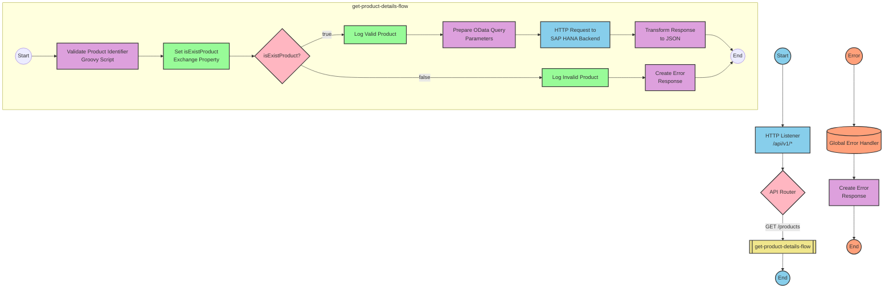

# SAP Integration Suite Implementation for Product API

# Table of Contents
- [API Overview](#api-overview)
- [Endpoints](#endpoints)
- [Current MuleSoft Flow Logic](#current-mulesoft-flow-logic)
- [DataWeave Transformations Explained](#dataweave-transformations-explained)
- [SAP Integration Suite Implementation](#sap-integration-suite-implementation)
  - [Component Mapping](#component-mapping)
  - [Integration Flow Visualization](#integration-flow-visualization)
- [Configuration Details](#configuration-details)
- [Configuration](#configuration)

# API Overview
This API provides access to product information from an SAP HANA backend system. It allows clients to retrieve product details by specifying a product identifier. The API validates the product identifier against a configured list of valid identifiers before retrieving the data from the SAP HANA system.

**Base URL**: `http://localhost:8081/api/v1`

# Endpoints

## GET /products
**Purpose**: Retrieves product details based on the provided product identifier.

**Request Parameters**:
- **Query Parameters**:
  - `productIdentifier` (required): The unique identifier of the product to retrieve

**Response Format**:
- **200 OK**: Successfully retrieved product details
  - Content-Type: application/json
  - Body: Product details JSON object
- **400 Bad Request**: Invalid request format
- **404 Not Found**: Product identifier not found
- **500 Internal Server Error**: Server-side error

**Example Response (200 OK)**:
```json
{
  "ProductId": "HT-2000",
  "Category": "Notebooks",
  "CategoryName": "Notebooks",
  "CurrencyCode": "USD",
  "DimensionDepth": 30,
  "DimensionHeight": 3,
  "DimensionUnit": "cm",
  "DimensionWidth": 40,
  "LongDescription": "Notebook Basic 17 with 2,80 GHz quad core, 17\" LCD, 4 GB DDR3 RAM, 500 GB Hard Disc, Windows 8 Pro",
  "Name": "Notebook Basic 17",
  "PictureUrl": "/sap/public/bc/NWDEMO_MODEL/IMAGES/HT-2000.jpg",
  "Price": 1249,
  "QuantityUnit": "EA",
  "ShortDescription": "Notebook Basic 17 with 2,80 GHz quad core, 17\" LCD, 4 GB DDR3 RAM, 500 GB Hard Disc, Windows 8 Pro",
  "SupplierId": "0100000046",
  "Weight": 4.5,
  "WeightUnit": "KG"
}
```

**Example Response (Error)**:
```json
{
  "status": "error",
  "message": "The product identifier HT-3000 was not found.",
  "errorCode": "PRODUCT_NOT_FOUND"
}
```

# Current MuleSoft Flow Logic

## products-main Flow
**Trigger**: HTTP listener configured to listen on `/api/v1/*`
**Purpose**: Main entry point for the API that handles routing to appropriate endpoints

1. Starts with an HTTP listener configured to listen on `/api/v1/*`
2. Sets up response headers
3. Includes error response handling
4. Routes requests to appropriate endpoints based on the API configuration

## products-console Flow
**Trigger**: HTTP listener
**Purpose**: Provides console logging functionality for debugging

1. Starts with an HTTP listener
2. Sets up response headers
3. Includes error response handling
4. Logs information to the console

## get:\products:products-config Flow
**Trigger**: HTTP GET request to `/products`
**Purpose**: Handles GET requests to the products endpoint

1. Receives GET requests to `/products`
2. References the `get-product-details-flow` subflow to process the request

## get-product-details-flow Subflow
**Purpose**: Validates the product identifier and retrieves product details from the SAP HANA backend

1. Transforms the request to check if the product identifier exists in the configured list:
   ```
   %dw 2.0
   output application/java
   var productidentifer=p('odata.productIdentifiers') splitBy(",")
   ---
   sizeOf(productidentifer filter ($ == attributes.queryParams.productIdentifier))>0
   ```

2. Sets a variable `isExistProduct` with the result of the validation

3. Uses a choice router to handle two scenarios:
   - **When the product identifier exists**:
     - Logs a message: "The request is processed and sent downstream with the product identifier (#[attributes.queryParams.productIdentifier])."
     - Makes an HTTP request to the SAP HANA backend with the following query parameters:
       ```
       #[output application/java
       ---
       {
         "$filter" : "ProductId eq '" ++ (attributes.queryParams.productIdentifier default '') ++ "'",
         "$select" : "ProductId,Category,CategoryName,CurrencyCode,DimensionDepth,DimensionHeight,DimensionUnit,DimensionWidth,LongDescription,Name,PictureUrl,Price,QuantityUnit,ShortDescription,SupplierId,Weight,WeightUnit"
       }]
       ```
     - Transforms the response payload to JSON:
       ```
       %dw 2.0
       output application/json
       ---
       payload
       ```

   - **Otherwise (when the product identifier doesn't exist)**:
     - Logs a message: "The product identifier (#[attributes.queryParams.productIdentifier]) was not passed in the request or was passed incorrectly."
     - Transforms the payload to return an error response:
       ```
       %dw 2.0
       output application/json
       ---
       {
         status: "error",
         message: "The product identifier " ++ attributes.queryParams.productIdentifier ++ " was not found.",
         errorCode: "PRODUCT_NOT_FOUND"
       }
       ```

## Error Handling
The application implements a global error handler that handles various APIKIT errors:
- APIKIT:BAD_REQUEST
- APIKIT:NOT_FOUND
- APIKIT:METHOD_NOT_ALLOWED
- APIKIT:NOT_ACCEPTABLE
- APIKIT:UNSUPPORTED_MEDIA_TYPE
- APIKIT:NOT_IMPLEMENTED

# DataWeave Transformations Explained

## Product Identifier Validation Transformation
**Purpose**: Validates if the provided product identifier exists in the configured list of valid identifiers.

**Input**: Query parameter `productIdentifier` from the HTTP request
**Output**: Boolean value indicating whether the product identifier is valid

**Logic**:
1. Retrieves the configured list of product identifiers from the properties file
2. Splits the comma-separated list into an array
3. Filters the array to find matches with the provided product identifier
4. Returns true if at least one match is found, false otherwise

**Code**:
```
%dw 2.0
output application/java
var productidentifer=p('odata.productIdentifiers') splitBy(",")
---
sizeOf(productidentifer filter ($ == attributes.queryParams.productIdentifier))>0
```

## OData Query Parameters Transformation
**Purpose**: Constructs OData query parameters for filtering and selecting specific product fields.

**Input**: Product identifier from query parameters
**Output**: OData query parameters object with $filter and $select

**Logic**:
1. Creates a $filter parameter to filter products by ProductId
2. Creates a $select parameter to specify which fields to retrieve

**Code**:
```
#[output application/java
---
{
  "$filter" : "ProductId eq '" ++ (attributes.queryParams.productIdentifier default '') ++ "'",
  "$select" : "ProductId,Category,CategoryName,CurrencyCode,DimensionDepth,DimensionHeight,DimensionUnit,DimensionWidth,LongDescription,Name,PictureUrl,Price,QuantityUnit,ShortDescription,SupplierId,Weight,WeightUnit"
}]
```

## Response Payload Transformation
**Purpose**: Transforms the response payload from the SAP HANA backend to JSON format.

**Input**: Response from the SAP HANA backend
**Output**: JSON representation of the product details

**Logic**: Simple pass-through transformation that converts the payload to JSON format

**Code**:
```
%dw 2.0
output application/json
---
payload
```

## Error Response Transformation
**Purpose**: Creates a standardized error response when the product identifier is not valid.

**Input**: Product identifier from query parameters
**Output**: JSON error object with status, message, and errorCode

**Logic**: Constructs an error object with a descriptive message including the invalid product identifier

**Code**:
```
%dw 2.0
output application/json
---
{
  status: "error",
  message: "The product identifier " ++ attributes.queryParams.productIdentifier ++ " was not found.",
  errorCode: "PRODUCT_NOT_FOUND"
}
```

# SAP Integration Suite Implementation

## Component Mapping

| MuleSoft Component | SAP Integration Suite Equivalent | Notes |
|--------------------|----------------------------------|-------|
| HTTP Listener | HTTPS Adapter (Receiver) | Configure with the same path and port settings |
| Router | Content Modifier + Router | Use a Content Modifier to set properties and a Router for conditional processing |
| Flow Reference | Process Call | References another integration flow |
| Transform (DataWeave) | Groovy Script or Message Mapping | Convert DataWeave scripts to equivalent Groovy scripts or Message Mappings |
| Logger | Write to Message Log | Configure with the same log message |
| HTTP Request | HTTPS Adapter (Sender) | Configure with the same URL and query parameters |
| Set Variable | Content Modifier | Use to set exchange properties |
| Choice Router | Router | Configure with the same conditions |
| Error Handler | Exception Subprocess | Configure to handle specific error types |

## Integration Flow Visualization

### REST API Integration Flow: GET /products



# Configuration Details

## HTTP Listener Configuration
- **Component**: HTTPS Adapter (Receiver)
- **Parameters**:
  - Address: `/api/v1/*`
  - Port: `8081` (from dev.yaml)
  - Authentication: None (based on source configuration)

## Product Validation Script (Groovy)
- **Component**: Groovy Script
- **Script**:
  ```groovy
  import com.sap.gateway.ip.core.customdev.util.Message;
  
  def Message processData(Message message) {
      def map = message.getProperties();
      def query = message.getHeaders().get("query");
      def productIdentifier = query.get("productIdentifier");
      
      def validProducts = map.get("odata.productIdentifiers").split(",");
      def isValid = false;
      
      for (product in validProducts) {
          if (product.trim() == productIdentifier) {
              isValid = true;
              break;
          }
      }
      
      map.put("isExistProduct", isValid);
      return message;
  }
  ```

## OData Query Parameters Configuration
- **Component**: Content Modifier
- **Parameters**:
  - Action: Create
  - Property Name: `$filter`
  - Property Type: Expression
  - Value: `ProductId eq '${header:query.productIdentifier}'`
  - Property Name: `$select`
  - Property Type: Expression
  - Value: `ProductId,Category,CategoryName,CurrencyCode,DimensionDepth,DimensionHeight,DimensionUnit,DimensionWidth,LongDescription,Name,PictureUrl,Price,QuantityUnit,ShortDescription,SupplierId,Weight,WeightUnit`

## HTTP Request to SAP HANA Backend
- **Component**: HTTPS Adapter (Sender)
- **Parameters**:
  - URL: `https://refapp-espm-ui-cf.cfapps.eu10.hana.ondemand.com:443/espm-cloud-web/espm.svc/Products` (from dev.yaml)
  - Method: GET
  - Query Parameters: Use OData query parameters from Content Modifier

## Error Response Creation
- **Component**: Groovy Script
- **Script**:
  ```groovy
  import com.sap.gateway.ip.core.customdev.util.Message;
  import groovy.json.JsonBuilder;
  
  def Message processData(Message message) {
      def map = message.getProperties();
      def query = message.getHeaders().get("query");
      def productIdentifier = query.get("productIdentifier");
      
      def errorResponse = [
          status: "error",
          message: "The product identifier " + productIdentifier + " was not found.",
          errorCode: "PRODUCT_NOT_FOUND"
      ];
      
      def jsonBuilder = new JsonBuilder(errorResponse);
      message.setBody(jsonBuilder.toString());
      message.setHeader("Content-Type", "application/json");
      
      return message;
  }
  ```

## Router Configuration
- **Component**: Router
- **Condition**: `${property.isExistProduct}` equals `true`
- **Default Route**: Error response path

## Global Error Handler
- **Component**: Exception Subprocess
- **Error Types**:
  - BAD_REQUEST
  - NOT_FOUND
  - METHOD_NOT_ALLOWED
  - NOT_ACCEPTABLE
  - UNSUPPORTED_MEDIA_TYPE
  - NOT_IMPLEMENTED

# Configuration

## Environment Variables
The following environment variables are required based on the source configuration:

### From dev.yaml
```yaml
api:
  listener:
    port: "8081"
    path: /api/v1/*
    
hana:
  espm:
    url: refapp-espm-ui-cf.cfapps.eu10.hana.ondemand.com
    port: "443"
    path: /espm-cloud-web/espm.svc/Products
    
odata:
  productIdentifiers: "HT-2000,HT-2001"
```

## External System Dependencies
- **SAP HANA Backend**: The integration depends on the SAP HANA backend system at `refapp-espm-ui-cf.cfapps.eu10.hana.ondemand.com` to retrieve product information.

## Security Settings
- The source configuration does not specify any authentication or security settings for the API or the backend connection.
- For production deployment, consider implementing:
  - OAuth or Basic Authentication for the API
  - Secure HTTPS connections
  - Proper certificate management for backend connections